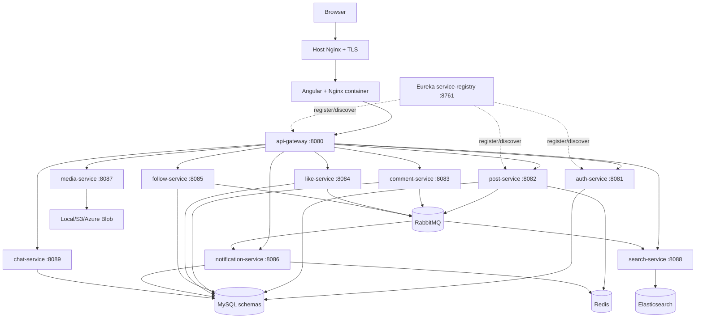
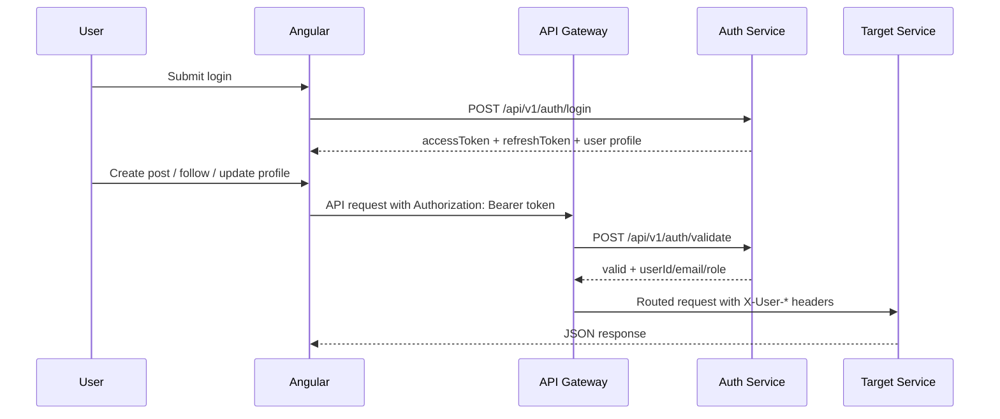
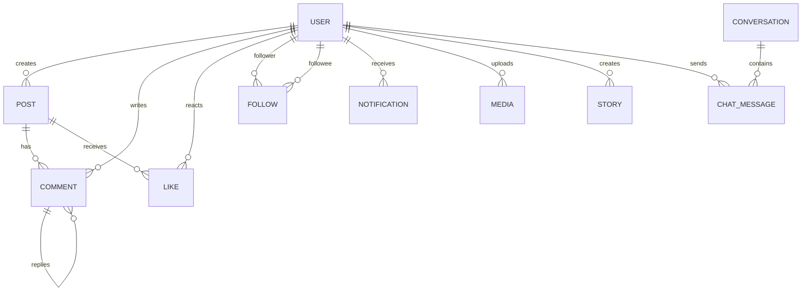
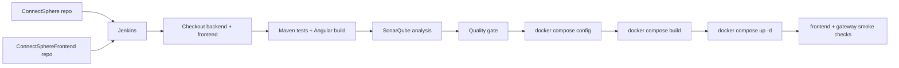

# ConnectSphere Project Documentation

This is the clean master document for interview, viva, onboarding, and deployment discussion. It avoids repeating service-level details. For file-by-file notes, use the service documents listed in section 3.

## 1. Project Overview

ConnectSphere is a full-stack social networking platform built with an Angular frontend and Spring Boot microservices. Users can register, verify email, sign in with JWT/OAuth, create posts, upload media, view stories, comment, like, follow private/public accounts, chat, search, receive notifications, and use admin moderation dashboards.

**Architecture:** containerized microservices, not monolithic. Each backend capability has its own Spring Boot service, port, Docker image, and usually its own MySQL schema. The Angular app is served by Nginx. Docker Compose runs the platform locally and in the Azure VM deployment.

**Real-world value:** this project demonstrates how a production-style social app separates identity, content, media, social graph, notifications, search, and realtime messaging into independently deployable services.

## 2. Architecture Summary

The browser loads the Angular SPA from the frontend Nginx container. Angular calls relative URLs such as `/api/v1/posts/feed`. The frontend Nginx proxies `/api`, `/oauth2`, `/login/oauth2`, and `/ws` to API Gateway. API Gateway validates protected JWT requests by calling auth-service, adds user identity headers, and routes to downstream services through Eureka service discovery.



## 3. Service Map

| Service | Port | Responsibility | Owns | Detailed doc |
| --- | ---: | --- | --- | --- |
| service-registry | 8761 | Eureka registry for service discovery | Runtime registry only | `service-registry/SERVICE_DOCUMENTATION.md` |
| api-gateway | 8080 | Entry point, routing, JWT validation, identity headers | Routes/security boundary | `api-gateway/SERVICE_DOCUMENTATION.md` |
| auth-service | 8081 | users, login, email OTP, OAuth, JWT, reports, admin data | `connectsphere_auth` | `auth-service/SERVICE_DOCUMENTATION.md` |
| post-service | 8082 | posts, feeds, visibility, counters | `connectsphere_post`, Redis cache | `post-service/SERVICE_DOCUMENTATION.md` |
| comment-service | 8083 | comments and replies | `connectsphere_comment` | `comment-service/SERVICE_DOCUMENTATION.md` |
| like-service | 8084 | reactions/likes | `connectsphere_like` | `like-service/SERVICE_DOCUMENTATION.md` |
| follow-service | 8085 | followers, following, private follow requests | `connectsphere_follow` | `follow-service/SERVICE_DOCUMENTATION.md` |
| notification-service | 8086 | notifications and unread counts | `connectsphere_notification`, Redis cache | `notification-service/SERVICE_DOCUMENTATION.md` |
| media-service | 8087 | uploads, avatars, banners, stories, blob providers | `connectsphere_media`, object storage | `media-service/SERVICE_DOCUMENTATION.md` |
| search-service | 8088 | post search, hashtags, user search proxy | `connectsphere_search`, Elasticsearch | `search-service/SERVICE_DOCUMENTATION.md` |
| chat-service | 8089 | conversations, direct messages, websocket delivery | `connectsphere_chat` | `chat-service/SERVICE_DOCUMENTATION.md` |
| connectsphere-web | 4200 local / 80 container / 8088 host | Angular UI | Browser state/local storage | `connectsphere-web/SERVICE_DOCUMENTATION.md` |

## 4. Main Request Flows

### Login and Protected API Flow



Important files:

| Concern | Files |
| --- | --- |
| JWT creation/validation | `auth-service/src/main/java/com/connectsphere/auth/security/JwtTokenService.java`, `api-gateway/src/main/java/com/connectsphere/gateway/security/GatewayAuthFilter.java` |
| Auth controller | `auth-service/src/main/java/com/connectsphere/auth/controller/AuthResource.java` |
| Angular session/token handling | `connectsphere-web/src/app/core/session.service.ts`, `auth.interceptor.ts`, `auth.guard.ts` |

### Media Upload Flow

1. Angular sends a multipart upload to media-service through API Gateway.
2. media-service stores metadata in MySQL.
3. File bytes are written to local disk, AWS S3, or Azure Blob depending on environment config.
4. The returned public/SAS/CDN URL is saved on posts, profile picture, banner, or story records.

Important files: `media-service/src/main/java/com/connectsphere/media/storage/*`, `MediaServiceImpl.java`, `MediaResource.java`, and frontend profile/feed upload code.

### Notification Flow

Comments, likes, follows, and follow-request acceptance publish social events to RabbitMQ. notification-service consumes those events and stores notifications. The frontend reads notifications and unread count through `/api/v1/notifications/...`.

Important files: `*service/src/main/java/**/messaging/*`, `notification-service/src/main/java/com/connectsphere/notification/messaging/NotificationEventListener.java`.

### Search Flow

post-service publishes post index events to RabbitMQ. search-service consumes those events and updates Elasticsearch documents. Frontend search/explore pages call search endpoints through API Gateway.

## 5. API Surface

The detailed endpoint list is in the service documents. This master table groups the API by business capability so you can explain it cleanly in interviews.

| Capability | Main endpoints | Service | Notes |
| --- | --- | --- | --- |
| Auth | `POST /api/v1/auth/register`, `verify-email`, `login`, `refresh`, `validate`, `GET/PUT /profile` | auth-service | Public auth routes plus protected profile routes. |
| OAuth | `/oauth2/authorization/google`, `/login/oauth2/code/google`, GitHub equivalents | auth-service via gateway | Requires Google/GitHub redirect URIs to match production domain. |
| Admin | `/api/v1/admin/users`, `/analytics`, `/platform-overview`, `/system-overview` | auth-service | Admin-only via JWT role. |
| Reports | `/api/v1/reports`, `/mine`, `/{reportId}/resolve` | auth-service | User reporting and moderation. |
| Posts | `/api/v1/posts`, `/feed`, `/user/{id}`, `/{postId}`, counters | post-service | Owns content and visibility. |
| Comments | `/api/v1/comments`, `/post/{postId}`, `/{commentId}/replies` | comment-service | Supports nested replies. |
| Likes | `/api/v1/likes`, `/has-liked`, `/count` | like-service | Target can be post/comment/story. |
| Follows | `/api/v1/follows`, `/followers/{id}`, `/following/{id}`, `/requests/...` | follow-service | Supports ACTIVE and PENDING relationships for private accounts. |
| Notifications | `/api/v1/notifications`, `/recipient/{id}`, `/unread-count`, mark read | notification-service | Read/unread user activity. |
| Media/Stories | `/api/v1/media/upload`, `/files/...`, `/api/v1/stories/...` | media-service | Azure Blob/S3/local storage. |
| Search | `/api/v1/search/posts`, `/users`, `/api/v1/hashtags/trending` | search-service | Elasticsearch plus user proxy search. |
| Chat | `/api/v1/chat/conversations`, `/messages`, `/ws/chat` | chat-service | REST history plus websocket realtime delivery. |

## 6. Database Ownership

Each service owns its schema. This is the main microservice data-boundary story.

| Schema | Owner | Important tables/entities |
| --- | --- | --- |
| `connectsphere_auth` | auth-service | `users`, `email_otps`, `revoked_tokens`, `reports` |
| `connectsphere_post` | post-service | `posts`, `post_media_urls` |
| `connectsphere_comment` | comment-service | `comments` |
| `connectsphere_like` | like-service | `likes` |
| `connectsphere_follow` | follow-service | `follows` |
| `connectsphere_notification` | notification-service | `notifications` |
| `connectsphere_media` | media-service | `media`, `stories` |
| `connectsphere_search` | search-service | hashtag/search metadata plus Elasticsearch documents |
| `connectsphere_chat` | chat-service | `conversations`, `chat_messages` |



## 7. Service Communication

| Source | Target | Method | Purpose |
| --- | --- | --- | --- |
| frontend Nginx | api-gateway | HTTP/WebSocket proxy | Single browser backend entry. |
| api-gateway | auth-service | REST | Token validation. |
| api-gateway | all services | REST/WebSocket | Route external API traffic. |
| services | service-registry | Eureka | Register/discover service instances. |
| comment/like/follow/post | RabbitMQ | AMQP | Publish social/search events. |
| notification-service | RabbitMQ | AMQP consumer | Store user notifications. |
| search-service | RabbitMQ | AMQP consumer | Index post/search data. |
| post/notification | Redis | cache | Reduce repeated read load. |
| media-service | Azure Blob/S3/local | SDK/filesystem | Store uploaded assets. |

## 8. Security Notes

Authentication is JWT-based for normal login and OAuth-based for Google/GitHub sign-in. API Gateway is the main guard for protected routes. It validates tokens with auth-service and forwards identity using headers such as `X-User-Id`, `X-User-Email`, and `X-User-Role`.

Production-sensitive values must stay in `deployment/.env.production` or Jenkins credentials, not in committed source:

| Secret/config | Used by |
| --- | --- |
| `MYSQL_ROOT_PASSWORD` | all database services |
| `JWT_SECRET` or auth JWT properties | auth-service |
| `SPRING_MAIL_USERNAME`, `SPRING_MAIL_PASSWORD` | auth-service OTP emails |
| `GOOGLE_CLIENT_ID`, `GOOGLE_CLIENT_SECRET` | Google OAuth |
| `GITHUB_CLIENT_ID`, `GITHUB_CLIENT_SECRET` | GitHub OAuth |
| `AZURE_STORAGE_CONNECTION_STRING`, container/account/CDN values | media-service |
| `RABBITMQ_USERNAME`, `RABBITMQ_PASSWORD` | event-driven services |

Security improvements worth mentioning in interviews:

- Move admin bootstrap password fully into secret storage.
- Restrict CORS in production instead of allowing all origins.
- Add rate limiting for login, OTP, upload, and search endpoints.
- Add structured audit logs for admin moderation actions.
- Add explicit object-storage access strategy: public CDN, signed URLs, or private blob with proxy.

## 9. DevOps and Deployment

### Local Development

```bash
# From repo root
mvn test
cd connectsphere-web && npm run build

# Production-like local Docker run
docker compose --env-file deployment/.env.production -f docker-compose.prod.yml up -d --build
```

### Azure VM Deployment

Core files:

| File | Role |
| --- | --- |
| `docker-compose.prod.yml` | Defines all app, infrastructure, volumes, and networks. |
| `deployment/.env.production` | Runtime secrets and deployment values. Do not commit real secrets. |
| `deployment/nginx/anuragbuilds.dev.conf` | Host reverse proxy/TLS routing. |
| `connectsphere-web/docker/nginx/default.conf` | Frontend container proxy to API Gateway. |
| `deployment/azure/jenkins/Jenkinsfile.azure-multirepo` | Jenkins checkout/build/test/deploy pipeline. |
| `deployment/azure/jenkins/Dockerfile` | Jenkins image with Java/Maven/Node/Docker CLI. |
| `deployment/azure/sonarqube/docker-compose.sonarqube.yml` | Self-hosted SonarQube dashboard and PostgreSQL database. |
| `deployment/azure/nginx/sonar.anuragbuilds.dev.conf` | Host Nginx reverse proxy for the SonarQube dashboard. |

### CI/CD Flow



Important operational point: a frontend-only push triggers Jenkins automatically only if the frontend repository also has a webhook or SCM polling configured for the Jenkins job.

## 10. Frontend Structure

| Area | Important files | Purpose |
| --- | --- | --- |
| Routes | `connectsphere-web/src/app/app.routes.ts` | Defines feed, auth, profile, post detail, messages, admin/system pages. |
| API client | `core/connectsphere-api.service.ts` | All HTTP calls to backend services. |
| Auth state | `core/session.service.ts`, `auth.interceptor.ts`, `auth.guard.ts` | Token storage, profile hydration, route protection. |
| Feed | `pages/feed/feed.ts/html/scss` | Composer, posts, stories, suggested users. |
| Profile | `pages/profile/*`, `components/profile-header/*` | Profile details, edit profile, followers/following overlay, posts/media tabs. |
| Messages | `pages/messages/*`, `core/chat-realtime.service.ts` | Conversation list, messages, websocket handling. |
| Notifications | `pages/notifications/*` | Activity feed and follow request actions. |
| Shared UI | `components/avatar`, `user-card`, `post-card`, `sidebar`, `right-sidebar` | Reusable UI pieces. |

## 11. Backend Structure Pattern

Most Spring services follow this pattern:

| Layer | Typical package | Job |
| --- | --- | --- |
| Controller | `controller/*Resource.java` | HTTP boundary and request/response mapping. |
| DTO | `dto/*Request.java`, `*Response.java` | API contracts. |
| Service | `service/*ServiceImpl.java` | Business rules, transactions, external calls/events. |
| Repository | `repository/*Repository.java` | Spring Data database access. |
| Entity/Document | `entity/*`, `document/*` | Persistence model. |
| Config | `config/*` | OpenAPI, security, messaging, storage, websocket setup. |
| Messaging | `messaging/*` | RabbitMQ event publishing/consuming. |
| Tests | `src/test/java/...` | Integration tests for service behavior. |

## 12. Technology and Dependency Map

| Technology | Where used | Why it matters |
| --- | --- | --- |
| Java 17 | Spring services | Main backend runtime. |
| Spring Boot 3.3.x | all services | Web APIs, dependency injection, configuration, actuator. |
| Spring Cloud 2023.0.3 | gateway, Eureka clients | Gateway routing and service discovery. |
| Spring Security | auth-service, gateway integration | JWT, protected routes, OAuth login. |
| JJWT 0.12.6 | auth-service | JWT creation and parsing. |
| Spring Data JPA + MySQL | business services | Service-owned relational persistence. |
| Redis | post-service, notification-service | Cache hot reads and unread counts. |
| RabbitMQ | post/comment/like/follow/search/notification | Async events for notifications and search indexing. |
| Elasticsearch | search-service | Full text search over posts/hashtags. |
| Azure Blob / AWS S3 SDK | media-service | Cloud storage providers for uploaded media. |
| Angular 21 | connectsphere-web | SPA frontend. |
| RxJS | frontend | Async HTTP and state streams. |
| STOMP.js | frontend chat | WebSocket messaging. |
| Docker Compose | deployment | Runs complete platform consistently. |
| Jenkins | deployment/azure/jenkins | CI/CD build, test, deploy. |
| Nginx | host and frontend container | TLS/reverse proxy and SPA serving. |
| SonarQube | deployment/azure/sonarqube | Static code analysis dashboard and quality gate before deploy. |

## 13. Interview Explanation

### 1 Minute

ConnectSphere is a microservices-based social media platform. The frontend is Angular, the backend is Spring Boot services behind Spring Cloud Gateway and Eureka. It supports auth, posts, comments, likes, follows, notifications, media/story uploads, search, chat, and admin dashboards. Docker Compose and Jenkins deploy it to an Azure VM with Nginx and TLS.

### 3 Minutes

The browser loads Angular from Nginx. Angular calls `/api` routes, which go through API Gateway. Gateway validates JWTs by calling auth-service and forwards identity headers to downstream services. Each domain service owns its schema: auth owns users, post owns posts, follow owns relationships, notification owns notifications, media owns uploads/stories, search owns Elasticsearch indexing, and chat owns conversations/messages. RabbitMQ decouples social events from notifications and search indexing. Redis caches high-read data. Jenkins builds backend and frontend, validates Compose config, builds images, deploys containers, and runs smoke checks.

### Strong Questions and Answers

| Question | Good answer |
| --- | --- |
| Why microservices? | The domains have separate scaling and ownership needs: auth, posts, media, search, chat, and notifications can evolve independently. |
| Why API Gateway? | It centralizes routing, auth validation, and browser-facing backend entry points. |
| How is auth enforced? | Gateway requires JWT for protected routes, validates it with auth-service, then forwards trusted identity headers. |
| Why RabbitMQ? | Notifications and search indexing should not block the user-facing request path. Events make those updates asynchronous. |
| Why Redis? | Post/feed and notification reads are frequent; caching reduces repeated database load. |
| How are files stored? | media-service abstracts storage; environment config selects local, S3, or Azure Blob. |
| How would you scale it? | Add replicas behind service discovery, externalize MySQL/Redis/RabbitMQ/Elasticsearch, use managed blob storage/CDN, add monitoring and rate limiting. |
| Biggest production risks? | Secrets handling, CORS tightening, object storage access, stronger observability, and migration management. |

## 14. Strengths, Limitations, Improvements

**Strengths**

- Clear service boundaries by domain.
- Gateway-based JWT validation.
- Dockerized full-stack deployment.
- Event-driven notification/search flow.
- Supports real user workflows: OAuth, media, stories, chat, admin moderation.

**Current limitations**

- Docker Compose is simple but not as scalable as Kubernetes/App Service/container apps.
- Some production settings depend on environment discipline.
- File-level generated docs are verbose; use them only as drill-down references.
- More end-to-end tests would help protect cross-service flows.

**High-value improvements**

- Add Flyway/Liquibase migrations.
- Add OpenTelemetry tracing across gateway and services.
- Add centralized logs and dashboards.
- Add rate limiting and stricter CORS.
- Add image resizing and CDN strategy for media.
- Add frontend E2E tests for auth, post, follow, message, and notification flows.

## 15. Quick Deployment Checklist

1. Pull latest backend and frontend repos on the Azure VM or let Jenkins do it.
2. Confirm `deployment/.env.production` has DB, mail, OAuth, RabbitMQ, storage, and domain values.
3. Run `docker compose --env-file deployment/.env.production -f docker-compose.prod.yml config`.
4. Make sure SonarQube is running and Jenkins has the `ConnectSphere SonarQube` server configured.
5. Run Jenkins pipeline or `docker compose --env-file deployment/.env.production -f docker-compose.prod.yml up -d --build`.
6. Verify `docker compose ... ps` shows all containers Up.
7. Check gateway route health: `curl -i http://127.0.0.1:8088/api/v1/auth/profile` should return `401` without a token.
8. Test browser flows: login, create post, upload media, follow/private request, notification, message, admin dashboard.

## 16. Glossary

| Term | Meaning in this project |
| --- | --- |
| API Gateway | Spring Cloud Gateway service that routes browser requests to backend services. |
| Eureka | Service registry used so services can find each other by name. |
| JWT | Signed token used to authenticate API requests. |
| DTO | Request/response object used as an API contract. |
| Entity | JPA object mapped to a database table. |
| Repository | Spring Data interface for database operations. |
| RabbitMQ | Message broker for async social/search events. |
| Redis | Cache for frequently read data. |
| Elasticsearch | Search engine used by search-service. |
| Nginx | Reverse proxy and Angular static file server. |
| Docker Compose | Tool that runs all containers and networks together. |
| Jenkins | CI/CD server that builds, tests, and deploys the app. |

## 17. Detail Pointers

Use this master document for project explanation. Use these files when you need exact endpoint, dependency, model, or file-by-file detail:

- `auth-service/SERVICE_DOCUMENTATION.md`
- `api-gateway/SERVICE_DOCUMENTATION.md`
- `post-service/SERVICE_DOCUMENTATION.md`
- `comment-service/SERVICE_DOCUMENTATION.md`
- `like-service/SERVICE_DOCUMENTATION.md`
- `follow-service/SERVICE_DOCUMENTATION.md`
- `notification-service/SERVICE_DOCUMENTATION.md`
- `media-service/SERVICE_DOCUMENTATION.md`
- `search-service/SERVICE_DOCUMENTATION.md`
- `chat-service/SERVICE_DOCUMENTATION.md`
- `service-registry/SERVICE_DOCUMENTATION.md`
- `connectsphere-web/SERVICE_DOCUMENTATION.md`

The original long generated master file was preserved as `PROJECT_COMPLETE_DOCUMENTATION_FULL_GENERATED.md` for archival reference.
