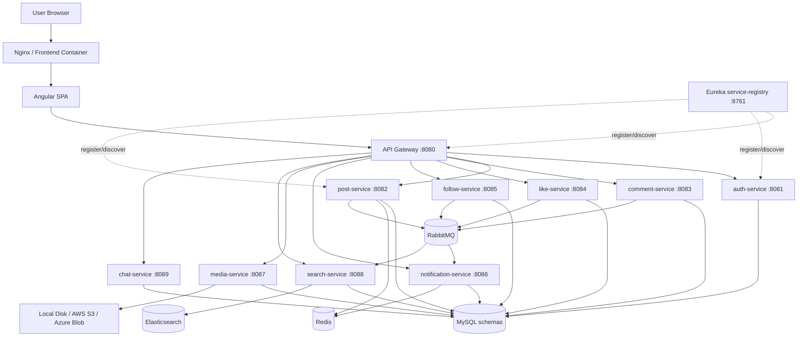
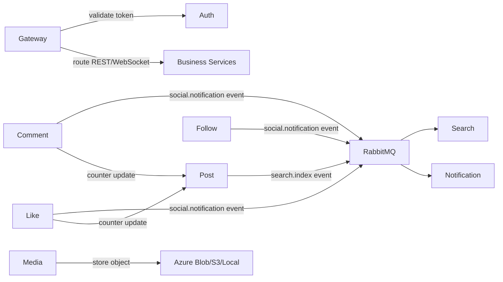
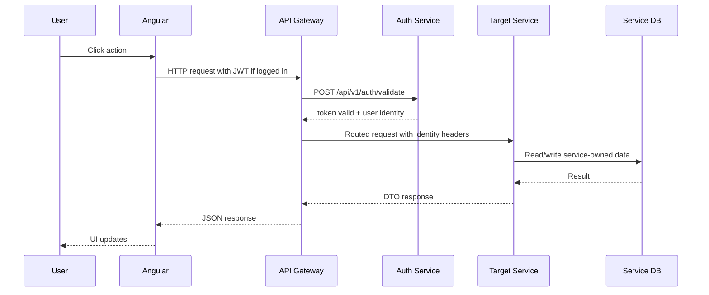
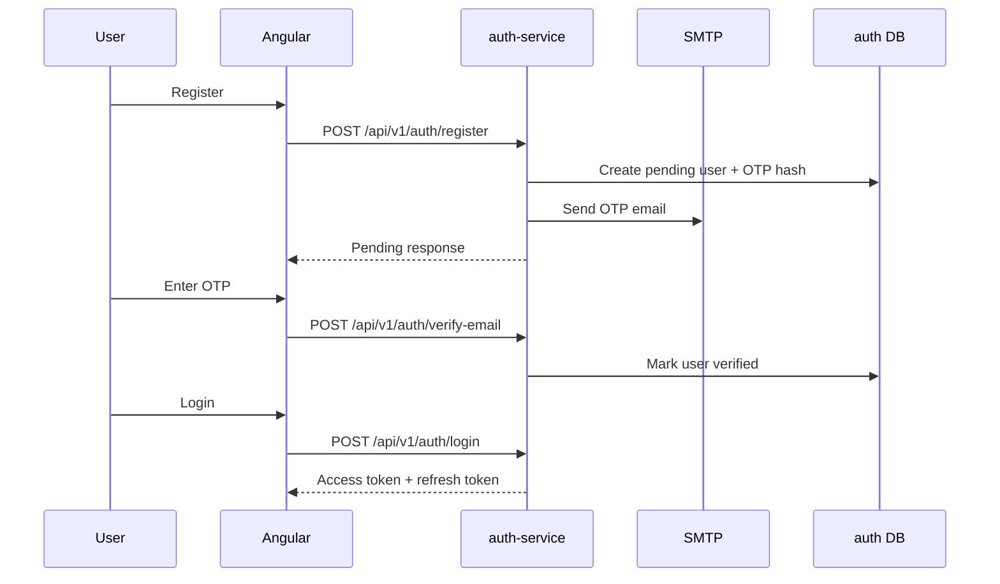
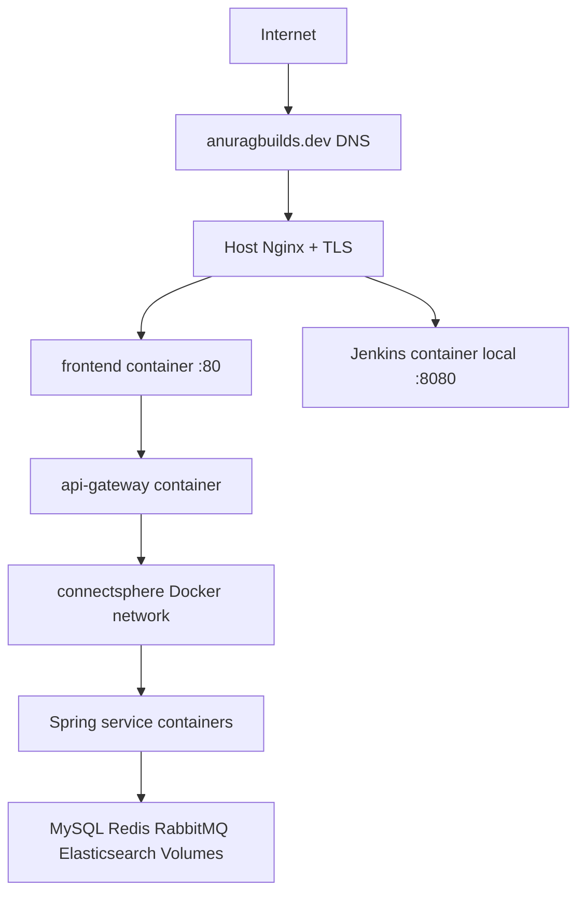
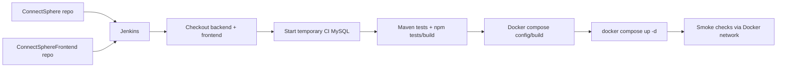
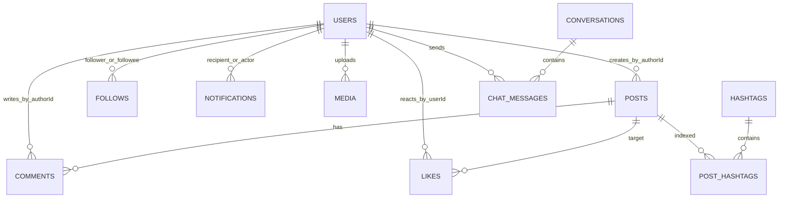

# ConnectSphere Complete Project Documentation

Generated from the repository source tree for interview, onboarding, viva, demo, and production understanding.

## 1. Project Overview

ConnectSphere is a full-stack social media platform built with an Angular frontend and Spring Boot microservices. It solves the problem of building a modern network where users can register, verify email, log in, create posts, upload media, comment, react, follow accounts, view stories, chat in real time, receive notifications, search content, and let admins moderate the platform.

**Architecture type:** microservices-based, containerized, cloud-deployable application. It is not monolithic because each business capability has its own Spring Boot service, port, database schema, and Docker image. It is not serverless because services run as long-lived containers/VM processes.

**Main features:** authentication, email OTP, JWT, OAuth login, posts, comments/replies, likes/reactions, follows/private requests, notifications, media uploads, 24-hour stories, Elasticsearch search, real-time chat, reports, admin dashboard, system health dashboard, Jenkins CI/CD, Docker Compose deployment, Nginx reverse proxy, Azure/AWS deployment guides.

**Real-world use case:** a portfolio-grade social platform demonstrating how production web products split identity, content, media, search, notifications, and messaging into independently deployable services.

## 2. Complete Architecture Explanation

The browser serves Angular from nginx. Angular calls `/api/...` URLs. Nginx proxies these to API Gateway. API Gateway validates protected requests by calling auth-service and then routes requests to downstream services through Eureka service discovery. Each business service owns its database schema and exposes REST APIs. RabbitMQ carries async notification/search events. Redis caches hot post/notification reads. Elasticsearch powers search. Media can be stored locally, in AWS S3, or in Azure Blob Storage.

### High-Level System Architecture



### Service-to-Service Communication



### Request Lifecycle



### Authentication Flow



### Deployment Architecture



### CI/CD Flow



## 3. Service-by-Service Explanation

| Service | Type | Port | Purpose | Database/Storage |
| --- | --- | --- | --- | --- |
| service-registry | Spring Boot service | 8761 | Runs Netflix Eureka so every backend service can register itself and discover other services by logical name. | None |
| api-gateway | Spring Cloud Gateway service | 8080 | Single backend entry point that routes browser API traffic to internal microservices and validates JWT tokens through auth-service. | None |
| auth-service | Spring Boot service | 8081 | Owns users, authentication, email OTP verification, OAuth login, JWT tokens, admin dashboard data, and reports. | MySQL database connectsphere_auth |
| post-service | Spring Boot service | 8082 | Owns posts, feed retrieval, post visibility, and denormalized counters for likes/comments/shares. | MySQL database connectsphere_post plus Redis cache |
| comment-service | Spring Boot service | 8083 | Owns comments and replies for posts. | MySQL database connectsphere_comment |
| like-service | Spring Boot service | 8084 | Owns reactions/likes for posts, comments, and stories. | MySQL database connectsphere_like |
| follow-service | Spring Boot service | 8085 | Owns social graph relationships between users. | MySQL database connectsphere_follow |
| notification-service | Spring Boot service | 8086 | Owns user notifications created directly or from RabbitMQ social events. | MySQL database connectsphere_notification plus Redis cache |
| media-service | Spring Boot service | 8087 | Handles media uploads and 24-hour stories, with local, AWS S3, or Azure Blob storage providers. | MySQL database connectsphere_media plus file/blob storage |
| search-service | Spring Boot service | 8088 | Indexes and searches posts, hashtags, and user search proxy data. | MySQL database connectsphere_search plus Elasticsearch |
| chat-service | Spring Boot service | 8089 | Owns direct message conversations and websocket delivery. | MySQL database connectsphere_chat |
| connectsphere-web | Angular frontend | 4200 local / 80 container / 8088 host in prod compose | Browser application for social feed, auth, profiles, posts, stories, messages, notifications, and admin dashboards. | None |

For deep service-specific details, read each `SERVICE_DOCUMENTATION.md` generated inside the service folder.

## 4. API Documentation

| Method | Endpoint | Service | Controller/File | Purpose | Request | Response | Auth | Database Interaction | Error Cases |
| --- | --- | --- | --- | --- | --- | --- | --- | --- | --- |
| GET | /api/v1/admin/users | auth-service | auth-service/src/main/java/com/connectsphere/auth/controller/AdminResource.java | List users through AdminResource.java. | Path/query parameters only unless noted by controller signature. | DTO/JSON response from controller | Normally called behind gateway with JWT; service itself mostly trusts forwarded user/context in this codebase. | Reads/writes users, email_otps, revoked_tokens, reports. | See GlobalExceptionHandler/domain exceptions |
| PATCH | /api/v1/admin/users/{userId}/suspend | auth-service | auth-service/src/main/java/com/connectsphere/auth/controller/AdminResource.java | Suspend user through AdminResource.java. | JSON body matching the request DTO named in the controller method signature. | DTO/JSON response from controller | Public for registration/login/verification/search where allowed; admin/profile/report actions require JWT and role checks. | Reads/writes users, email_otps, revoked_tokens, reports. | See GlobalExceptionHandler/domain exceptions |
| PATCH | /api/v1/admin/users/{userId}/reactivate | auth-service | auth-service/src/main/java/com/connectsphere/auth/controller/AdminResource.java | Reactivate user through AdminResource.java. | JSON body matching the request DTO named in the controller method signature. | DTO/JSON response from controller | Public for registration/login/verification/search where allowed; admin/profile/report actions require JWT and role checks. | Reads/writes users, email_otps, revoked_tokens, reports. | See GlobalExceptionHandler/domain exceptions |
| DELETE | /api/v1/admin/users/{userId} | auth-service | auth-service/src/main/java/com/connectsphere/auth/controller/AdminResource.java | Delete user through AdminResource.java. | JSON body matching the request DTO named in the controller method signature. | DTO/JSON response from controller | Public for registration/login/verification/search where allowed; admin/profile/report actions require JWT and role checks. | Reads/writes users, email_otps, revoked_tokens, reports. | See GlobalExceptionHandler/domain exceptions |
| GET | /api/v1/admin/analytics | auth-service | auth-service/src/main/java/com/connectsphere/auth/controller/AdminResource.java | Get stats through AdminResource.java. | Path/query parameters only unless noted by controller signature. | DTO/JSON response from controller | Normally called behind gateway with JWT; service itself mostly trusts forwarded user/context in this codebase. | Reads/writes users, email_otps, revoked_tokens, reports. | See GlobalExceptionHandler/domain exceptions |
| GET | /api/v1/admin/platform-overview | auth-service | auth-service/src/main/java/com/connectsphere/auth/controller/AdminResource.java | Get platform overview through AdminResource.java. | Path/query parameters only unless noted by controller signature. | DTO/JSON response from controller | Normally called behind gateway with JWT; service itself mostly trusts forwarded user/context in this codebase. | Reads/writes users, email_otps, revoked_tokens, reports. | See GlobalExceptionHandler/domain exceptions |
| GET | /api/v1/admin/system-overview | auth-service | auth-service/src/main/java/com/connectsphere/auth/controller/AdminResource.java | Get system overview through AdminResource.java. | Path/query parameters only unless noted by controller signature. | DTO/JSON response from controller | Normally called behind gateway with JWT; service itself mostly trusts forwarded user/context in this codebase. | Reads/writes users, email_otps, revoked_tokens, reports. | See GlobalExceptionHandler/domain exceptions |
| POST | /api/v1/auth/register | auth-service | auth-service/src/main/java/com/connectsphere/auth/controller/AuthResource.java | Register through AuthResource.java. | JSON body matching the request DTO named in the controller method signature. | DTO/JSON response from controller | Public for registration/login/verification/search where allowed; admin/profile/report actions require JWT and role checks. | Reads/writes users, email_otps, revoked_tokens, reports. | See GlobalExceptionHandler/domain exceptions |
| POST | /api/v1/auth/verify-email | auth-service | auth-service/src/main/java/com/connectsphere/auth/controller/AuthResource.java | Verify email through AuthResource.java. | JSON body matching the request DTO named in the controller method signature. | DTO/JSON response from controller | Public for registration/login/verification/search where allowed; admin/profile/report actions require JWT and role checks. | Reads/writes users, email_otps, revoked_tokens, reports. | See GlobalExceptionHandler/domain exceptions |
| POST | /api/v1/auth/resend-otp | auth-service | auth-service/src/main/java/com/connectsphere/auth/controller/AuthResource.java | Resend otp through AuthResource.java. | JSON body matching the request DTO named in the controller method signature. | DTO/JSON response from controller | Normally called behind gateway with JWT; service itself mostly trusts forwarded user/context in this codebase. | Reads/writes users, email_otps, revoked_tokens, reports. | See GlobalExceptionHandler/domain exceptions |
| POST | /api/v1/auth/forgot-password | auth-service | auth-service/src/main/java/com/connectsphere/auth/controller/AuthResource.java | Forgot password through AuthResource.java. | JSON body matching the request DTO named in the controller method signature. | DTO/JSON response from controller | Public for registration/login/verification/search where allowed; admin/profile/report actions require JWT and role checks. | Reads/writes users, email_otps, revoked_tokens, reports. | See GlobalExceptionHandler/domain exceptions |
| POST | /api/v1/auth/reset-password | auth-service | auth-service/src/main/java/com/connectsphere/auth/controller/AuthResource.java | Reset password through AuthResource.java. | JSON body matching the request DTO named in the controller method signature. | DTO/JSON response from controller | Public for registration/login/verification/search where allowed; admin/profile/report actions require JWT and role checks. | Reads/writes users, email_otps, revoked_tokens, reports. | See GlobalExceptionHandler/domain exceptions |
| POST | /api/v1/auth/login | auth-service | auth-service/src/main/java/com/connectsphere/auth/controller/AuthResource.java | Login through AuthResource.java. | JSON body matching the request DTO named in the controller method signature. | DTO/JSON response from controller | Public for registration/login/verification/search where allowed; admin/profile/report actions require JWT and role checks. | Reads/writes users, email_otps, revoked_tokens, reports. | See GlobalExceptionHandler/domain exceptions |
| POST | /api/v1/auth/logout | auth-service | auth-service/src/main/java/com/connectsphere/auth/controller/AuthResource.java | Logout through AuthResource.java. | JSON body matching the request DTO named in the controller method signature. | DTO/JSON response from controller | Normally called behind gateway with JWT; service itself mostly trusts forwarded user/context in this codebase. | Reads/writes users, email_otps, revoked_tokens, reports. | See GlobalExceptionHandler/domain exceptions |
| POST | /api/v1/auth/refresh | auth-service | auth-service/src/main/java/com/connectsphere/auth/controller/AuthResource.java | Refresh through AuthResource.java. | JSON body matching the request DTO named in the controller method signature. | DTO/JSON response from controller | Public for registration/login/verification/search where allowed; admin/profile/report actions require JWT and role checks. | Reads/writes users, email_otps, revoked_tokens, reports. | See GlobalExceptionHandler/domain exceptions |
| POST | /api/v1/auth/validate | auth-service | auth-service/src/main/java/com/connectsphere/auth/controller/AuthResource.java | Validate through AuthResource.java. | JSON body matching the request DTO named in the controller method signature. | DTO/JSON response from controller | Public for registration/login/verification/search where allowed; admin/profile/report actions require JWT and role checks. | Reads/writes users, email_otps, revoked_tokens, reports. | See GlobalExceptionHandler/domain exceptions |
| GET | /api/v1/auth/profile | auth-service | auth-service/src/main/java/com/connectsphere/auth/controller/AuthResource.java | Get profile through AuthResource.java. | Path/query parameters only unless noted by controller signature. | DTO/JSON response from controller | Normally called behind gateway with JWT; service itself mostly trusts forwarded user/context in this codebase. | Reads/writes users, email_otps, revoked_tokens, reports. | See GlobalExceptionHandler/domain exceptions |
| PUT | /api/v1/auth/profile | auth-service | auth-service/src/main/java/com/connectsphere/auth/controller/AuthResource.java | Update profile through AuthResource.java. | JSON body matching the request DTO named in the controller method signature. | DTO/JSON response from controller | Normally called behind gateway with JWT; service itself mostly trusts forwarded user/context in this codebase. | Reads/writes users, email_otps, revoked_tokens, reports. | See GlobalExceptionHandler/domain exceptions |
| PATCH | /api/v1/auth/password | auth-service | auth-service/src/main/java/com/connectsphere/auth/controller/AuthResource.java | Change password through AuthResource.java. | JSON body matching the request DTO named in the controller method signature. | DTO/JSON response from controller | Normally called behind gateway with JWT; service itself mostly trusts forwarded user/context in this codebase. | Reads/writes users, email_otps, revoked_tokens, reports. | See GlobalExceptionHandler/domain exceptions |
| GET | /api/v1/auth/search | auth-service | auth-service/src/main/java/com/connectsphere/auth/controller/AuthResource.java | Search users through AuthResource.java. | Path/query parameters only unless noted by controller signature. | DTO/JSON response from controller | Normally called behind gateway with JWT; service itself mostly trusts forwarded user/context in this codebase. | Reads/writes users, email_otps, revoked_tokens, reports. | See GlobalExceptionHandler/domain exceptions |
| GET | /api/v1/auth/users/{userId} | auth-service | auth-service/src/main/java/com/connectsphere/auth/controller/AuthResource.java | Handler through AuthResource.java. | Path/query parameters only unless noted by controller signature. | DTO/JSON response from controller | Public for registration/login/verification/search where allowed; admin/profile/report actions require JWT and role checks. | Reads/writes users, email_otps, revoked_tokens, reports. | See GlobalExceptionHandler/domain exceptions |
| PATCH | /api/v1/auth/deactivate | auth-service | auth-service/src/main/java/com/connectsphere/auth/controller/AuthResource.java | Deactivate account through AuthResource.java. | JSON body matching the request DTO named in the controller method signature. | DTO/JSON response from controller | Normally called behind gateway with JWT; service itself mostly trusts forwarded user/context in this codebase. | Reads/writes users, email_otps, revoked_tokens, reports. | See GlobalExceptionHandler/domain exceptions |
| GET | /api/v1/auth/users/by-email/{email} | auth-service | auth-service/src/main/java/com/connectsphere/auth/controller/AuthResource.java | Get user by email through AuthResource.java. | Path/query parameters only unless noted by controller signature. | DTO/JSON response from controller | Public for registration/login/verification/search where allowed; admin/profile/report actions require JWT and role checks. | Reads/writes users, email_otps, revoked_tokens, reports. | See GlobalExceptionHandler/domain exceptions |
| POST | /api/v1/reports | auth-service | auth-service/src/main/java/com/connectsphere/auth/controller/ReportResource.java | Create report through ReportResource.java. | JSON body matching the request DTO named in the controller method signature. | DTO/JSON response from controller | Normally called behind gateway with JWT; service itself mostly trusts forwarded user/context in this codebase. | Reads/writes users, email_otps, revoked_tokens, reports. | See GlobalExceptionHandler/domain exceptions |
| GET | /api/v1/reports/mine | auth-service | auth-service/src/main/java/com/connectsphere/auth/controller/ReportResource.java | Get my reports through ReportResource.java. | Path/query parameters only unless noted by controller signature. | DTO/JSON response from controller | Normally called behind gateway with JWT; service itself mostly trusts forwarded user/context in this codebase. | Reads/writes users, email_otps, revoked_tokens, reports. | See GlobalExceptionHandler/domain exceptions |
| GET | /api/v1/reports | auth-service | auth-service/src/main/java/com/connectsphere/auth/controller/ReportResource.java | Get reports through ReportResource.java. | Path/query parameters only unless noted by controller signature. | DTO/JSON response from controller | Normally called behind gateway with JWT; service itself mostly trusts forwarded user/context in this codebase. | Reads/writes users, email_otps, revoked_tokens, reports. | See GlobalExceptionHandler/domain exceptions |
| PATCH | /api/v1/reports/{reportId}/resolve | auth-service | auth-service/src/main/java/com/connectsphere/auth/controller/ReportResource.java | Resolve report through ReportResource.java. | JSON body matching the request DTO named in the controller method signature. | DTO/JSON response from controller | Normally called behind gateway with JWT; service itself mostly trusts forwarded user/context in this codebase. | Reads/writes users, email_otps, revoked_tokens, reports. | See GlobalExceptionHandler/domain exceptions |
| POST | /api/v1/posts | post-service | post-service/src/main/java/com/connectsphere/post/controller/PostResource.java | Create post through PostResource.java. | JSON body matching the request DTO named in the controller method signature. | DTO/JSON response from controller | Normally called behind gateway with JWT; service itself mostly trusts forwarded user/context in this codebase. | Reads/writes posts and post_media_urls element collection. | See GlobalExceptionHandler/domain exceptions |
| GET | /api/v1/posts/{postId} | post-service | post-service/src/main/java/com/connectsphere/post/controller/PostResource.java | Get post by id through PostResource.java. | Path/query parameters only unless noted by controller signature. | DTO/JSON response from controller | Normally called behind gateway with JWT; service itself mostly trusts forwarded user/context in this codebase. | Reads/writes posts and post_media_urls element collection. | See GlobalExceptionHandler/domain exceptions |
| GET | /api/v1/posts/user/{authorId} | post-service | post-service/src/main/java/com/connectsphere/post/controller/PostResource.java | Get posts by user through PostResource.java. | Path/query parameters only unless noted by controller signature. | DTO/JSON response from controller | Normally called behind gateway with JWT; service itself mostly trusts forwarded user/context in this codebase. | Reads/writes posts and post_media_urls element collection. | See GlobalExceptionHandler/domain exceptions |
| GET | /api/v1/posts/feed | post-service | post-service/src/main/java/com/connectsphere/post/controller/PostResource.java | Get feed through PostResource.java. | Path/query parameters only unless noted by controller signature. | DTO/JSON response from controller | Normally called behind gateway with JWT; service itself mostly trusts forwarded user/context in this codebase. | Reads/writes posts and post_media_urls element collection. | See GlobalExceptionHandler/domain exceptions |
| GET | /api/v1/posts/search | post-service | post-service/src/main/java/com/connectsphere/post/controller/PostResource.java | Search posts through PostResource.java. | Path/query parameters only unless noted by controller signature. | DTO/JSON response from controller | Normally called behind gateway with JWT; service itself mostly trusts forwarded user/context in this codebase. | Reads/writes posts and post_media_urls element collection. | See GlobalExceptionHandler/domain exceptions |
| PUT | /api/v1/posts/{postId} | post-service | post-service/src/main/java/com/connectsphere/post/controller/PostResource.java | Update post through PostResource.java. | JSON body matching the request DTO named in the controller method signature. | DTO/JSON response from controller | Normally called behind gateway with JWT; service itself mostly trusts forwarded user/context in this codebase. | Reads/writes posts and post_media_urls element collection. | See GlobalExceptionHandler/domain exceptions |
| PUT | /api/v1/posts/{postId}/visibility | post-service | post-service/src/main/java/com/connectsphere/post/controller/PostResource.java | Change visibility through PostResource.java. | JSON body matching the request DTO named in the controller method signature. | DTO/JSON response from controller | Normally called behind gateway with JWT; service itself mostly trusts forwarded user/context in this codebase. | Reads/writes posts and post_media_urls element collection. | See GlobalExceptionHandler/domain exceptions |
| DELETE | /api/v1/posts/{postId} | post-service | post-service/src/main/java/com/connectsphere/post/controller/PostResource.java | Delete post through PostResource.java. | JSON body matching the request DTO named in the controller method signature. | DTO/JSON response from controller | Normally called behind gateway with JWT; service itself mostly trusts forwarded user/context in this codebase. | Reads/writes posts and post_media_urls element collection. | See GlobalExceptionHandler/domain exceptions |
| POST | /api/v1/posts/{postId}/likes/increment | post-service | post-service/src/main/java/com/connectsphere/post/controller/PostResource.java | Increment likes through PostResource.java. | JSON body matching the request DTO named in the controller method signature. | DTO/JSON response from controller | Normally called behind gateway with JWT; service itself mostly trusts forwarded user/context in this codebase. | Reads/writes posts and post_media_urls element collection. | See GlobalExceptionHandler/domain exceptions |
| POST | /api/v1/posts/{postId}/likes/decrement | post-service | post-service/src/main/java/com/connectsphere/post/controller/PostResource.java | Decrement likes through PostResource.java. | JSON body matching the request DTO named in the controller method signature. | DTO/JSON response from controller | Normally called behind gateway with JWT; service itself mostly trusts forwarded user/context in this codebase. | Reads/writes posts and post_media_urls element collection. | See GlobalExceptionHandler/domain exceptions |
| POST | /api/v1/posts/{postId}/comments/increment | post-service | post-service/src/main/java/com/connectsphere/post/controller/PostResource.java | Increment comments through PostResource.java. | JSON body matching the request DTO named in the controller method signature. | DTO/JSON response from controller | Normally called behind gateway with JWT; service itself mostly trusts forwarded user/context in this codebase. | Reads/writes posts and post_media_urls element collection. | See GlobalExceptionHandler/domain exceptions |
| GET | /api/v1/posts/count/{authorId} | post-service | post-service/src/main/java/com/connectsphere/post/controller/PostResource.java | Get post count through PostResource.java. | Path/query parameters only unless noted by controller signature. | DTO/JSON response from controller | Normally called behind gateway with JWT; service itself mostly trusts forwarded user/context in this codebase. | Reads/writes posts and post_media_urls element collection. | See GlobalExceptionHandler/domain exceptions |
| POST | /api/v1/comments | comment-service | comment-service/src/main/java/com/connectsphere/comment/controller/CommentResource.java | Add comment through CommentResource.java. | JSON body matching the request DTO named in the controller method signature. | DTO/JSON response from controller | Normally called behind gateway with JWT; service itself mostly trusts forwarded user/context in this codebase. | Reads/writes comments. | See GlobalExceptionHandler/domain exceptions |
| GET | /api/v1/comments/post/{postId} | comment-service | comment-service/src/main/java/com/connectsphere/comment/controller/CommentResource.java | Get comments by post through CommentResource.java. | Path/query parameters only unless noted by controller signature. | DTO/JSON response from controller | Normally called behind gateway with JWT; service itself mostly trusts forwarded user/context in this codebase. | Reads/writes comments. | See GlobalExceptionHandler/domain exceptions |
| GET | /api/v1/comments/{commentId} | comment-service | comment-service/src/main/java/com/connectsphere/comment/controller/CommentResource.java | Get comment by id through CommentResource.java. | Path/query parameters only unless noted by controller signature. | DTO/JSON response from controller | Normally called behind gateway with JWT; service itself mostly trusts forwarded user/context in this codebase. | Reads/writes comments. | See GlobalExceptionHandler/domain exceptions |
| GET | /api/v1/comments/{commentId}/replies | comment-service | comment-service/src/main/java/com/connectsphere/comment/controller/CommentResource.java | Get replies through CommentResource.java. | Path/query parameters only unless noted by controller signature. | DTO/JSON response from controller | Normally called behind gateway with JWT; service itself mostly trusts forwarded user/context in this codebase. | Reads/writes comments. | See GlobalExceptionHandler/domain exceptions |
| PUT | /api/v1/comments/{commentId} | comment-service | comment-service/src/main/java/com/connectsphere/comment/controller/CommentResource.java | Update comment through CommentResource.java. | JSON body matching the request DTO named in the controller method signature. | DTO/JSON response from controller | Normally called behind gateway with JWT; service itself mostly trusts forwarded user/context in this codebase. | Reads/writes comments. | See GlobalExceptionHandler/domain exceptions |
| DELETE | /api/v1/comments/{commentId} | comment-service | comment-service/src/main/java/com/connectsphere/comment/controller/CommentResource.java | Delete comment through CommentResource.java. | JSON body matching the request DTO named in the controller method signature. | DTO/JSON response from controller | Normally called behind gateway with JWT; service itself mostly trusts forwarded user/context in this codebase. | Reads/writes comments. | See GlobalExceptionHandler/domain exceptions |
| GET | /api/v1/comments/user/{authorId} | comment-service | comment-service/src/main/java/com/connectsphere/comment/controller/CommentResource.java | Get comments by user through CommentResource.java. | Path/query parameters only unless noted by controller signature. | DTO/JSON response from controller | Normally called behind gateway with JWT; service itself mostly trusts forwarded user/context in this codebase. | Reads/writes comments. | See GlobalExceptionHandler/domain exceptions |
| POST | /api/v1/comments/{commentId}/likes | comment-service | comment-service/src/main/java/com/connectsphere/comment/controller/CommentResource.java | Like comment through CommentResource.java. | JSON body matching the request DTO named in the controller method signature. | DTO/JSON response from controller | Normally called behind gateway with JWT; service itself mostly trusts forwarded user/context in this codebase. | Reads/writes comments. | See GlobalExceptionHandler/domain exceptions |
| POST | /api/v1/comments/{commentId}/likes/remove | comment-service | comment-service/src/main/java/com/connectsphere/comment/controller/CommentResource.java | Unlike comment through CommentResource.java. | JSON body matching the request DTO named in the controller method signature. | DTO/JSON response from controller | Normally called behind gateway with JWT; service itself mostly trusts forwarded user/context in this codebase. | Reads/writes comments. | See GlobalExceptionHandler/domain exceptions |
| GET | /api/v1/comments/count | comment-service | comment-service/src/main/java/com/connectsphere/comment/controller/CommentResource.java | Get comment count through CommentResource.java. | Path/query parameters only unless noted by controller signature. | DTO/JSON response from controller | Normally called behind gateway with JWT; service itself mostly trusts forwarded user/context in this codebase. | Reads/writes comments. | See GlobalExceptionHandler/domain exceptions |
| POST | /api/v1/likes | like-service | like-service/src/main/java/com/connectsphere/like/controller/LikeResource.java | Like target through LikeResource.java. | JSON body matching the request DTO named in the controller method signature. | DTO/JSON response from controller | Normally called behind gateway with JWT; service itself mostly trusts forwarded user/context in this codebase. | Reads/writes likes. | See GlobalExceptionHandler/domain exceptions |
| DELETE | /api/v1/likes | like-service | like-service/src/main/java/com/connectsphere/like/controller/LikeResource.java | Unlike target through LikeResource.java. | JSON body matching the request DTO named in the controller method signature. | DTO/JSON response from controller | Normally called behind gateway with JWT; service itself mostly trusts forwarded user/context in this codebase. | Reads/writes likes. | See GlobalExceptionHandler/domain exceptions |
| GET | /api/v1/likes/has-liked | like-service | like-service/src/main/java/com/connectsphere/like/controller/LikeResource.java | Has liked through LikeResource.java. | Path/query parameters only unless noted by controller signature. | DTO/JSON response from controller | Normally called behind gateway with JWT; service itself mostly trusts forwarded user/context in this codebase. | Reads/writes likes. | See GlobalExceptionHandler/domain exceptions |
| GET | /api/v1/likes/target/{targetId} | like-service | like-service/src/main/java/com/connectsphere/like/controller/LikeResource.java | Get likes by target through LikeResource.java. | Path/query parameters only unless noted by controller signature. | DTO/JSON response from controller | Normally called behind gateway with JWT; service itself mostly trusts forwarded user/context in this codebase. | Reads/writes likes. | See GlobalExceptionHandler/domain exceptions |
| GET | /api/v1/likes/user/{userId} | like-service | like-service/src/main/java/com/connectsphere/like/controller/LikeResource.java | Get likes by user through LikeResource.java. | Path/query parameters only unless noted by controller signature. | DTO/JSON response from controller | Normally called behind gateway with JWT; service itself mostly trusts forwarded user/context in this codebase. | Reads/writes likes. | See GlobalExceptionHandler/domain exceptions |
| GET | /api/v1/likes/count/{targetId} | like-service | like-service/src/main/java/com/connectsphere/like/controller/LikeResource.java | Get like count through LikeResource.java. | Path/query parameters only unless noted by controller signature. | DTO/JSON response from controller | Normally called behind gateway with JWT; service itself mostly trusts forwarded user/context in this codebase. | Reads/writes likes. | See GlobalExceptionHandler/domain exceptions |
| GET | /api/v1/likes/count/{targetId}/type | like-service | like-service/src/main/java/com/connectsphere/like/controller/LikeResource.java | Get like count by type through LikeResource.java. | Path/query parameters only unless noted by controller signature. | DTO/JSON response from controller | Normally called behind gateway with JWT; service itself mostly trusts forwarded user/context in this codebase. | Reads/writes likes. | See GlobalExceptionHandler/domain exceptions |
| GET | /api/v1/likes/summary/{targetId} | like-service | like-service/src/main/java/com/connectsphere/like/controller/LikeResource.java | Get reaction summary through LikeResource.java. | Path/query parameters only unless noted by controller signature. | DTO/JSON response from controller | Normally called behind gateway with JWT; service itself mostly trusts forwarded user/context in this codebase. | Reads/writes likes. | See GlobalExceptionHandler/domain exceptions |
| PUT | /api/v1/likes/{userId}/{targetId} | like-service | like-service/src/main/java/com/connectsphere/like/controller/LikeResource.java | Change reaction through LikeResource.java. | JSON body matching the request DTO named in the controller method signature. | DTO/JSON response from controller | Normally called behind gateway with JWT; service itself mostly trusts forwarded user/context in this codebase. | Reads/writes likes. | See GlobalExceptionHandler/domain exceptions |
| POST | /api/v1/follows | follow-service | follow-service/src/main/java/com/connectsphere/follow/controller/FollowResource.java | Follow through FollowResource.java. | JSON body matching the request DTO named in the controller method signature. | DTO/JSON response from controller | Normally called behind gateway with JWT; service itself mostly trusts forwarded user/context in this codebase. | Reads/writes follows. | See GlobalExceptionHandler/domain exceptions |
| DELETE | /api/v1/follows | follow-service | follow-service/src/main/java/com/connectsphere/follow/controller/FollowResource.java | Unfollow through FollowResource.java. | JSON body matching the request DTO named in the controller method signature. | DTO/JSON response from controller | Normally called behind gateway with JWT; service itself mostly trusts forwarded user/context in this codebase. | Reads/writes follows. | See GlobalExceptionHandler/domain exceptions |
| GET | /api/v1/follows/is-following | follow-service | follow-service/src/main/java/com/connectsphere/follow/controller/FollowResource.java | Is following through FollowResource.java. | Path/query parameters only unless noted by controller signature. | DTO/JSON response from controller | Normally called behind gateway with JWT; service itself mostly trusts forwarded user/context in this codebase. | Reads/writes follows. | See GlobalExceptionHandler/domain exceptions |
| GET | /api/v1/follows/relationship | follow-service | follow-service/src/main/java/com/connectsphere/follow/controller/FollowResource.java | Get relationship through FollowResource.java. | Path/query parameters only unless noted by controller signature. | DTO/JSON response from controller | Normally called behind gateway with JWT; service itself mostly trusts forwarded user/context in this codebase. | Reads/writes follows. | See GlobalExceptionHandler/domain exceptions |
| GET | /api/v1/follows/followers/{followeeId} | follow-service | follow-service/src/main/java/com/connectsphere/follow/controller/FollowResource.java | Get followers through FollowResource.java. | Path/query parameters only unless noted by controller signature. | DTO/JSON response from controller | Normally called behind gateway with JWT; service itself mostly trusts forwarded user/context in this codebase. | Reads/writes follows. | See GlobalExceptionHandler/domain exceptions |
| GET | /api/v1/follows/following/{followerId} | follow-service | follow-service/src/main/java/com/connectsphere/follow/controller/FollowResource.java | Get following through FollowResource.java. | Path/query parameters only unless noted by controller signature. | DTO/JSON response from controller | Normally called behind gateway with JWT; service itself mostly trusts forwarded user/context in this codebase. | Reads/writes follows. | See GlobalExceptionHandler/domain exceptions |
| GET | /api/v1/follows/requests/{followeeId} | follow-service | follow-service/src/main/java/com/connectsphere/follow/controller/FollowResource.java | Get pending requests through FollowResource.java. | Path/query parameters only unless noted by controller signature. | DTO/JSON response from controller | Normally called behind gateway with JWT; service itself mostly trusts forwarded user/context in this codebase. | Reads/writes follows. | See GlobalExceptionHandler/domain exceptions |
| GET | /api/v1/follows/requests/sent/{followerId} | follow-service | follow-service/src/main/java/com/connectsphere/follow/controller/FollowResource.java | Get outgoing pending requests through FollowResource.java. | Path/query parameters only unless noted by controller signature. | DTO/JSON response from controller | Normally called behind gateway with JWT; service itself mostly trusts forwarded user/context in this codebase. | Reads/writes follows. | See GlobalExceptionHandler/domain exceptions |
| PATCH | /api/v1/follows/{followId}/accept | follow-service | follow-service/src/main/java/com/connectsphere/follow/controller/FollowResource.java | Accept request through FollowResource.java. | JSON body matching the request DTO named in the controller method signature. | DTO/JSON response from controller | Normally called behind gateway with JWT; service itself mostly trusts forwarded user/context in this codebase. | Reads/writes follows. | See GlobalExceptionHandler/domain exceptions |
| DELETE | /api/v1/follows/{followId}/reject | follow-service | follow-service/src/main/java/com/connectsphere/follow/controller/FollowResource.java | Reject request through FollowResource.java. | JSON body matching the request DTO named in the controller method signature. | DTO/JSON response from controller | Normally called behind gateway with JWT; service itself mostly trusts forwarded user/context in this codebase. | Reads/writes follows. | See GlobalExceptionHandler/domain exceptions |
| GET | /api/v1/follows/followers/{followeeId}/count | follow-service | follow-service/src/main/java/com/connectsphere/follow/controller/FollowResource.java | Get follower count through FollowResource.java. | Path/query parameters only unless noted by controller signature. | DTO/JSON response from controller | Normally called behind gateway with JWT; service itself mostly trusts forwarded user/context in this codebase. | Reads/writes follows. | See GlobalExceptionHandler/domain exceptions |
| GET | /api/v1/follows/following/{followerId}/count | follow-service | follow-service/src/main/java/com/connectsphere/follow/controller/FollowResource.java | Get following count through FollowResource.java. | Path/query parameters only unless noted by controller signature. | DTO/JSON response from controller | Normally called behind gateway with JWT; service itself mostly trusts forwarded user/context in this codebase. | Reads/writes follows. | See GlobalExceptionHandler/domain exceptions |
| GET | /api/v1/follows/mutual/{userId} | follow-service | follow-service/src/main/java/com/connectsphere/follow/controller/FollowResource.java | Get mutual follows through FollowResource.java. | Path/query parameters only unless noted by controller signature. | DTO/JSON response from controller | Normally called behind gateway with JWT; service itself mostly trusts forwarded user/context in this codebase. | Reads/writes follows. | See GlobalExceptionHandler/domain exceptions |
| GET | /api/v1/follows/suggested/{userId} | follow-service | follow-service/src/main/java/com/connectsphere/follow/controller/FollowResource.java | Get suggested users through FollowResource.java. | Path/query parameters only unless noted by controller signature. | DTO/JSON response from controller | Normally called behind gateway with JWT; service itself mostly trusts forwarded user/context in this codebase. | Reads/writes follows. | See GlobalExceptionHandler/domain exceptions |
| POST | /api/v1/notifications | notification-service | notification-service/src/main/java/com/connectsphere/notification/controller/NotificationResource.java | Create notification through NotificationResource.java. | JSON body matching the request DTO named in the controller method signature. | DTO/JSON response from controller | Normally called behind gateway with JWT; service itself mostly trusts forwarded user/context in this codebase. | Reads/writes notifications. | See GlobalExceptionHandler/domain exceptions |
| POST | /api/v1/notifications/bulk | notification-service | notification-service/src/main/java/com/connectsphere/notification/controller/NotificationResource.java | Send bulk through NotificationResource.java. | JSON body matching the request DTO named in the controller method signature. | DTO/JSON response from controller | Normally called behind gateway with JWT; service itself mostly trusts forwarded user/context in this codebase. | Reads/writes notifications. | See GlobalExceptionHandler/domain exceptions |
| PATCH | /api/v1/notifications/{notificationId}/read | notification-service | notification-service/src/main/java/com/connectsphere/notification/controller/NotificationResource.java | Mark as read through NotificationResource.java. | JSON body matching the request DTO named in the controller method signature. | DTO/JSON response from controller | Normally called behind gateway with JWT; service itself mostly trusts forwarded user/context in this codebase. | Reads/writes notifications. | See GlobalExceptionHandler/domain exceptions |
| PATCH | /api/v1/notifications/read-all | notification-service | notification-service/src/main/java/com/connectsphere/notification/controller/NotificationResource.java | Mark all read through NotificationResource.java. | JSON body matching the request DTO named in the controller method signature. | DTO/JSON response from controller | Normally called behind gateway with JWT; service itself mostly trusts forwarded user/context in this codebase. | Reads/writes notifications. | See GlobalExceptionHandler/domain exceptions |
| GET | /api/v1/notifications/recipient/{recipientId} | notification-service | notification-service/src/main/java/com/connectsphere/notification/controller/NotificationResource.java | Get by recipient through NotificationResource.java. | Path/query parameters only unless noted by controller signature. | DTO/JSON response from controller | Normally called behind gateway with JWT; service itself mostly trusts forwarded user/context in this codebase. | Reads/writes notifications. | See GlobalExceptionHandler/domain exceptions |
| GET | /api/v1/notifications/recipient/{recipientId}/unread-count | notification-service | notification-service/src/main/java/com/connectsphere/notification/controller/NotificationResource.java | Get unread count through NotificationResource.java. | Path/query parameters only unless noted by controller signature. | DTO/JSON response from controller | Normally called behind gateway with JWT; service itself mostly trusts forwarded user/context in this codebase. | Reads/writes notifications. | See GlobalExceptionHandler/domain exceptions |
| DELETE | /api/v1/notifications/{notificationId} | notification-service | notification-service/src/main/java/com/connectsphere/notification/controller/NotificationResource.java | Delete notification through NotificationResource.java. | JSON body matching the request DTO named in the controller method signature. | DTO/JSON response from controller | Normally called behind gateway with JWT; service itself mostly trusts forwarded user/context in this codebase. | Reads/writes notifications. | See GlobalExceptionHandler/domain exceptions |
| GET | /api/v1/notifications | notification-service | notification-service/src/main/java/com/connectsphere/notification/controller/NotificationResource.java | Get all through NotificationResource.java. | Path/query parameters only unless noted by controller signature. | DTO/JSON response from controller | Normally called behind gateway with JWT; service itself mostly trusts forwarded user/context in this codebase. | Reads/writes notifications. | See GlobalExceptionHandler/domain exceptions |
| POST | /api/v1/media/upload | media-service | media-service/src/main/java/com/connectsphere/media/controller/MediaResource.java | Upload media through MediaResource.java. | Multipart form-data for file endpoints; JSON for non-file writes. | DTO/JSON response from controller | Normally called behind gateway with JWT; service itself mostly trusts forwarded user/context in this codebase. | Reads/writes media, stories. | See GlobalExceptionHandler/domain exceptions |
| GET | /api/v1/media/post/{postId} | media-service | media-service/src/main/java/com/connectsphere/media/controller/MediaResource.java | Get media by post through MediaResource.java. | Path/query parameters only unless noted by controller signature. | DTO/JSON response from controller | Normally called behind gateway with JWT; service itself mostly trusts forwarded user/context in this codebase. | Reads/writes media, stories. | See GlobalExceptionHandler/domain exceptions |
| GET | /api/v1/media/{mediaId} | media-service | media-service/src/main/java/com/connectsphere/media/controller/MediaResource.java | Get media by id through MediaResource.java. | Path/query parameters only unless noted by controller signature. | DTO/JSON response from controller | Normally called behind gateway with JWT; service itself mostly trusts forwarded user/context in this codebase. | Reads/writes media, stories. | See GlobalExceptionHandler/domain exceptions |
| DELETE | /api/v1/media/{mediaId} | media-service | media-service/src/main/java/com/connectsphere/media/controller/MediaResource.java | Delete media through MediaResource.java. | JSON body matching the request DTO named in the controller method signature. | DTO/JSON response from controller | Normally called behind gateway with JWT; service itself mostly trusts forwarded user/context in this codebase. | Reads/writes media, stories. | See GlobalExceptionHandler/domain exceptions |
| POST | /api/v1/stories | media-service | media-service/src/main/java/com/connectsphere/media/controller/MediaResource.java | Create story through MediaResource.java. | Multipart form-data for file endpoints; JSON for non-file writes. | DTO/JSON response from controller | Normally called behind gateway with JWT; service itself mostly trusts forwarded user/context in this codebase. | Reads/writes media, stories. | See GlobalExceptionHandler/domain exceptions |
| GET | /api/v1/stories/active | media-service | media-service/src/main/java/com/connectsphere/media/controller/MediaResource.java | Get active stories through MediaResource.java. | Path/query parameters only unless noted by controller signature. | DTO/JSON response from controller | Normally called behind gateway with JWT; service itself mostly trusts forwarded user/context in this codebase. | Reads/writes media, stories. | See GlobalExceptionHandler/domain exceptions |
| GET | /api/v1/stories/{storyId} | media-service | media-service/src/main/java/com/connectsphere/media/controller/MediaResource.java | Get story by id through MediaResource.java. | Path/query parameters only unless noted by controller signature. | DTO/JSON response from controller | Normally called behind gateway with JWT; service itself mostly trusts forwarded user/context in this codebase. | Reads/writes media, stories. | See GlobalExceptionHandler/domain exceptions |
| POST | /api/v1/stories/{storyId}/view | media-service | media-service/src/main/java/com/connectsphere/media/controller/MediaResource.java | View story through MediaResource.java. | Multipart form-data for file endpoints; JSON for non-file writes. | DTO/JSON response from controller | Normally called behind gateway with JWT; service itself mostly trusts forwarded user/context in this codebase. | Reads/writes media, stories. | See GlobalExceptionHandler/domain exceptions |
| DELETE | /api/v1/stories/{storyId} | media-service | media-service/src/main/java/com/connectsphere/media/controller/MediaResource.java | Delete story through MediaResource.java. | Multipart form-data for file endpoints; JSON for non-file writes. | DTO/JSON response from controller | Normally called behind gateway with JWT; service itself mostly trusts forwarded user/context in this codebase. | Reads/writes media, stories. | See GlobalExceptionHandler/domain exceptions |
| GET | /api/v1/stories/user/{authorId} | media-service | media-service/src/main/java/com/connectsphere/media/controller/MediaResource.java | Get stories by user through MediaResource.java. | Path/query parameters only unless noted by controller signature. | DTO/JSON response from controller | Normally called behind gateway with JWT; service itself mostly trusts forwarded user/context in this codebase. | Reads/writes media, stories. | See GlobalExceptionHandler/domain exceptions |
| GET | /api/v1/media/files/{filename} | media-service | media-service/src/main/java/com/connectsphere/media/controller/MediaResource.java | Serve file through MediaResource.java. | Path/query parameters only unless noted by controller signature. | DTO/JSON response from controller | Normally called behind gateway with JWT; service itself mostly trusts forwarded user/context in this codebase. | Reads/writes media, stories. | See GlobalExceptionHandler/domain exceptions |
| POST | /api/v1/search/index | search-service | search-service/src/main/java/com/connectsphere/search/controller/SearchResource.java | Index post through SearchResource.java. | JSON body matching the request DTO named in the controller method signature. | DTO/JSON response from controller | Normally called behind gateway with JWT; service itself mostly trusts forwarded user/context in this codebase. | Reads/writes hashtags, post_hashtags, Elasticsearch documents. | See GlobalExceptionHandler/domain exceptions |
| DELETE | /api/v1/search/index/{postId} | search-service | search-service/src/main/java/com/connectsphere/search/controller/SearchResource.java | Remove post index through SearchResource.java. | JSON body matching the request DTO named in the controller method signature. | DTO/JSON response from controller | Normally called behind gateway with JWT; service itself mostly trusts forwarded user/context in this codebase. | Reads/writes hashtags, post_hashtags, Elasticsearch documents. | See GlobalExceptionHandler/domain exceptions |
| GET | /api/v1/search/posts | search-service | search-service/src/main/java/com/connectsphere/search/controller/SearchResource.java | Search posts through SearchResource.java. | Path/query parameters only unless noted by controller signature. | DTO/JSON response from controller | Normally called behind gateway with JWT; service itself mostly trusts forwarded user/context in this codebase. | Reads/writes hashtags, post_hashtags, Elasticsearch documents. | See GlobalExceptionHandler/domain exceptions |
| GET | /api/v1/search/users | search-service | search-service/src/main/java/com/connectsphere/search/controller/SearchResource.java | Search users through SearchResource.java. | Path/query parameters only unless noted by controller signature. | DTO/JSON response from controller | Normally called behind gateway with JWT; service itself mostly trusts forwarded user/context in this codebase. | Reads/writes hashtags, post_hashtags, Elasticsearch documents. | See GlobalExceptionHandler/domain exceptions |
| GET | /api/v1/hashtags/post/{postId} | search-service | search-service/src/main/java/com/connectsphere/search/controller/SearchResource.java | Get hashtags for post through SearchResource.java. | Path/query parameters only unless noted by controller signature. | DTO/JSON response from controller | Normally called behind gateway with JWT; service itself mostly trusts forwarded user/context in this codebase. | Reads/writes hashtags, post_hashtags, Elasticsearch documents. | See GlobalExceptionHandler/domain exceptions |
| GET | /api/v1/hashtags/trending | search-service | search-service/src/main/java/com/connectsphere/search/controller/SearchResource.java | Get trending hashtags through SearchResource.java. | Path/query parameters only unless noted by controller signature. | DTO/JSON response from controller | Normally called behind gateway with JWT; service itself mostly trusts forwarded user/context in this codebase. | Reads/writes hashtags, post_hashtags, Elasticsearch documents. | See GlobalExceptionHandler/domain exceptions |
| GET | /api/v1/hashtags/{tag}/posts | search-service | search-service/src/main/java/com/connectsphere/search/controller/SearchResource.java | Get posts by hashtag through SearchResource.java. | Path/query parameters only unless noted by controller signature. | DTO/JSON response from controller | Normally called behind gateway with JWT; service itself mostly trusts forwarded user/context in this codebase. | Reads/writes hashtags, post_hashtags, Elasticsearch documents. | See GlobalExceptionHandler/domain exceptions |
| GET | /api/v1/hashtags/search | search-service | search-service/src/main/java/com/connectsphere/search/controller/SearchResource.java | Search hashtags through SearchResource.java. | Path/query parameters only unless noted by controller signature. | DTO/JSON response from controller | Normally called behind gateway with JWT; service itself mostly trusts forwarded user/context in this codebase. | Reads/writes hashtags, post_hashtags, Elasticsearch documents. | See GlobalExceptionHandler/domain exceptions |
| GET | /api/v1/hashtags/{tag}/count | search-service | search-service/src/main/java/com/connectsphere/search/controller/SearchResource.java | Get hashtag count through SearchResource.java. | Path/query parameters only unless noted by controller signature. | DTO/JSON response from controller | Normally called behind gateway with JWT; service itself mostly trusts forwarded user/context in this codebase. | Reads/writes hashtags, post_hashtags, Elasticsearch documents. | See GlobalExceptionHandler/domain exceptions |
| POST | /api/v1/chat/conversations | chat-service | chat-service/src/main/java/com/connectsphere/chat/controller/ChatRestController.java | Create conversation through ChatRestController.java. | JSON body matching the request DTO named in the controller method signature. | DTO/JSON response from controller | Normally called behind gateway with JWT; service itself mostly trusts forwarded user/context in this codebase. | Reads/writes conversations, chat_messages. | See GlobalExceptionHandler/domain exceptions |
| GET | /api/v1/chat/conversations | chat-service | chat-service/src/main/java/com/connectsphere/chat/controller/ChatRestController.java | Get conversations through ChatRestController.java. | Path/query parameters only unless noted by controller signature. | DTO/JSON response from controller | Normally called behind gateway with JWT; service itself mostly trusts forwarded user/context in this codebase. | Reads/writes conversations, chat_messages. | See GlobalExceptionHandler/domain exceptions |
| POST | /api/v1/chat/messages | chat-service | chat-service/src/main/java/com/connectsphere/chat/controller/ChatRestController.java | Save message through ChatRestController.java. | JSON body matching the request DTO named in the controller method signature. | DTO/JSON response from controller | Normally called behind gateway with JWT; service itself mostly trusts forwarded user/context in this codebase. | Reads/writes conversations, chat_messages. | See GlobalExceptionHandler/domain exceptions |
| GET | /api/v1/chat/messages/{conversationId} | chat-service | chat-service/src/main/java/com/connectsphere/chat/controller/ChatRestController.java | Get messages through ChatRestController.java. | Path/query parameters only unless noted by controller signature. | DTO/JSON response from controller | Normally called behind gateway with JWT; service itself mostly trusts forwarded user/context in this codebase. | Reads/writes conversations, chat_messages. | See GlobalExceptionHandler/domain exceptions |
| DELETE | /api/v1/chat/messages/{conversationId} | chat-service | chat-service/src/main/java/com/connectsphere/chat/controller/ChatRestController.java | Clear messages through ChatRestController.java. | JSON body matching the request DTO named in the controller method signature. | DTO/JSON response from controller | Normally called behind gateway with JWT; service itself mostly trusts forwarded user/context in this codebase. | Reads/writes conversations, chat_messages. | See GlobalExceptionHandler/domain exceptions |

### API Examples

```http
POST /api/v1/auth/login
Content-Type: application/json

{
  "emailOrUsername": "admin",
  "password": "your-password"
}
```

```http
POST /api/v1/posts
Authorization: Bearer <access-token>
Content-Type: application/json

{
  "authorId": "user-uuid",
  "content": "Hello #connectsphere",
  "mediaUrls": [],
  "postType": "TEXT_ONLY",
  "visibility": "PUBLIC"
}
```

## 5. Database Documentation

The project uses MySQL 8.4 with one schema per service. This supports microservice ownership: auth-service owns auth tables, post-service owns post tables, etc. Services communicate through APIs/events instead of cross-writing another service's tables.

| Service | Table | Entity | File | Important Fields |
| --- | --- | --- | --- | --- |
| auth-service | email_otps | EmailOtp | auth-service/src/main/java/com/connectsphere/auth/entity/EmailOtp.java | otpId:String, userId:String, email:String, purpose:OtpPurpose, codeHash:String, expiresAt:Instant, attempts:int, used:boolean, createdAt:Instant |
| auth-service | reports | Report | auth-service/src/main/java/com/connectsphere/auth/entity/Report.java | reportId:String, reporterId:String, targetType:ReportTargetType, targetId:String, reason:String, details:String, status:ReportStatus, resolutionAction:ReportResolutionAction, resolutionNotes:String, resolvedBy:String, resolvedAt:Instant, createdAt:Instant, updatedAt:Instant |
| auth-service | revoked_tokens | RevokedToken | auth-service/src/main/java/com/connectsphere/auth/entity/RevokedToken.java | tokenId:String, expiresAt:Instant |
| auth-service | users | User | auth-service/src/main/java/com/connectsphere/auth/entity/User.java | userId:String, username:String, email:String, passwordHash:String, fullName:String, bio:String, profilePicUrl:String, bannerUrl:String, privateAccount:boolean, role:Role, provider:AuthProvider, active:boolean, emailVerified:boolean, pendingEmail:String, createdAt:Instant, updatedAt:Instant |
| post-service | posts | Post | post-service/src/main/java/com/connectsphere/post/entity/Post.java | postId:String, authorId:String, content:String, postType:PostType, visibility:PostVisibility, likesCount:long, commentsCount:long, sharesCount:long, createdAt:Instant, updatedAt:Instant, deleted:boolean |
| comment-service | comments | Comment | comment-service/src/main/java/com/connectsphere/comment/entity/Comment.java | commentId:String, postId:String, authorId:String, parentCommentId:String, content:String, likesCount:int, deleted:boolean, createdAt:Instant, updatedAt:Instant |
| like-service | likes | Like | like-service/src/main/java/com/connectsphere/like/entity/Like.java | likeId:String, userId:String, targetId:String, targetType:TargetType, reactionType:ReactionType, createdAt:Instant |
| follow-service | follows | Follow | follow-service/src/main/java/com/connectsphere/follow/entity/Follow.java | followId:String, followerId:String, followeeId:String, status:FollowStatus, createdAt:Instant |
| notification-service | notifications | Notification | notification-service/src/main/java/com/connectsphere/notification/entity/Notification.java | notificationId:String, recipientId:String, actorId:String, type:NotificationType, message:String, targetId:String, targetType:String, deepLinkUrl:String, read:boolean, createdAt:Instant |
| media-service | media | Media | media-service/src/main/java/com/connectsphere/media/entity/Media.java | mediaId:String, uploaderId:String, url:String, mediaType:MediaType, sizeKb:long, mimeType:String, linkedPostId:String, uploadedAt:Instant, deleted:boolean |
| media-service | stories | Story | media-service/src/main/java/com/connectsphere/media/entity/Story.java | storyId:String, authorId:String, mediaUrl:String, caption:String, mediaType:MediaType, viewsCount:long, expiresAt:Instant, createdAt:Instant, active:boolean |
| search-service | hashtags | Hashtag | search-service/src/main/java/com/connectsphere/search/entity/Hashtag.java | hashtagId:String, tag:String, postCount:long, lastUsedAt:Instant |
| search-service | post_hashtags | PostHashtag | search-service/src/main/java/com/connectsphere/search/entity/PostHashtag.java | id:String, postId:String, hashtagId:String, createdAt:Instant |
| chat-service | chat_messages | ChatMessage | chat-service/src/main/java/com/connectsphere/chat/entity/ChatMessage.java | messageId:String, conversationId:String, senderId:String, recipientId:String, content:String, sentAt:Instant, read:boolean |
| chat-service | conversations | Conversation | chat-service/src/main/java/com/connectsphere/chat/entity/Conversation.java | conversationId:String, participantOneId:String, participantTwoId:String, createdAt:Instant |

### Database Relationship Diagram



## 6. Service Communication Documentation

| Source Service | Target Service | Communication Method | Purpose | Related Files |
| --- | --- | --- | --- | --- |
| Angular frontend | api-gateway | HTTP REST | All API requests and auth flows | connectsphere-web/src/app/core/connectsphere-api.service.ts |
| Angular frontend | chat-service via gateway | STOMP WebSocket | Realtime chat/typing | connectsphere-web/src/app/core/chat-realtime.service.ts |
| api-gateway | auth-service | REST WebClient | JWT validation | api-gateway/src/main/java/.../GatewayAuthFilter.java |
| api-gateway | all services | Spring Cloud Gateway + Eureka | Route API paths | api-gateway/src/main/resources/application.yml |
| post-service | search-service | RabbitMQ event | Async index/unindex posts | post-service/messaging, search-service/messaging |
| comment-service | notification-service | RabbitMQ event | Notify post/comment interactions | comment-service/messaging |
| like-service | notification-service | RabbitMQ event | Notify reactions | like-service/messaging |
| follow-service | notification-service | RabbitMQ event | Notify follows and follow requests | follow-service/messaging |
| notification-service | Redis | Cache | Cache notification lists/unread data | notification-service/application.yml |
| post-service | Redis | Cache | Cache post/feed reads | post-service/application.yml |
| media-service | Azure Blob/S3/local | SDK/filesystem | Store uploaded media and stories | media-service/storage package |

## 7. Security Documentation

Authentication is stateless JWT-based. auth-service issues access and refresh tokens after login or OAuth success. The Angular frontend stores session data and adds `Authorization: Bearer <token>` through `auth.interceptor.ts`. API Gateway validates protected requests by calling auth-service `/api/v1/auth/validate`, then forwards the request to downstream services. Admin routes require admin role checks in frontend guards and auth-service security configuration. Passwords are hashed with BCrypt via `PasswordConfig`. Revoked tokens are stored in auth-service to support logout invalidation.

**Important security files:** `auth-service/src/main/java/com/connectsphere/auth/config/SecurityConfig.java`, `JwtTokenService.java`, `JwtAuthenticationFilter.java`, `api-gateway/.../GatewayAuthFilter.java`, `connectsphere-web/src/app/core/auth.interceptor.ts`, `auth.guard.ts`.

**Risks/improvements:** service-to-service calls are mostly trusted inside Docker network; production should add internal auth/mTLS or signed headers. CORS is permissive in gateway. Secrets must stay in environment files or Jenkins credentials, not source. Add rate limiting for auth and upload endpoints.

## 8. DevOps and Deployment Documentation

**Build:** Maven builds Spring services. npm/Angular CLI builds frontend. Dockerfiles package each module. `docker-compose.prod.yml` runs MySQL, Redis, RabbitMQ, Elasticsearch, service registry, all services, gateway, and frontend.

**Local run:** use `scripts/start-local.ps1` to start backend services in order, then `cd connectsphere-web; npm start`.

**Production run:**

```bash
docker compose --env-file deployment/.env.production -f docker-compose.prod.yml up -d --build
```

**Jenkins:** root `Jenkinsfile` is a Windows/local pipeline. `deployment/azure/jenkins/Jenkinsfile.azure-multirepo` is the Azure VM production pipeline that checks out backend and frontend repos, starts CI MySQL on a Docker network, runs tests/builds, validates compose, deploys, and smoke checks.

**Important production variables:** `APP_OAUTH_FAILURE_REDIRECT_URL`, `APP_OAUTH_SUCCESS_REDIRECT_URL`, `AWS_REGION`, `AWS_S3_BUCKET`, `AWS_S3_KEY_PREFIX`, `AWS_S3_PUBLIC_BASE_URL`, `AZURE_STORAGE_ACCOUNT`, `AZURE_STORAGE_CONNECTION_STRING`, `AZURE_STORAGE_CONTAINER`, `AZURE_STORAGE_KEY_PREFIX`, `AZURE_STORAGE_PUBLIC_BASE_URL`, `BOOTSTRAP_ADMIN_EMAIL`, `BOOTSTRAP_ADMIN_ENABLED`, `BOOTSTRAP_ADMIN_FULL_NAME`, `BOOTSTRAP_ADMIN_PASSWORD`, `BOOTSTRAP_ADMIN_USERNAME`, `DOCKER_REGISTRY`, `ELASTICSEARCH_HEALTH_ENABLED`, `ES_JAVA_OPTS`, `GITHUB_CLIENT_ID`, `GITHUB_CLIENT_SECRET`, `GOOGLE_CLIENT_ID`, `GOOGLE_CLIENT_SECRET`, `IMAGE_TAG`, `MAIL_ENABLED`, `MAIL_FROM`, `MAIL_HEALTH_ENABLED`, `MEDIA_STORAGE_PROVIDER`, `MYSQL_ROOT_PASSWORD`, `NOTIFICATION_CACHE_TTL`, `POST_CACHE_TTL`, `RABBITMQ_PASSWORD`, `RABBITMQ_USERNAME`, `RABBIT_HEALTH_ENABLED`, `REDIS_HEALTH_ENABLED`, `SPRING_MAIL_HOST`, `SPRING_MAIL_PASSWORD`, `SPRING_MAIL_PORT`, `SPRING_MAIL_SMTP_AUTH`, `SPRING_MAIL_STARTTLS_ENABLE`, `SPRING_MAIL_USERNAME`, `SPRING_PROFILES_ACTIVE`.

## 9. Technology and Tool Explanation

| Technology | What It Is | Where Used | Why It Matters in Interviews |
| --- | --- | --- | --- |
| Java 17 | Backend language/runtime | All Spring services | Modern LTS Java, records, mature backend ecosystem. |
| Spring Boot 3.3.5 | Backend application framework | All services | Embedded server, dependency injection, auto-configuration. |
| Spring Cloud Gateway | API gateway | api-gateway | Central routing, CORS, JWT validation, load-balanced routing. |
| Eureka | Service discovery | service-registry + clients | Services use logical names instead of hardcoded IPs. |
| Spring Data JPA/Hibernate | ORM | Data-owning services | Repository pattern and entity-to-table mapping. |
| MySQL 8.4 | Relational database | Per-service schemas | Durable transactional storage. |
| Redis | Cache | post-service, notification-service | Improves read latency for hot data. |
| RabbitMQ | Message broker | social notifications/search indexing | Decouples slow side-effects from user request path. |
| Elasticsearch | Search engine | search-service | Full-text search and hashtags. |
| Angular 21 | Frontend framework | connectsphere-web | SPA routing, components, guards, services. |
| Docker Compose | Container orchestration | docker-compose.prod.yml | Reproducible local/cloud deployment. |
| Jenkins | CI/CD | Jenkinsfiles/deployment/azure/jenkins | Automated test/build/deploy pipeline. |
| Nginx | Reverse proxy | deployment/nginx, frontend docker | TLS termination, route proxying, static frontend serving. |
| Azure Blob / AWS S3 | Object storage | media-service | Production media storage outside container filesystem. |

## 10. Dependency Explanation

| Dependency | Used In | Purpose | Project Usage | Important Files | Interview Notes |
| --- | --- | --- | --- | --- | --- |
| spring-cloud-dependencies ${spring-cloud.version} | service-registry | Project dependency used by framework/build/runtime code. | Used by Service Registry; declared in service-registry/pom.xml. | service-registry/pom.xml or package.json | Be ready to say what breaks if this dependency is removed. |
| spring-cloud-starter-netflix-eureka-server | service-registry | Runs the Eureka service registry. | Used by Service Registry; declared in service-registry/pom.xml. | service-registry/pom.xml or package.json | Know that it decouples service locations from hardcoded host/port values. |
| spring-boot-starter-actuator | service-registry | Health and operational endpoints. | Used by Service Registry; declared in service-registry/pom.xml. | service-registry/pom.xml or package.json | Be ready to say what breaks if this dependency is removed. |
| spring-boot-starter-test | service-registry | JUnit/Spring test support. | Used by Service Registry; declared in service-registry/pom.xml. | service-registry/pom.xml or package.json | Be ready to say what breaks if this dependency is removed. |
| spring-cloud-dependencies ${spring-cloud.version} | api-gateway | Project dependency used by framework/build/runtime code. | Used by API Gateway; declared in api-gateway/pom.xml. | api-gateway/pom.xml or package.json | Be ready to say what breaks if this dependency is removed. |
| spring-cloud-starter-gateway | api-gateway | Reactive API gateway and route filters. | Used by API Gateway; declared in api-gateway/pom.xml. | api-gateway/pom.xml or package.json | Be ready to say what breaks if this dependency is removed. |
| spring-cloud-starter-netflix-eureka-client | api-gateway | Registers service with Eureka and enables discovery. | Used by API Gateway; declared in api-gateway/pom.xml. | api-gateway/pom.xml or package.json | Know that it decouples service locations from hardcoded host/port values. |
| spring-boot-starter-actuator | api-gateway | Health and operational endpoints. | Used by API Gateway; declared in api-gateway/pom.xml. | api-gateway/pom.xml or package.json | Be ready to say what breaks if this dependency is removed. |
| spring-boot-starter-test | api-gateway | JUnit/Spring test support. | Used by API Gateway; declared in api-gateway/pom.xml. | api-gateway/pom.xml or package.json | Be ready to say what breaks if this dependency is removed. |
| spring-cloud-dependencies ${spring-cloud.version} | auth-service | Project dependency used by framework/build/runtime code. | Used by Auth Service; declared in auth-service/pom.xml. | auth-service/pom.xml or package.json | Be ready to say what breaks if this dependency is removed. |
| spring-boot-starter-web | auth-service | Builds REST controllers on embedded Tomcat. | Used by Auth Service; declared in auth-service/pom.xml. | auth-service/pom.xml or package.json | Be ready to say what breaks if this dependency is removed. |
| spring-boot-starter-validation | auth-service | Bean validation for DTO constraints such as @NotBlank and @Email. | Used by Auth Service; declared in auth-service/pom.xml. | auth-service/pom.xml or package.json | Be ready to say what breaks if this dependency is removed. |
| spring-boot-starter-data-jpa | auth-service | JPA/Hibernate persistence against MySQL. | Used by Auth Service; declared in auth-service/pom.xml. | auth-service/src/main/java/.../entity, repository | Explain repository pattern and service-owned databases. |
| spring-boot-starter-security | auth-service | Authentication, authorization, password hashing, and filters. | Used by Auth Service; declared in auth-service/pom.xml. | auth-service/security/config or api-gateway/security | Explain stateless authentication and token validation. |
| spring-boot-starter-oauth2-client | auth-service | Google/GitHub OAuth2 login support. | Used by Auth Service; declared in auth-service/pom.xml. | auth-service/pom.xml or package.json | Be ready to say what breaks if this dependency is removed. |
| spring-boot-starter-actuator | auth-service | Health and operational endpoints. | Used by Auth Service; declared in auth-service/pom.xml. | auth-service/pom.xml or package.json | Be ready to say what breaks if this dependency is removed. |
| spring-cloud-starter-netflix-eureka-client | auth-service | Registers service with Eureka and enables discovery. | Used by Auth Service; declared in auth-service/pom.xml. | auth-service/pom.xml or package.json | Know that it decouples service locations from hardcoded host/port values. |
| springdoc-openapi-starter-webmvc-ui ${springdoc.version} | auth-service | Swagger/OpenAPI docs for REST endpoints. | Used by Auth Service; declared in auth-service/pom.xml. | auth-service/pom.xml or package.json | Be ready to say what breaks if this dependency is removed. |
| mysql-connector-j | auth-service | MySQL JDBC driver. | Used by Auth Service; declared in auth-service/pom.xml. | auth-service/src/main/java/.../entity, repository | Explain repository pattern and service-owned databases. |
| spring-boot-starter-mail | auth-service | SMTP email delivery for OTP verification/reset. | Used by Auth Service; declared in auth-service/pom.xml. | auth-service/pom.xml or package.json | Be ready to say what breaks if this dependency is removed. |
| jjwt-api ${jjwt.version} | auth-service | JWT token creation and parsing API. | Used by Auth Service; declared in auth-service/pom.xml. | auth-service/security/config or api-gateway/security | Explain stateless authentication and token validation. |
| jjwt-impl ${jjwt.version} | auth-service | Runtime implementation for JJWT. | Used by Auth Service; declared in auth-service/pom.xml. | auth-service/security/config or api-gateway/security | Explain stateless authentication and token validation. |
| jjwt-jackson ${jjwt.version} | auth-service | JSON/Jackson support for JWT claims. | Used by Auth Service; declared in auth-service/pom.xml. | auth-service/security/config or api-gateway/security | Explain stateless authentication and token validation. |
| spring-boot-starter-test | auth-service | JUnit/Spring test support. | Used by Auth Service; declared in auth-service/pom.xml. | auth-service/pom.xml or package.json | Be ready to say what breaks if this dependency is removed. |
| spring-security-test | auth-service | Security test helpers. | Used by Auth Service; declared in auth-service/pom.xml. | auth-service/security/config or api-gateway/security | Explain stateless authentication and token validation. |
| spring-cloud-dependencies ${spring-cloud.version} | post-service | Project dependency used by framework/build/runtime code. | Used by Post Service; declared in post-service/pom.xml. | post-service/pom.xml or package.json | Be ready to say what breaks if this dependency is removed. |
| spring-boot-starter-web | post-service | Builds REST controllers on embedded Tomcat. | Used by Post Service; declared in post-service/pom.xml. | post-service/pom.xml or package.json | Be ready to say what breaks if this dependency is removed. |
| spring-boot-starter-validation | post-service | Bean validation for DTO constraints such as @NotBlank and @Email. | Used by Post Service; declared in post-service/pom.xml. | post-service/pom.xml or package.json | Be ready to say what breaks if this dependency is removed. |
| spring-boot-starter-data-jpa | post-service | JPA/Hibernate persistence against MySQL. | Used by Post Service; declared in post-service/pom.xml. | post-service/src/main/java/.../entity, repository | Explain repository pattern and service-owned databases. |
| spring-boot-starter-cache | post-service | Spring cache abstraction. | Used by Post Service; declared in post-service/pom.xml. | post-service/src/main/resources/application.yml | Explain caching of read-heavy responses and invalidation risks. |
| spring-boot-starter-data-redis | post-service | Redis cache integration. | Used by Post Service; declared in post-service/pom.xml. | post-service/src/main/resources/application.yml | Explain caching of read-heavy responses and invalidation risks. |
| spring-boot-starter-amqp | post-service | RabbitMQ publisher/listener support. | Used by Post Service; declared in post-service/pom.xml. | post-service/src/main/java/.../messaging | Explain async event-driven notifications/search indexing. |
| spring-boot-starter-actuator | post-service | Health and operational endpoints. | Used by Post Service; declared in post-service/pom.xml. | post-service/pom.xml or package.json | Be ready to say what breaks if this dependency is removed. |
| spring-cloud-starter-netflix-eureka-client | post-service | Registers service with Eureka and enables discovery. | Used by Post Service; declared in post-service/pom.xml. | post-service/pom.xml or package.json | Know that it decouples service locations from hardcoded host/port values. |
| springdoc-openapi-starter-webmvc-ui ${springdoc.version} | post-service | Swagger/OpenAPI docs for REST endpoints. | Used by Post Service; declared in post-service/pom.xml. | post-service/pom.xml or package.json | Be ready to say what breaks if this dependency is removed. |
| mysql-connector-j | post-service | MySQL JDBC driver. | Used by Post Service; declared in post-service/pom.xml. | post-service/src/main/java/.../entity, repository | Explain repository pattern and service-owned databases. |
| spring-boot-starter-test | post-service | JUnit/Spring test support. | Used by Post Service; declared in post-service/pom.xml. | post-service/pom.xml or package.json | Be ready to say what breaks if this dependency is removed. |
| spring-cloud-dependencies ${spring-cloud.version} | comment-service | Project dependency used by framework/build/runtime code. | Used by Comment Service; declared in comment-service/pom.xml. | comment-service/pom.xml or package.json | Be ready to say what breaks if this dependency is removed. |
| spring-boot-starter-web | comment-service | Builds REST controllers on embedded Tomcat. | Used by Comment Service; declared in comment-service/pom.xml. | comment-service/pom.xml or package.json | Be ready to say what breaks if this dependency is removed. |
| spring-boot-starter-validation | comment-service | Bean validation for DTO constraints such as @NotBlank and @Email. | Used by Comment Service; declared in comment-service/pom.xml. | comment-service/pom.xml or package.json | Be ready to say what breaks if this dependency is removed. |
| spring-boot-starter-data-jpa | comment-service | JPA/Hibernate persistence against MySQL. | Used by Comment Service; declared in comment-service/pom.xml. | comment-service/src/main/java/.../entity, repository | Explain repository pattern and service-owned databases. |
| spring-boot-starter-amqp | comment-service | RabbitMQ publisher/listener support. | Used by Comment Service; declared in comment-service/pom.xml. | comment-service/src/main/java/.../messaging | Explain async event-driven notifications/search indexing. |
| spring-boot-starter-actuator | comment-service | Health and operational endpoints. | Used by Comment Service; declared in comment-service/pom.xml. | comment-service/pom.xml or package.json | Be ready to say what breaks if this dependency is removed. |
| spring-cloud-starter-netflix-eureka-client | comment-service | Registers service with Eureka and enables discovery. | Used by Comment Service; declared in comment-service/pom.xml. | comment-service/pom.xml or package.json | Know that it decouples service locations from hardcoded host/port values. |
| springdoc-openapi-starter-webmvc-ui ${springdoc.version} | comment-service | Swagger/OpenAPI docs for REST endpoints. | Used by Comment Service; declared in comment-service/pom.xml. | comment-service/pom.xml or package.json | Be ready to say what breaks if this dependency is removed. |
| mysql-connector-j | comment-service | MySQL JDBC driver. | Used by Comment Service; declared in comment-service/pom.xml. | comment-service/src/main/java/.../entity, repository | Explain repository pattern and service-owned databases. |
| spring-boot-starter-test | comment-service | JUnit/Spring test support. | Used by Comment Service; declared in comment-service/pom.xml. | comment-service/pom.xml or package.json | Be ready to say what breaks if this dependency is removed. |
| spring-cloud-dependencies ${spring-cloud.version} | like-service | Project dependency used by framework/build/runtime code. | Used by Like Service; declared in like-service/pom.xml. | like-service/pom.xml or package.json | Be ready to say what breaks if this dependency is removed. |
| spring-boot-starter-web | like-service | Builds REST controllers on embedded Tomcat. | Used by Like Service; declared in like-service/pom.xml. | like-service/pom.xml or package.json | Be ready to say what breaks if this dependency is removed. |
| spring-boot-starter-validation | like-service | Bean validation for DTO constraints such as @NotBlank and @Email. | Used by Like Service; declared in like-service/pom.xml. | like-service/pom.xml or package.json | Be ready to say what breaks if this dependency is removed. |
| spring-boot-starter-data-jpa | like-service | JPA/Hibernate persistence against MySQL. | Used by Like Service; declared in like-service/pom.xml. | like-service/src/main/java/.../entity, repository | Explain repository pattern and service-owned databases. |
| spring-boot-starter-amqp | like-service | RabbitMQ publisher/listener support. | Used by Like Service; declared in like-service/pom.xml. | like-service/src/main/java/.../messaging | Explain async event-driven notifications/search indexing. |
| spring-boot-starter-actuator | like-service | Health and operational endpoints. | Used by Like Service; declared in like-service/pom.xml. | like-service/pom.xml or package.json | Be ready to say what breaks if this dependency is removed. |
| spring-cloud-starter-netflix-eureka-client | like-service | Registers service with Eureka and enables discovery. | Used by Like Service; declared in like-service/pom.xml. | like-service/pom.xml or package.json | Know that it decouples service locations from hardcoded host/port values. |
| springdoc-openapi-starter-webmvc-ui ${springdoc.version} | like-service | Swagger/OpenAPI docs for REST endpoints. | Used by Like Service; declared in like-service/pom.xml. | like-service/pom.xml or package.json | Be ready to say what breaks if this dependency is removed. |
| mysql-connector-j | like-service | MySQL JDBC driver. | Used by Like Service; declared in like-service/pom.xml. | like-service/src/main/java/.../entity, repository | Explain repository pattern and service-owned databases. |
| spring-boot-starter-test | like-service | JUnit/Spring test support. | Used by Like Service; declared in like-service/pom.xml. | like-service/pom.xml or package.json | Be ready to say what breaks if this dependency is removed. |
| spring-cloud-dependencies ${spring-cloud.version} | follow-service | Project dependency used by framework/build/runtime code. | Used by Follow Service; declared in follow-service/pom.xml. | follow-service/pom.xml or package.json | Be ready to say what breaks if this dependency is removed. |
| spring-boot-starter-web | follow-service | Builds REST controllers on embedded Tomcat. | Used by Follow Service; declared in follow-service/pom.xml. | follow-service/pom.xml or package.json | Be ready to say what breaks if this dependency is removed. |
| spring-boot-starter-validation | follow-service | Bean validation for DTO constraints such as @NotBlank and @Email. | Used by Follow Service; declared in follow-service/pom.xml. | follow-service/pom.xml or package.json | Be ready to say what breaks if this dependency is removed. |
| spring-boot-starter-data-jpa | follow-service | JPA/Hibernate persistence against MySQL. | Used by Follow Service; declared in follow-service/pom.xml. | follow-service/src/main/java/.../entity, repository | Explain repository pattern and service-owned databases. |
| spring-boot-starter-amqp | follow-service | RabbitMQ publisher/listener support. | Used by Follow Service; declared in follow-service/pom.xml. | follow-service/src/main/java/.../messaging | Explain async event-driven notifications/search indexing. |
| spring-boot-starter-actuator | follow-service | Health and operational endpoints. | Used by Follow Service; declared in follow-service/pom.xml. | follow-service/pom.xml or package.json | Be ready to say what breaks if this dependency is removed. |
| spring-cloud-starter-netflix-eureka-client | follow-service | Registers service with Eureka and enables discovery. | Used by Follow Service; declared in follow-service/pom.xml. | follow-service/pom.xml or package.json | Know that it decouples service locations from hardcoded host/port values. |
| springdoc-openapi-starter-webmvc-ui ${springdoc.version} | follow-service | Swagger/OpenAPI docs for REST endpoints. | Used by Follow Service; declared in follow-service/pom.xml. | follow-service/pom.xml or package.json | Be ready to say what breaks if this dependency is removed. |
| mysql-connector-j | follow-service | MySQL JDBC driver. | Used by Follow Service; declared in follow-service/pom.xml. | follow-service/src/main/java/.../entity, repository | Explain repository pattern and service-owned databases. |
| spring-boot-starter-test | follow-service | JUnit/Spring test support. | Used by Follow Service; declared in follow-service/pom.xml. | follow-service/pom.xml or package.json | Be ready to say what breaks if this dependency is removed. |
| spring-cloud-dependencies ${spring-cloud.version} | notification-service | Project dependency used by framework/build/runtime code. | Used by Notification Service; declared in notification-service/pom.xml. | notification-service/pom.xml or package.json | Be ready to say what breaks if this dependency is removed. |
| spring-boot-starter-web | notification-service | Builds REST controllers on embedded Tomcat. | Used by Notification Service; declared in notification-service/pom.xml. | notification-service/pom.xml or package.json | Be ready to say what breaks if this dependency is removed. |
| spring-boot-starter-validation | notification-service | Bean validation for DTO constraints such as @NotBlank and @Email. | Used by Notification Service; declared in notification-service/pom.xml. | notification-service/pom.xml or package.json | Be ready to say what breaks if this dependency is removed. |
| spring-boot-starter-data-jpa | notification-service | JPA/Hibernate persistence against MySQL. | Used by Notification Service; declared in notification-service/pom.xml. | notification-service/src/main/java/.../entity, repository | Explain repository pattern and service-owned databases. |
| spring-boot-starter-cache | notification-service | Spring cache abstraction. | Used by Notification Service; declared in notification-service/pom.xml. | notification-service/src/main/resources/application.yml | Explain caching of read-heavy responses and invalidation risks. |
| spring-boot-starter-data-redis | notification-service | Redis cache integration. | Used by Notification Service; declared in notification-service/pom.xml. | notification-service/src/main/resources/application.yml | Explain caching of read-heavy responses and invalidation risks. |
| spring-boot-starter-amqp | notification-service | RabbitMQ publisher/listener support. | Used by Notification Service; declared in notification-service/pom.xml. | notification-service/src/main/java/.../messaging | Explain async event-driven notifications/search indexing. |
| spring-boot-starter-actuator | notification-service | Health and operational endpoints. | Used by Notification Service; declared in notification-service/pom.xml. | notification-service/pom.xml or package.json | Be ready to say what breaks if this dependency is removed. |
| spring-cloud-starter-netflix-eureka-client | notification-service | Registers service with Eureka and enables discovery. | Used by Notification Service; declared in notification-service/pom.xml. | notification-service/pom.xml or package.json | Know that it decouples service locations from hardcoded host/port values. |
| springdoc-openapi-starter-webmvc-ui ${springdoc.version} | notification-service | Swagger/OpenAPI docs for REST endpoints. | Used by Notification Service; declared in notification-service/pom.xml. | notification-service/pom.xml or package.json | Be ready to say what breaks if this dependency is removed. |
| mysql-connector-j | notification-service | MySQL JDBC driver. | Used by Notification Service; declared in notification-service/pom.xml. | notification-service/src/main/java/.../entity, repository | Explain repository pattern and service-owned databases. |
| spring-boot-starter-test | notification-service | JUnit/Spring test support. | Used by Notification Service; declared in notification-service/pom.xml. | notification-service/pom.xml or package.json | Be ready to say what breaks if this dependency is removed. |
| spring-cloud-dependencies ${spring-cloud.version} | media-service | Project dependency used by framework/build/runtime code. | Used by Media Service; declared in media-service/pom.xml. | media-service/pom.xml or package.json | Be ready to say what breaks if this dependency is removed. |
| spring-boot-starter-web | media-service | Builds REST controllers on embedded Tomcat. | Used by Media Service; declared in media-service/pom.xml. | media-service/pom.xml or package.json | Be ready to say what breaks if this dependency is removed. |
| spring-boot-starter-validation | media-service | Bean validation for DTO constraints such as @NotBlank and @Email. | Used by Media Service; declared in media-service/pom.xml. | media-service/pom.xml or package.json | Be ready to say what breaks if this dependency is removed. |
| spring-boot-starter-data-jpa | media-service | JPA/Hibernate persistence against MySQL. | Used by Media Service; declared in media-service/pom.xml. | media-service/src/main/java/.../entity, repository | Explain repository pattern and service-owned databases. |
| spring-boot-starter-actuator | media-service | Health and operational endpoints. | Used by Media Service; declared in media-service/pom.xml. | media-service/pom.xml or package.json | Be ready to say what breaks if this dependency is removed. |
| spring-cloud-starter-netflix-eureka-client | media-service | Registers service with Eureka and enables discovery. | Used by Media Service; declared in media-service/pom.xml. | media-service/pom.xml or package.json | Know that it decouples service locations from hardcoded host/port values. |
| springdoc-openapi-starter-webmvc-ui ${springdoc.version} | media-service | Swagger/OpenAPI docs for REST endpoints. | Used by Media Service; declared in media-service/pom.xml. | media-service/pom.xml or package.json | Be ready to say what breaks if this dependency is removed. |
| s3 2.26.28 | media-service | AWS S3 SDK client for media storage. | Used by Media Service; declared in media-service/pom.xml. | media-service/pom.xml or package.json | Be ready to say what breaks if this dependency is removed. |
| azure-storage-blob 12.27.0 | media-service | Azure Blob Storage SDK for media storage. | Used by Media Service; declared in media-service/pom.xml. | media-service/pom.xml or package.json | Be ready to say what breaks if this dependency is removed. |
| mysql-connector-j | media-service | MySQL JDBC driver. | Used by Media Service; declared in media-service/pom.xml. | media-service/src/main/java/.../entity, repository | Explain repository pattern and service-owned databases. |
| spring-boot-starter-test | media-service | JUnit/Spring test support. | Used by Media Service; declared in media-service/pom.xml. | media-service/pom.xml or package.json | Be ready to say what breaks if this dependency is removed. |
| spring-cloud-dependencies ${spring-cloud.version} | search-service | Project dependency used by framework/build/runtime code. | Used by Search Service; declared in search-service/pom.xml. | search-service/pom.xml or package.json | Be ready to say what breaks if this dependency is removed. |
| spring-boot-starter-web | search-service | Builds REST controllers on embedded Tomcat. | Used by Search Service; declared in search-service/pom.xml. | search-service/pom.xml or package.json | Be ready to say what breaks if this dependency is removed. |
| spring-boot-starter-validation | search-service | Bean validation for DTO constraints such as @NotBlank and @Email. | Used by Search Service; declared in search-service/pom.xml. | search-service/pom.xml or package.json | Be ready to say what breaks if this dependency is removed. |
| spring-boot-starter-data-jpa | search-service | JPA/Hibernate persistence against MySQL. | Used by Search Service; declared in search-service/pom.xml. | search-service/src/main/java/.../entity, repository | Explain repository pattern and service-owned databases. |
| spring-boot-starter-amqp | search-service | RabbitMQ publisher/listener support. | Used by Search Service; declared in search-service/pom.xml. | search-service/src/main/java/.../messaging | Explain async event-driven notifications/search indexing. |
| spring-boot-starter-data-elasticsearch | search-service | Elasticsearch repositories and templates. | Used by Search Service; declared in search-service/pom.xml. | search-service/document, repository | Be ready to say what breaks if this dependency is removed. |
| spring-boot-starter-actuator | search-service | Health and operational endpoints. | Used by Search Service; declared in search-service/pom.xml. | search-service/pom.xml or package.json | Be ready to say what breaks if this dependency is removed. |
| spring-cloud-starter-netflix-eureka-client | search-service | Registers service with Eureka and enables discovery. | Used by Search Service; declared in search-service/pom.xml. | search-service/pom.xml or package.json | Know that it decouples service locations from hardcoded host/port values. |
| springdoc-openapi-starter-webmvc-ui ${springdoc.version} | search-service | Swagger/OpenAPI docs for REST endpoints. | Used by Search Service; declared in search-service/pom.xml. | search-service/pom.xml or package.json | Be ready to say what breaks if this dependency is removed. |
| mysql-connector-j | search-service | MySQL JDBC driver. | Used by Search Service; declared in search-service/pom.xml. | search-service/src/main/java/.../entity, repository | Explain repository pattern and service-owned databases. |
| spring-boot-starter-test | search-service | JUnit/Spring test support. | Used by Search Service; declared in search-service/pom.xml. | search-service/pom.xml or package.json | Be ready to say what breaks if this dependency is removed. |
| spring-cloud-dependencies ${spring-cloud.version} | chat-service | Project dependency used by framework/build/runtime code. | Used by Chat Service; declared in chat-service/pom.xml. | chat-service/pom.xml or package.json | Be ready to say what breaks if this dependency is removed. |
| spring-boot-starter-web | chat-service | Builds REST controllers on embedded Tomcat. | Used by Chat Service; declared in chat-service/pom.xml. | chat-service/pom.xml or package.json | Be ready to say what breaks if this dependency is removed. |
| spring-boot-starter-websocket | chat-service | STOMP websocket messaging for chat. | Used by Chat Service; declared in chat-service/pom.xml. | chat-service/pom.xml or package.json | Be ready to say what breaks if this dependency is removed. |
| spring-boot-starter-validation | chat-service | Bean validation for DTO constraints such as @NotBlank and @Email. | Used by Chat Service; declared in chat-service/pom.xml. | chat-service/pom.xml or package.json | Be ready to say what breaks if this dependency is removed. |
| spring-boot-starter-data-jpa | chat-service | JPA/Hibernate persistence against MySQL. | Used by Chat Service; declared in chat-service/pom.xml. | chat-service/src/main/java/.../entity, repository | Explain repository pattern and service-owned databases. |
| spring-boot-starter-actuator | chat-service | Health and operational endpoints. | Used by Chat Service; declared in chat-service/pom.xml. | chat-service/pom.xml or package.json | Be ready to say what breaks if this dependency is removed. |
| spring-cloud-starter-netflix-eureka-client | chat-service | Registers service with Eureka and enables discovery. | Used by Chat Service; declared in chat-service/pom.xml. | chat-service/pom.xml or package.json | Know that it decouples service locations from hardcoded host/port values. |
| springdoc-openapi-starter-webmvc-ui ${springdoc.version} | chat-service | Swagger/OpenAPI docs for REST endpoints. | Used by Chat Service; declared in chat-service/pom.xml. | chat-service/pom.xml or package.json | Be ready to say what breaks if this dependency is removed. |
| mysql-connector-j | chat-service | MySQL JDBC driver. | Used by Chat Service; declared in chat-service/pom.xml. | chat-service/src/main/java/.../entity, repository | Explain repository pattern and service-owned databases. |
| spring-boot-starter-test | chat-service | JUnit/Spring test support. | Used by Chat Service; declared in chat-service/pom.xml. | chat-service/pom.xml or package.json | Be ready to say what breaks if this dependency is removed. |
| @angular/common ^21.2.0 | connectsphere-web | Project dependency used by framework/build/runtime code. | Used by ConnectSphere Web; declared in connectsphere-web/package.json. | connectsphere-web/src/app | Explain how frontend dependencies support routing/components/builds. |
| @angular/compiler ^21.2.0 | connectsphere-web | Project dependency used by framework/build/runtime code. | Used by ConnectSphere Web; declared in connectsphere-web/package.json. | connectsphere-web/src/app | Explain how frontend dependencies support routing/components/builds. |
| @angular/core ^21.2.0 | connectsphere-web | Angular component and dependency injection runtime. | Used by ConnectSphere Web; declared in connectsphere-web/package.json. | connectsphere-web/src/app | Explain how frontend dependencies support routing/components/builds. |
| @angular/forms ^21.2.0 | connectsphere-web | Template/reactive forms for auth and post inputs. | Used by ConnectSphere Web; declared in connectsphere-web/package.json. | connectsphere-web/src/app | Explain how frontend dependencies support routing/components/builds. |
| @angular/platform-browser ^21.2.0 | connectsphere-web | Project dependency used by framework/build/runtime code. | Used by ConnectSphere Web; declared in connectsphere-web/package.json. | connectsphere-web/src/app | Explain how frontend dependencies support routing/components/builds. |
| @angular/router ^21.2.0 | connectsphere-web | Client-side routes and guards. | Used by ConnectSphere Web; declared in connectsphere-web/package.json. | connectsphere-web/src/app | Explain how frontend dependencies support routing/components/builds. |
| @stomp/stompjs ^7.2.1 | connectsphere-web | STOMP client for websocket chat. | Used by ConnectSphere Web; declared in connectsphere-web/package.json. | connectsphere-web/src/app | Explain how frontend dependencies support routing/components/builds. |
| rxjs ~7.8.0 | connectsphere-web | Observable primitives used by Angular HttpClient and state flows. | Used by ConnectSphere Web; declared in connectsphere-web/package.json. | connectsphere-web/pom.xml or package.json | Be ready to say what breaks if this dependency is removed. |
| tslib ^2.3.0 | connectsphere-web | Project dependency used by framework/build/runtime code. | Used by ConnectSphere Web; declared in connectsphere-web/package.json. | connectsphere-web/pom.xml or package.json | Be ready to say what breaks if this dependency is removed. |
| @angular/build ^21.2.5 | connectsphere-web | Project dependency used by framework/build/runtime code. | Used by ConnectSphere Web; declared in connectsphere-web/package.json. | connectsphere-web/src/app | Explain how frontend dependencies support routing/components/builds. |
| @angular/cli ^21.2.5 | connectsphere-web | Project dependency used by framework/build/runtime code. | Used by ConnectSphere Web; declared in connectsphere-web/package.json. | connectsphere-web/src/app | Explain how frontend dependencies support routing/components/builds. |
| @angular/compiler-cli ^21.2.0 | connectsphere-web | Project dependency used by framework/build/runtime code. | Used by ConnectSphere Web; declared in connectsphere-web/package.json. | connectsphere-web/src/app | Explain how frontend dependencies support routing/components/builds. |
| jsdom ^28.0.0 | connectsphere-web | Project dependency used by framework/build/runtime code. | Used by ConnectSphere Web; declared in connectsphere-web/package.json. | connectsphere-web/pom.xml or package.json | Be ready to say what breaks if this dependency is removed. |
| prettier ^3.8.1 | connectsphere-web | Project dependency used by framework/build/runtime code. | Used by ConnectSphere Web; declared in connectsphere-web/package.json. | connectsphere-web/pom.xml or package.json | Be ready to say what breaks if this dependency is removed. |
| typescript ~5.9.2 | connectsphere-web | TypeScript compiler. | Used by ConnectSphere Web; declared in connectsphere-web/package.json. | connectsphere-web/pom.xml or package.json | Be ready to say what breaks if this dependency is removed. |
| vitest ^4.0.8 | connectsphere-web | Frontend unit test runner. | Used by ConnectSphere Web; declared in connectsphere-web/package.json. | connectsphere-web/pom.xml or package.json | Be ready to say what breaks if this dependency is removed. |

## 11. Code Flow Explanation

### Registration/Login Flow

1. Angular auth page submits register/login through `connectsphere-api.service.ts`.
2. API Gateway routes `/api/v1/auth/**` to auth-service.
3. `AuthResource` validates DTO and delegates to `AuthServiceImpl`.
4. Registration stores user + OTP hash through `UserRepository` and `EmailOtpRepository`; `OutboundEmailService` sends OTP if mail is enabled.
5. Login checks BCrypt password and verified/active flags, then `JwtTokenService` issues tokens.

### Create Post Flow

1. Angular feed/create-post component optionally uploads media to media-service.
2. Angular posts JSON to `/api/v1/posts`.
3. post-service validates content/media/post type and saves `Post`.
4. post-service publishes search indexing event to RabbitMQ.
5. search-service consumes event, extracts hashtags, and writes MySQL + Elasticsearch documents.

### Comment/Like/Follow Notification Flow

1. User comments/likes/follows.
2. Domain service writes its own table.
3. Service publishes `social.notification` event to RabbitMQ.
4. notification-service consumes event and persists `Notification`.
5. Angular notification tab/unread badge reads notification-service APIs.

### Media Upload / Story Flow

1. Angular sends multipart file to media-service.
2. `MediaServiceImpl` selects storage provider by `MEDIA_STORAGE_PROVIDER`.
3. Local/S3/Azure adapter stores file and returns public URL.
4. Media metadata or story metadata is saved in MySQL.
5. Story active query requires author IDs so logged-out users do not see everyone’s stories.

## 12. Frontend Documentation

Angular uses standalone components, routes in `app.routes.ts`, API integration in `connectsphere-api.service.ts`, auth state in `session.service.ts`, JWT injection in `auth.interceptor.ts`, route protection in `auth.guard.ts`, realtime chat in `chat-realtime.service.ts`, and shared UI components under `components`. Local dev proxy `src/proxy.conf.json` forwards API calls to gateway/backend. Production frontend is built by `connectsphere-web/Dockerfile` and served by nginx with `connectsphere-web/docker/nginx/default.conf`.

## 13. Backend Documentation

Each backend service follows a common Spring layout: Application class, controller/resource layer, service interface/implementation, repository, entity, DTO records, config, exceptions, tests, `application.yml`, `application-mysql.yml`, `pom.xml`, and `Dockerfile`. This consistency is a strength: once you understand one service, you can navigate all.

## 14. Configuration Documentation

| Config File | Purpose | Important Keys | Interview Explanation |
| --- | --- | --- | --- |
| .github/java-upgrade/hooks/scripts/recordToolUse.ps1 | PowerShell helper script for local developer workflow. | # Records run_in_terminal and appmod-* tool calls as JSONL for the extension to process.<br><br>$raw = [Console]::In.ReadToEnd()<br><br>if ($raw -notmatch '"tool_name"\s*:\s*"([^"]+)"') { exit 0 }<br>$toolName = $Matches[1]<br><br>if ($toolName -ne 'run_in_terminal' -and $toolName -notlike 'appmod-*') { exit 0 } | Know why the file exists and what runtime/build behavior would break if removed. |
| .github/java-upgrade/hooks/scripts/recordToolUse.sh | Shell automation script for Linux/cloud bootstrap. | #!/usr/bin/env bash<br># Records run_in_terminal and appmod-* tool calls as JSONL for the extension to process.<br><br>INPUT=$(cat)<br><br>TOOL_NAME="${INPUT#*\"tool_name\":\"}"<br>TOOL_NAME="${TOOL_NAME%%\"*}"<br> | Know why the file exists and what runtime/build behavior would break if removed. |
| Jenkinsfile | Project source/configuration file used by this module. |  | Know why the file exists and what runtime/build behavior would break if removed. |
| api-gateway/Dockerfile | Container build recipe used by Docker Compose and Jenkins deployment. |  | Explain multi-stage/image build and why containerized services are portable. |
| api-gateway/pom.xml | Maven project descriptor: declares Spring Boot parent, dependencies, build plugin, and Java version. | <?xml version="1.0" encoding="UTF-8"?><br><project xmlns="http://maven.apache.org/POM/4.0.0"<br>         xmlns:xsi="http://www.w3.org/2001/XMLSchema-instance"<br>         xsi:schemaLocation="http://maven.apache.org/POM/4.0.0 https://maven.apache.org/xsd/maven-4.0.0.xsd"><br>    <modelVersion>4.0.0</modelVersion><br>    <parent><br>        <groupId>org.springframework.boot</groupId><br>        <artifactId>spring-boot-starter-parent</artifactId> | Know why the file exists and what runtime/build behavior would break if removed. |
| api-gateway/src/main/resources/application.yml | Spring configuration file for port, datasource, Eureka, cache, broker, storage, and actuator settings. | server:<br>  port: 8080<br><br>spring:<br>  application:<br>    name: api-gateway<br>  cloud:<br>    gateway: | Explain port, service name, Eureka registration, and environment-variable overrides. |
| auth-service/Dockerfile | Container build recipe used by Docker Compose and Jenkins deployment. |  | Explain multi-stage/image build and why containerized services are portable. |
| auth-service/docs/generate-line-by-line-doc.ps1 | PowerShell helper script for local developer workflow. | $ErrorActionPreference = "Stop"<br><br>Set-Location (Split-Path -Parent $PSScriptRoot)<br><br>function Escape-Html {<br>    param([string]$Text)<br><br>    if ($null -eq $Text) { | Know why the file exists and what runtime/build behavior would break if removed. |
| auth-service/pom.xml | Maven project descriptor: declares Spring Boot parent, dependencies, build plugin, and Java version. | <?xml version="1.0" encoding="UTF-8"?><br><project xmlns="http://maven.apache.org/POM/4.0.0"<br>         xmlns:xsi="http://www.w3.org/2001/XMLSchema-instance"<br>         xsi:schemaLocation="http://maven.apache.org/POM/4.0.0 https://maven.apache.org/xsd/maven-4.0.0.xsd"><br>    <modelVersion>4.0.0</modelVersion><br><br>    <parent><br>        <groupId>org.springframework.boot</groupId> | Know why the file exists and what runtime/build behavior would break if removed. |
| auth-service/src/main/resources/application-mysql.yml | Spring configuration file for port, datasource, Eureka, cache, broker, storage, and actuator settings. | spring:<br>  datasource:<br>    # These defaults now match your local MySQL setup, while still allowing overrides through env vars.<br>    url: jdbc:mysql://${MYSQL_HOST:localhost}:${MYSQL_PORT:3306}/${MYSQL_DB:connectsphere_auth}?createDatabaseIfNotExist=true&useSSL=false&allowPublicKeyRetrieval=true&serverTimezone=UTC<br>    username: ${MYSQL_USERNAME:root}<br>    password: ${MYSQL_PASSWORD:root123}<br>    driver-class-name: com.mysql.cj.jdbc.Driver<br>  jpa: | Know why the file exists and what runtime/build behavior would break if removed. |
| auth-service/src/main/resources/application-oauth.yml | Spring configuration file for port, datasource, Eureka, cache, broker, storage, and actuator settings. | spring:<br>  config:<br>    activate:<br>      on-profile: oauth<br>  security:<br>    oauth2:<br>      client:<br>        registration: | Know why the file exists and what runtime/build behavior would break if removed. |
| auth-service/src/main/resources/application.yml | Spring configuration file for port, datasource, Eureka, cache, broker, storage, and actuator settings. | server:<br>  port: 8081<br>  forward-headers-strategy: framework<br><br>spring:<br>  application:<br>    name: auth-service<br>  profiles: | Explain port, service name, Eureka registration, and environment-variable overrides. |
| auth-service/src/test/resources/application.yml | Spring configuration file for port, datasource, Eureka, cache, broker, storage, and actuator settings. | spring:<br>  datasource:<br>    url: jdbc:mysql://${MYSQL_HOST:localhost}:${MYSQL_PORT:3306}/${MYSQL_DB:connectsphere_auth}?createDatabaseIfNotExist=true&useSSL=false&allowPublicKeyRetrieval=true&serverTimezone=UTC<br>    username: ${MYSQL_USERNAME:root}<br>    password: ${MYSQL_PASSWORD:root123}<br>    driver-class-name: com.mysql.cj.jdbc.Driver<br>  jpa:<br>    hibernate: | Explain port, service name, Eureka registration, and environment-variable overrides. |
| chat-service/Dockerfile | Container build recipe used by Docker Compose and Jenkins deployment. |  | Explain multi-stage/image build and why containerized services are portable. |
| chat-service/pom.xml | Maven project descriptor: declares Spring Boot parent, dependencies, build plugin, and Java version. | <?xml version="1.0" encoding="UTF-8"?><br><project xmlns="http://maven.apache.org/POM/4.0.0"<br>         xmlns:xsi="http://www.w3.org/2001/XMLSchema-instance"<br>         xsi:schemaLocation="http://maven.apache.org/POM/4.0.0 https://maven.apache.org/xsd/maven-4.0.0.xsd"><br>    <modelVersion>4.0.0</modelVersion><br>    <parent><br>        <groupId>org.springframework.boot</groupId><br>        <artifactId>spring-boot-starter-parent</artifactId> | Know why the file exists and what runtime/build behavior would break if removed. |
| chat-service/src/main/resources/application-mysql.yml | Spring configuration file for port, datasource, Eureka, cache, broker, storage, and actuator settings. | spring:<br>  datasource:<br>    url: jdbc:mysql://${MYSQL_HOST:localhost}:${MYSQL_PORT:3306}/${MYSQL_DB:connectsphere_chat}?createDatabaseIfNotExist=true&useSSL=false&allowPublicKeyRetrieval=true&serverTimezone=UTC<br>    username: ${MYSQL_USERNAME:root}<br>    password: ${MYSQL_PASSWORD:root123}<br>    driver-class-name: com.mysql.cj.jdbc.Driver<br>  jpa:<br>    hibernate: | Know why the file exists and what runtime/build behavior would break if removed. |
| chat-service/src/main/resources/application.yml | Spring configuration file for port, datasource, Eureka, cache, broker, storage, and actuator settings. | server:<br>  port: 8089<br>  forward-headers-strategy: framework<br><br>spring:<br>  application:<br>    name: chat-service<br>  profiles: | Explain port, service name, Eureka registration, and environment-variable overrides. |
| comment-service/Dockerfile | Container build recipe used by Docker Compose and Jenkins deployment. |  | Explain multi-stage/image build and why containerized services are portable. |
| comment-service/pom.xml | Maven project descriptor: declares Spring Boot parent, dependencies, build plugin, and Java version. | <?xml version="1.0" encoding="UTF-8"?><br><project xmlns="http://maven.apache.org/POM/4.0.0"<br>         xmlns:xsi="http://www.w3.org/2001/XMLSchema-instance"<br>         xsi:schemaLocation="http://maven.apache.org/POM/4.0.0 https://maven.apache.org/xsd/maven-4.0.0.xsd"><br>    <modelVersion>4.0.0</modelVersion><br><br>    <parent><br>        <groupId>org.springframework.boot</groupId> | Know why the file exists and what runtime/build behavior would break if removed. |
| comment-service/src/main/resources/application-mysql.yml | Spring configuration file for port, datasource, Eureka, cache, broker, storage, and actuator settings. | spring:<br>  datasource:<br>    url: jdbc:mysql://${MYSQL_HOST:localhost}:${MYSQL_PORT:3306}/${MYSQL_DB:connectsphere_comment}?createDatabaseIfNotExist=true&useSSL=false&allowPublicKeyRetrieval=true&serverTimezone=UTC<br>    username: ${MYSQL_USERNAME:root}<br>    password: ${MYSQL_PASSWORD:root123}<br>    driver-class-name: com.mysql.cj.jdbc.Driver<br>  jpa:<br>    hibernate: | Know why the file exists and what runtime/build behavior would break if removed. |
| comment-service/src/main/resources/application.yml | Spring configuration file for port, datasource, Eureka, cache, broker, storage, and actuator settings. | server:<br>  port: 8083<br>  forward-headers-strategy: framework<br><br>spring:<br>  application:<br>    name: comment-service<br>  profiles: | Explain port, service name, Eureka registration, and environment-variable overrides. |
| connectsphere-web/Dockerfile | Container build recipe used by Docker Compose and Jenkins deployment. |  | Explain multi-stage/image build and why containerized services are portable. |
| connectsphere-web/angular.json | JSON configuration or data file. | {<br>  "$schema": "./node_modules/@angular/cli/lib/config/schema.json",<br>  "version": 1,<br>  "cli": {<br>    "packageManager": "npm"<br>  },<br>  "newProjectRoot": "projects",<br>  "projects": { | Explain how Angular component/page/core layers connect UI interactions to REST/WebSocket calls. |
| connectsphere-web/docker/nginx/default.conf | Nginx configuration for reverse proxy and TLS routing. | server {<br>    listen 80;<br>    server_name _;<br><br>    root /usr/share/nginx/html;<br>    index index.html;<br><br>    client_max_body_size 25m; | Explain how Angular component/page/core layers connect UI interactions to REST/WebSocket calls. |
| connectsphere-web/package.json | npm project descriptor: declares Angular scripts and frontend dependencies. | {<br>  "name": "connectsphere-web",<br>  "version": "0.0.0",<br>  "scripts": {<br>    "ng": "ng",<br>    "start": "ng serve --proxy-config src/proxy.conf.json",<br>    "build": "ng build",<br>    "watch": "ng build --watch --configuration development", | Explain how Angular component/page/core layers connect UI interactions to REST/WebSocket calls. |
| connectsphere-web/src/proxy.conf.json | JSON configuration or data file. | {<br>  "/api": {<br>    "target": "http://localhost:8080",<br>    "secure": false,<br>    "changeOrigin": true<br>  },<br>  "/auth": {<br>    "target": "http://localhost:8080", | Explain how Angular component/page/core layers connect UI interactions to REST/WebSocket calls. |
| connectsphere-web/tsconfig.app.json | Configuration class: declares beans, security, OpenAPI, messaging, storage, or websocket setup. | {<br>  "extends": "./tsconfig.json",<br>  "compilerOptions": {<br>    "rootDir": "./src",<br>    "outDir": "./out-tsc/app",<br>    "types": []<br>  },<br>  "include": ["src/**/*.ts"], | Explain how Angular component/page/core layers connect UI interactions to REST/WebSocket calls. |
| connectsphere-web/tsconfig.json | Configuration class: declares beans, security, OpenAPI, messaging, storage, or websocket setup. | /* To learn more about Typescript configuration file: https://www.typescriptlang.org/docs/handbook/tsconfig-json.html. */<br>/* To learn more about Angular compiler options: https://angular.dev/reference/configs/angular-compiler-options. */<br>{<br>  "compileOnSave": false,<br>  "compilerOptions": {<br>    "strict": true,<br>    "noImplicitOverride": true,<br>    "noPropertyAccessFromIndexSignature": true, | Explain how Angular component/page/core layers connect UI interactions to REST/WebSocket calls. |
| connectsphere-web/tsconfig.spec.json | Configuration class: declares beans, security, OpenAPI, messaging, storage, or websocket setup. | /* To learn more about Typescript configuration file: https://www.typescriptlang.org/docs/handbook/tsconfig-json.html. */<br>/* To learn more about Angular compiler options: https://angular.dev/reference/configs/angular-compiler-options. */<br>{<br>  "extends": "./tsconfig.json",<br>  "compilerOptions": {<br>    "outDir": "./out-tsc/spec",<br>    "types": [<br>      "vitest/globals" | Explain how Angular component/page/core layers connect UI interactions to REST/WebSocket calls. |
| deployment/aws/bootstrap-ubuntu-ec2.sh | Shell automation script for Linux/cloud bootstrap. | #!/usr/bin/env bash<br>set -euo pipefail<br><br>sudo apt-get update<br>sudo apt-get install -y ca-certificates curl gnupg git nginx certbot python3-certbot-nginx<br><br>sudo install -m 0755 -d /etc/apt/keyrings<br>curl -fsSL https://download.docker.com/linux/ubuntu/gpg \| sudo gpg --dearmor -o /etc/apt/keyrings/docker.gpg | Know why the file exists and what runtime/build behavior would break if removed. |
| deployment/azure/bootstrap-ubuntu-vm.sh | Shell automation script for Linux/cloud bootstrap. | #!/usr/bin/env bash<br>set -euo pipefail<br><br>sudo apt-get update<br>sudo apt-get install -y ca-certificates curl gnupg lsb-release git nginx certbot python3-certbot-nginx unzip<br><br>sudo install -m 0755 -d /etc/apt/keyrings<br>if [ ! -f /etc/apt/keyrings/docker.asc ]; then | Know why the file exists and what runtime/build behavior would break if removed. |
| deployment/azure/jenkins/Dockerfile | Container build recipe used by Docker Compose and Jenkins deployment. |  | Explain multi-stage/image build and why containerized services are portable. |
| deployment/azure/jenkins/Jenkinsfile.azure-multirepo | Project source/configuration file used by this module. |  | Know why the file exists and what runtime/build behavior would break if removed. |
| deployment/azure/jenkins/docker-compose.jenkins.yml | YAML configuration for Spring, Docker Compose, Jenkins, or CI/CD. | services:<br>  jenkins:<br>    build:<br>      context: .<br>    container_name: connectsphere-jenkins<br>    restart: unless-stopped<br>    user: root<br>    ports: | Know why the file exists and what runtime/build behavior would break if removed. |
| deployment/azure/nginx/jenkins.anuragbuilds.dev.conf | Nginx configuration for reverse proxy and TLS routing. | server {<br>    server_name jenkins.anuragbuilds.dev;<br><br>    location / {<br>        proxy_pass http://127.0.0.1:8080;<br>        proxy_set_header Host $host;<br>        proxy_set_header X-Real-IP $remote_addr;<br>        proxy_set_header X-Forwarded-For $proxy_add_x_forwarded_for; | Know why the file exists and what runtime/build behavior would break if removed. |
| deployment/mysql/init/01-databases.sql | SQL initialization script for MySQL databases. | CREATE DATABASE IF NOT EXISTS connectsphere_auth;<br>CREATE DATABASE IF NOT EXISTS connectsphere_post;<br>CREATE DATABASE IF NOT EXISTS connectsphere_comment;<br>CREATE DATABASE IF NOT EXISTS connectsphere_like;<br>CREATE DATABASE IF NOT EXISTS connectsphere_follow;<br>CREATE DATABASE IF NOT EXISTS connectsphere_notification;<br>CREATE DATABASE IF NOT EXISTS connectsphere_media;<br>CREATE DATABASE IF NOT EXISTS connectsphere_search; | Know why the file exists and what runtime/build behavior would break if removed. |
| deployment/nginx/anuragbuilds.dev.conf | Nginx configuration for reverse proxy and TLS routing. | server {<br>    listen 80;<br>    server_name anuragbuilds.dev www.anuragbuilds.dev;<br><br>    location /.well-known/acme-challenge/ {<br>        root /var/www/certbot;<br>    }<br> | Know why the file exists and what runtime/build behavior would break if removed. |
| docker-compose.prod.yml | YAML configuration for Spring, Docker Compose, Jenkins, or CI/CD. | services:<br>  mysql:<br>    image: mysql:8.4<br>    container_name: connectsphere-mysql<br>    restart: unless-stopped<br>    environment:<br>      MYSQL_ROOT_PASSWORD: ${MYSQL_ROOT_PASSWORD:-root123}<br>    ports: | Know why the file exists and what runtime/build behavior would break if removed. |
| follow-service/Dockerfile | Container build recipe used by Docker Compose and Jenkins deployment. |  | Explain multi-stage/image build and why containerized services are portable. |
| follow-service/pom.xml | Maven project descriptor: declares Spring Boot parent, dependencies, build plugin, and Java version. | <?xml version="1.0" encoding="UTF-8"?><br><project xmlns="http://maven.apache.org/POM/4.0.0"<br>         xmlns:xsi="http://www.w3.org/2001/XMLSchema-instance"<br>         xsi:schemaLocation="http://maven.apache.org/POM/4.0.0 https://maven.apache.org/xsd/maven-4.0.0.xsd"><br>    <modelVersion>4.0.0</modelVersion><br>    <parent><br>        <groupId>org.springframework.boot</groupId><br>        <artifactId>spring-boot-starter-parent</artifactId> | Know why the file exists and what runtime/build behavior would break if removed. |
| follow-service/src/main/resources/application-mysql.yml | Spring configuration file for port, datasource, Eureka, cache, broker, storage, and actuator settings. | spring:<br>  datasource:<br>    url: jdbc:mysql://${MYSQL_HOST:localhost}:${MYSQL_PORT:3306}/${MYSQL_DB:connectsphere_follow}?createDatabaseIfNotExist=true&useSSL=false&allowPublicKeyRetrieval=true&serverTimezone=UTC<br>    username: ${MYSQL_USERNAME:root}<br>    password: ${MYSQL_PASSWORD:root123}<br>    driver-class-name: com.mysql.cj.jdbc.Driver<br>  jpa:<br>    hibernate: | Know why the file exists and what runtime/build behavior would break if removed. |
| follow-service/src/main/resources/application.yml | Spring configuration file for port, datasource, Eureka, cache, broker, storage, and actuator settings. | server:<br>  port: 8085<br>  forward-headers-strategy: framework<br><br>spring:<br>  application:<br>    name: follow-service<br>  profiles: | Explain port, service name, Eureka registration, and environment-variable overrides. |
| like-service/Dockerfile | Container build recipe used by Docker Compose and Jenkins deployment. |  | Explain multi-stage/image build and why containerized services are portable. |
| like-service/pom.xml | Maven project descriptor: declares Spring Boot parent, dependencies, build plugin, and Java version. | <?xml version="1.0" encoding="UTF-8"?><br><project xmlns="http://maven.apache.org/POM/4.0.0"<br>         xmlns:xsi="http://www.w3.org/2001/XMLSchema-instance"<br>         xsi:schemaLocation="http://maven.apache.org/POM/4.0.0 https://maven.apache.org/xsd/maven-4.0.0.xsd"><br>    <modelVersion>4.0.0</modelVersion><br><br>    <parent><br>        <groupId>org.springframework.boot</groupId> | Know why the file exists and what runtime/build behavior would break if removed. |
| like-service/src/main/resources/application-mysql.yml | Spring configuration file for port, datasource, Eureka, cache, broker, storage, and actuator settings. | spring:<br>  datasource:<br>    url: jdbc:mysql://${MYSQL_HOST:localhost}:${MYSQL_PORT:3306}/${MYSQL_DB:connectsphere_like}?createDatabaseIfNotExist=true&useSSL=false&allowPublicKeyRetrieval=true&serverTimezone=UTC<br>    username: ${MYSQL_USERNAME:root}<br>    password: ${MYSQL_PASSWORD:root123}<br>    driver-class-name: com.mysql.cj.jdbc.Driver<br>  jpa:<br>    hibernate: | Know why the file exists and what runtime/build behavior would break if removed. |
| like-service/src/main/resources/application.yml | Spring configuration file for port, datasource, Eureka, cache, broker, storage, and actuator settings. | server:<br>  port: 8084<br>  forward-headers-strategy: framework<br><br>spring:<br>  application:<br>    name: like-service<br>  profiles: | Explain port, service name, Eureka registration, and environment-variable overrides. |
| media-service/Dockerfile | Container build recipe used by Docker Compose and Jenkins deployment. |  | Explain multi-stage/image build and why containerized services are portable. |
| media-service/pom.xml | Maven project descriptor: declares Spring Boot parent, dependencies, build plugin, and Java version. | <?xml version="1.0" encoding="UTF-8"?><br><project xmlns="http://maven.apache.org/POM/4.0.0"<br>         xmlns:xsi="http://www.w3.org/2001/XMLSchema-instance"<br>         xsi:schemaLocation="http://maven.apache.org/POM/4.0.0 https://maven.apache.org/xsd/maven-4.0.0.xsd"><br>    <modelVersion>4.0.0</modelVersion><br>    <parent><br>        <groupId>org.springframework.boot</groupId><br>        <artifactId>spring-boot-starter-parent</artifactId> | Know why the file exists and what runtime/build behavior would break if removed. |
| media-service/src/main/resources/application-mysql.yml | Spring configuration file for port, datasource, Eureka, cache, broker, storage, and actuator settings. | spring:<br>  datasource:<br>    url: jdbc:mysql://${MYSQL_HOST:localhost}:${MYSQL_PORT:3306}/${MYSQL_DB:connectsphere_media}?createDatabaseIfNotExist=true&useSSL=false&allowPublicKeyRetrieval=true&serverTimezone=UTC<br>    username: ${MYSQL_USERNAME:root}<br>    password: ${MYSQL_PASSWORD:root123}<br>    driver-class-name: com.mysql.cj.jdbc.Driver<br>  jpa:<br>    hibernate: | Know why the file exists and what runtime/build behavior would break if removed. |
| media-service/src/main/resources/application.yml | Spring configuration file for port, datasource, Eureka, cache, broker, storage, and actuator settings. | server:<br>  port: 8087<br>  forward-headers-strategy: framework<br><br>spring:<br>  application:<br>    name: media-service<br>  servlet: | Explain port, service name, Eureka registration, and environment-variable overrides. |
| notification-service/Dockerfile | Container build recipe used by Docker Compose and Jenkins deployment. |  | Explain multi-stage/image build and why containerized services are portable. |
| notification-service/pom.xml | Maven project descriptor: declares Spring Boot parent, dependencies, build plugin, and Java version. | <?xml version="1.0" encoding="UTF-8"?><br><project xmlns="http://maven.apache.org/POM/4.0.0"<br>         xmlns:xsi="http://www.w3.org/2001/XMLSchema-instance"<br>         xsi:schemaLocation="http://maven.apache.org/POM/4.0.0 https://maven.apache.org/xsd/maven-4.0.0.xsd"><br>    <modelVersion>4.0.0</modelVersion><br>    <parent><br>        <groupId>org.springframework.boot</groupId><br>        <artifactId>spring-boot-starter-parent</artifactId> | Know why the file exists and what runtime/build behavior would break if removed. |
| notification-service/src/main/resources/application-mysql.yml | Spring configuration file for port, datasource, Eureka, cache, broker, storage, and actuator settings. | spring:<br>  datasource:<br>    url: jdbc:mysql://${MYSQL_HOST:localhost}:${MYSQL_PORT:3306}/${MYSQL_DB:connectsphere_notification}?createDatabaseIfNotExist=true&useSSL=false&allowPublicKeyRetrieval=true&serverTimezone=UTC<br>    username: ${MYSQL_USERNAME:root}<br>    password: ${MYSQL_PASSWORD:root123}<br>    driver-class-name: com.mysql.cj.jdbc.Driver<br>  jpa:<br>    hibernate: | Know why the file exists and what runtime/build behavior would break if removed. |
| notification-service/src/main/resources/application.yml | Spring configuration file for port, datasource, Eureka, cache, broker, storage, and actuator settings. | server:<br>  port: 8086<br>  forward-headers-strategy: framework<br><br>spring:<br>  application:<br>    name: notification-service<br>  profiles: | Explain port, service name, Eureka registration, and environment-variable overrides. |
| pom.xml | Maven project descriptor: declares Spring Boot parent, dependencies, build plugin, and Java version. | <?xml version="1.0" encoding="UTF-8"?><br><project xmlns="http://maven.apache.org/POM/4.0.0"<br>         xmlns:xsi="http://www.w3.org/2001/XMLSchema-instance"<br>         xsi:schemaLocation="http://maven.apache.org/POM/4.0.0 https://maven.apache.org/xsd/maven-4.0.0.xsd"><br>    <modelVersion>4.0.0</modelVersion><br><br>    <groupId>com.connectsphere</groupId><br>    <artifactId>connectsphere</artifactId> | Know why the file exists and what runtime/build behavior would break if removed. |
| post-service/Dockerfile | Container build recipe used by Docker Compose and Jenkins deployment. |  | Explain multi-stage/image build and why containerized services are portable. |
| post-service/pom.xml | Maven project descriptor: declares Spring Boot parent, dependencies, build plugin, and Java version. | <?xml version="1.0" encoding="UTF-8"?><br><project xmlns="http://maven.apache.org/POM/4.0.0"<br>         xmlns:xsi="http://www.w3.org/2001/XMLSchema-instance"<br>         xsi:schemaLocation="http://maven.apache.org/POM/4.0.0 https://maven.apache.org/xsd/maven-4.0.0.xsd"><br>    <modelVersion>4.0.0</modelVersion><br><br>    <parent><br>        <groupId>org.springframework.boot</groupId> | Know why the file exists and what runtime/build behavior would break if removed. |
| post-service/src/main/resources/application-mysql.yml | Spring configuration file for port, datasource, Eureka, cache, broker, storage, and actuator settings. | spring:<br>  datasource:<br>    # These defaults now match your local MySQL setup, while still allowing overrides through env vars.<br>    url: jdbc:mysql://${MYSQL_HOST:localhost}:${MYSQL_PORT:3306}/${MYSQL_DB:connectsphere_post}?createDatabaseIfNotExist=true&useSSL=false&allowPublicKeyRetrieval=true&serverTimezone=UTC<br>    username: ${MYSQL_USERNAME:root}<br>    password: ${MYSQL_PASSWORD:root123}<br>    driver-class-name: com.mysql.cj.jdbc.Driver<br>  jpa: | Know why the file exists and what runtime/build behavior would break if removed. |
| post-service/src/main/resources/application.yml | Spring configuration file for port, datasource, Eureka, cache, broker, storage, and actuator settings. | server:<br>  port: 8082<br>  # This helps Swagger/OpenAPI generate correct links once the service sits behind an API gateway.<br>  forward-headers-strategy: framework<br><br>spring:<br>  application:<br>    name: post-service | Explain port, service name, Eureka registration, and environment-variable overrides. |
| scripts/start-local.ps1 | PowerShell helper script for local developer workflow. | $ErrorActionPreference = "Stop"<br><br>$root = Resolve-Path (Join-Path $PSScriptRoot "..")<br>$logs = Join-Path $root "logs"<br>New-Item -ItemType Directory -Force -Path $logs \| Out-Null<br><br>$services = @(<br>  @{ Name = "service-registry"; Port = 8761 }, | Know why the file exists and what runtime/build behavior would break if removed. |
| scripts/stop-local.ps1 | PowerShell helper script for local developer workflow. | $ErrorActionPreference = "Stop"<br><br>$ports = @(8080, 8081, 8082, 8083, 8084, 8085, 8086, 8087, 8088, 8089, 8761)<br><br>foreach ($port in $ports) {<br>  $connections = Get-NetTCPConnection -State Listen -LocalPort $port -ErrorAction SilentlyContinue<br>  foreach ($connection in $connections) {<br>    $processId = $connection.OwningProcess | Know why the file exists and what runtime/build behavior would break if removed. |
| search-service/Dockerfile | Container build recipe used by Docker Compose and Jenkins deployment. |  | Explain multi-stage/image build and why containerized services are portable. |
| search-service/pom.xml | Maven project descriptor: declares Spring Boot parent, dependencies, build plugin, and Java version. | <?xml version="1.0" encoding="UTF-8"?><br><project xmlns="http://maven.apache.org/POM/4.0.0"<br>         xmlns:xsi="http://www.w3.org/2001/XMLSchema-instance"<br>         xsi:schemaLocation="http://maven.apache.org/POM/4.0.0 https://maven.apache.org/xsd/maven-4.0.0.xsd"><br>    <modelVersion>4.0.0</modelVersion><br>    <parent><br>        <groupId>org.springframework.boot</groupId><br>        <artifactId>spring-boot-starter-parent</artifactId> | Know why the file exists and what runtime/build behavior would break if removed. |
| search-service/src/main/resources/application-mysql.yml | Spring configuration file for port, datasource, Eureka, cache, broker, storage, and actuator settings. | spring:<br>  datasource:<br>    url: jdbc:mysql://${MYSQL_HOST:localhost}:${MYSQL_PORT:3306}/${MYSQL_DB:connectsphere_search}?createDatabaseIfNotExist=true&useSSL=false&allowPublicKeyRetrieval=true&serverTimezone=UTC<br>    username: ${MYSQL_USERNAME:root}<br>    password: ${MYSQL_PASSWORD:root123}<br>    driver-class-name: com.mysql.cj.jdbc.Driver<br>  jpa:<br>    hibernate: | Know why the file exists and what runtime/build behavior would break if removed. |
| search-service/src/main/resources/application.yml | Spring configuration file for port, datasource, Eureka, cache, broker, storage, and actuator settings. | server:<br>  port: 8088<br>  forward-headers-strategy: framework<br><br>spring:<br>  application:<br>    name: search-service<br>  profiles: | Explain port, service name, Eureka registration, and environment-variable overrides. |
| service-registry/Dockerfile | Container build recipe used by Docker Compose and Jenkins deployment. |  | Explain multi-stage/image build and why containerized services are portable. |
| service-registry/pom.xml | Maven project descriptor: declares Spring Boot parent, dependencies, build plugin, and Java version. | <?xml version="1.0" encoding="UTF-8"?><br><project xmlns="http://maven.apache.org/POM/4.0.0"<br>         xmlns:xsi="http://www.w3.org/2001/XMLSchema-instance"<br>         xsi:schemaLocation="http://maven.apache.org/POM/4.0.0 https://maven.apache.org/xsd/maven-4.0.0.xsd"><br>    <modelVersion>4.0.0</modelVersion><br>    <parent><br>        <groupId>org.springframework.boot</groupId><br>        <artifactId>spring-boot-starter-parent</artifactId> | Know why the file exists and what runtime/build behavior would break if removed. |
| service-registry/src/main/resources/application.yml | Spring configuration file for port, datasource, Eureka, cache, broker, storage, and actuator settings. | server:<br>  port: 8761<br><br>spring:<br>  application:<br>    name: service-registry<br><br>eureka: | Explain port, service name, Eureka registration, and environment-variable overrides. |
| sonar-project.properties | Project source/configuration file used by this module. |  | Know why the file exists and what runtime/build behavior would break if removed. |
| tasks.json | JSON configuration or data file. | {<br>  "version": "2.0.0",<br>  "tasks": [<br>    {<br>      "label": "Run All Services",<br>      "dependsOrder": "parallel",<br>      "dependsOn": [<br>        "service-registry", | Know why the file exists and what runtime/build behavior would break if removed. |

## 15. File-by-File Explanation

This table covers important non-generated files. Generated folders such as `target`, `dist`, `node_modules`, logs, cache folders, and git internals are intentionally excluded.

| File Path | Purpose | What It Does | Connected With | Interview Notes |
| --- | --- | --- | --- | --- |
| .dockerignore | Project source/configuration file used by this module. | Project source/configuration file used by this module. | Related module build/runtime | Know why the file exists and what runtime/build behavior would break if removed. |
| .github/java-upgrade/.gitignore | Project source/configuration file used by this module. | Project source/configuration file used by this module. | Related module build/runtime | Know why the file exists and what runtime/build behavior would break if removed. |
| .github/java-upgrade/hooks/scripts/recordToolUse.ps1 | PowerShell helper script for local developer workflow. | PowerShell helper script for local developer workflow. | Related module build/runtime | Know why the file exists and what runtime/build behavior would break if removed. |
| .github/java-upgrade/hooks/scripts/recordToolUse.sh | Shell automation script for Linux/cloud bootstrap. | Shell automation script for Linux/cloud bootstrap. | Related module build/runtime | Know why the file exists and what runtime/build behavior would break if removed. |
| .gitignore | Project source/configuration file used by this module. | Project source/configuration file used by this module. | Related module build/runtime | Know why the file exists and what runtime/build behavior would break if removed. |
| Jenkinsfile | Project source/configuration file used by this module. | Project source/configuration file used by this module. | Related module build/runtime | Know why the file exists and what runtime/build behavior would break if removed. |
| README.md | Markdown documentation/readme file. | Markdown documentation/readme file. | Related module build/runtime | Know why the file exists and what runtime/build behavior would break if removed. |
| api-gateway/Dockerfile | Container build recipe used by Docker Compose and Jenkins deployment. | Container build recipe used by Docker Compose and Jenkins deployment. | Related module build/runtime | Explain multi-stage/image build and why containerized services are portable. |
| api-gateway/README.md | Markdown documentation/readme file. | Markdown documentation/readme file. | Related module build/runtime | Know why the file exists and what runtime/build behavior would break if removed. |
| api-gateway/pom.xml | Maven project descriptor: declares Spring Boot parent, dependencies, build plugin, and Java version. | Maven project descriptor: declares Spring Boot parent, dependencies, build plugin, and Java version. | Maven, Spring Boot, Jenkins, Docker build | Know why the file exists and what runtime/build behavior would break if removed. |
| api-gateway/src/main/java/com/connectsphere/gateway/ApiGatewayApplication.java | Java source file: Spring Boot application, controller, service, entity, repository, DTO, config, or test. | Java source file: Spring Boot application, controller, service, entity, repository, DTO, config, or test. | Related module build/runtime | Know why the file exists and what runtime/build behavior would break if removed. |
| api-gateway/src/main/java/com/connectsphere/gateway/security/AuthServiceClient.java | Security class: handles JWT, user details, filters, or route protection. | Security class: handles JWT, user details, filters, or route protection. | Related module build/runtime | Know why the file exists and what runtime/build behavior would break if removed. |
| api-gateway/src/main/java/com/connectsphere/gateway/security/GatewayAuthFilter.java | Security class: handles JWT, user details, filters, or route protection. | Security class: handles JWT, user details, filters, or route protection. | Related module build/runtime | Know why the file exists and what runtime/build behavior would break if removed. |
| api-gateway/src/main/resources/application.yml | Spring configuration file for port, datasource, Eureka, cache, broker, storage, and actuator settings. | Spring configuration file for port, datasource, Eureka, cache, broker, storage, and actuator settings. | Related module build/runtime | Explain port, service name, Eureka registration, and environment-variable overrides. |
| api-gateway/src/test/java/com/connectsphere/gateway/ApiGatewayApplicationTests.java | Java source file: Spring Boot application, controller, service, entity, repository, DTO, config, or test. | Java source file: Spring Boot application, controller, service, entity, repository, DTO, config, or test. | Related module build/runtime | Know why the file exists and what runtime/build behavior would break if removed. |
| auth-service/Dockerfile | Container build recipe used by Docker Compose and Jenkins deployment. | Container build recipe used by Docker Compose and Jenkins deployment. | Related module build/runtime | Explain multi-stage/image build and why containerized services are portable. |
| auth-service/README.md | Markdown documentation/readme file. | Markdown documentation/readme file. | Related module build/runtime | Know why the file exists and what runtime/build behavior would break if removed. |
| auth-service/docs/generate-line-by-line-doc.ps1 | PowerShell helper script for local developer workflow. | PowerShell helper script for local developer workflow. | Related module build/runtime | Know why the file exists and what runtime/build behavior would break if removed. |
| auth-service/pom.xml | Maven project descriptor: declares Spring Boot parent, dependencies, build plugin, and Java version. | Maven project descriptor: declares Spring Boot parent, dependencies, build plugin, and Java version. | Maven, Spring Boot, Jenkins, Docker build | Know why the file exists and what runtime/build behavior would break if removed. |
| auth-service/src/main/java/com/connectsphere/auth/AuthServiceApplication.java | Java source file: Spring Boot application, controller, service, entity, repository, DTO, config, or test. | Java source file: Spring Boot application, controller, service, entity, repository, DTO, config, or test. | Related module build/runtime | Know why the file exists and what runtime/build behavior would break if removed. |
| auth-service/src/main/java/com/connectsphere/auth/config/BootstrapAdminProperties.java | Configuration class: declares beans, security, OpenAPI, messaging, storage, or websocket setup. | Configuration class: declares beans, security, OpenAPI, messaging, storage, or websocket setup. | Spring application context and runtime configuration | Know why the file exists and what runtime/build behavior would break if removed. |
| auth-service/src/main/java/com/connectsphere/auth/config/BootstrapAdminRunner.java | Configuration class: declares beans, security, OpenAPI, messaging, storage, or websocket setup. | Configuration class: declares beans, security, OpenAPI, messaging, storage, or websocket setup. | Spring application context and runtime configuration | Know why the file exists and what runtime/build behavior would break if removed. |
| auth-service/src/main/java/com/connectsphere/auth/config/JwtProperties.java | Configuration class: declares beans, security, OpenAPI, messaging, storage, or websocket setup. | Configuration class: declares beans, security, OpenAPI, messaging, storage, or websocket setup. | Spring application context and runtime configuration | Know why the file exists and what runtime/build behavior would break if removed. |
| auth-service/src/main/java/com/connectsphere/auth/config/OpenApiConfig.java | Configuration class: declares beans, security, OpenAPI, messaging, storage, or websocket setup. | Configuration class: declares beans, security, OpenAPI, messaging, storage, or websocket setup. | Spring application context and runtime configuration | Know why the file exists and what runtime/build behavior would break if removed. |
| auth-service/src/main/java/com/connectsphere/auth/config/OtpProperties.java | Configuration class: declares beans, security, OpenAPI, messaging, storage, or websocket setup. | Configuration class: declares beans, security, OpenAPI, messaging, storage, or websocket setup. | Spring application context and runtime configuration | Know why the file exists and what runtime/build behavior would break if removed. |
| auth-service/src/main/java/com/connectsphere/auth/config/PasswordConfig.java | Configuration class: declares beans, security, OpenAPI, messaging, storage, or websocket setup. | Configuration class: declares beans, security, OpenAPI, messaging, storage, or websocket setup. | Spring application context and runtime configuration | Know why the file exists and what runtime/build behavior would break if removed. |
| auth-service/src/main/java/com/connectsphere/auth/config/SecurityConfig.java | Configuration class: declares beans, security, OpenAPI, messaging, storage, or websocket setup. | Configuration class: declares beans, security, OpenAPI, messaging, storage, or websocket setup. | Spring application context and runtime configuration | Know why the file exists and what runtime/build behavior would break if removed. |
| auth-service/src/main/java/com/connectsphere/auth/controller/AdminResource.java | REST controller: exposes HTTP API routes and delegates business work to service classes. | REST controller: exposes HTTP API routes and delegates business work to service classes. | Service layer, DTOs, API gateway, frontend calls | Explain this as the HTTP boundary: validation happens here, but business rules stay in services. |
| auth-service/src/main/java/com/connectsphere/auth/controller/AuthResource.java | REST controller: exposes HTTP API routes and delegates business work to service classes. | REST controller: exposes HTTP API routes and delegates business work to service classes. | Service layer, DTOs, API gateway, frontend calls | Explain this as the HTTP boundary: validation happens here, but business rules stay in services. |
| auth-service/src/main/java/com/connectsphere/auth/controller/GlobalExceptionHandler.java | REST controller: exposes HTTP API routes and delegates business work to service classes. | REST controller: exposes HTTP API routes and delegates business work to service classes. | Service layer, DTOs, API gateway, frontend calls | Explain this as the HTTP boundary: validation happens here, but business rules stay in services. |
| auth-service/src/main/java/com/connectsphere/auth/controller/ReportResource.java | REST controller: exposes HTTP API routes and delegates business work to service classes. | REST controller: exposes HTTP API routes and delegates business work to service classes. | Service layer, DTOs, API gateway, frontend calls | Explain this as the HTTP boundary: validation happens here, but business rules stay in services. |
| auth-service/src/main/java/com/connectsphere/auth/dto/AdminPlatformOverviewResponse.java | DTO/request/response record: defines API input/output contract and validation. | DTO/request/response record: defines API input/output contract and validation. | Controllers, services, API clients | Explain DTOs as API contracts that keep entity models separate from request/response payloads. |
| auth-service/src/main/java/com/connectsphere/auth/dto/AdminStatsResponse.java | DTO/request/response record: defines API input/output contract and validation. | DTO/request/response record: defines API input/output contract and validation. | Controllers, services, API clients | Explain DTOs as API contracts that keep entity models separate from request/response payloads. |
| auth-service/src/main/java/com/connectsphere/auth/dto/AdminSystemOverviewResponse.java | DTO/request/response record: defines API input/output contract and validation. | DTO/request/response record: defines API input/output contract and validation. | Controllers, services, API clients | Explain DTOs as API contracts that keep entity models separate from request/response payloads. |
| auth-service/src/main/java/com/connectsphere/auth/dto/AdminUserResponse.java | DTO/request/response record: defines API input/output contract and validation. | DTO/request/response record: defines API input/output contract and validation. | Controllers, services, API clients | Explain DTOs as API contracts that keep entity models separate from request/response payloads. |
| auth-service/src/main/java/com/connectsphere/auth/dto/ApiMessageResponse.java | DTO/request/response record: defines API input/output contract and validation. | DTO/request/response record: defines API input/output contract and validation. | Controllers, services, API clients | Explain DTOs as API contracts that keep entity models separate from request/response payloads. |
| auth-service/src/main/java/com/connectsphere/auth/dto/AuthResponse.java | DTO/request/response record: defines API input/output contract and validation. | DTO/request/response record: defines API input/output contract and validation. | Controllers, services, API clients | Explain DTOs as API contracts that keep entity models separate from request/response payloads. |
| auth-service/src/main/java/com/connectsphere/auth/dto/ChangePasswordRequest.java | DTO/request/response record: defines API input/output contract and validation. | DTO/request/response record: defines API input/output contract and validation. | Controllers, services, API clients | Explain DTOs as API contracts that keep entity models separate from request/response payloads. |
| auth-service/src/main/java/com/connectsphere/auth/dto/CreateReportRequest.java | DTO/request/response record: defines API input/output contract and validation. | DTO/request/response record: defines API input/output contract and validation. | Controllers, services, API clients | Explain DTOs as API contracts that keep entity models separate from request/response payloads. |
| auth-service/src/main/java/com/connectsphere/auth/dto/ForgotPasswordRequest.java | DTO/request/response record: defines API input/output contract and validation. | DTO/request/response record: defines API input/output contract and validation. | Controllers, services, API clients | Explain DTOs as API contracts that keep entity models separate from request/response payloads. |
| auth-service/src/main/java/com/connectsphere/auth/dto/HashtagSummaryResponse.java | DTO/request/response record: defines API input/output contract and validation. | DTO/request/response record: defines API input/output contract and validation. | Controllers, services, API clients | Explain DTOs as API contracts that keep entity models separate from request/response payloads. |
| auth-service/src/main/java/com/connectsphere/auth/dto/LoginRequest.java | DTO/request/response record: defines API input/output contract and validation. | DTO/request/response record: defines API input/output contract and validation. | Controllers, services, API clients | Explain DTOs as API contracts that keep entity models separate from request/response payloads. |
| auth-service/src/main/java/com/connectsphere/auth/dto/LogoutRequest.java | DTO/request/response record: defines API input/output contract and validation. | DTO/request/response record: defines API input/output contract and validation. | Controllers, services, API clients | Explain DTOs as API contracts that keep entity models separate from request/response payloads. |
| auth-service/src/main/java/com/connectsphere/auth/dto/PublicUserProfileResponse.java | DTO/request/response record: defines API input/output contract and validation. | DTO/request/response record: defines API input/output contract and validation. | Controllers, services, API clients | Explain DTOs as API contracts that keep entity models separate from request/response payloads. |
| auth-service/src/main/java/com/connectsphere/auth/dto/RefreshTokenRequest.java | DTO/request/response record: defines API input/output contract and validation. | DTO/request/response record: defines API input/output contract and validation. | Controllers, services, API clients | Explain DTOs as API contracts that keep entity models separate from request/response payloads. |
| auth-service/src/main/java/com/connectsphere/auth/dto/RegisterPendingResponse.java | DTO/request/response record: defines API input/output contract and validation. | DTO/request/response record: defines API input/output contract and validation. | Controllers, services, API clients | Explain DTOs as API contracts that keep entity models separate from request/response payloads. |
| auth-service/src/main/java/com/connectsphere/auth/dto/RegisterRequest.java | DTO/request/response record: defines API input/output contract and validation. | DTO/request/response record: defines API input/output contract and validation. | Controllers, services, API clients | Explain DTOs as API contracts that keep entity models separate from request/response payloads. |
| auth-service/src/main/java/com/connectsphere/auth/dto/ReportResponse.java | DTO/request/response record: defines API input/output contract and validation. | DTO/request/response record: defines API input/output contract and validation. | Controllers, services, API clients | Explain DTOs as API contracts that keep entity models separate from request/response payloads. |
| auth-service/src/main/java/com/connectsphere/auth/dto/ResendOtpRequest.java | DTO/request/response record: defines API input/output contract and validation. | DTO/request/response record: defines API input/output contract and validation. | Controllers, services, API clients | Explain DTOs as API contracts that keep entity models separate from request/response payloads. |
| auth-service/src/main/java/com/connectsphere/auth/dto/ResetPasswordRequest.java | DTO/request/response record: defines API input/output contract and validation. | DTO/request/response record: defines API input/output contract and validation. | Controllers, services, API clients | Explain DTOs as API contracts that keep entity models separate from request/response payloads. |
| auth-service/src/main/java/com/connectsphere/auth/dto/ResolveReportRequest.java | DTO/request/response record: defines API input/output contract and validation. | DTO/request/response record: defines API input/output contract and validation. | Controllers, services, API clients | Explain DTOs as API contracts that keep entity models separate from request/response payloads. |
| auth-service/src/main/java/com/connectsphere/auth/dto/ServiceHealthResponse.java | DTO/request/response record: defines API input/output contract and validation. | DTO/request/response record: defines API input/output contract and validation. | Controllers, services, API clients | Explain DTOs as API contracts that keep entity models separate from request/response payloads. |
| auth-service/src/main/java/com/connectsphere/auth/dto/TokenValidationRequest.java | DTO/request/response record: defines API input/output contract and validation. | DTO/request/response record: defines API input/output contract and validation. | Controllers, services, API clients | Explain DTOs as API contracts that keep entity models separate from request/response payloads. |
| auth-service/src/main/java/com/connectsphere/auth/dto/TokenValidationResponse.java | DTO/request/response record: defines API input/output contract and validation. | DTO/request/response record: defines API input/output contract and validation. | Controllers, services, API clients | Explain DTOs as API contracts that keep entity models separate from request/response payloads. |
| auth-service/src/main/java/com/connectsphere/auth/dto/UpdateProfileRequest.java | DTO/request/response record: defines API input/output contract and validation. | DTO/request/response record: defines API input/output contract and validation. | Controllers, services, API clients | Explain DTOs as API contracts that keep entity models separate from request/response payloads. |
| auth-service/src/main/java/com/connectsphere/auth/dto/UserProfileResponse.java | DTO/request/response record: defines API input/output contract and validation. | DTO/request/response record: defines API input/output contract and validation. | Controllers, services, API clients | Explain DTOs as API contracts that keep entity models separate from request/response payloads. |
| auth-service/src/main/java/com/connectsphere/auth/dto/UserSummaryResponse.java | DTO/request/response record: defines API input/output contract and validation. | DTO/request/response record: defines API input/output contract and validation. | Controllers, services, API clients | Explain DTOs as API contracts that keep entity models separate from request/response payloads. |
| auth-service/src/main/java/com/connectsphere/auth/dto/VerifyEmailRequest.java | DTO/request/response record: defines API input/output contract and validation. | DTO/request/response record: defines API input/output contract and validation. | Controllers, services, API clients | Explain DTOs as API contracts that keep entity models separate from request/response payloads. |
| auth-service/src/main/java/com/connectsphere/auth/entity/AuthProvider.java | JPA entity/model: maps Java fields to a database table. | JPA entity/model: maps Java fields to a database table. | Repositories and database schema | Explain table ownership, UUID identifiers, and denormalized counters/fields where present. |
| auth-service/src/main/java/com/connectsphere/auth/entity/EmailOtp.java | JPA entity/model: maps Java fields to a database table. | JPA entity/model: maps Java fields to a database table. | Repositories and database schema | Explain table ownership, UUID identifiers, and denormalized counters/fields where present. |
| auth-service/src/main/java/com/connectsphere/auth/entity/OtpPurpose.java | JPA entity/model: maps Java fields to a database table. | JPA entity/model: maps Java fields to a database table. | Repositories and database schema | Explain table ownership, UUID identifiers, and denormalized counters/fields where present. |
| auth-service/src/main/java/com/connectsphere/auth/entity/Report.java | JPA entity/model: maps Java fields to a database table. | JPA entity/model: maps Java fields to a database table. | Repositories and database schema | Explain table ownership, UUID identifiers, and denormalized counters/fields where present. |
| auth-service/src/main/java/com/connectsphere/auth/entity/ReportResolutionAction.java | JPA entity/model: maps Java fields to a database table. | JPA entity/model: maps Java fields to a database table. | Repositories and database schema | Explain table ownership, UUID identifiers, and denormalized counters/fields where present. |
| auth-service/src/main/java/com/connectsphere/auth/entity/ReportStatus.java | JPA entity/model: maps Java fields to a database table. | JPA entity/model: maps Java fields to a database table. | Repositories and database schema | Explain table ownership, UUID identifiers, and denormalized counters/fields where present. |
| auth-service/src/main/java/com/connectsphere/auth/entity/ReportTargetType.java | JPA entity/model: maps Java fields to a database table. | JPA entity/model: maps Java fields to a database table. | Repositories and database schema | Explain table ownership, UUID identifiers, and denormalized counters/fields where present. |
| auth-service/src/main/java/com/connectsphere/auth/entity/RevokedToken.java | JPA entity/model: maps Java fields to a database table. | JPA entity/model: maps Java fields to a database table. | Repositories and database schema | Explain table ownership, UUID identifiers, and denormalized counters/fields where present. |
| auth-service/src/main/java/com/connectsphere/auth/entity/Role.java | JPA entity/model: maps Java fields to a database table. | JPA entity/model: maps Java fields to a database table. | Repositories and database schema | Explain table ownership, UUID identifiers, and denormalized counters/fields where present. |
| auth-service/src/main/java/com/connectsphere/auth/entity/User.java | JPA entity/model: maps Java fields to a database table. | JPA entity/model: maps Java fields to a database table. | Repositories and database schema | Explain table ownership, UUID identifiers, and denormalized counters/fields where present. |
| auth-service/src/main/java/com/connectsphere/auth/exception/BadRequestException.java | Java source file: Spring Boot application, controller, service, entity, repository, DTO, config, or test. | Java source file: Spring Boot application, controller, service, entity, repository, DTO, config, or test. | Related module build/runtime | Know why the file exists and what runtime/build behavior would break if removed. |
| auth-service/src/main/java/com/connectsphere/auth/exception/NotFoundException.java | Java source file: Spring Boot application, controller, service, entity, repository, DTO, config, or test. | Java source file: Spring Boot application, controller, service, entity, repository, DTO, config, or test. | Related module build/runtime | Know why the file exists and what runtime/build behavior would break if removed. |
| auth-service/src/main/java/com/connectsphere/auth/oauth/OAuth2LoginFailureHandler.java | OAuth integration class: handles external login profile extraction and OAuth success/failure flows. | OAuth integration class: handles external login profile extraction and OAuth success/failure flows. | Related module build/runtime | Know why the file exists and what runtime/build behavior would break if removed. |
| auth-service/src/main/java/com/connectsphere/auth/oauth/OAuth2LoginSuccessHandler.java | OAuth integration class: handles external login profile extraction and OAuth success/failure flows. | OAuth integration class: handles external login profile extraction and OAuth success/failure flows. | Related module build/runtime | Know why the file exists and what runtime/build behavior would break if removed. |
| auth-service/src/main/java/com/connectsphere/auth/oauth/OAuth2UserProfileService.java | OAuth integration class: handles external login profile extraction and OAuth success/failure flows. | OAuth integration class: handles external login profile extraction and OAuth success/failure flows. | Related module build/runtime | Know why the file exists and what runtime/build behavior would break if removed. |
| auth-service/src/main/java/com/connectsphere/auth/oauth/OAuthAccountService.java | OAuth integration class: handles external login profile extraction and OAuth success/failure flows. | OAuth integration class: handles external login profile extraction and OAuth success/failure flows. | Related module build/runtime | Know why the file exists and what runtime/build behavior would break if removed. |
| auth-service/src/main/java/com/connectsphere/auth/oauth/OAuthUserProfile.java | OAuth integration class: handles external login profile extraction and OAuth success/failure flows. | OAuth integration class: handles external login profile extraction and OAuth success/failure flows. | Related module build/runtime | Know why the file exists and what runtime/build behavior would break if removed. |
| auth-service/src/main/java/com/connectsphere/auth/repository/EmailOtpRepository.java | Repository/DAO: Spring Data or Angular data access boundary for persistence/search. | Repository/DAO: Spring Data or Angular data access boundary for persistence/search. | Service layer and JPA/Elasticsearch persistence | Explain Spring Data derived queries and why services do not write SQL directly. |
| auth-service/src/main/java/com/connectsphere/auth/repository/ReportRepository.java | Repository/DAO: Spring Data or Angular data access boundary for persistence/search. | Repository/DAO: Spring Data or Angular data access boundary for persistence/search. | Service layer and JPA/Elasticsearch persistence | Explain Spring Data derived queries and why services do not write SQL directly. |
| auth-service/src/main/java/com/connectsphere/auth/repository/RevokedTokenRepository.java | Repository/DAO: Spring Data or Angular data access boundary for persistence/search. | Repository/DAO: Spring Data or Angular data access boundary for persistence/search. | Service layer and JPA/Elasticsearch persistence | Explain Spring Data derived queries and why services do not write SQL directly. |
| auth-service/src/main/java/com/connectsphere/auth/repository/UserRepository.java | Repository/DAO: Spring Data or Angular data access boundary for persistence/search. | Repository/DAO: Spring Data or Angular data access boundary for persistence/search. | Service layer and JPA/Elasticsearch persistence | Explain Spring Data derived queries and why services do not write SQL directly. |
| auth-service/src/main/java/com/connectsphere/auth/security/AuthenticatedUser.java | Security class: handles JWT, user details, filters, or route protection. | Security class: handles JWT, user details, filters, or route protection. | Related module build/runtime | Know why the file exists and what runtime/build behavior would break if removed. |
| auth-service/src/main/java/com/connectsphere/auth/security/CustomUserDetailsService.java | Security class: handles JWT, user details, filters, or route protection. | Security class: handles JWT, user details, filters, or route protection. | Related module build/runtime | Know why the file exists and what runtime/build behavior would break if removed. |
| auth-service/src/main/java/com/connectsphere/auth/security/JwtAuthenticationFilter.java | Security class: handles JWT, user details, filters, or route protection. | Security class: handles JWT, user details, filters, or route protection. | Related module build/runtime | Know why the file exists and what runtime/build behavior would break if removed. |
| auth-service/src/main/java/com/connectsphere/auth/security/JwtTokenService.java | Security class: handles JWT, user details, filters, or route protection. | Security class: handles JWT, user details, filters, or route protection. | Related module build/runtime | Know why the file exists and what runtime/build behavior would break if removed. |
| auth-service/src/main/java/com/connectsphere/auth/service/AdminInsightsService.java | Java source file: Spring Boot application, controller, service, entity, repository, DTO, config, or test. | Java source file: Spring Boot application, controller, service, entity, repository, DTO, config, or test. | Controllers, repositories, entities, messaging/storage clients | Explain this as the business logic layer and the best place to discuss transactions and edge cases. |
| auth-service/src/main/java/com/connectsphere/auth/service/AuthService.java | Java source file: Spring Boot application, controller, service, entity, repository, DTO, config, or test. | Java source file: Spring Boot application, controller, service, entity, repository, DTO, config, or test. | Controllers, repositories, entities, messaging/storage clients | Explain this as the business logic layer and the best place to discuss transactions and edge cases. |
| auth-service/src/main/java/com/connectsphere/auth/service/AuthServiceImpl.java | Business service implementation: contains main domain logic and transaction boundaries. | Business service implementation: contains main domain logic and transaction boundaries. | Controllers, repositories, entities, messaging/storage clients | Explain this as the business logic layer and the best place to discuss transactions and edge cases. |
| auth-service/src/main/java/com/connectsphere/auth/service/EmailOtpService.java | Java source file: Spring Boot application, controller, service, entity, repository, DTO, config, or test. | Java source file: Spring Boot application, controller, service, entity, repository, DTO, config, or test. | Controllers, repositories, entities, messaging/storage clients | Explain this as the business logic layer and the best place to discuss transactions and edge cases. |
| auth-service/src/main/java/com/connectsphere/auth/service/OutboundEmailService.java | Java source file: Spring Boot application, controller, service, entity, repository, DTO, config, or test. | Java source file: Spring Boot application, controller, service, entity, repository, DTO, config, or test. | Controllers, repositories, entities, messaging/storage clients | Explain this as the business logic layer and the best place to discuss transactions and edge cases. |
| auth-service/src/main/java/com/connectsphere/auth/service/ReportModerationService.java | Java source file: Spring Boot application, controller, service, entity, repository, DTO, config, or test. | Java source file: Spring Boot application, controller, service, entity, repository, DTO, config, or test. | Controllers, repositories, entities, messaging/storage clients | Explain this as the business logic layer and the best place to discuss transactions and edge cases. |
| auth-service/src/main/resources/application-mysql.yml | Spring configuration file for port, datasource, Eureka, cache, broker, storage, and actuator settings. | Spring configuration file for port, datasource, Eureka, cache, broker, storage, and actuator settings. | Related module build/runtime | Know why the file exists and what runtime/build behavior would break if removed. |
| auth-service/src/main/resources/application-oauth.yml | Spring configuration file for port, datasource, Eureka, cache, broker, storage, and actuator settings. | Spring configuration file for port, datasource, Eureka, cache, broker, storage, and actuator settings. | Related module build/runtime | Know why the file exists and what runtime/build behavior would break if removed. |
| auth-service/src/main/resources/application.yml | Spring configuration file for port, datasource, Eureka, cache, broker, storage, and actuator settings. | Spring configuration file for port, datasource, Eureka, cache, broker, storage, and actuator settings. | Related module build/runtime | Explain port, service name, Eureka registration, and environment-variable overrides. |
| auth-service/src/test/java/com/connectsphere/auth/AuthResourceIntegrationTest.java | REST controller: exposes HTTP API routes and delegates business work to service classes. | REST controller: exposes HTTP API routes and delegates business work to service classes. | Related module build/runtime | Know why the file exists and what runtime/build behavior would break if removed. |
| auth-service/src/test/java/com/connectsphere/auth/JsonTestHelper.java | Java source file: Spring Boot application, controller, service, entity, repository, DTO, config, or test. | Java source file: Spring Boot application, controller, service, entity, repository, DTO, config, or test. | Related module build/runtime | Know why the file exists and what runtime/build behavior would break if removed. |
| auth-service/src/test/java/com/connectsphere/auth/OAuthAccountServiceTest.java | Java source file: Spring Boot application, controller, service, entity, repository, DTO, config, or test. | Java source file: Spring Boot application, controller, service, entity, repository, DTO, config, or test. | Related module build/runtime | Know why the file exists and what runtime/build behavior would break if removed. |
| auth-service/src/test/resources/application.yml | Spring configuration file for port, datasource, Eureka, cache, broker, storage, and actuator settings. | Spring configuration file for port, datasource, Eureka, cache, broker, storage, and actuator settings. | Related module build/runtime | Explain port, service name, Eureka registration, and environment-variable overrides. |
| chat-service/Dockerfile | Container build recipe used by Docker Compose and Jenkins deployment. | Container build recipe used by Docker Compose and Jenkins deployment. | Related module build/runtime | Explain multi-stage/image build and why containerized services are portable. |
| chat-service/README.md | Markdown documentation/readme file. | Markdown documentation/readme file. | Related module build/runtime | Know why the file exists and what runtime/build behavior would break if removed. |
| chat-service/pom.xml | Maven project descriptor: declares Spring Boot parent, dependencies, build plugin, and Java version. | Maven project descriptor: declares Spring Boot parent, dependencies, build plugin, and Java version. | Maven, Spring Boot, Jenkins, Docker build | Know why the file exists and what runtime/build behavior would break if removed. |
| chat-service/src/main/java/com/connectsphere/chat/ChatServiceApplication.java | Java source file: Spring Boot application, controller, service, entity, repository, DTO, config, or test. | Java source file: Spring Boot application, controller, service, entity, repository, DTO, config, or test. | Related module build/runtime | Know why the file exists and what runtime/build behavior would break if removed. |
| chat-service/src/main/java/com/connectsphere/chat/config/OpenApiConfig.java | Configuration class: declares beans, security, OpenAPI, messaging, storage, or websocket setup. | Configuration class: declares beans, security, OpenAPI, messaging, storage, or websocket setup. | Spring application context and runtime configuration | Know why the file exists and what runtime/build behavior would break if removed. |
| chat-service/src/main/java/com/connectsphere/chat/config/WebSocketConfig.java | Configuration class: declares beans, security, OpenAPI, messaging, storage, or websocket setup. | Configuration class: declares beans, security, OpenAPI, messaging, storage, or websocket setup. | Spring application context and runtime configuration | Know why the file exists and what runtime/build behavior would break if removed. |
| chat-service/src/main/java/com/connectsphere/chat/controller/ChatRestController.java | REST controller: exposes HTTP API routes and delegates business work to service classes. | REST controller: exposes HTTP API routes and delegates business work to service classes. | Service layer, DTOs, API gateway, frontend calls | Explain this as the HTTP boundary: validation happens here, but business rules stay in services. |
| chat-service/src/main/java/com/connectsphere/chat/controller/ChatSocketController.java | REST controller: exposes HTTP API routes and delegates business work to service classes. | REST controller: exposes HTTP API routes and delegates business work to service classes. | Service layer, DTOs, API gateway, frontend calls | Explain this as the HTTP boundary: validation happens here, but business rules stay in services. |
| chat-service/src/main/java/com/connectsphere/chat/dto/ChatMessageRequest.java | DTO/request/response record: defines API input/output contract and validation. | DTO/request/response record: defines API input/output contract and validation. | Controllers, services, API clients | Explain DTOs as API contracts that keep entity models separate from request/response payloads. |
| chat-service/src/main/java/com/connectsphere/chat/dto/ChatMessageResponse.java | DTO/request/response record: defines API input/output contract and validation. | DTO/request/response record: defines API input/output contract and validation. | Controllers, services, API clients | Explain DTOs as API contracts that keep entity models separate from request/response payloads. |
| chat-service/src/main/java/com/connectsphere/chat/dto/ConversationRequest.java | DTO/request/response record: defines API input/output contract and validation. | DTO/request/response record: defines API input/output contract and validation. | Controllers, services, API clients | Explain DTOs as API contracts that keep entity models separate from request/response payloads. |
| chat-service/src/main/java/com/connectsphere/chat/dto/ConversationResponse.java | DTO/request/response record: defines API input/output contract and validation. | DTO/request/response record: defines API input/output contract and validation. | Controllers, services, API clients | Explain DTOs as API contracts that keep entity models separate from request/response payloads. |
| chat-service/src/main/java/com/connectsphere/chat/dto/TypingIndicator.java | DTO/request/response record: defines API input/output contract and validation. | DTO/request/response record: defines API input/output contract and validation. | Controllers, services, API clients | Explain DTOs as API contracts that keep entity models separate from request/response payloads. |
| chat-service/src/main/java/com/connectsphere/chat/entity/ChatMessage.java | JPA entity/model: maps Java fields to a database table. | JPA entity/model: maps Java fields to a database table. | Repositories and database schema | Explain table ownership, UUID identifiers, and denormalized counters/fields where present. |
| chat-service/src/main/java/com/connectsphere/chat/entity/Conversation.java | JPA entity/model: maps Java fields to a database table. | JPA entity/model: maps Java fields to a database table. | Repositories and database schema | Explain table ownership, UUID identifiers, and denormalized counters/fields where present. |
| chat-service/src/main/java/com/connectsphere/chat/repository/ChatMessageRepository.java | Repository/DAO: Spring Data or Angular data access boundary for persistence/search. | Repository/DAO: Spring Data or Angular data access boundary for persistence/search. | Service layer and JPA/Elasticsearch persistence | Explain Spring Data derived queries and why services do not write SQL directly. |
| chat-service/src/main/java/com/connectsphere/chat/repository/ConversationRepository.java | Repository/DAO: Spring Data or Angular data access boundary for persistence/search. | Repository/DAO: Spring Data or Angular data access boundary for persistence/search. | Service layer and JPA/Elasticsearch persistence | Explain Spring Data derived queries and why services do not write SQL directly. |
| chat-service/src/main/java/com/connectsphere/chat/service/ChatService.java | Java source file: Spring Boot application, controller, service, entity, repository, DTO, config, or test. | Java source file: Spring Boot application, controller, service, entity, repository, DTO, config, or test. | Controllers, repositories, entities, messaging/storage clients | Explain this as the business logic layer and the best place to discuss transactions and edge cases. |
| chat-service/src/main/java/com/connectsphere/chat/service/ChatServiceImpl.java | Business service implementation: contains main domain logic and transaction boundaries. | Business service implementation: contains main domain logic and transaction boundaries. | Controllers, repositories, entities, messaging/storage clients | Explain this as the business logic layer and the best place to discuss transactions and edge cases. |
| chat-service/src/main/resources/application-mysql.yml | Spring configuration file for port, datasource, Eureka, cache, broker, storage, and actuator settings. | Spring configuration file for port, datasource, Eureka, cache, broker, storage, and actuator settings. | Related module build/runtime | Know why the file exists and what runtime/build behavior would break if removed. |
| chat-service/src/main/resources/application.yml | Spring configuration file for port, datasource, Eureka, cache, broker, storage, and actuator settings. | Spring configuration file for port, datasource, Eureka, cache, broker, storage, and actuator settings. | Related module build/runtime | Explain port, service name, Eureka registration, and environment-variable overrides. |
| chat-service/src/test/java/com/connectsphere/chat/ChatRestIntegrationTest.java | Java source file: Spring Boot application, controller, service, entity, repository, DTO, config, or test. | Java source file: Spring Boot application, controller, service, entity, repository, DTO, config, or test. | Related module build/runtime | Know why the file exists and what runtime/build behavior would break if removed. |
| comment-service/Dockerfile | Container build recipe used by Docker Compose and Jenkins deployment. | Container build recipe used by Docker Compose and Jenkins deployment. | Related module build/runtime | Explain multi-stage/image build and why containerized services are portable. |
| comment-service/README.md | Markdown documentation/readme file. | Markdown documentation/readme file. | Related module build/runtime | Know why the file exists and what runtime/build behavior would break if removed. |
| comment-service/pom.xml | Maven project descriptor: declares Spring Boot parent, dependencies, build plugin, and Java version. | Maven project descriptor: declares Spring Boot parent, dependencies, build plugin, and Java version. | Maven, Spring Boot, Jenkins, Docker build | Know why the file exists and what runtime/build behavior would break if removed. |
| comment-service/src/main/java/com/connectsphere/comment/CommentServiceApplication.java | Java source file: Spring Boot application, controller, service, entity, repository, DTO, config, or test. | Java source file: Spring Boot application, controller, service, entity, repository, DTO, config, or test. | Related module build/runtime | Know why the file exists and what runtime/build behavior would break if removed. |
| comment-service/src/main/java/com/connectsphere/comment/config/OpenApiConfig.java | Configuration class: declares beans, security, OpenAPI, messaging, storage, or websocket setup. | Configuration class: declares beans, security, OpenAPI, messaging, storage, or websocket setup. | Spring application context and runtime configuration | Know why the file exists and what runtime/build behavior would break if removed. |
| comment-service/src/main/java/com/connectsphere/comment/controller/CommentResource.java | REST controller: exposes HTTP API routes and delegates business work to service classes. | REST controller: exposes HTTP API routes and delegates business work to service classes. | Service layer, DTOs, API gateway, frontend calls | Explain this as the HTTP boundary: validation happens here, but business rules stay in services. |
| comment-service/src/main/java/com/connectsphere/comment/controller/GlobalExceptionHandler.java | REST controller: exposes HTTP API routes and delegates business work to service classes. | REST controller: exposes HTTP API routes and delegates business work to service classes. | Service layer, DTOs, API gateway, frontend calls | Explain this as the HTTP boundary: validation happens here, but business rules stay in services. |
| comment-service/src/main/java/com/connectsphere/comment/dto/ApiMessageResponse.java | DTO/request/response record: defines API input/output contract and validation. | DTO/request/response record: defines API input/output contract and validation. | Controllers, services, API clients | Explain DTOs as API contracts that keep entity models separate from request/response payloads. |
| comment-service/src/main/java/com/connectsphere/comment/dto/CommentCountResponse.java | DTO/request/response record: defines API input/output contract and validation. | DTO/request/response record: defines API input/output contract and validation. | Controllers, services, API clients | Explain DTOs as API contracts that keep entity models separate from request/response payloads. |
| comment-service/src/main/java/com/connectsphere/comment/dto/CommentResponse.java | DTO/request/response record: defines API input/output contract and validation. | DTO/request/response record: defines API input/output contract and validation. | Controllers, services, API clients | Explain DTOs as API contracts that keep entity models separate from request/response payloads. |
| comment-service/src/main/java/com/connectsphere/comment/dto/CreateCommentRequest.java | DTO/request/response record: defines API input/output contract and validation. | DTO/request/response record: defines API input/output contract and validation. | Controllers, services, API clients | Explain DTOs as API contracts that keep entity models separate from request/response payloads. |
| comment-service/src/main/java/com/connectsphere/comment/dto/UpdateCommentRequest.java | DTO/request/response record: defines API input/output contract and validation. | DTO/request/response record: defines API input/output contract and validation. | Controllers, services, API clients | Explain DTOs as API contracts that keep entity models separate from request/response payloads. |
| comment-service/src/main/java/com/connectsphere/comment/entity/Comment.java | JPA entity/model: maps Java fields to a database table. | JPA entity/model: maps Java fields to a database table. | Repositories and database schema | Explain table ownership, UUID identifiers, and denormalized counters/fields where present. |
| comment-service/src/main/java/com/connectsphere/comment/exception/BadRequestException.java | Java source file: Spring Boot application, controller, service, entity, repository, DTO, config, or test. | Java source file: Spring Boot application, controller, service, entity, repository, DTO, config, or test. | Related module build/runtime | Know why the file exists and what runtime/build behavior would break if removed. |
| comment-service/src/main/java/com/connectsphere/comment/exception/NotFoundException.java | Java source file: Spring Boot application, controller, service, entity, repository, DTO, config, or test. | Java source file: Spring Boot application, controller, service, entity, repository, DTO, config, or test. | Related module build/runtime | Know why the file exists and what runtime/build behavior would break if removed. |
| comment-service/src/main/java/com/connectsphere/comment/messaging/NotificationEventPublisher.java | Messaging component: publishes or consumes RabbitMQ events. | Messaging component: publishes or consumes RabbitMQ events. | RabbitMQ exchange/queue bindings and async service flows | Know why the file exists and what runtime/build behavior would break if removed. |
| comment-service/src/main/java/com/connectsphere/comment/messaging/RabbitMessagingConfig.java | Messaging component: publishes or consumes RabbitMQ events. | Messaging component: publishes or consumes RabbitMQ events. | RabbitMQ exchange/queue bindings and async service flows | Know why the file exists and what runtime/build behavior would break if removed. |
| comment-service/src/main/java/com/connectsphere/comment/messaging/SocialNotificationEvent.java | Messaging component: publishes or consumes RabbitMQ events. | Messaging component: publishes or consumes RabbitMQ events. | RabbitMQ exchange/queue bindings and async service flows | Know why the file exists and what runtime/build behavior would break if removed. |
| comment-service/src/main/java/com/connectsphere/comment/repository/CommentRepository.java | Repository/DAO: Spring Data or Angular data access boundary for persistence/search. | Repository/DAO: Spring Data or Angular data access boundary for persistence/search. | Service layer and JPA/Elasticsearch persistence | Explain Spring Data derived queries and why services do not write SQL directly. |
| comment-service/src/main/java/com/connectsphere/comment/service/CommentService.java | Java source file: Spring Boot application, controller, service, entity, repository, DTO, config, or test. | Java source file: Spring Boot application, controller, service, entity, repository, DTO, config, or test. | Controllers, repositories, entities, messaging/storage clients | Explain this as the business logic layer and the best place to discuss transactions and edge cases. |
| comment-service/src/main/java/com/connectsphere/comment/service/CommentServiceImpl.java | Business service implementation: contains main domain logic and transaction boundaries. | Business service implementation: contains main domain logic and transaction boundaries. | Controllers, repositories, entities, messaging/storage clients | Explain this as the business logic layer and the best place to discuss transactions and edge cases. |
| comment-service/src/main/resources/application-mysql.yml | Spring configuration file for port, datasource, Eureka, cache, broker, storage, and actuator settings. | Spring configuration file for port, datasource, Eureka, cache, broker, storage, and actuator settings. | Related module build/runtime | Know why the file exists and what runtime/build behavior would break if removed. |
| comment-service/src/main/resources/application.yml | Spring configuration file for port, datasource, Eureka, cache, broker, storage, and actuator settings. | Spring configuration file for port, datasource, Eureka, cache, broker, storage, and actuator settings. | Related module build/runtime | Explain port, service name, Eureka registration, and environment-variable overrides. |
| comment-service/src/test/java/com/connectsphere/comment/CommentResourceIntegrationTest.java | REST controller: exposes HTTP API routes and delegates business work to service classes. | REST controller: exposes HTTP API routes and delegates business work to service classes. | Related module build/runtime | Know why the file exists and what runtime/build behavior would break if removed. |
| comment-service/src/test/java/com/connectsphere/comment/JsonTestHelper.java | Java source file: Spring Boot application, controller, service, entity, repository, DTO, config, or test. | Java source file: Spring Boot application, controller, service, entity, repository, DTO, config, or test. | Related module build/runtime | Know why the file exists and what runtime/build behavior would break if removed. |
| connectsphere-web/.editorconfig | Configuration class: declares beans, security, OpenAPI, messaging, storage, or websocket setup. | Configuration class: declares beans, security, OpenAPI, messaging, storage, or websocket setup. | Related module build/runtime | Explain how Angular component/page/core layers connect UI interactions to REST/WebSocket calls. |
| connectsphere-web/.gitignore | Project source/configuration file used by this module. | Project source/configuration file used by this module. | Related module build/runtime | Explain how Angular component/page/core layers connect UI interactions to REST/WebSocket calls. |
| connectsphere-web/.prettierrc | Project source/configuration file used by this module. | Project source/configuration file used by this module. | Related module build/runtime | Explain how Angular component/page/core layers connect UI interactions to REST/WebSocket calls. |
| connectsphere-web/Dockerfile | Container build recipe used by Docker Compose and Jenkins deployment. | Container build recipe used by Docker Compose and Jenkins deployment. | Related module build/runtime | Explain multi-stage/image build and why containerized services are portable. |
| connectsphere-web/README.md | Markdown documentation/readme file. | Markdown documentation/readme file. | Related module build/runtime | Explain how Angular component/page/core layers connect UI interactions to REST/WebSocket calls. |
| connectsphere-web/angular.json | JSON configuration or data file. | JSON configuration or data file. | Related module build/runtime | Explain how Angular component/page/core layers connect UI interactions to REST/WebSocket calls. |
| connectsphere-web/docker/nginx/default.conf | Nginx configuration for reverse proxy and TLS routing. | Nginx configuration for reverse proxy and TLS routing. | Related module build/runtime | Explain how Angular component/page/core layers connect UI interactions to REST/WebSocket calls. |
| connectsphere-web/package.json | npm project descriptor: declares Angular scripts and frontend dependencies. | npm project descriptor: declares Angular scripts and frontend dependencies. | Angular CLI, npm, Docker frontend build | Explain how Angular component/page/core layers connect UI interactions to REST/WebSocket calls. |
| connectsphere-web/public/favicon.ico | Project source/configuration file used by this module. | Project source/configuration file used by this module. | Related module build/runtime | Explain how Angular component/page/core layers connect UI interactions to REST/WebSocket calls. |
| connectsphere-web/src/app/app.config.ts | Configuration class: declares beans, security, OpenAPI, messaging, storage, or websocket setup. | Configuration class: declares beans, security, OpenAPI, messaging, storage, or websocket setup. | Related module build/runtime | Explain how Angular component/page/core layers connect UI interactions to REST/WebSocket calls. |
| connectsphere-web/src/app/app.html | Template file: declares the rendered UI markup for an Angular component/page. | Template file: declares the rendered UI markup for an Angular component/page. | Related module build/runtime | Explain how Angular component/page/core layers connect UI interactions to REST/WebSocket calls. |
| connectsphere-web/src/app/app.routes.ts | TypeScript source: Angular component, route, model, guard, interceptor, or helper. | TypeScript source: Angular component, route, model, guard, interceptor, or helper. | Related module build/runtime | Explain how Angular component/page/core layers connect UI interactions to REST/WebSocket calls. |
| connectsphere-web/src/app/app.scss | Stylesheet file: component/page styling, layout, responsive behavior, and visual polish. | Stylesheet file: component/page styling, layout, responsive behavior, and visual polish. | Related module build/runtime | Explain how Angular component/page/core layers connect UI interactions to REST/WebSocket calls. |
| connectsphere-web/src/app/app.spec.ts | TypeScript source: Angular component, route, model, guard, interceptor, or helper. | TypeScript source: Angular component, route, model, guard, interceptor, or helper. | Related module build/runtime | Explain how Angular component/page/core layers connect UI interactions to REST/WebSocket calls. |
| connectsphere-web/src/app/app.ts | TypeScript source: Angular component, route, model, guard, interceptor, or helper. | TypeScript source: Angular component, route, model, guard, interceptor, or helper. | Related module build/runtime | Explain how Angular component/page/core layers connect UI interactions to REST/WebSocket calls. |
| connectsphere-web/src/app/components/auth-modal/auth-modal.html | Template file: declares the rendered UI markup for an Angular component/page. | Template file: declares the rendered UI markup for an Angular component/page. | Pages and shared UI shell | Explain how Angular component/page/core layers connect UI interactions to REST/WebSocket calls. |
| connectsphere-web/src/app/components/auth-modal/auth-modal.scss | Stylesheet file: component/page styling, layout, responsive behavior, and visual polish. | Stylesheet file: component/page styling, layout, responsive behavior, and visual polish. | Pages and shared UI shell | Explain how Angular component/page/core layers connect UI interactions to REST/WebSocket calls. |
| connectsphere-web/src/app/components/auth-modal/auth-modal.ts | TypeScript source: Angular component, route, model, guard, interceptor, or helper. | TypeScript source: Angular component, route, model, guard, interceptor, or helper. | Pages and shared UI shell | Explain how Angular component/page/core layers connect UI interactions to REST/WebSocket calls. |
| connectsphere-web/src/app/components/avatar/avatar.html | Template file: declares the rendered UI markup for an Angular component/page. | Template file: declares the rendered UI markup for an Angular component/page. | Pages and shared UI shell | Explain how Angular component/page/core layers connect UI interactions to REST/WebSocket calls. |
| connectsphere-web/src/app/components/avatar/avatar.scss | Stylesheet file: component/page styling, layout, responsive behavior, and visual polish. | Stylesheet file: component/page styling, layout, responsive behavior, and visual polish. | Pages and shared UI shell | Explain how Angular component/page/core layers connect UI interactions to REST/WebSocket calls. |
| connectsphere-web/src/app/components/avatar/avatar.ts | TypeScript source: Angular component, route, model, guard, interceptor, or helper. | TypeScript source: Angular component, route, model, guard, interceptor, or helper. | Pages and shared UI shell | Explain how Angular component/page/core layers connect UI interactions to REST/WebSocket calls. |
| connectsphere-web/src/app/components/chat-list-item/chat-list-item.html | Template file: declares the rendered UI markup for an Angular component/page. | Template file: declares the rendered UI markup for an Angular component/page. | Pages and shared UI shell | Explain how Angular component/page/core layers connect UI interactions to REST/WebSocket calls. |
| connectsphere-web/src/app/components/chat-list-item/chat-list-item.scss | Stylesheet file: component/page styling, layout, responsive behavior, and visual polish. | Stylesheet file: component/page styling, layout, responsive behavior, and visual polish. | Pages and shared UI shell | Explain how Angular component/page/core layers connect UI interactions to REST/WebSocket calls. |
| connectsphere-web/src/app/components/chat-list-item/chat-list-item.ts | TypeScript source: Angular component, route, model, guard, interceptor, or helper. | TypeScript source: Angular component, route, model, guard, interceptor, or helper. | Pages and shared UI shell | Explain how Angular component/page/core layers connect UI interactions to REST/WebSocket calls. |
| connectsphere-web/src/app/components/comment-item/comment-item.html | Template file: declares the rendered UI markup for an Angular component/page. | Template file: declares the rendered UI markup for an Angular component/page. | Pages and shared UI shell | Explain how Angular component/page/core layers connect UI interactions to REST/WebSocket calls. |
| connectsphere-web/src/app/components/comment-item/comment-item.scss | Stylesheet file: component/page styling, layout, responsive behavior, and visual polish. | Stylesheet file: component/page styling, layout, responsive behavior, and visual polish. | Pages and shared UI shell | Explain how Angular component/page/core layers connect UI interactions to REST/WebSocket calls. |
| connectsphere-web/src/app/components/comment-item/comment-item.ts | TypeScript source: Angular component, route, model, guard, interceptor, or helper. | TypeScript source: Angular component, route, model, guard, interceptor, or helper. | Pages and shared UI shell | Explain how Angular component/page/core layers connect UI interactions to REST/WebSocket calls. |
| connectsphere-web/src/app/components/empty-state/empty-state.html | Template file: declares the rendered UI markup for an Angular component/page. | Template file: declares the rendered UI markup for an Angular component/page. | Pages and shared UI shell | Explain how Angular component/page/core layers connect UI interactions to REST/WebSocket calls. |
| connectsphere-web/src/app/components/empty-state/empty-state.scss | Stylesheet file: component/page styling, layout, responsive behavior, and visual polish. | Stylesheet file: component/page styling, layout, responsive behavior, and visual polish. | Pages and shared UI shell | Explain how Angular component/page/core layers connect UI interactions to REST/WebSocket calls. |
| connectsphere-web/src/app/components/empty-state/empty-state.ts | TypeScript source: Angular component, route, model, guard, interceptor, or helper. | TypeScript source: Angular component, route, model, guard, interceptor, or helper. | Pages and shared UI shell | Explain how Angular component/page/core layers connect UI interactions to REST/WebSocket calls. |
| connectsphere-web/src/app/components/navbar/navbar.html | Template file: declares the rendered UI markup for an Angular component/page. | Template file: declares the rendered UI markup for an Angular component/page. | Pages and shared UI shell | Explain how Angular component/page/core layers connect UI interactions to REST/WebSocket calls. |
| connectsphere-web/src/app/components/navbar/navbar.scss | Stylesheet file: component/page styling, layout, responsive behavior, and visual polish. | Stylesheet file: component/page styling, layout, responsive behavior, and visual polish. | Pages and shared UI shell | Explain how Angular component/page/core layers connect UI interactions to REST/WebSocket calls. |
| connectsphere-web/src/app/components/navbar/navbar.ts | TypeScript source: Angular component, route, model, guard, interceptor, or helper. | TypeScript source: Angular component, route, model, guard, interceptor, or helper. | Pages and shared UI shell | Explain how Angular component/page/core layers connect UI interactions to REST/WebSocket calls. |
| connectsphere-web/src/app/components/notification-item/notification-item.html | Template file: declares the rendered UI markup for an Angular component/page. | Template file: declares the rendered UI markup for an Angular component/page. | Pages and shared UI shell | Explain how Angular component/page/core layers connect UI interactions to REST/WebSocket calls. |
| connectsphere-web/src/app/components/notification-item/notification-item.scss | Stylesheet file: component/page styling, layout, responsive behavior, and visual polish. | Stylesheet file: component/page styling, layout, responsive behavior, and visual polish. | Pages and shared UI shell | Explain how Angular component/page/core layers connect UI interactions to REST/WebSocket calls. |
| connectsphere-web/src/app/components/notification-item/notification-item.ts | TypeScript source: Angular component, route, model, guard, interceptor, or helper. | TypeScript source: Angular component, route, model, guard, interceptor, or helper. | Pages and shared UI shell | Explain how Angular component/page/core layers connect UI interactions to REST/WebSocket calls. |
| connectsphere-web/src/app/components/post-card/post-card.html | Template file: declares the rendered UI markup for an Angular component/page. | Template file: declares the rendered UI markup for an Angular component/page. | Pages and shared UI shell | Explain how Angular component/page/core layers connect UI interactions to REST/WebSocket calls. |
| connectsphere-web/src/app/components/post-card/post-card.scss | Stylesheet file: component/page styling, layout, responsive behavior, and visual polish. | Stylesheet file: component/page styling, layout, responsive behavior, and visual polish. | Pages and shared UI shell | Explain how Angular component/page/core layers connect UI interactions to REST/WebSocket calls. |
| connectsphere-web/src/app/components/post-card/post-card.ts | TypeScript source: Angular component, route, model, guard, interceptor, or helper. | TypeScript source: Angular component, route, model, guard, interceptor, or helper. | Pages and shared UI shell | Explain how Angular component/page/core layers connect UI interactions to REST/WebSocket calls. |
| connectsphere-web/src/app/components/post-composer/post-composer.html | Template file: declares the rendered UI markup for an Angular component/page. | Template file: declares the rendered UI markup for an Angular component/page. | Pages and shared UI shell | Explain how Angular component/page/core layers connect UI interactions to REST/WebSocket calls. |
| connectsphere-web/src/app/components/post-composer/post-composer.scss | Stylesheet file: component/page styling, layout, responsive behavior, and visual polish. | Stylesheet file: component/page styling, layout, responsive behavior, and visual polish. | Pages and shared UI shell | Explain how Angular component/page/core layers connect UI interactions to REST/WebSocket calls. |
| connectsphere-web/src/app/components/post-composer/post-composer.ts | TypeScript source: Angular component, route, model, guard, interceptor, or helper. | TypeScript source: Angular component, route, model, guard, interceptor, or helper. | Pages and shared UI shell | Explain how Angular component/page/core layers connect UI interactions to REST/WebSocket calls. |
| connectsphere-web/src/app/components/profile-header/profile-header.html | Template file: declares the rendered UI markup for an Angular component/page. | Template file: declares the rendered UI markup for an Angular component/page. | Pages and shared UI shell | Explain how Angular component/page/core layers connect UI interactions to REST/WebSocket calls. |
| connectsphere-web/src/app/components/profile-header/profile-header.scss | Stylesheet file: component/page styling, layout, responsive behavior, and visual polish. | Stylesheet file: component/page styling, layout, responsive behavior, and visual polish. | Pages and shared UI shell | Explain how Angular component/page/core layers connect UI interactions to REST/WebSocket calls. |
| connectsphere-web/src/app/components/profile-header/profile-header.ts | TypeScript source: Angular component, route, model, guard, interceptor, or helper. | TypeScript source: Angular component, route, model, guard, interceptor, or helper. | Pages and shared UI shell | Explain how Angular component/page/core layers connect UI interactions to REST/WebSocket calls. |
| connectsphere-web/src/app/components/right-sidebar/right-sidebar.html | Template file: declares the rendered UI markup for an Angular component/page. | Template file: declares the rendered UI markup for an Angular component/page. | Pages and shared UI shell | Explain how Angular component/page/core layers connect UI interactions to REST/WebSocket calls. |
| connectsphere-web/src/app/components/right-sidebar/right-sidebar.scss | Stylesheet file: component/page styling, layout, responsive behavior, and visual polish. | Stylesheet file: component/page styling, layout, responsive behavior, and visual polish. | Pages and shared UI shell | Explain how Angular component/page/core layers connect UI interactions to REST/WebSocket calls. |
| connectsphere-web/src/app/components/right-sidebar/right-sidebar.ts | TypeScript source: Angular component, route, model, guard, interceptor, or helper. | TypeScript source: Angular component, route, model, guard, interceptor, or helper. | Pages and shared UI shell | Explain how Angular component/page/core layers connect UI interactions to REST/WebSocket calls. |
| connectsphere-web/src/app/components/share-sheet/share-sheet.html | Template file: declares the rendered UI markup for an Angular component/page. | Template file: declares the rendered UI markup for an Angular component/page. | Pages and shared UI shell | Explain how Angular component/page/core layers connect UI interactions to REST/WebSocket calls. |
| connectsphere-web/src/app/components/share-sheet/share-sheet.scss | Stylesheet file: component/page styling, layout, responsive behavior, and visual polish. | Stylesheet file: component/page styling, layout, responsive behavior, and visual polish. | Pages and shared UI shell | Explain how Angular component/page/core layers connect UI interactions to REST/WebSocket calls. |
| connectsphere-web/src/app/components/share-sheet/share-sheet.ts | TypeScript source: Angular component, route, model, guard, interceptor, or helper. | TypeScript source: Angular component, route, model, guard, interceptor, or helper. | Pages and shared UI shell | Explain how Angular component/page/core layers connect UI interactions to REST/WebSocket calls. |
| connectsphere-web/src/app/components/sidebar/sidebar.html | Template file: declares the rendered UI markup for an Angular component/page. | Template file: declares the rendered UI markup for an Angular component/page. | Pages and shared UI shell | Explain how Angular component/page/core layers connect UI interactions to REST/WebSocket calls. |
| connectsphere-web/src/app/components/sidebar/sidebar.scss | Stylesheet file: component/page styling, layout, responsive behavior, and visual polish. | Stylesheet file: component/page styling, layout, responsive behavior, and visual polish. | Pages and shared UI shell | Explain how Angular component/page/core layers connect UI interactions to REST/WebSocket calls. |
| connectsphere-web/src/app/components/sidebar/sidebar.ts | TypeScript source: Angular component, route, model, guard, interceptor, or helper. | TypeScript source: Angular component, route, model, guard, interceptor, or helper. | Pages and shared UI shell | Explain how Angular component/page/core layers connect UI interactions to REST/WebSocket calls. |
| connectsphere-web/src/app/components/skeleton-post/skeleton-post.html | Template file: declares the rendered UI markup for an Angular component/page. | Template file: declares the rendered UI markup for an Angular component/page. | Pages and shared UI shell | Explain how Angular component/page/core layers connect UI interactions to REST/WebSocket calls. |
| connectsphere-web/src/app/components/skeleton-post/skeleton-post.scss | Stylesheet file: component/page styling, layout, responsive behavior, and visual polish. | Stylesheet file: component/page styling, layout, responsive behavior, and visual polish. | Pages and shared UI shell | Explain how Angular component/page/core layers connect UI interactions to REST/WebSocket calls. |
| connectsphere-web/src/app/components/skeleton-post/skeleton-post.ts | TypeScript source: Angular component, route, model, guard, interceptor, or helper. | TypeScript source: Angular component, route, model, guard, interceptor, or helper. | Pages and shared UI shell | Explain how Angular component/page/core layers connect UI interactions to REST/WebSocket calls. |
| connectsphere-web/src/app/components/story-bar/story-bar.html | Template file: declares the rendered UI markup for an Angular component/page. | Template file: declares the rendered UI markup for an Angular component/page. | Pages and shared UI shell | Explain how Angular component/page/core layers connect UI interactions to REST/WebSocket calls. |
| connectsphere-web/src/app/components/story-bar/story-bar.scss | Stylesheet file: component/page styling, layout, responsive behavior, and visual polish. | Stylesheet file: component/page styling, layout, responsive behavior, and visual polish. | Pages and shared UI shell | Explain how Angular component/page/core layers connect UI interactions to REST/WebSocket calls. |
| connectsphere-web/src/app/components/story-bar/story-bar.ts | TypeScript source: Angular component, route, model, guard, interceptor, or helper. | TypeScript source: Angular component, route, model, guard, interceptor, or helper. | Pages and shared UI shell | Explain how Angular component/page/core layers connect UI interactions to REST/WebSocket calls. |
| connectsphere-web/src/app/components/toast-stack/toast-stack.html | Template file: declares the rendered UI markup for an Angular component/page. | Template file: declares the rendered UI markup for an Angular component/page. | Pages and shared UI shell | Explain how Angular component/page/core layers connect UI interactions to REST/WebSocket calls. |
| connectsphere-web/src/app/components/toast-stack/toast-stack.scss | Stylesheet file: component/page styling, layout, responsive behavior, and visual polish. | Stylesheet file: component/page styling, layout, responsive behavior, and visual polish. | Pages and shared UI shell | Explain how Angular component/page/core layers connect UI interactions to REST/WebSocket calls. |
| connectsphere-web/src/app/components/toast-stack/toast-stack.ts | TypeScript source: Angular component, route, model, guard, interceptor, or helper. | TypeScript source: Angular component, route, model, guard, interceptor, or helper. | Pages and shared UI shell | Explain how Angular component/page/core layers connect UI interactions to REST/WebSocket calls. |
| connectsphere-web/src/app/components/ui-icon/ui-icon.ts | TypeScript source: Angular component, route, model, guard, interceptor, or helper. | TypeScript source: Angular component, route, model, guard, interceptor, or helper. | Pages and shared UI shell | Explain how Angular component/page/core layers connect UI interactions to REST/WebSocket calls. |
| connectsphere-web/src/app/components/user-card/user-card.html | Template file: declares the rendered UI markup for an Angular component/page. | Template file: declares the rendered UI markup for an Angular component/page. | Pages and shared UI shell | Explain how Angular component/page/core layers connect UI interactions to REST/WebSocket calls. |
| connectsphere-web/src/app/components/user-card/user-card.scss | Stylesheet file: component/page styling, layout, responsive behavior, and visual polish. | Stylesheet file: component/page styling, layout, responsive behavior, and visual polish. | Pages and shared UI shell | Explain how Angular component/page/core layers connect UI interactions to REST/WebSocket calls. |
| connectsphere-web/src/app/components/user-card/user-card.ts | TypeScript source: Angular component, route, model, guard, interceptor, or helper. | TypeScript source: Angular component, route, model, guard, interceptor, or helper. | Pages and shared UI shell | Explain how Angular component/page/core layers connect UI interactions to REST/WebSocket calls. |
| connectsphere-web/src/app/core/auth.guard.ts | TypeScript source: Angular component, route, model, guard, interceptor, or helper. | TypeScript source: Angular component, route, model, guard, interceptor, or helper. | Angular pages/components and backend API | Explain how Angular component/page/core layers connect UI interactions to REST/WebSocket calls. |
| connectsphere-web/src/app/core/auth.interceptor.ts | TypeScript source: Angular component, route, model, guard, interceptor, or helper. | TypeScript source: Angular component, route, model, guard, interceptor, or helper. | Angular pages/components and backend API | Explain how Angular component/page/core layers connect UI interactions to REST/WebSocket calls. |
| connectsphere-web/src/app/core/chat-realtime.service.ts | Angular service: shared client-side state or API integration logic. | Angular service: shared client-side state or API integration logic. | Angular pages/components and backend API | Explain how Angular component/page/core layers connect UI interactions to REST/WebSocket calls. |
| connectsphere-web/src/app/core/connectsphere-api.service.ts | Angular service: shared client-side state or API integration logic. | Angular service: shared client-side state or API integration logic. | Angular pages/components and backend API | Explain how Angular component/page/core layers connect UI interactions to REST/WebSocket calls. |
| connectsphere-web/src/app/core/session.service.ts | Angular service: shared client-side state or API integration logic. | Angular service: shared client-side state or API integration logic. | Angular pages/components and backend API | Explain how Angular component/page/core layers connect UI interactions to REST/WebSocket calls. |
| connectsphere-web/src/app/core/social.models.ts | TypeScript source: Angular component, route, model, guard, interceptor, or helper. | TypeScript source: Angular component, route, model, guard, interceptor, or helper. | Angular pages/components and backend API | Explain how Angular component/page/core layers connect UI interactions to REST/WebSocket calls. |
| connectsphere-web/src/app/core/toast.service.ts | Angular service: shared client-side state or API integration logic. | Angular service: shared client-side state or API integration logic. | Angular pages/components and backend API | Explain how Angular component/page/core layers connect UI interactions to REST/WebSocket calls. |
| connectsphere-web/src/app/core/ui-shell.service.ts | Angular service: shared client-side state or API integration logic. | Angular service: shared client-side state or API integration logic. | Angular pages/components and backend API | Explain how Angular component/page/core layers connect UI interactions to REST/WebSocket calls. |
| connectsphere-web/src/app/core/user-directory.service.ts | Angular service: shared client-side state or API integration logic. | Angular service: shared client-side state or API integration logic. | Angular pages/components and backend API | Explain how Angular component/page/core layers connect UI interactions to REST/WebSocket calls. |
| connectsphere-web/src/app/core/visuals.ts | TypeScript source: Angular component, route, model, guard, interceptor, or helper. | TypeScript source: Angular component, route, model, guard, interceptor, or helper. | Angular pages/components and backend API | Explain how Angular component/page/core layers connect UI interactions to REST/WebSocket calls. |
| connectsphere-web/src/app/pages/admin-dashboard/admin-dashboard.html | Template file: declares the rendered UI markup for an Angular component/page. | Template file: declares the rendered UI markup for an Angular component/page. | Angular router, components, API service | Explain how Angular component/page/core layers connect UI interactions to REST/WebSocket calls. |
| connectsphere-web/src/app/pages/admin-dashboard/admin-dashboard.scss | Stylesheet file: component/page styling, layout, responsive behavior, and visual polish. | Stylesheet file: component/page styling, layout, responsive behavior, and visual polish. | Angular router, components, API service | Explain how Angular component/page/core layers connect UI interactions to REST/WebSocket calls. |
| connectsphere-web/src/app/pages/admin-dashboard/admin-dashboard.spec.ts | TypeScript source: Angular component, route, model, guard, interceptor, or helper. | TypeScript source: Angular component, route, model, guard, interceptor, or helper. | Angular router, components, API service | Explain how Angular component/page/core layers connect UI interactions to REST/WebSocket calls. |
| connectsphere-web/src/app/pages/admin-dashboard/admin-dashboard.ts | TypeScript source: Angular component, route, model, guard, interceptor, or helper. | TypeScript source: Angular component, route, model, guard, interceptor, or helper. | Angular router, components, API service | Explain how Angular component/page/core layers connect UI interactions to REST/WebSocket calls. |
| connectsphere-web/src/app/pages/auth/auth.html | Template file: declares the rendered UI markup for an Angular component/page. | Template file: declares the rendered UI markup for an Angular component/page. | Angular router, components, API service | Explain how Angular component/page/core layers connect UI interactions to REST/WebSocket calls. |
| connectsphere-web/src/app/pages/auth/auth.scss | Stylesheet file: component/page styling, layout, responsive behavior, and visual polish. | Stylesheet file: component/page styling, layout, responsive behavior, and visual polish. | Angular router, components, API service | Explain how Angular component/page/core layers connect UI interactions to REST/WebSocket calls. |
| connectsphere-web/src/app/pages/auth/auth.ts | TypeScript source: Angular component, route, model, guard, interceptor, or helper. | TypeScript source: Angular component, route, model, guard, interceptor, or helper. | Angular router, components, API service | Explain how Angular component/page/core layers connect UI interactions to REST/WebSocket calls. |
| connectsphere-web/src/app/pages/create-post/create-post.html | Template file: declares the rendered UI markup for an Angular component/page. | Template file: declares the rendered UI markup for an Angular component/page. | Angular router, components, API service | Explain how Angular component/page/core layers connect UI interactions to REST/WebSocket calls. |
| connectsphere-web/src/app/pages/create-post/create-post.scss | Stylesheet file: component/page styling, layout, responsive behavior, and visual polish. | Stylesheet file: component/page styling, layout, responsive behavior, and visual polish. | Angular router, components, API service | Explain how Angular component/page/core layers connect UI interactions to REST/WebSocket calls. |
| connectsphere-web/src/app/pages/create-post/create-post.ts | TypeScript source: Angular component, route, model, guard, interceptor, or helper. | TypeScript source: Angular component, route, model, guard, interceptor, or helper. | Angular router, components, API service | Explain how Angular component/page/core layers connect UI interactions to REST/WebSocket calls. |
| connectsphere-web/src/app/pages/explore/explore.html | Template file: declares the rendered UI markup for an Angular component/page. | Template file: declares the rendered UI markup for an Angular component/page. | Angular router, components, API service | Explain how Angular component/page/core layers connect UI interactions to REST/WebSocket calls. |
| connectsphere-web/src/app/pages/explore/explore.scss | Stylesheet file: component/page styling, layout, responsive behavior, and visual polish. | Stylesheet file: component/page styling, layout, responsive behavior, and visual polish. | Angular router, components, API service | Explain how Angular component/page/core layers connect UI interactions to REST/WebSocket calls. |
| connectsphere-web/src/app/pages/explore/explore.ts | TypeScript source: Angular component, route, model, guard, interceptor, or helper. | TypeScript source: Angular component, route, model, guard, interceptor, or helper. | Angular router, components, API service | Explain how Angular component/page/core layers connect UI interactions to REST/WebSocket calls. |
| connectsphere-web/src/app/pages/feed/feed.html | Template file: declares the rendered UI markup for an Angular component/page. | Template file: declares the rendered UI markup for an Angular component/page. | Angular router, components, API service | Explain how Angular component/page/core layers connect UI interactions to REST/WebSocket calls. |
| connectsphere-web/src/app/pages/feed/feed.scss | Stylesheet file: component/page styling, layout, responsive behavior, and visual polish. | Stylesheet file: component/page styling, layout, responsive behavior, and visual polish. | Angular router, components, API service | Explain how Angular component/page/core layers connect UI interactions to REST/WebSocket calls. |
| connectsphere-web/src/app/pages/feed/feed.ts | TypeScript source: Angular component, route, model, guard, interceptor, or helper. | TypeScript source: Angular component, route, model, guard, interceptor, or helper. | Angular router, components, API service | Explain how Angular component/page/core layers connect UI interactions to REST/WebSocket calls. |
| connectsphere-web/src/app/pages/messages/messages.html | Template file: declares the rendered UI markup for an Angular component/page. | Template file: declares the rendered UI markup for an Angular component/page. | Angular router, components, API service | Explain how Angular component/page/core layers connect UI interactions to REST/WebSocket calls. |
| connectsphere-web/src/app/pages/messages/messages.scss | Stylesheet file: component/page styling, layout, responsive behavior, and visual polish. | Stylesheet file: component/page styling, layout, responsive behavior, and visual polish. | Angular router, components, API service | Explain how Angular component/page/core layers connect UI interactions to REST/WebSocket calls. |
| connectsphere-web/src/app/pages/messages/messages.ts | TypeScript source: Angular component, route, model, guard, interceptor, or helper. | TypeScript source: Angular component, route, model, guard, interceptor, or helper. | Angular router, components, API service | Explain how Angular component/page/core layers connect UI interactions to REST/WebSocket calls. |
| connectsphere-web/src/app/pages/notifications/notifications.html | Template file: declares the rendered UI markup for an Angular component/page. | Template file: declares the rendered UI markup for an Angular component/page. | Angular router, components, API service | Explain how Angular component/page/core layers connect UI interactions to REST/WebSocket calls. |
| connectsphere-web/src/app/pages/notifications/notifications.scss | Stylesheet file: component/page styling, layout, responsive behavior, and visual polish. | Stylesheet file: component/page styling, layout, responsive behavior, and visual polish. | Angular router, components, API service | Explain how Angular component/page/core layers connect UI interactions to REST/WebSocket calls. |
| connectsphere-web/src/app/pages/notifications/notifications.ts | TypeScript source: Angular component, route, model, guard, interceptor, or helper. | TypeScript source: Angular component, route, model, guard, interceptor, or helper. | Angular router, components, API service | Explain how Angular component/page/core layers connect UI interactions to REST/WebSocket calls. |
| connectsphere-web/src/app/pages/oauth-callback/oauth-callback.ts | OAuth integration class: handles external login profile extraction and OAuth success/failure flows. | OAuth integration class: handles external login profile extraction and OAuth success/failure flows. | Angular router, components, API service | Explain how Angular component/page/core layers connect UI interactions to REST/WebSocket calls. |
| connectsphere-web/src/app/pages/post-detail/post-detail.html | Template file: declares the rendered UI markup for an Angular component/page. | Template file: declares the rendered UI markup for an Angular component/page. | Angular router, components, API service | Explain how Angular component/page/core layers connect UI interactions to REST/WebSocket calls. |
| connectsphere-web/src/app/pages/post-detail/post-detail.scss | Stylesheet file: component/page styling, layout, responsive behavior, and visual polish. | Stylesheet file: component/page styling, layout, responsive behavior, and visual polish. | Angular router, components, API service | Explain how Angular component/page/core layers connect UI interactions to REST/WebSocket calls. |
| connectsphere-web/src/app/pages/post-detail/post-detail.ts | TypeScript source: Angular component, route, model, guard, interceptor, or helper. | TypeScript source: Angular component, route, model, guard, interceptor, or helper. | Angular router, components, API service | Explain how Angular component/page/core layers connect UI interactions to REST/WebSocket calls. |
| connectsphere-web/src/app/pages/profile/profile.html | Template file: declares the rendered UI markup for an Angular component/page. | Template file: declares the rendered UI markup for an Angular component/page. | Angular router, components, API service | Explain how Angular component/page/core layers connect UI interactions to REST/WebSocket calls. |
| connectsphere-web/src/app/pages/profile/profile.scss | Stylesheet file: component/page styling, layout, responsive behavior, and visual polish. | Stylesheet file: component/page styling, layout, responsive behavior, and visual polish. | Angular router, components, API service | Explain how Angular component/page/core layers connect UI interactions to REST/WebSocket calls. |
| connectsphere-web/src/app/pages/profile/profile.ts | TypeScript source: Angular component, route, model, guard, interceptor, or helper. | TypeScript source: Angular component, route, model, guard, interceptor, or helper. | Angular router, components, API service | Explain how Angular component/page/core layers connect UI interactions to REST/WebSocket calls. |
| connectsphere-web/src/app/pages/system-dashboard/system-dashboard.html | Template file: declares the rendered UI markup for an Angular component/page. | Template file: declares the rendered UI markup for an Angular component/page. | Angular router, components, API service | Explain how Angular component/page/core layers connect UI interactions to REST/WebSocket calls. |
| connectsphere-web/src/app/pages/system-dashboard/system-dashboard.scss | Stylesheet file: component/page styling, layout, responsive behavior, and visual polish. | Stylesheet file: component/page styling, layout, responsive behavior, and visual polish. | Angular router, components, API service | Explain how Angular component/page/core layers connect UI interactions to REST/WebSocket calls. |
| connectsphere-web/src/app/pages/system-dashboard/system-dashboard.ts | TypeScript source: Angular component, route, model, guard, interceptor, or helper. | TypeScript source: Angular component, route, model, guard, interceptor, or helper. | Angular router, components, API service | Explain how Angular component/page/core layers connect UI interactions to REST/WebSocket calls. |
| connectsphere-web/src/index.html | Template file: declares the rendered UI markup for an Angular component/page. | Template file: declares the rendered UI markup for an Angular component/page. | Related module build/runtime | Explain how Angular component/page/core layers connect UI interactions to REST/WebSocket calls. |
| connectsphere-web/src/main.ts | TypeScript source: Angular component, route, model, guard, interceptor, or helper. | TypeScript source: Angular component, route, model, guard, interceptor, or helper. | Related module build/runtime | Explain how Angular component/page/core layers connect UI interactions to REST/WebSocket calls. |
| connectsphere-web/src/proxy.conf.json | JSON configuration or data file. | JSON configuration or data file. | Related module build/runtime | Explain how Angular component/page/core layers connect UI interactions to REST/WebSocket calls. |
| connectsphere-web/src/styles.scss | Stylesheet file: component/page styling, layout, responsive behavior, and visual polish. | Stylesheet file: component/page styling, layout, responsive behavior, and visual polish. | Related module build/runtime | Explain how Angular component/page/core layers connect UI interactions to REST/WebSocket calls. |
| connectsphere-web/tsconfig.app.json | Configuration class: declares beans, security, OpenAPI, messaging, storage, or websocket setup. | Configuration class: declares beans, security, OpenAPI, messaging, storage, or websocket setup. | Related module build/runtime | Explain how Angular component/page/core layers connect UI interactions to REST/WebSocket calls. |
| connectsphere-web/tsconfig.json | Configuration class: declares beans, security, OpenAPI, messaging, storage, or websocket setup. | Configuration class: declares beans, security, OpenAPI, messaging, storage, or websocket setup. | Related module build/runtime | Explain how Angular component/page/core layers connect UI interactions to REST/WebSocket calls. |
| connectsphere-web/tsconfig.spec.json | Configuration class: declares beans, security, OpenAPI, messaging, storage, or websocket setup. | Configuration class: declares beans, security, OpenAPI, messaging, storage, or websocket setup. | Related module build/runtime | Explain how Angular component/page/core layers connect UI interactions to REST/WebSocket calls. |
| deployment/.env.aws.example | Project source/configuration file used by this module. | Project source/configuration file used by this module. | Related module build/runtime | Know why the file exists and what runtime/build behavior would break if removed. |
| deployment/.env.azure.example | Project source/configuration file used by this module. | Project source/configuration file used by this module. | Related module build/runtime | Know why the file exists and what runtime/build behavior would break if removed. |
| deployment/.env.production | Project source/configuration file used by this module. | Project source/configuration file used by this module. | Related module build/runtime | Know why the file exists and what runtime/build behavior would break if removed. |
| deployment/.env.production.example | Project source/configuration file used by this module. | Project source/configuration file used by this module. | Related module build/runtime | Know why the file exists and what runtime/build behavior would break if removed. |
| deployment/aws/bootstrap-ubuntu-ec2.sh | Shell automation script for Linux/cloud bootstrap. | Shell automation script for Linux/cloud bootstrap. | Related module build/runtime | Know why the file exists and what runtime/build behavior would break if removed. |
| deployment/azure/bootstrap-ubuntu-vm.sh | Shell automation script for Linux/cloud bootstrap. | Shell automation script for Linux/cloud bootstrap. | Related module build/runtime | Know why the file exists and what runtime/build behavior would break if removed. |
| deployment/azure/jenkins/Dockerfile | Container build recipe used by Docker Compose and Jenkins deployment. | Container build recipe used by Docker Compose and Jenkins deployment. | Related module build/runtime | Explain multi-stage/image build and why containerized services are portable. |
| deployment/azure/jenkins/Jenkinsfile.azure-multirepo | Project source/configuration file used by this module. | Project source/configuration file used by this module. | Related module build/runtime | Know why the file exists and what runtime/build behavior would break if removed. |
| deployment/azure/jenkins/docker-compose.jenkins.yml | YAML configuration for Spring, Docker Compose, Jenkins, or CI/CD. | YAML configuration for Spring, Docker Compose, Jenkins, or CI/CD. | Related module build/runtime | Know why the file exists and what runtime/build behavior would break if removed. |
| deployment/azure/jenkins/plugins.txt | Project source/configuration file used by this module. | Project source/configuration file used by this module. | Related module build/runtime | Know why the file exists and what runtime/build behavior would break if removed. |
| deployment/azure/nginx/jenkins.anuragbuilds.dev.conf | Nginx configuration for reverse proxy and TLS routing. | Nginx configuration for reverse proxy and TLS routing. | Related module build/runtime | Know why the file exists and what runtime/build behavior would break if removed. |
| deployment/mysql/init/01-databases.sql | SQL initialization script for MySQL databases. | SQL initialization script for MySQL databases. | Related module build/runtime | Know why the file exists and what runtime/build behavior would break if removed. |
| deployment/nginx/anuragbuilds.dev.conf | Nginx configuration for reverse proxy and TLS routing. | Nginx configuration for reverse proxy and TLS routing. | Related module build/runtime | Know why the file exists and what runtime/build behavior would break if removed. |
| docker-compose.prod.yml | YAML configuration for Spring, Docker Compose, Jenkins, or CI/CD. | YAML configuration for Spring, Docker Compose, Jenkins, or CI/CD. | Related module build/runtime | Know why the file exists and what runtime/build behavior would break if removed. |
| docs/aws-ec2-s3-jenkins-deployment-guide.md | Markdown documentation/readme file. | Markdown documentation/readme file. | Related module build/runtime | Know why the file exists and what runtime/build behavior would break if removed. |
| docs/azure-production-checklist.md | Markdown documentation/readme file. | Markdown documentation/readme file. | Related module build/runtime | Know why the file exists and what runtime/build behavior would break if removed. |
| docs/azure-vm-jenkins-deployment-guide.html | Template file: declares the rendered UI markup for an Angular component/page. | Template file: declares the rendered UI markup for an Angular component/page. | Related module build/runtime | Know why the file exists and what runtime/build behavior would break if removed. |
| docs/azure-vm-jenkins-deployment-guide.md | Markdown documentation/readme file. | Markdown documentation/readme file. | Related module build/runtime | Know why the file exists and what runtime/build behavior would break if removed. |
| docs/case-study.txt | Project source/configuration file used by this module. | Project source/configuration file used by this module. | Related module build/runtime | Know why the file exists and what runtime/build behavior would break if removed. |
| docs/connectsphere-complete-beginner-guide.md | Markdown documentation/readme file. | Markdown documentation/readme file. | Related module build/runtime | Know why the file exists and what runtime/build behavior would break if removed. |
| docs/connectsphere-storage-map.html | Storage adapter: stores uploaded media in local disk, AWS S3, or Azure Blob. | Storage adapter: stores uploaded media in local disk, AWS S3, or Azure Blob. | Related module build/runtime | Know why the file exists and what runtime/build behavior would break if removed. |
| docs/end-to-end-testing-checklist.md | Markdown documentation/readme file. | Markdown documentation/readme file. | Related module build/runtime | Know why the file exists and what runtime/build behavior would break if removed. |
| docs/local-jenkins-docker-desktop-deployment-guide.html | Template file: declares the rendered UI markup for an Angular component/page. | Template file: declares the rendered UI markup for an Angular component/page. | Related module build/runtime | Know why the file exists and what runtime/build behavior would break if removed. |
| docs/local-jenkins-docker-desktop-deployment-guide.md | Markdown documentation/readme file. | Markdown documentation/readme file. | Related module build/runtime | Know why the file exists and what runtime/build behavior would break if removed. |
| docs/moderation-and-admin-guide.md | Markdown documentation/readme file. | Markdown documentation/readme file. | Related module build/runtime | Know why the file exists and what runtime/build behavior would break if removed. |
| docs/pdf-requirements-audit.md | Markdown documentation/readme file. | Markdown documentation/readme file. | Related module build/runtime | Know why the file exists and what runtime/build behavior would break if removed. |
| docs/platform-runbook.md | Markdown documentation/readme file. | Markdown documentation/readme file. | Related module build/runtime | Know why the file exists and what runtime/build behavior would break if removed. |
| docs/production-deployment-guide.md | Markdown documentation/readme file. | Markdown documentation/readme file. | Related module build/runtime | Know why the file exists and what runtime/build behavior would break if removed. |
| follow-service/Dockerfile | Container build recipe used by Docker Compose and Jenkins deployment. | Container build recipe used by Docker Compose and Jenkins deployment. | Related module build/runtime | Explain multi-stage/image build and why containerized services are portable. |
| follow-service/README.md | Markdown documentation/readme file. | Markdown documentation/readme file. | Related module build/runtime | Know why the file exists and what runtime/build behavior would break if removed. |
| follow-service/pom.xml | Maven project descriptor: declares Spring Boot parent, dependencies, build plugin, and Java version. | Maven project descriptor: declares Spring Boot parent, dependencies, build plugin, and Java version. | Maven, Spring Boot, Jenkins, Docker build | Know why the file exists and what runtime/build behavior would break if removed. |
| follow-service/src/main/java/com/connectsphere/follow/FollowServiceApplication.java | Java source file: Spring Boot application, controller, service, entity, repository, DTO, config, or test. | Java source file: Spring Boot application, controller, service, entity, repository, DTO, config, or test. | Related module build/runtime | Know why the file exists and what runtime/build behavior would break if removed. |
| follow-service/src/main/java/com/connectsphere/follow/config/OpenApiConfig.java | Configuration class: declares beans, security, OpenAPI, messaging, storage, or websocket setup. | Configuration class: declares beans, security, OpenAPI, messaging, storage, or websocket setup. | Spring application context and runtime configuration | Know why the file exists and what runtime/build behavior would break if removed. |
| follow-service/src/main/java/com/connectsphere/follow/controller/FollowResource.java | REST controller: exposes HTTP API routes and delegates business work to service classes. | REST controller: exposes HTTP API routes and delegates business work to service classes. | Service layer, DTOs, API gateway, frontend calls | Explain this as the HTTP boundary: validation happens here, but business rules stay in services. |
| follow-service/src/main/java/com/connectsphere/follow/controller/GlobalExceptionHandler.java | REST controller: exposes HTTP API routes and delegates business work to service classes. | REST controller: exposes HTTP API routes and delegates business work to service classes. | Service layer, DTOs, API gateway, frontend calls | Explain this as the HTTP boundary: validation happens here, but business rules stay in services. |
| follow-service/src/main/java/com/connectsphere/follow/dto/ApiMessageResponse.java | DTO/request/response record: defines API input/output contract and validation. | DTO/request/response record: defines API input/output contract and validation. | Controllers, services, API clients | Explain DTOs as API contracts that keep entity models separate from request/response payloads. |
| follow-service/src/main/java/com/connectsphere/follow/dto/FollowRelationshipResponse.java | DTO/request/response record: defines API input/output contract and validation. | DTO/request/response record: defines API input/output contract and validation. | Controllers, services, API clients | Explain DTOs as API contracts that keep entity models separate from request/response payloads. |
| follow-service/src/main/java/com/connectsphere/follow/dto/FollowRequest.java | DTO/request/response record: defines API input/output contract and validation. | DTO/request/response record: defines API input/output contract and validation. | Controllers, services, API clients | Explain DTOs as API contracts that keep entity models separate from request/response payloads. |
| follow-service/src/main/java/com/connectsphere/follow/dto/FollowResponse.java | DTO/request/response record: defines API input/output contract and validation. | DTO/request/response record: defines API input/output contract and validation. | Controllers, services, API clients | Explain DTOs as API contracts that keep entity models separate from request/response payloads. |
| follow-service/src/main/java/com/connectsphere/follow/entity/Follow.java | JPA entity/model: maps Java fields to a database table. | JPA entity/model: maps Java fields to a database table. | Repositories and database schema | Explain table ownership, UUID identifiers, and denormalized counters/fields where present. |
| follow-service/src/main/java/com/connectsphere/follow/entity/FollowStatus.java | JPA entity/model: maps Java fields to a database table. | JPA entity/model: maps Java fields to a database table. | Repositories and database schema | Explain table ownership, UUID identifiers, and denormalized counters/fields where present. |
| follow-service/src/main/java/com/connectsphere/follow/exception/BadRequestException.java | Java source file: Spring Boot application, controller, service, entity, repository, DTO, config, or test. | Java source file: Spring Boot application, controller, service, entity, repository, DTO, config, or test. | Related module build/runtime | Know why the file exists and what runtime/build behavior would break if removed. |
| follow-service/src/main/java/com/connectsphere/follow/exception/NotFoundException.java | Java source file: Spring Boot application, controller, service, entity, repository, DTO, config, or test. | Java source file: Spring Boot application, controller, service, entity, repository, DTO, config, or test. | Related module build/runtime | Know why the file exists and what runtime/build behavior would break if removed. |
| follow-service/src/main/java/com/connectsphere/follow/messaging/NotificationEventPublisher.java | Messaging component: publishes or consumes RabbitMQ events. | Messaging component: publishes or consumes RabbitMQ events. | RabbitMQ exchange/queue bindings and async service flows | Know why the file exists and what runtime/build behavior would break if removed. |
| follow-service/src/main/java/com/connectsphere/follow/messaging/RabbitMessagingConfig.java | Messaging component: publishes or consumes RabbitMQ events. | Messaging component: publishes or consumes RabbitMQ events. | RabbitMQ exchange/queue bindings and async service flows | Know why the file exists and what runtime/build behavior would break if removed. |
| follow-service/src/main/java/com/connectsphere/follow/messaging/SocialNotificationEvent.java | Messaging component: publishes or consumes RabbitMQ events. | Messaging component: publishes or consumes RabbitMQ events. | RabbitMQ exchange/queue bindings and async service flows | Know why the file exists and what runtime/build behavior would break if removed. |
| follow-service/src/main/java/com/connectsphere/follow/repository/FollowRepository.java | Repository/DAO: Spring Data or Angular data access boundary for persistence/search. | Repository/DAO: Spring Data or Angular data access boundary for persistence/search. | Service layer and JPA/Elasticsearch persistence | Explain Spring Data derived queries and why services do not write SQL directly. |
| follow-service/src/main/java/com/connectsphere/follow/service/FollowService.java | Java source file: Spring Boot application, controller, service, entity, repository, DTO, config, or test. | Java source file: Spring Boot application, controller, service, entity, repository, DTO, config, or test. | Controllers, repositories, entities, messaging/storage clients | Explain this as the business logic layer and the best place to discuss transactions and edge cases. |
| follow-service/src/main/java/com/connectsphere/follow/service/FollowServiceImpl.java | Business service implementation: contains main domain logic and transaction boundaries. | Business service implementation: contains main domain logic and transaction boundaries. | Controllers, repositories, entities, messaging/storage clients | Explain this as the business logic layer and the best place to discuss transactions and edge cases. |
| follow-service/src/main/resources/application-mysql.yml | Spring configuration file for port, datasource, Eureka, cache, broker, storage, and actuator settings. | Spring configuration file for port, datasource, Eureka, cache, broker, storage, and actuator settings. | Related module build/runtime | Know why the file exists and what runtime/build behavior would break if removed. |
| follow-service/src/main/resources/application.yml | Spring configuration file for port, datasource, Eureka, cache, broker, storage, and actuator settings. | Spring configuration file for port, datasource, Eureka, cache, broker, storage, and actuator settings. | Related module build/runtime | Explain port, service name, Eureka registration, and environment-variable overrides. |
| follow-service/src/test/java/com/connectsphere/follow/FollowResourceIntegrationTest.java | REST controller: exposes HTTP API routes and delegates business work to service classes. | REST controller: exposes HTTP API routes and delegates business work to service classes. | Related module build/runtime | Know why the file exists and what runtime/build behavior would break if removed. |
| like-service/Dockerfile | Container build recipe used by Docker Compose and Jenkins deployment. | Container build recipe used by Docker Compose and Jenkins deployment. | Related module build/runtime | Explain multi-stage/image build and why containerized services are portable. |
| like-service/README.md | Markdown documentation/readme file. | Markdown documentation/readme file. | Related module build/runtime | Know why the file exists and what runtime/build behavior would break if removed. |
| like-service/pom.xml | Maven project descriptor: declares Spring Boot parent, dependencies, build plugin, and Java version. | Maven project descriptor: declares Spring Boot parent, dependencies, build plugin, and Java version. | Maven, Spring Boot, Jenkins, Docker build | Know why the file exists and what runtime/build behavior would break if removed. |
| like-service/src/main/java/com/connectsphere/like/LikeServiceApplication.java | Java source file: Spring Boot application, controller, service, entity, repository, DTO, config, or test. | Java source file: Spring Boot application, controller, service, entity, repository, DTO, config, or test. | Related module build/runtime | Know why the file exists and what runtime/build behavior would break if removed. |
| like-service/src/main/java/com/connectsphere/like/config/OpenApiConfig.java | Configuration class: declares beans, security, OpenAPI, messaging, storage, or websocket setup. | Configuration class: declares beans, security, OpenAPI, messaging, storage, or websocket setup. | Spring application context and runtime configuration | Know why the file exists and what runtime/build behavior would break if removed. |
| like-service/src/main/java/com/connectsphere/like/controller/GlobalExceptionHandler.java | REST controller: exposes HTTP API routes and delegates business work to service classes. | REST controller: exposes HTTP API routes and delegates business work to service classes. | Service layer, DTOs, API gateway, frontend calls | Explain this as the HTTP boundary: validation happens here, but business rules stay in services. |
| like-service/src/main/java/com/connectsphere/like/controller/LikeResource.java | REST controller: exposes HTTP API routes and delegates business work to service classes. | REST controller: exposes HTTP API routes and delegates business work to service classes. | Service layer, DTOs, API gateway, frontend calls | Explain this as the HTTP boundary: validation happens here, but business rules stay in services. |
| like-service/src/main/java/com/connectsphere/like/dto/ApiMessageResponse.java | DTO/request/response record: defines API input/output contract and validation. | DTO/request/response record: defines API input/output contract and validation. | Controllers, services, API clients | Explain DTOs as API contracts that keep entity models separate from request/response payloads. |
| like-service/src/main/java/com/connectsphere/like/dto/LikeRequest.java | DTO/request/response record: defines API input/output contract and validation. | DTO/request/response record: defines API input/output contract and validation. | Controllers, services, API clients | Explain DTOs as API contracts that keep entity models separate from request/response payloads. |
| like-service/src/main/java/com/connectsphere/like/dto/LikeResponse.java | DTO/request/response record: defines API input/output contract and validation. | DTO/request/response record: defines API input/output contract and validation. | Controllers, services, API clients | Explain DTOs as API contracts that keep entity models separate from request/response payloads. |
| like-service/src/main/java/com/connectsphere/like/dto/ReactionChangeRequest.java | DTO/request/response record: defines API input/output contract and validation. | DTO/request/response record: defines API input/output contract and validation. | Controllers, services, API clients | Explain DTOs as API contracts that keep entity models separate from request/response payloads. |
| like-service/src/main/java/com/connectsphere/like/entity/Like.java | JPA entity/model: maps Java fields to a database table. | JPA entity/model: maps Java fields to a database table. | Repositories and database schema | Explain table ownership, UUID identifiers, and denormalized counters/fields where present. |
| like-service/src/main/java/com/connectsphere/like/entity/ReactionType.java | JPA entity/model: maps Java fields to a database table. | JPA entity/model: maps Java fields to a database table. | Repositories and database schema | Explain table ownership, UUID identifiers, and denormalized counters/fields where present. |
| like-service/src/main/java/com/connectsphere/like/entity/TargetType.java | JPA entity/model: maps Java fields to a database table. | JPA entity/model: maps Java fields to a database table. | Repositories and database schema | Explain table ownership, UUID identifiers, and denormalized counters/fields where present. |
| like-service/src/main/java/com/connectsphere/like/exception/BadRequestException.java | Java source file: Spring Boot application, controller, service, entity, repository, DTO, config, or test. | Java source file: Spring Boot application, controller, service, entity, repository, DTO, config, or test. | Related module build/runtime | Know why the file exists and what runtime/build behavior would break if removed. |
| like-service/src/main/java/com/connectsphere/like/messaging/NotificationEventPublisher.java | Messaging component: publishes or consumes RabbitMQ events. | Messaging component: publishes or consumes RabbitMQ events. | RabbitMQ exchange/queue bindings and async service flows | Know why the file exists and what runtime/build behavior would break if removed. |
| like-service/src/main/java/com/connectsphere/like/messaging/RabbitMessagingConfig.java | Messaging component: publishes or consumes RabbitMQ events. | Messaging component: publishes or consumes RabbitMQ events. | RabbitMQ exchange/queue bindings and async service flows | Know why the file exists and what runtime/build behavior would break if removed. |
| like-service/src/main/java/com/connectsphere/like/messaging/SocialNotificationEvent.java | Messaging component: publishes or consumes RabbitMQ events. | Messaging component: publishes or consumes RabbitMQ events. | RabbitMQ exchange/queue bindings and async service flows | Know why the file exists and what runtime/build behavior would break if removed. |
| like-service/src/main/java/com/connectsphere/like/repository/LikeRepository.java | Repository/DAO: Spring Data or Angular data access boundary for persistence/search. | Repository/DAO: Spring Data or Angular data access boundary for persistence/search. | Service layer and JPA/Elasticsearch persistence | Explain Spring Data derived queries and why services do not write SQL directly. |
| like-service/src/main/java/com/connectsphere/like/service/LikeService.java | Java source file: Spring Boot application, controller, service, entity, repository, DTO, config, or test. | Java source file: Spring Boot application, controller, service, entity, repository, DTO, config, or test. | Controllers, repositories, entities, messaging/storage clients | Explain this as the business logic layer and the best place to discuss transactions and edge cases. |
| like-service/src/main/java/com/connectsphere/like/service/LikeServiceImpl.java | Business service implementation: contains main domain logic and transaction boundaries. | Business service implementation: contains main domain logic and transaction boundaries. | Controllers, repositories, entities, messaging/storage clients | Explain this as the business logic layer and the best place to discuss transactions and edge cases. |
| like-service/src/main/resources/application-mysql.yml | Spring configuration file for port, datasource, Eureka, cache, broker, storage, and actuator settings. | Spring configuration file for port, datasource, Eureka, cache, broker, storage, and actuator settings. | Related module build/runtime | Know why the file exists and what runtime/build behavior would break if removed. |
| like-service/src/main/resources/application.yml | Spring configuration file for port, datasource, Eureka, cache, broker, storage, and actuator settings. | Spring configuration file for port, datasource, Eureka, cache, broker, storage, and actuator settings. | Related module build/runtime | Explain port, service name, Eureka registration, and environment-variable overrides. |
| like-service/src/test/java/com/connectsphere/like/LikeResourceIntegrationTest.java | REST controller: exposes HTTP API routes and delegates business work to service classes. | REST controller: exposes HTTP API routes and delegates business work to service classes. | Related module build/runtime | Know why the file exists and what runtime/build behavior would break if removed. |
| media-service/Dockerfile | Container build recipe used by Docker Compose and Jenkins deployment. | Container build recipe used by Docker Compose and Jenkins deployment. | Related module build/runtime | Explain multi-stage/image build and why containerized services are portable. |
| media-service/README.md | Markdown documentation/readme file. | Markdown documentation/readme file. | Related module build/runtime | Know why the file exists and what runtime/build behavior would break if removed. |
| media-service/pom.xml | Maven project descriptor: declares Spring Boot parent, dependencies, build plugin, and Java version. | Maven project descriptor: declares Spring Boot parent, dependencies, build plugin, and Java version. | Maven, Spring Boot, Jenkins, Docker build | Know why the file exists and what runtime/build behavior would break if removed. |
| media-service/src/main/java/com/connectsphere/media/MediaServiceApplication.java | Java source file: Spring Boot application, controller, service, entity, repository, DTO, config, or test. | Java source file: Spring Boot application, controller, service, entity, repository, DTO, config, or test. | Related module build/runtime | Know why the file exists and what runtime/build behavior would break if removed. |
| media-service/src/main/java/com/connectsphere/media/config/MediaStorageProperties.java | Configuration class: declares beans, security, OpenAPI, messaging, storage, or websocket setup. | Configuration class: declares beans, security, OpenAPI, messaging, storage, or websocket setup. | Spring application context and runtime configuration | Know why the file exists and what runtime/build behavior would break if removed. |
| media-service/src/main/java/com/connectsphere/media/config/OpenApiConfig.java | Configuration class: declares beans, security, OpenAPI, messaging, storage, or websocket setup. | Configuration class: declares beans, security, OpenAPI, messaging, storage, or websocket setup. | Spring application context and runtime configuration | Know why the file exists and what runtime/build behavior would break if removed. |
| media-service/src/main/java/com/connectsphere/media/controller/GlobalExceptionHandler.java | REST controller: exposes HTTP API routes and delegates business work to service classes. | REST controller: exposes HTTP API routes and delegates business work to service classes. | Service layer, DTOs, API gateway, frontend calls | Explain this as the HTTP boundary: validation happens here, but business rules stay in services. |
| media-service/src/main/java/com/connectsphere/media/controller/MediaResource.java | REST controller: exposes HTTP API routes and delegates business work to service classes. | REST controller: exposes HTTP API routes and delegates business work to service classes. | Service layer, DTOs, API gateway, frontend calls | Explain this as the HTTP boundary: validation happens here, but business rules stay in services. |
| media-service/src/main/java/com/connectsphere/media/dto/ApiMessageResponse.java | DTO/request/response record: defines API input/output contract and validation. | DTO/request/response record: defines API input/output contract and validation. | Controllers, services, API clients | Explain DTOs as API contracts that keep entity models separate from request/response payloads. |
| media-service/src/main/java/com/connectsphere/media/dto/MediaResponse.java | DTO/request/response record: defines API input/output contract and validation. | DTO/request/response record: defines API input/output contract and validation. | Controllers, services, API clients | Explain DTOs as API contracts that keep entity models separate from request/response payloads. |
| media-service/src/main/java/com/connectsphere/media/dto/StoryResponse.java | DTO/request/response record: defines API input/output contract and validation. | DTO/request/response record: defines API input/output contract and validation. | Controllers, services, API clients | Explain DTOs as API contracts that keep entity models separate from request/response payloads. |
| media-service/src/main/java/com/connectsphere/media/entity/Media.java | JPA entity/model: maps Java fields to a database table. | JPA entity/model: maps Java fields to a database table. | Repositories and database schema | Explain table ownership, UUID identifiers, and denormalized counters/fields where present. |
| media-service/src/main/java/com/connectsphere/media/entity/MediaType.java | JPA entity/model: maps Java fields to a database table. | JPA entity/model: maps Java fields to a database table. | Repositories and database schema | Explain table ownership, UUID identifiers, and denormalized counters/fields where present. |
| media-service/src/main/java/com/connectsphere/media/entity/Story.java | JPA entity/model: maps Java fields to a database table. | JPA entity/model: maps Java fields to a database table. | Repositories and database schema | Explain table ownership, UUID identifiers, and denormalized counters/fields where present. |
| media-service/src/main/java/com/connectsphere/media/exception/BadRequestException.java | Java source file: Spring Boot application, controller, service, entity, repository, DTO, config, or test. | Java source file: Spring Boot application, controller, service, entity, repository, DTO, config, or test. | Related module build/runtime | Know why the file exists and what runtime/build behavior would break if removed. |
| media-service/src/main/java/com/connectsphere/media/exception/NotFoundException.java | Java source file: Spring Boot application, controller, service, entity, repository, DTO, config, or test. | Java source file: Spring Boot application, controller, service, entity, repository, DTO, config, or test. | Related module build/runtime | Know why the file exists and what runtime/build behavior would break if removed. |
| media-service/src/main/java/com/connectsphere/media/repository/MediaRepository.java | Repository/DAO: Spring Data or Angular data access boundary for persistence/search. | Repository/DAO: Spring Data or Angular data access boundary for persistence/search. | Service layer and JPA/Elasticsearch persistence | Explain Spring Data derived queries and why services do not write SQL directly. |
| media-service/src/main/java/com/connectsphere/media/repository/StoryRepository.java | Repository/DAO: Spring Data or Angular data access boundary for persistence/search. | Repository/DAO: Spring Data or Angular data access boundary for persistence/search. | Service layer and JPA/Elasticsearch persistence | Explain Spring Data derived queries and why services do not write SQL directly. |
| media-service/src/main/java/com/connectsphere/media/service/MediaService.java | Java source file: Spring Boot application, controller, service, entity, repository, DTO, config, or test. | Java source file: Spring Boot application, controller, service, entity, repository, DTO, config, or test. | Controllers, repositories, entities, messaging/storage clients | Explain this as the business logic layer and the best place to discuss transactions and edge cases. |
| media-service/src/main/java/com/connectsphere/media/service/MediaServiceImpl.java | Business service implementation: contains main domain logic and transaction boundaries. | Business service implementation: contains main domain logic and transaction boundaries. | Controllers, repositories, entities, messaging/storage clients | Explain this as the business logic layer and the best place to discuss transactions and edge cases. |
| media-service/src/main/java/com/connectsphere/media/storage/AzureBlobMediaStorageService.java | Storage adapter: stores uploaded media in local disk, AWS S3, or Azure Blob. | Storage adapter: stores uploaded media in local disk, AWS S3, or Azure Blob. | MediaServiceImpl and external storage provider | Know why the file exists and what runtime/build behavior would break if removed. |
| media-service/src/main/java/com/connectsphere/media/storage/LocalMediaStorageService.java | Storage adapter: stores uploaded media in local disk, AWS S3, or Azure Blob. | Storage adapter: stores uploaded media in local disk, AWS S3, or Azure Blob. | MediaServiceImpl and external storage provider | Know why the file exists and what runtime/build behavior would break if removed. |
| media-service/src/main/java/com/connectsphere/media/storage/MediaStorageService.java | Storage adapter: stores uploaded media in local disk, AWS S3, or Azure Blob. | Storage adapter: stores uploaded media in local disk, AWS S3, or Azure Blob. | MediaServiceImpl and external storage provider | Know why the file exists and what runtime/build behavior would break if removed. |
| media-service/src/main/java/com/connectsphere/media/storage/S3MediaStorageService.java | Storage adapter: stores uploaded media in local disk, AWS S3, or Azure Blob. | Storage adapter: stores uploaded media in local disk, AWS S3, or Azure Blob. | MediaServiceImpl and external storage provider | Know why the file exists and what runtime/build behavior would break if removed. |
| media-service/src/main/java/com/connectsphere/media/storage/StoredMediaAsset.java | Storage adapter: stores uploaded media in local disk, AWS S3, or Azure Blob. | Storage adapter: stores uploaded media in local disk, AWS S3, or Azure Blob. | MediaServiceImpl and external storage provider | Know why the file exists and what runtime/build behavior would break if removed. |
| media-service/src/main/resources/application-mysql.yml | Spring configuration file for port, datasource, Eureka, cache, broker, storage, and actuator settings. | Spring configuration file for port, datasource, Eureka, cache, broker, storage, and actuator settings. | Related module build/runtime | Know why the file exists and what runtime/build behavior would break if removed. |
| media-service/src/main/resources/application.yml | Spring configuration file for port, datasource, Eureka, cache, broker, storage, and actuator settings. | Spring configuration file for port, datasource, Eureka, cache, broker, storage, and actuator settings. | Related module build/runtime | Explain port, service name, Eureka registration, and environment-variable overrides. |
| media-service/src/test/java/com/connectsphere/media/MediaResourceIntegrationTest.java | REST controller: exposes HTTP API routes and delegates business work to service classes. | REST controller: exposes HTTP API routes and delegates business work to service classes. | Related module build/runtime | Know why the file exists and what runtime/build behavior would break if removed. |
| notification-service/Dockerfile | Container build recipe used by Docker Compose and Jenkins deployment. | Container build recipe used by Docker Compose and Jenkins deployment. | Related module build/runtime | Explain multi-stage/image build and why containerized services are portable. |
| notification-service/README.md | Markdown documentation/readme file. | Markdown documentation/readme file. | Related module build/runtime | Know why the file exists and what runtime/build behavior would break if removed. |
| notification-service/pom.xml | Maven project descriptor: declares Spring Boot parent, dependencies, build plugin, and Java version. | Maven project descriptor: declares Spring Boot parent, dependencies, build plugin, and Java version. | Maven, Spring Boot, Jenkins, Docker build | Know why the file exists and what runtime/build behavior would break if removed. |
| notification-service/src/main/java/com/connectsphere/notification/NotificationServiceApplication.java | Java source file: Spring Boot application, controller, service, entity, repository, DTO, config, or test. | Java source file: Spring Boot application, controller, service, entity, repository, DTO, config, or test. | Related module build/runtime | Know why the file exists and what runtime/build behavior would break if removed. |
| notification-service/src/main/java/com/connectsphere/notification/config/OpenApiConfig.java | Configuration class: declares beans, security, OpenAPI, messaging, storage, or websocket setup. | Configuration class: declares beans, security, OpenAPI, messaging, storage, or websocket setup. | Spring application context and runtime configuration | Know why the file exists and what runtime/build behavior would break if removed. |
| notification-service/src/main/java/com/connectsphere/notification/controller/GlobalExceptionHandler.java | REST controller: exposes HTTP API routes and delegates business work to service classes. | REST controller: exposes HTTP API routes and delegates business work to service classes. | Service layer, DTOs, API gateway, frontend calls | Explain this as the HTTP boundary: validation happens here, but business rules stay in services. |
| notification-service/src/main/java/com/connectsphere/notification/controller/NotificationResource.java | REST controller: exposes HTTP API routes and delegates business work to service classes. | REST controller: exposes HTTP API routes and delegates business work to service classes. | Service layer, DTOs, API gateway, frontend calls | Explain this as the HTTP boundary: validation happens here, but business rules stay in services. |
| notification-service/src/main/java/com/connectsphere/notification/dto/ApiMessageResponse.java | DTO/request/response record: defines API input/output contract and validation. | DTO/request/response record: defines API input/output contract and validation. | Controllers, services, API clients | Explain DTOs as API contracts that keep entity models separate from request/response payloads. |
| notification-service/src/main/java/com/connectsphere/notification/dto/BulkNotificationRequest.java | DTO/request/response record: defines API input/output contract and validation. | DTO/request/response record: defines API input/output contract and validation. | Controllers, services, API clients | Explain DTOs as API contracts that keep entity models separate from request/response payloads. |
| notification-service/src/main/java/com/connectsphere/notification/dto/NotificationRequest.java | DTO/request/response record: defines API input/output contract and validation. | DTO/request/response record: defines API input/output contract and validation. | Controllers, services, API clients | Explain DTOs as API contracts that keep entity models separate from request/response payloads. |
| notification-service/src/main/java/com/connectsphere/notification/dto/NotificationResponse.java | DTO/request/response record: defines API input/output contract and validation. | DTO/request/response record: defines API input/output contract and validation. | Controllers, services, API clients | Explain DTOs as API contracts that keep entity models separate from request/response payloads. |
| notification-service/src/main/java/com/connectsphere/notification/entity/Notification.java | JPA entity/model: maps Java fields to a database table. | JPA entity/model: maps Java fields to a database table. | Repositories and database schema | Explain table ownership, UUID identifiers, and denormalized counters/fields where present. |
| notification-service/src/main/java/com/connectsphere/notification/entity/NotificationType.java | JPA entity/model: maps Java fields to a database table. | JPA entity/model: maps Java fields to a database table. | Repositories and database schema | Explain table ownership, UUID identifiers, and denormalized counters/fields where present. |
| notification-service/src/main/java/com/connectsphere/notification/exception/NotFoundException.java | Java source file: Spring Boot application, controller, service, entity, repository, DTO, config, or test. | Java source file: Spring Boot application, controller, service, entity, repository, DTO, config, or test. | Related module build/runtime | Know why the file exists and what runtime/build behavior would break if removed. |
| notification-service/src/main/java/com/connectsphere/notification/messaging/NotificationEventListener.java | Messaging component: publishes or consumes RabbitMQ events. | Messaging component: publishes or consumes RabbitMQ events. | RabbitMQ exchange/queue bindings and async service flows | Know why the file exists and what runtime/build behavior would break if removed. |
| notification-service/src/main/java/com/connectsphere/notification/messaging/RabbitMessagingConfig.java | Messaging component: publishes or consumes RabbitMQ events. | Messaging component: publishes or consumes RabbitMQ events. | RabbitMQ exchange/queue bindings and async service flows | Know why the file exists and what runtime/build behavior would break if removed. |
| notification-service/src/main/java/com/connectsphere/notification/messaging/SocialNotificationEvent.java | Messaging component: publishes or consumes RabbitMQ events. | Messaging component: publishes or consumes RabbitMQ events. | RabbitMQ exchange/queue bindings and async service flows | Know why the file exists and what runtime/build behavior would break if removed. |
| notification-service/src/main/java/com/connectsphere/notification/repository/NotificationRepository.java | Repository/DAO: Spring Data or Angular data access boundary for persistence/search. | Repository/DAO: Spring Data or Angular data access boundary for persistence/search. | Service layer and JPA/Elasticsearch persistence | Explain Spring Data derived queries and why services do not write SQL directly. |
| notification-service/src/main/java/com/connectsphere/notification/service/NotificationService.java | Java source file: Spring Boot application, controller, service, entity, repository, DTO, config, or test. | Java source file: Spring Boot application, controller, service, entity, repository, DTO, config, or test. | Controllers, repositories, entities, messaging/storage clients | Explain this as the business logic layer and the best place to discuss transactions and edge cases. |
| notification-service/src/main/java/com/connectsphere/notification/service/NotificationServiceImpl.java | Business service implementation: contains main domain logic and transaction boundaries. | Business service implementation: contains main domain logic and transaction boundaries. | Controllers, repositories, entities, messaging/storage clients | Explain this as the business logic layer and the best place to discuss transactions and edge cases. |
| notification-service/src/main/resources/application-mysql.yml | Spring configuration file for port, datasource, Eureka, cache, broker, storage, and actuator settings. | Spring configuration file for port, datasource, Eureka, cache, broker, storage, and actuator settings. | Related module build/runtime | Know why the file exists and what runtime/build behavior would break if removed. |
| notification-service/src/main/resources/application.yml | Spring configuration file for port, datasource, Eureka, cache, broker, storage, and actuator settings. | Spring configuration file for port, datasource, Eureka, cache, broker, storage, and actuator settings. | Related module build/runtime | Explain port, service name, Eureka registration, and environment-variable overrides. |
| notification-service/src/test/java/com/connectsphere/notification/NotificationResourceIntegrationTest.java | REST controller: exposes HTTP API routes and delegates business work to service classes. | REST controller: exposes HTTP API routes and delegates business work to service classes. | Related module build/runtime | Know why the file exists and what runtime/build behavior would break if removed. |
| pom.xml | Maven project descriptor: declares Spring Boot parent, dependencies, build plugin, and Java version. | Maven project descriptor: declares Spring Boot parent, dependencies, build plugin, and Java version. | Maven, Spring Boot, Jenkins, Docker build | Know why the file exists and what runtime/build behavior would break if removed. |
| post-service/Dockerfile | Container build recipe used by Docker Compose and Jenkins deployment. | Container build recipe used by Docker Compose and Jenkins deployment. | Related module build/runtime | Explain multi-stage/image build and why containerized services are portable. |
| post-service/README.md | Markdown documentation/readme file. | Markdown documentation/readme file. | Related module build/runtime | Know why the file exists and what runtime/build behavior would break if removed. |
| post-service/pom.xml | Maven project descriptor: declares Spring Boot parent, dependencies, build plugin, and Java version. | Maven project descriptor: declares Spring Boot parent, dependencies, build plugin, and Java version. | Maven, Spring Boot, Jenkins, Docker build | Know why the file exists and what runtime/build behavior would break if removed. |
| post-service/src/main/java/com/connectsphere/post/PostServiceApplication.java | Java source file: Spring Boot application, controller, service, entity, repository, DTO, config, or test. | Java source file: Spring Boot application, controller, service, entity, repository, DTO, config, or test. | Related module build/runtime | Know why the file exists and what runtime/build behavior would break if removed. |
| post-service/src/main/java/com/connectsphere/post/config/OpenApiConfig.java | Configuration class: declares beans, security, OpenAPI, messaging, storage, or websocket setup. | Configuration class: declares beans, security, OpenAPI, messaging, storage, or websocket setup. | Spring application context and runtime configuration | Know why the file exists and what runtime/build behavior would break if removed. |
| post-service/src/main/java/com/connectsphere/post/controller/GlobalExceptionHandler.java | REST controller: exposes HTTP API routes and delegates business work to service classes. | REST controller: exposes HTTP API routes and delegates business work to service classes. | Service layer, DTOs, API gateway, frontend calls | Explain this as the HTTP boundary: validation happens here, but business rules stay in services. |
| post-service/src/main/java/com/connectsphere/post/controller/PostResource.java | REST controller: exposes HTTP API routes and delegates business work to service classes. | REST controller: exposes HTTP API routes and delegates business work to service classes. | Service layer, DTOs, API gateway, frontend calls | Explain this as the HTTP boundary: validation happens here, but business rules stay in services. |
| post-service/src/main/java/com/connectsphere/post/dto/ApiMessageResponse.java | DTO/request/response record: defines API input/output contract and validation. | DTO/request/response record: defines API input/output contract and validation. | Controllers, services, API clients | Explain DTOs as API contracts that keep entity models separate from request/response payloads. |
| post-service/src/main/java/com/connectsphere/post/dto/ChangeVisibilityRequest.java | DTO/request/response record: defines API input/output contract and validation. | DTO/request/response record: defines API input/output contract and validation. | Controllers, services, API clients | Explain DTOs as API contracts that keep entity models separate from request/response payloads. |
| post-service/src/main/java/com/connectsphere/post/dto/CreatePostRequest.java | DTO/request/response record: defines API input/output contract and validation. | DTO/request/response record: defines API input/output contract and validation. | Controllers, services, API clients | Explain DTOs as API contracts that keep entity models separate from request/response payloads. |
| post-service/src/main/java/com/connectsphere/post/dto/PostCountResponse.java | DTO/request/response record: defines API input/output contract and validation. | DTO/request/response record: defines API input/output contract and validation. | Controllers, services, API clients | Explain DTOs as API contracts that keep entity models separate from request/response payloads. |
| post-service/src/main/java/com/connectsphere/post/dto/PostResponse.java | DTO/request/response record: defines API input/output contract and validation. | DTO/request/response record: defines API input/output contract and validation. | Controllers, services, API clients | Explain DTOs as API contracts that keep entity models separate from request/response payloads. |
| post-service/src/main/java/com/connectsphere/post/dto/UpdatePostRequest.java | DTO/request/response record: defines API input/output contract and validation. | DTO/request/response record: defines API input/output contract and validation. | Controllers, services, API clients | Explain DTOs as API contracts that keep entity models separate from request/response payloads. |
| post-service/src/main/java/com/connectsphere/post/entity/Post.java | JPA entity/model: maps Java fields to a database table. | JPA entity/model: maps Java fields to a database table. | Repositories and database schema | Explain table ownership, UUID identifiers, and denormalized counters/fields where present. |
| post-service/src/main/java/com/connectsphere/post/entity/PostType.java | JPA entity/model: maps Java fields to a database table. | JPA entity/model: maps Java fields to a database table. | Repositories and database schema | Explain table ownership, UUID identifiers, and denormalized counters/fields where present. |
| post-service/src/main/java/com/connectsphere/post/entity/PostVisibility.java | JPA entity/model: maps Java fields to a database table. | JPA entity/model: maps Java fields to a database table. | Repositories and database schema | Explain table ownership, UUID identifiers, and denormalized counters/fields where present. |
| post-service/src/main/java/com/connectsphere/post/exception/BadRequestException.java | Java source file: Spring Boot application, controller, service, entity, repository, DTO, config, or test. | Java source file: Spring Boot application, controller, service, entity, repository, DTO, config, or test. | Related module build/runtime | Know why the file exists and what runtime/build behavior would break if removed. |
| post-service/src/main/java/com/connectsphere/post/exception/NotFoundException.java | Java source file: Spring Boot application, controller, service, entity, repository, DTO, config, or test. | Java source file: Spring Boot application, controller, service, entity, repository, DTO, config, or test. | Related module build/runtime | Know why the file exists and what runtime/build behavior would break if removed. |
| post-service/src/main/java/com/connectsphere/post/messaging/RabbitMessagingConfig.java | Messaging component: publishes or consumes RabbitMQ events. | Messaging component: publishes or consumes RabbitMQ events. | RabbitMQ exchange/queue bindings and async service flows | Know why the file exists and what runtime/build behavior would break if removed. |
| post-service/src/main/java/com/connectsphere/post/messaging/SearchIndexEvent.java | Messaging component: publishes or consumes RabbitMQ events. | Messaging component: publishes or consumes RabbitMQ events. | RabbitMQ exchange/queue bindings and async service flows | Know why the file exists and what runtime/build behavior would break if removed. |
| post-service/src/main/java/com/connectsphere/post/messaging/SearchIndexEventPublisher.java | Messaging component: publishes or consumes RabbitMQ events. | Messaging component: publishes or consumes RabbitMQ events. | RabbitMQ exchange/queue bindings and async service flows | Know why the file exists and what runtime/build behavior would break if removed. |
| post-service/src/main/java/com/connectsphere/post/repository/PostRepository.java | Repository/DAO: Spring Data or Angular data access boundary for persistence/search. | Repository/DAO: Spring Data or Angular data access boundary for persistence/search. | Service layer and JPA/Elasticsearch persistence | Explain Spring Data derived queries and why services do not write SQL directly. |
| post-service/src/main/java/com/connectsphere/post/service/PostService.java | Java source file: Spring Boot application, controller, service, entity, repository, DTO, config, or test. | Java source file: Spring Boot application, controller, service, entity, repository, DTO, config, or test. | Controllers, repositories, entities, messaging/storage clients | Explain this as the business logic layer and the best place to discuss transactions and edge cases. |
| post-service/src/main/java/com/connectsphere/post/service/PostServiceImpl.java | Business service implementation: contains main domain logic and transaction boundaries. | Business service implementation: contains main domain logic and transaction boundaries. | Controllers, repositories, entities, messaging/storage clients | Explain this as the business logic layer and the best place to discuss transactions and edge cases. |
| post-service/src/main/resources/application-mysql.yml | Spring configuration file for port, datasource, Eureka, cache, broker, storage, and actuator settings. | Spring configuration file for port, datasource, Eureka, cache, broker, storage, and actuator settings. | Related module build/runtime | Know why the file exists and what runtime/build behavior would break if removed. |
| post-service/src/main/resources/application.yml | Spring configuration file for port, datasource, Eureka, cache, broker, storage, and actuator settings. | Spring configuration file for port, datasource, Eureka, cache, broker, storage, and actuator settings. | Related module build/runtime | Explain port, service name, Eureka registration, and environment-variable overrides. |
| post-service/src/test/java/com/connectsphere/post/JsonTestHelper.java | Java source file: Spring Boot application, controller, service, entity, repository, DTO, config, or test. | Java source file: Spring Boot application, controller, service, entity, repository, DTO, config, or test. | Related module build/runtime | Know why the file exists and what runtime/build behavior would break if removed. |
| post-service/src/test/java/com/connectsphere/post/PostResourceIntegrationTest.java | REST controller: exposes HTTP API routes and delegates business work to service classes. | REST controller: exposes HTTP API routes and delegates business work to service classes. | Related module build/runtime | Know why the file exists and what runtime/build behavior would break if removed. |
| scripts/start-local.ps1 | PowerShell helper script for local developer workflow. | PowerShell helper script for local developer workflow. | Related module build/runtime | Know why the file exists and what runtime/build behavior would break if removed. |
| scripts/stop-local.ps1 | PowerShell helper script for local developer workflow. | PowerShell helper script for local developer workflow. | Related module build/runtime | Know why the file exists and what runtime/build behavior would break if removed. |
| search-service/Dockerfile | Container build recipe used by Docker Compose and Jenkins deployment. | Container build recipe used by Docker Compose and Jenkins deployment. | Related module build/runtime | Explain multi-stage/image build and why containerized services are portable. |
| search-service/README.md | Markdown documentation/readme file. | Markdown documentation/readme file. | Related module build/runtime | Know why the file exists and what runtime/build behavior would break if removed. |
| search-service/pom.xml | Maven project descriptor: declares Spring Boot parent, dependencies, build plugin, and Java version. | Maven project descriptor: declares Spring Boot parent, dependencies, build plugin, and Java version. | Maven, Spring Boot, Jenkins, Docker build | Know why the file exists and what runtime/build behavior would break if removed. |
| search-service/src/main/java/com/connectsphere/search/SearchServiceApplication.java | Java source file: Spring Boot application, controller, service, entity, repository, DTO, config, or test. | Java source file: Spring Boot application, controller, service, entity, repository, DTO, config, or test. | Related module build/runtime | Know why the file exists and what runtime/build behavior would break if removed. |
| search-service/src/main/java/com/connectsphere/search/config/OpenApiConfig.java | Configuration class: declares beans, security, OpenAPI, messaging, storage, or websocket setup. | Configuration class: declares beans, security, OpenAPI, messaging, storage, or websocket setup. | Spring application context and runtime configuration | Know why the file exists and what runtime/build behavior would break if removed. |
| search-service/src/main/java/com/connectsphere/search/config/RabbitMessagingConfig.java | Configuration class: declares beans, security, OpenAPI, messaging, storage, or websocket setup. | Configuration class: declares beans, security, OpenAPI, messaging, storage, or websocket setup. | Spring application context and runtime configuration | Know why the file exists and what runtime/build behavior would break if removed. |
| search-service/src/main/java/com/connectsphere/search/controller/SearchResource.java | REST controller: exposes HTTP API routes and delegates business work to service classes. | REST controller: exposes HTTP API routes and delegates business work to service classes. | Service layer, DTOs, API gateway, frontend calls | Explain this as the HTTP boundary: validation happens here, but business rules stay in services. |
| search-service/src/main/java/com/connectsphere/search/document/HashtagSearchDocument.java | Java source file: Spring Boot application, controller, service, entity, repository, DTO, config, or test. | Java source file: Spring Boot application, controller, service, entity, repository, DTO, config, or test. | Related module build/runtime | Know why the file exists and what runtime/build behavior would break if removed. |
| search-service/src/main/java/com/connectsphere/search/document/PostSearchDocument.java | Java source file: Spring Boot application, controller, service, entity, repository, DTO, config, or test. | Java source file: Spring Boot application, controller, service, entity, repository, DTO, config, or test. | Related module build/runtime | Know why the file exists and what runtime/build behavior would break if removed. |
| search-service/src/main/java/com/connectsphere/search/dto/ApiMessageResponse.java | DTO/request/response record: defines API input/output contract and validation. | DTO/request/response record: defines API input/output contract and validation. | Controllers, services, API clients | Explain DTOs as API contracts that keep entity models separate from request/response payloads. |
| search-service/src/main/java/com/connectsphere/search/dto/HashtagResponse.java | DTO/request/response record: defines API input/output contract and validation. | DTO/request/response record: defines API input/output contract and validation. | Controllers, services, API clients | Explain DTOs as API contracts that keep entity models separate from request/response payloads. |
| search-service/src/main/java/com/connectsphere/search/dto/PostIndexRequest.java | DTO/request/response record: defines API input/output contract and validation. | DTO/request/response record: defines API input/output contract and validation. | Controllers, services, API clients | Explain DTOs as API contracts that keep entity models separate from request/response payloads. |
| search-service/src/main/java/com/connectsphere/search/entity/Hashtag.java | JPA entity/model: maps Java fields to a database table. | JPA entity/model: maps Java fields to a database table. | Repositories and database schema | Explain table ownership, UUID identifiers, and denormalized counters/fields where present. |
| search-service/src/main/java/com/connectsphere/search/entity/PostHashtag.java | JPA entity/model: maps Java fields to a database table. | JPA entity/model: maps Java fields to a database table. | Repositories and database schema | Explain table ownership, UUID identifiers, and denormalized counters/fields where present. |
| search-service/src/main/java/com/connectsphere/search/exception/BadRequestException.java | Java source file: Spring Boot application, controller, service, entity, repository, DTO, config, or test. | Java source file: Spring Boot application, controller, service, entity, repository, DTO, config, or test. | Related module build/runtime | Know why the file exists and what runtime/build behavior would break if removed. |
| search-service/src/main/java/com/connectsphere/search/messaging/PostIndexEvent.java | Messaging component: publishes or consumes RabbitMQ events. | Messaging component: publishes or consumes RabbitMQ events. | RabbitMQ exchange/queue bindings and async service flows | Know why the file exists and what runtime/build behavior would break if removed. |
| search-service/src/main/java/com/connectsphere/search/messaging/SearchIndexEventListener.java | Messaging component: publishes or consumes RabbitMQ events. | Messaging component: publishes or consumes RabbitMQ events. | RabbitMQ exchange/queue bindings and async service flows | Know why the file exists and what runtime/build behavior would break if removed. |
| search-service/src/main/java/com/connectsphere/search/repository/HashtagRepository.java | Repository/DAO: Spring Data or Angular data access boundary for persistence/search. | Repository/DAO: Spring Data or Angular data access boundary for persistence/search. | Service layer and JPA/Elasticsearch persistence | Explain Spring Data derived queries and why services do not write SQL directly. |
| search-service/src/main/java/com/connectsphere/search/repository/HashtagSearchRepository.java | Repository/DAO: Spring Data or Angular data access boundary for persistence/search. | Repository/DAO: Spring Data or Angular data access boundary for persistence/search. | Service layer and JPA/Elasticsearch persistence | Explain Spring Data derived queries and why services do not write SQL directly. |
| search-service/src/main/java/com/connectsphere/search/repository/PostHashtagRepository.java | Repository/DAO: Spring Data or Angular data access boundary for persistence/search. | Repository/DAO: Spring Data or Angular data access boundary for persistence/search. | Service layer and JPA/Elasticsearch persistence | Explain Spring Data derived queries and why services do not write SQL directly. |
| search-service/src/main/java/com/connectsphere/search/repository/PostSearchRepository.java | Repository/DAO: Spring Data or Angular data access boundary for persistence/search. | Repository/DAO: Spring Data or Angular data access boundary for persistence/search. | Service layer and JPA/Elasticsearch persistence | Explain Spring Data derived queries and why services do not write SQL directly. |
| search-service/src/main/java/com/connectsphere/search/service/SearchService.java | Java source file: Spring Boot application, controller, service, entity, repository, DTO, config, or test. | Java source file: Spring Boot application, controller, service, entity, repository, DTO, config, or test. | Controllers, repositories, entities, messaging/storage clients | Explain this as the business logic layer and the best place to discuss transactions and edge cases. |
| search-service/src/main/java/com/connectsphere/search/service/SearchServiceImpl.java | Business service implementation: contains main domain logic and transaction boundaries. | Business service implementation: contains main domain logic and transaction boundaries. | Controllers, repositories, entities, messaging/storage clients | Explain this as the business logic layer and the best place to discuss transactions and edge cases. |
| search-service/src/main/resources/application-mysql.yml | Spring configuration file for port, datasource, Eureka, cache, broker, storage, and actuator settings. | Spring configuration file for port, datasource, Eureka, cache, broker, storage, and actuator settings. | Related module build/runtime | Know why the file exists and what runtime/build behavior would break if removed. |
| search-service/src/main/resources/application.yml | Spring configuration file for port, datasource, Eureka, cache, broker, storage, and actuator settings. | Spring configuration file for port, datasource, Eureka, cache, broker, storage, and actuator settings. | Related module build/runtime | Explain port, service name, Eureka registration, and environment-variable overrides. |
| search-service/src/test/java/com/connectsphere/search/SearchServiceIntegrationTest.java | Java source file: Spring Boot application, controller, service, entity, repository, DTO, config, or test. | Java source file: Spring Boot application, controller, service, entity, repository, DTO, config, or test. | Related module build/runtime | Know why the file exists and what runtime/build behavior would break if removed. |
| service-registry/Dockerfile | Container build recipe used by Docker Compose and Jenkins deployment. | Container build recipe used by Docker Compose and Jenkins deployment. | Related module build/runtime | Explain multi-stage/image build and why containerized services are portable. |
| service-registry/pom.xml | Maven project descriptor: declares Spring Boot parent, dependencies, build plugin, and Java version. | Maven project descriptor: declares Spring Boot parent, dependencies, build plugin, and Java version. | Maven, Spring Boot, Jenkins, Docker build | Know why the file exists and what runtime/build behavior would break if removed. |
| service-registry/src/main/java/com/connectsphere/registry/ServiceRegistryApplication.java | Java source file: Spring Boot application, controller, service, entity, repository, DTO, config, or test. | Java source file: Spring Boot application, controller, service, entity, repository, DTO, config, or test. | Related module build/runtime | Know why the file exists and what runtime/build behavior would break if removed. |
| service-registry/src/main/resources/application.yml | Spring configuration file for port, datasource, Eureka, cache, broker, storage, and actuator settings. | Spring configuration file for port, datasource, Eureka, cache, broker, storage, and actuator settings. | Related module build/runtime | Explain port, service name, Eureka registration, and environment-variable overrides. |
| sonar-project.properties | Project source/configuration file used by this module. | Project source/configuration file used by this module. | Related module build/runtime | Know why the file exists and what runtime/build behavior would break if removed. |
| tasks.json | JSON configuration or data file. | JSON configuration or data file. | Related module build/runtime | Know why the file exists and what runtime/build behavior would break if removed. |
| uploads/05d47264-6a35-445f-b058-925f409f0832.jpeg | Project source/configuration file used by this module. | Project source/configuration file used by this module. | Related module build/runtime | Know why the file exists and what runtime/build behavior would break if removed. |
| uploads/06389388-547e-40bc-bb26-0975602bc254.jpg | Project source/configuration file used by this module. | Project source/configuration file used by this module. | Related module build/runtime | Know why the file exists and what runtime/build behavior would break if removed. |
| uploads/095ff207-4fd3-4a0e-a5c4-ea638379e5fa.png | Project source/configuration file used by this module. | Project source/configuration file used by this module. | Related module build/runtime | Know why the file exists and what runtime/build behavior would break if removed. |
| uploads/0baf280b-2214-410a-9144-ff631c222f54.jpeg | Project source/configuration file used by this module. | Project source/configuration file used by this module. | Related module build/runtime | Know why the file exists and what runtime/build behavior would break if removed. |
| uploads/1052ec93-c901-4728-814c-566e5036a788.png | Project source/configuration file used by this module. | Project source/configuration file used by this module. | Related module build/runtime | Know why the file exists and what runtime/build behavior would break if removed. |
| uploads/19d6e7a7-de81-4dff-97d7-11b2a91103ba.jpg | Project source/configuration file used by this module. | Project source/configuration file used by this module. | Related module build/runtime | Know why the file exists and what runtime/build behavior would break if removed. |
| uploads/24fc491d-4212-47cf-b681-b1a7129a1c4f.jpg | Project source/configuration file used by this module. | Project source/configuration file used by this module. | Related module build/runtime | Know why the file exists and what runtime/build behavior would break if removed. |
| uploads/29734feb-7bc9-4b58-82ea-54c4964a1249.png | Project source/configuration file used by this module. | Project source/configuration file used by this module. | Related module build/runtime | Know why the file exists and what runtime/build behavior would break if removed. |
| uploads/33220945-0c67-4db6-9715-68dca780acbf.png | Project source/configuration file used by this module. | Project source/configuration file used by this module. | Related module build/runtime | Know why the file exists and what runtime/build behavior would break if removed. |
| uploads/35d8bb2d-4d7b-438b-9d03-ee160113da6f.png | Project source/configuration file used by this module. | Project source/configuration file used by this module. | Related module build/runtime | Know why the file exists and what runtime/build behavior would break if removed. |
| uploads/3ad052fd-63e3-4014-a583-14ed57a92f01.png | Project source/configuration file used by this module. | Project source/configuration file used by this module. | Related module build/runtime | Know why the file exists and what runtime/build behavior would break if removed. |
| uploads/3ae7bb34-bf1b-4d66-b2cc-da6ade59ffca.jpeg | Project source/configuration file used by this module. | Project source/configuration file used by this module. | Related module build/runtime | Know why the file exists and what runtime/build behavior would break if removed. |
| uploads/3d91c198-f0b1-401e-a433-6e918dbb255e.jpg | Project source/configuration file used by this module. | Project source/configuration file used by this module. | Related module build/runtime | Know why the file exists and what runtime/build behavior would break if removed. |
| uploads/4de96c52-1212-4b76-a8ef-8346242bb39b.jpg | Project source/configuration file used by this module. | Project source/configuration file used by this module. | Related module build/runtime | Know why the file exists and what runtime/build behavior would break if removed. |
| uploads/60ff6a07-9bef-4b5c-a2c2-5f1c6395ed0a.jpeg | Project source/configuration file used by this module. | Project source/configuration file used by this module. | Related module build/runtime | Know why the file exists and what runtime/build behavior would break if removed. |
| uploads/6192f10c-739f-45ea-a507-534d7341547c.png | Project source/configuration file used by this module. | Project source/configuration file used by this module. | Related module build/runtime | Know why the file exists and what runtime/build behavior would break if removed. |
| uploads/68794805-9f7d-40e0-8699-aaa00a2a5e1c.jpeg | Project source/configuration file used by this module. | Project source/configuration file used by this module. | Related module build/runtime | Know why the file exists and what runtime/build behavior would break if removed. |
| uploads/9eec2e91-34b0-427d-a220-5efd05d6f577.jpg | Project source/configuration file used by this module. | Project source/configuration file used by this module. | Related module build/runtime | Know why the file exists and what runtime/build behavior would break if removed. |
| uploads/a583c91f-1b43-4e26-bf4d-a93ff92b5662.png | Project source/configuration file used by this module. | Project source/configuration file used by this module. | Related module build/runtime | Know why the file exists and what runtime/build behavior would break if removed. |
| uploads/b1ac854e-5198-4c8d-b53f-7ad1897c653f.png | Project source/configuration file used by this module. | Project source/configuration file used by this module. | Related module build/runtime | Know why the file exists and what runtime/build behavior would break if removed. |
| uploads/b96d8f02-65ab-4b90-956e-7ca8accdac1c.jpg | Project source/configuration file used by this module. | Project source/configuration file used by this module. | Related module build/runtime | Know why the file exists and what runtime/build behavior would break if removed. |
| uploads/ba92aa6e-da27-4273-832c-e506fedeedc9.jpg | Project source/configuration file used by this module. | Project source/configuration file used by this module. | Related module build/runtime | Know why the file exists and what runtime/build behavior would break if removed. |
| uploads/be170d74-9c50-4fd0-8757-e1f87ae3b666.png | Project source/configuration file used by this module. | Project source/configuration file used by this module. | Related module build/runtime | Know why the file exists and what runtime/build behavior would break if removed. |
| uploads/c7e46c33-b866-484f-9ef1-d747f3ddc2a4.jpeg | Project source/configuration file used by this module. | Project source/configuration file used by this module. | Related module build/runtime | Know why the file exists and what runtime/build behavior would break if removed. |
| uploads/d46e7806-9a87-45bc-8db9-409cd9039b6b.jpg | Project source/configuration file used by this module. | Project source/configuration file used by this module. | Related module build/runtime | Know why the file exists and what runtime/build behavior would break if removed. |
| uploads/dedb79be-0740-497f-beb6-2bb01b18aafc.jpg | Project source/configuration file used by this module. | Project source/configuration file used by this module. | Related module build/runtime | Know why the file exists and what runtime/build behavior would break if removed. |
| uploads/e2c3be14-74c3-46d3-91e7-a1f9c8012c8a.jpeg | Project source/configuration file used by this module. | Project source/configuration file used by this module. | Related module build/runtime | Know why the file exists and what runtime/build behavior would break if removed. |
| uploads/e8cd582f-5c5f-482e-8284-9b2c6017ab61.jpeg | Project source/configuration file used by this module. | Project source/configuration file used by this module. | Related module build/runtime | Know why the file exists and what runtime/build behavior would break if removed. |
| uploads/f8d0a3b7-c915-42d1-9b3e-dac6445be1c5.png | Project source/configuration file used by this module. | Project source/configuration file used by this module. | Related module build/runtime | Know why the file exists and what runtime/build behavior would break if removed. |

## 16. Interview Preparation Section

### 1-Minute Explanation

ConnectSphere is a microservices-based social media platform with Angular frontend and Spring Boot backend services. It supports auth, posts, comments, likes, follows, notifications, media stories, search, chat, and admin moderation. It uses API Gateway, Eureka, MySQL, Redis, RabbitMQ, Elasticsearch, Docker, Jenkins, and Nginx, so it demonstrates both application development and production deployment practices.

### 3-Minute Explanation

Start with the user flow: the browser loads Angular, Angular calls API Gateway, Gateway validates JWT with auth-service, and then routes to the correct service. Each domain service owns its own database schema. For example, post-service owns posts, comment-service owns comments, notification-service owns notifications, and media-service stores media in local/S3/Azure Blob. RabbitMQ decouples side effects: posts trigger search indexing, while likes/comments/follows trigger notifications. Redis caches read-heavy post and notification responses. Elasticsearch powers post and hashtag search. Docker Compose runs the whole stack, Jenkins tests/builds/deploys it, and Nginx exposes production domains with TLS.

### 5-Minute Explanation

Add details about service boundaries, database ownership, security, deployment, and tradeoffs. Explain that API Gateway centralizes routing and token validation, but each service still owns business rules and data. MySQL is split into schemas to avoid one shared monolithic database model. RabbitMQ improves responsiveness by moving notification/index work outside the request path. Redis reduces repeated database reads. Elasticsearch is chosen because relational LIKE queries are not enough for scalable search. Media storage is abstracted so local dev, AWS, and Azure all work. Jenkins performs multi-repo checkout because frontend is deployed from a separate repo in production. The main improvements would be centralized tracing, stronger service-to-service security, Kubernetes, better frontend bundle splitting, and more contract tests.

### Common Interview Questions

| Question | Strong Answer |
| --- | --- |
| Why microservices? | To separate identity, content, social graph, media, search, messaging, and notifications so they can scale and change independently. |
| Why API Gateway? | It gives one external API surface, handles CORS/routing, and validates JWT before forwarding to internal services. |
| Why Eureka? | Containers and service instances can change addresses; Eureka lets services call logical names. |
| Why RabbitMQ? | It decouples side effects like notifications and search indexing from user-facing request latency. |
| Why Redis? | It caches hot data and reduces database load for feed/notification reads. |
| Why Elasticsearch? | It is built for full-text search and hashtag/trending queries better than plain MySQL LIKE. |
| How is auth handled? | auth-service issues JWTs, Angular sends them, Gateway validates them with auth-service, and protected routes require valid tokens/roles. |
| How do you deploy? | Fill env file, build Docker images with Compose/Jenkins, run containers on a Docker network, expose frontend/gateway through Nginx/TLS. |
| What is your biggest production improvement? | Add distributed tracing, stricter internal auth, rate limiting, observability dashboards, and automated rollback. |

## 17. Strengths, Weaknesses, and Improvements

**Strengths:** clear microservice boundaries, real social feature set, async RabbitMQ events, Redis caching, Elasticsearch search, Dockerized deployment, Jenkins CI/CD, Azure/AWS-ready media storage, admin/moderation tools, tests per service.

**Limitations:** no centralized tracing, permissive gateway CORS, service-to-service calls mostly trust network boundary, frontend bundle budget warnings, no Kubernetes manifests, limited contract tests between services.

**Improvements:** add OpenTelemetry + Prometheus/Grafana, add rate limiting, add service-to-service auth, use Jenkins credentials store for secrets, add frontend lazy-loading, expand integration/contract tests, add blue-green deployment, add backups for MySQL/blob storage, add centralized logging.

## 18. Glossary

| Term | Meaning in This Project |
| --- | --- |
| API Gateway | Entry service that routes browser API calls to internal services. |
| JWT | Signed token used for stateless authentication. |
| Eureka | Service registry used for service discovery. |
| DTO | Request/response object that defines API contract. |
| Entity | Java class mapped to a MySQL table by JPA. |
| Repository | Spring Data interface for database/search access. |
| RabbitMQ | Message broker for async notification/search events. |
| Redis | In-memory cache used by post and notification services. |
| Elasticsearch | Search engine for posts and hashtags. |
| Docker Compose | Tool that runs all services/infra containers together. |
| Jenkins | CI/CD automation server. |
| Nginx | Reverse proxy and static frontend server. |
| OAuth | External login protocol used for Google/GitHub sign-in. |
| RBAC | Role-based access control, used for admin features. |
