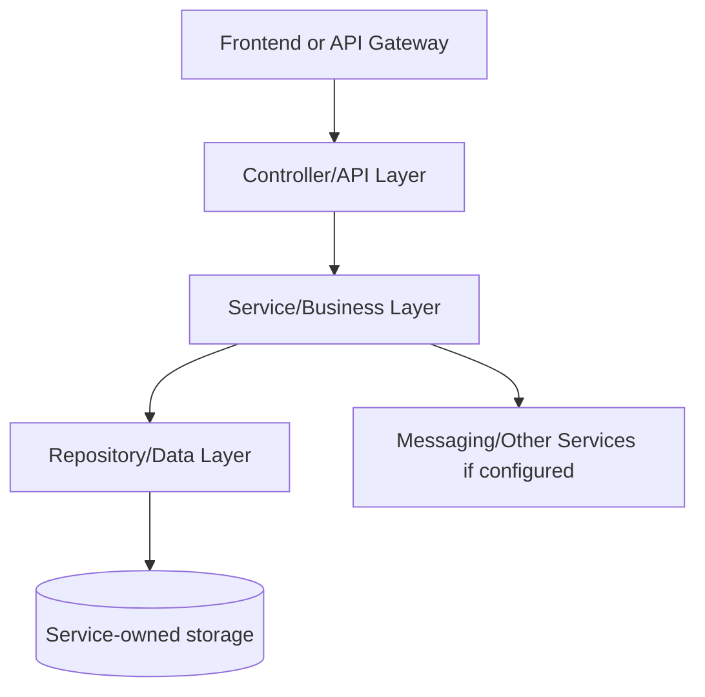
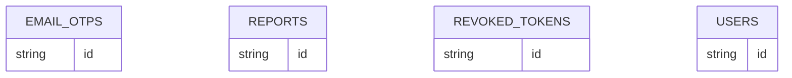

# Auth Service - SERVICE_DOCUMENTATION.md

## 1. Service Overview

**Service folder:** `auth-service`  
**Type:** Spring Boot service  
**Port:** 8081  
**Run command:** `mvn -pl auth-service spring-boot:run`

Owns users, authentication, email OTP verification, OAuth login, JWT tokens, admin dashboard data, and reports.

**Business responsibility:** Identity, user profile, RBAC, bootstrap admin, OTP emails, moderation reports, system dashboard aggregation.

**Data owned:** users, email_otps, revoked_tokens, reports.

**Why this service exists:** In a microservices design, this responsibility changes independently from other domains. For interviews, explain that the service owns its data and exposes an API contract instead of letting other services touch its tables directly.

## 2. Service Architecture



**Internal structure:**

| Folder/File Area | Meaning |
| --- | --- |
| `src/main/java/.../controller` | HTTP boundary and exception mapping. |
| `src/main/java/.../service` | Business rules, transactions, orchestration. |
| `src/main/java/.../repository` | Spring Data persistence/search queries. |
| `src/main/java/.../entity` | Database table mapping. |
| `src/main/java/.../dto` | Request and response contracts. |
| `src/main/java/.../config` | Beans, OpenAPI, security, messaging, storage, or websocket setup. |
| `src/main/resources` | Runtime configuration with environment overrides. |
| `src/test` | Integration/unit tests proving important flows. |

**Request flow:** request enters controller, request DTO validation runs, service performs business checks, repository persists/queries data, response DTO returns to API Gateway/front-end.

## 3. File-by-File Explanation

| File Path | Purpose | What It Does | Connected With | Interview Notes |
| --- | --- | --- | --- | --- |
| auth-service/Dockerfile | Container build recipe used by Docker Compose and Jenkins deployment. | Container build recipe used by Docker Compose and Jenkins deployment. | Related module build/runtime | Explain multi-stage/image build and why containerized services are portable. |
| auth-service/README.md | Markdown documentation/readme file. | Markdown documentation/readme file. | Related module build/runtime | Know why the file exists and what runtime/build behavior would break if removed. |
| auth-service/docs/generate-line-by-line-doc.ps1 | PowerShell helper script for local developer workflow. | PowerShell helper script for local developer workflow. | Related module build/runtime | Know why the file exists and what runtime/build behavior would break if removed. |
| auth-service/pom.xml | Maven project descriptor: declares Spring Boot parent, dependencies, build plugin, and Java version. | Maven project descriptor: declares Spring Boot parent, dependencies, build plugin, and Java version. | Maven, Spring Boot, Jenkins, Docker build | Know why the file exists and what runtime/build behavior would break if removed. |
| auth-service/src/main/java/com/connectsphere/auth/AuthServiceApplication.java | Java source file: Spring Boot application, controller, service, entity, repository, DTO, config, or test. | Java source file: Spring Boot application, controller, service, entity, repository, DTO, config, or test. | Related module build/runtime | Know why the file exists and what runtime/build behavior would break if removed. |
| auth-service/src/main/java/com/connectsphere/auth/config/BootstrapAdminProperties.java | Configuration class: declares beans, security, OpenAPI, messaging, storage, or websocket setup. | Configuration class: declares beans, security, OpenAPI, messaging, storage, or websocket setup. | Spring application context and runtime configuration | Know why the file exists and what runtime/build behavior would break if removed. |
| auth-service/src/main/java/com/connectsphere/auth/config/BootstrapAdminRunner.java | Configuration class: declares beans, security, OpenAPI, messaging, storage, or websocket setup. | Configuration class: declares beans, security, OpenAPI, messaging, storage, or websocket setup. | Spring application context and runtime configuration | Know why the file exists and what runtime/build behavior would break if removed. |
| auth-service/src/main/java/com/connectsphere/auth/config/JwtProperties.java | Configuration class: declares beans, security, OpenAPI, messaging, storage, or websocket setup. | Configuration class: declares beans, security, OpenAPI, messaging, storage, or websocket setup. | Spring application context and runtime configuration | Know why the file exists and what runtime/build behavior would break if removed. |
| auth-service/src/main/java/com/connectsphere/auth/config/OpenApiConfig.java | Configuration class: declares beans, security, OpenAPI, messaging, storage, or websocket setup. | Configuration class: declares beans, security, OpenAPI, messaging, storage, or websocket setup. | Spring application context and runtime configuration | Know why the file exists and what runtime/build behavior would break if removed. |
| auth-service/src/main/java/com/connectsphere/auth/config/OtpProperties.java | Configuration class: declares beans, security, OpenAPI, messaging, storage, or websocket setup. | Configuration class: declares beans, security, OpenAPI, messaging, storage, or websocket setup. | Spring application context and runtime configuration | Know why the file exists and what runtime/build behavior would break if removed. |
| auth-service/src/main/java/com/connectsphere/auth/config/PasswordConfig.java | Configuration class: declares beans, security, OpenAPI, messaging, storage, or websocket setup. | Configuration class: declares beans, security, OpenAPI, messaging, storage, or websocket setup. | Spring application context and runtime configuration | Know why the file exists and what runtime/build behavior would break if removed. |
| auth-service/src/main/java/com/connectsphere/auth/config/SecurityConfig.java | Configuration class: declares beans, security, OpenAPI, messaging, storage, or websocket setup. | Configuration class: declares beans, security, OpenAPI, messaging, storage, or websocket setup. | Spring application context and runtime configuration | Know why the file exists and what runtime/build behavior would break if removed. |
| auth-service/src/main/java/com/connectsphere/auth/controller/AdminResource.java | REST controller: exposes HTTP API routes and delegates business work to service classes. | REST controller: exposes HTTP API routes and delegates business work to service classes. | Service layer, DTOs, API gateway, frontend calls | Explain this as the HTTP boundary: validation happens here, but business rules stay in services. |
| auth-service/src/main/java/com/connectsphere/auth/controller/AuthResource.java | REST controller: exposes HTTP API routes and delegates business work to service classes. | REST controller: exposes HTTP API routes and delegates business work to service classes. | Service layer, DTOs, API gateway, frontend calls | Explain this as the HTTP boundary: validation happens here, but business rules stay in services. |
| auth-service/src/main/java/com/connectsphere/auth/controller/GlobalExceptionHandler.java | REST controller: exposes HTTP API routes and delegates business work to service classes. | REST controller: exposes HTTP API routes and delegates business work to service classes. | Service layer, DTOs, API gateway, frontend calls | Explain this as the HTTP boundary: validation happens here, but business rules stay in services. |
| auth-service/src/main/java/com/connectsphere/auth/controller/ReportResource.java | REST controller: exposes HTTP API routes and delegates business work to service classes. | REST controller: exposes HTTP API routes and delegates business work to service classes. | Service layer, DTOs, API gateway, frontend calls | Explain this as the HTTP boundary: validation happens here, but business rules stay in services. |
| auth-service/src/main/java/com/connectsphere/auth/dto/AdminPlatformOverviewResponse.java | DTO/request/response record: defines API input/output contract and validation. | DTO/request/response record: defines API input/output contract and validation. | Controllers, services, API clients | Explain DTOs as API contracts that keep entity models separate from request/response payloads. |
| auth-service/src/main/java/com/connectsphere/auth/dto/AdminStatsResponse.java | DTO/request/response record: defines API input/output contract and validation. | DTO/request/response record: defines API input/output contract and validation. | Controllers, services, API clients | Explain DTOs as API contracts that keep entity models separate from request/response payloads. |
| auth-service/src/main/java/com/connectsphere/auth/dto/AdminSystemOverviewResponse.java | DTO/request/response record: defines API input/output contract and validation. | DTO/request/response record: defines API input/output contract and validation. | Controllers, services, API clients | Explain DTOs as API contracts that keep entity models separate from request/response payloads. |
| auth-service/src/main/java/com/connectsphere/auth/dto/AdminUserResponse.java | DTO/request/response record: defines API input/output contract and validation. | DTO/request/response record: defines API input/output contract and validation. | Controllers, services, API clients | Explain DTOs as API contracts that keep entity models separate from request/response payloads. |
| auth-service/src/main/java/com/connectsphere/auth/dto/ApiMessageResponse.java | DTO/request/response record: defines API input/output contract and validation. | DTO/request/response record: defines API input/output contract and validation. | Controllers, services, API clients | Explain DTOs as API contracts that keep entity models separate from request/response payloads. |
| auth-service/src/main/java/com/connectsphere/auth/dto/AuthResponse.java | DTO/request/response record: defines API input/output contract and validation. | DTO/request/response record: defines API input/output contract and validation. | Controllers, services, API clients | Explain DTOs as API contracts that keep entity models separate from request/response payloads. |
| auth-service/src/main/java/com/connectsphere/auth/dto/ChangePasswordRequest.java | DTO/request/response record: defines API input/output contract and validation. | DTO/request/response record: defines API input/output contract and validation. | Controllers, services, API clients | Explain DTOs as API contracts that keep entity models separate from request/response payloads. |
| auth-service/src/main/java/com/connectsphere/auth/dto/CreateReportRequest.java | DTO/request/response record: defines API input/output contract and validation. | DTO/request/response record: defines API input/output contract and validation. | Controllers, services, API clients | Explain DTOs as API contracts that keep entity models separate from request/response payloads. |
| auth-service/src/main/java/com/connectsphere/auth/dto/ForgotPasswordRequest.java | DTO/request/response record: defines API input/output contract and validation. | DTO/request/response record: defines API input/output contract and validation. | Controllers, services, API clients | Explain DTOs as API contracts that keep entity models separate from request/response payloads. |
| auth-service/src/main/java/com/connectsphere/auth/dto/HashtagSummaryResponse.java | DTO/request/response record: defines API input/output contract and validation. | DTO/request/response record: defines API input/output contract and validation. | Controllers, services, API clients | Explain DTOs as API contracts that keep entity models separate from request/response payloads. |
| auth-service/src/main/java/com/connectsphere/auth/dto/LoginRequest.java | DTO/request/response record: defines API input/output contract and validation. | DTO/request/response record: defines API input/output contract and validation. | Controllers, services, API clients | Explain DTOs as API contracts that keep entity models separate from request/response payloads. |
| auth-service/src/main/java/com/connectsphere/auth/dto/LogoutRequest.java | DTO/request/response record: defines API input/output contract and validation. | DTO/request/response record: defines API input/output contract and validation. | Controllers, services, API clients | Explain DTOs as API contracts that keep entity models separate from request/response payloads. |
| auth-service/src/main/java/com/connectsphere/auth/dto/PublicUserProfileResponse.java | DTO/request/response record: defines API input/output contract and validation. | DTO/request/response record: defines API input/output contract and validation. | Controllers, services, API clients | Explain DTOs as API contracts that keep entity models separate from request/response payloads. |
| auth-service/src/main/java/com/connectsphere/auth/dto/RefreshTokenRequest.java | DTO/request/response record: defines API input/output contract and validation. | DTO/request/response record: defines API input/output contract and validation. | Controllers, services, API clients | Explain DTOs as API contracts that keep entity models separate from request/response payloads. |
| auth-service/src/main/java/com/connectsphere/auth/dto/RegisterPendingResponse.java | DTO/request/response record: defines API input/output contract and validation. | DTO/request/response record: defines API input/output contract and validation. | Controllers, services, API clients | Explain DTOs as API contracts that keep entity models separate from request/response payloads. |
| auth-service/src/main/java/com/connectsphere/auth/dto/RegisterRequest.java | DTO/request/response record: defines API input/output contract and validation. | DTO/request/response record: defines API input/output contract and validation. | Controllers, services, API clients | Explain DTOs as API contracts that keep entity models separate from request/response payloads. |
| auth-service/src/main/java/com/connectsphere/auth/dto/ReportResponse.java | DTO/request/response record: defines API input/output contract and validation. | DTO/request/response record: defines API input/output contract and validation. | Controllers, services, API clients | Explain DTOs as API contracts that keep entity models separate from request/response payloads. |
| auth-service/src/main/java/com/connectsphere/auth/dto/ResendOtpRequest.java | DTO/request/response record: defines API input/output contract and validation. | DTO/request/response record: defines API input/output contract and validation. | Controllers, services, API clients | Explain DTOs as API contracts that keep entity models separate from request/response payloads. |
| auth-service/src/main/java/com/connectsphere/auth/dto/ResetPasswordRequest.java | DTO/request/response record: defines API input/output contract and validation. | DTO/request/response record: defines API input/output contract and validation. | Controllers, services, API clients | Explain DTOs as API contracts that keep entity models separate from request/response payloads. |
| auth-service/src/main/java/com/connectsphere/auth/dto/ResolveReportRequest.java | DTO/request/response record: defines API input/output contract and validation. | DTO/request/response record: defines API input/output contract and validation. | Controllers, services, API clients | Explain DTOs as API contracts that keep entity models separate from request/response payloads. |
| auth-service/src/main/java/com/connectsphere/auth/dto/ServiceHealthResponse.java | DTO/request/response record: defines API input/output contract and validation. | DTO/request/response record: defines API input/output contract and validation. | Controllers, services, API clients | Explain DTOs as API contracts that keep entity models separate from request/response payloads. |
| auth-service/src/main/java/com/connectsphere/auth/dto/TokenValidationRequest.java | DTO/request/response record: defines API input/output contract and validation. | DTO/request/response record: defines API input/output contract and validation. | Controllers, services, API clients | Explain DTOs as API contracts that keep entity models separate from request/response payloads. |
| auth-service/src/main/java/com/connectsphere/auth/dto/TokenValidationResponse.java | DTO/request/response record: defines API input/output contract and validation. | DTO/request/response record: defines API input/output contract and validation. | Controllers, services, API clients | Explain DTOs as API contracts that keep entity models separate from request/response payloads. |
| auth-service/src/main/java/com/connectsphere/auth/dto/UpdateProfileRequest.java | DTO/request/response record: defines API input/output contract and validation. | DTO/request/response record: defines API input/output contract and validation. | Controllers, services, API clients | Explain DTOs as API contracts that keep entity models separate from request/response payloads. |
| auth-service/src/main/java/com/connectsphere/auth/dto/UserProfileResponse.java | DTO/request/response record: defines API input/output contract and validation. | DTO/request/response record: defines API input/output contract and validation. | Controllers, services, API clients | Explain DTOs as API contracts that keep entity models separate from request/response payloads. |
| auth-service/src/main/java/com/connectsphere/auth/dto/UserSummaryResponse.java | DTO/request/response record: defines API input/output contract and validation. | DTO/request/response record: defines API input/output contract and validation. | Controllers, services, API clients | Explain DTOs as API contracts that keep entity models separate from request/response payloads. |
| auth-service/src/main/java/com/connectsphere/auth/dto/VerifyEmailRequest.java | DTO/request/response record: defines API input/output contract and validation. | DTO/request/response record: defines API input/output contract and validation. | Controllers, services, API clients | Explain DTOs as API contracts that keep entity models separate from request/response payloads. |
| auth-service/src/main/java/com/connectsphere/auth/entity/AuthProvider.java | JPA entity/model: maps Java fields to a database table. | JPA entity/model: maps Java fields to a database table. | Repositories and database schema | Explain table ownership, UUID identifiers, and denormalized counters/fields where present. |
| auth-service/src/main/java/com/connectsphere/auth/entity/EmailOtp.java | JPA entity/model: maps Java fields to a database table. | JPA entity/model: maps Java fields to a database table. | Repositories and database schema | Explain table ownership, UUID identifiers, and denormalized counters/fields where present. |
| auth-service/src/main/java/com/connectsphere/auth/entity/OtpPurpose.java | JPA entity/model: maps Java fields to a database table. | JPA entity/model: maps Java fields to a database table. | Repositories and database schema | Explain table ownership, UUID identifiers, and denormalized counters/fields where present. |
| auth-service/src/main/java/com/connectsphere/auth/entity/Report.java | JPA entity/model: maps Java fields to a database table. | JPA entity/model: maps Java fields to a database table. | Repositories and database schema | Explain table ownership, UUID identifiers, and denormalized counters/fields where present. |
| auth-service/src/main/java/com/connectsphere/auth/entity/ReportResolutionAction.java | JPA entity/model: maps Java fields to a database table. | JPA entity/model: maps Java fields to a database table. | Repositories and database schema | Explain table ownership, UUID identifiers, and denormalized counters/fields where present. |
| auth-service/src/main/java/com/connectsphere/auth/entity/ReportStatus.java | JPA entity/model: maps Java fields to a database table. | JPA entity/model: maps Java fields to a database table. | Repositories and database schema | Explain table ownership, UUID identifiers, and denormalized counters/fields where present. |
| auth-service/src/main/java/com/connectsphere/auth/entity/ReportTargetType.java | JPA entity/model: maps Java fields to a database table. | JPA entity/model: maps Java fields to a database table. | Repositories and database schema | Explain table ownership, UUID identifiers, and denormalized counters/fields where present. |
| auth-service/src/main/java/com/connectsphere/auth/entity/RevokedToken.java | JPA entity/model: maps Java fields to a database table. | JPA entity/model: maps Java fields to a database table. | Repositories and database schema | Explain table ownership, UUID identifiers, and denormalized counters/fields where present. |
| auth-service/src/main/java/com/connectsphere/auth/entity/Role.java | JPA entity/model: maps Java fields to a database table. | JPA entity/model: maps Java fields to a database table. | Repositories and database schema | Explain table ownership, UUID identifiers, and denormalized counters/fields where present. |
| auth-service/src/main/java/com/connectsphere/auth/entity/User.java | JPA entity/model: maps Java fields to a database table. | JPA entity/model: maps Java fields to a database table. | Repositories and database schema | Explain table ownership, UUID identifiers, and denormalized counters/fields where present. |
| auth-service/src/main/java/com/connectsphere/auth/exception/BadRequestException.java | Java source file: Spring Boot application, controller, service, entity, repository, DTO, config, or test. | Java source file: Spring Boot application, controller, service, entity, repository, DTO, config, or test. | Related module build/runtime | Know why the file exists and what runtime/build behavior would break if removed. |
| auth-service/src/main/java/com/connectsphere/auth/exception/NotFoundException.java | Java source file: Spring Boot application, controller, service, entity, repository, DTO, config, or test. | Java source file: Spring Boot application, controller, service, entity, repository, DTO, config, or test. | Related module build/runtime | Know why the file exists and what runtime/build behavior would break if removed. |
| auth-service/src/main/java/com/connectsphere/auth/oauth/OAuth2LoginFailureHandler.java | OAuth integration class: handles external login profile extraction and OAuth success/failure flows. | OAuth integration class: handles external login profile extraction and OAuth success/failure flows. | Related module build/runtime | Know why the file exists and what runtime/build behavior would break if removed. |
| auth-service/src/main/java/com/connectsphere/auth/oauth/OAuth2LoginSuccessHandler.java | OAuth integration class: handles external login profile extraction and OAuth success/failure flows. | OAuth integration class: handles external login profile extraction and OAuth success/failure flows. | Related module build/runtime | Know why the file exists and what runtime/build behavior would break if removed. |
| auth-service/src/main/java/com/connectsphere/auth/oauth/OAuth2UserProfileService.java | OAuth integration class: handles external login profile extraction and OAuth success/failure flows. | OAuth integration class: handles external login profile extraction and OAuth success/failure flows. | Related module build/runtime | Know why the file exists and what runtime/build behavior would break if removed. |
| auth-service/src/main/java/com/connectsphere/auth/oauth/OAuthAccountService.java | OAuth integration class: handles external login profile extraction and OAuth success/failure flows. | OAuth integration class: handles external login profile extraction and OAuth success/failure flows. | Related module build/runtime | Know why the file exists and what runtime/build behavior would break if removed. |
| auth-service/src/main/java/com/connectsphere/auth/oauth/OAuthUserProfile.java | OAuth integration class: handles external login profile extraction and OAuth success/failure flows. | OAuth integration class: handles external login profile extraction and OAuth success/failure flows. | Related module build/runtime | Know why the file exists and what runtime/build behavior would break if removed. |
| auth-service/src/main/java/com/connectsphere/auth/repository/EmailOtpRepository.java | Repository/DAO: Spring Data or Angular data access boundary for persistence/search. | Repository/DAO: Spring Data or Angular data access boundary for persistence/search. | Service layer and JPA/Elasticsearch persistence | Explain Spring Data derived queries and why services do not write SQL directly. |
| auth-service/src/main/java/com/connectsphere/auth/repository/ReportRepository.java | Repository/DAO: Spring Data or Angular data access boundary for persistence/search. | Repository/DAO: Spring Data or Angular data access boundary for persistence/search. | Service layer and JPA/Elasticsearch persistence | Explain Spring Data derived queries and why services do not write SQL directly. |
| auth-service/src/main/java/com/connectsphere/auth/repository/RevokedTokenRepository.java | Repository/DAO: Spring Data or Angular data access boundary for persistence/search. | Repository/DAO: Spring Data or Angular data access boundary for persistence/search. | Service layer and JPA/Elasticsearch persistence | Explain Spring Data derived queries and why services do not write SQL directly. |
| auth-service/src/main/java/com/connectsphere/auth/repository/UserRepository.java | Repository/DAO: Spring Data or Angular data access boundary for persistence/search. | Repository/DAO: Spring Data or Angular data access boundary for persistence/search. | Service layer and JPA/Elasticsearch persistence | Explain Spring Data derived queries and why services do not write SQL directly. |
| auth-service/src/main/java/com/connectsphere/auth/security/AuthenticatedUser.java | Security class: handles JWT, user details, filters, or route protection. | Security class: handles JWT, user details, filters, or route protection. | Related module build/runtime | Know why the file exists and what runtime/build behavior would break if removed. |
| auth-service/src/main/java/com/connectsphere/auth/security/CustomUserDetailsService.java | Security class: handles JWT, user details, filters, or route protection. | Security class: handles JWT, user details, filters, or route protection. | Related module build/runtime | Know why the file exists and what runtime/build behavior would break if removed. |
| auth-service/src/main/java/com/connectsphere/auth/security/JwtAuthenticationFilter.java | Security class: handles JWT, user details, filters, or route protection. | Security class: handles JWT, user details, filters, or route protection. | Related module build/runtime | Know why the file exists and what runtime/build behavior would break if removed. |
| auth-service/src/main/java/com/connectsphere/auth/security/JwtTokenService.java | Security class: handles JWT, user details, filters, or route protection. | Security class: handles JWT, user details, filters, or route protection. | Related module build/runtime | Know why the file exists and what runtime/build behavior would break if removed. |
| auth-service/src/main/java/com/connectsphere/auth/service/AdminInsightsService.java | Java source file: Spring Boot application, controller, service, entity, repository, DTO, config, or test. | Java source file: Spring Boot application, controller, service, entity, repository, DTO, config, or test. | Controllers, repositories, entities, messaging/storage clients | Explain this as the business logic layer and the best place to discuss transactions and edge cases. |
| auth-service/src/main/java/com/connectsphere/auth/service/AuthService.java | Java source file: Spring Boot application, controller, service, entity, repository, DTO, config, or test. | Java source file: Spring Boot application, controller, service, entity, repository, DTO, config, or test. | Controllers, repositories, entities, messaging/storage clients | Explain this as the business logic layer and the best place to discuss transactions and edge cases. |
| auth-service/src/main/java/com/connectsphere/auth/service/AuthServiceImpl.java | Business service implementation: contains main domain logic and transaction boundaries. | Business service implementation: contains main domain logic and transaction boundaries. | Controllers, repositories, entities, messaging/storage clients | Explain this as the business logic layer and the best place to discuss transactions and edge cases. |
| auth-service/src/main/java/com/connectsphere/auth/service/EmailOtpService.java | Java source file: Spring Boot application, controller, service, entity, repository, DTO, config, or test. | Java source file: Spring Boot application, controller, service, entity, repository, DTO, config, or test. | Controllers, repositories, entities, messaging/storage clients | Explain this as the business logic layer and the best place to discuss transactions and edge cases. |
| auth-service/src/main/java/com/connectsphere/auth/service/OutboundEmailService.java | Java source file: Spring Boot application, controller, service, entity, repository, DTO, config, or test. | Java source file: Spring Boot application, controller, service, entity, repository, DTO, config, or test. | Controllers, repositories, entities, messaging/storage clients | Explain this as the business logic layer and the best place to discuss transactions and edge cases. |
| auth-service/src/main/java/com/connectsphere/auth/service/ReportModerationService.java | Java source file: Spring Boot application, controller, service, entity, repository, DTO, config, or test. | Java source file: Spring Boot application, controller, service, entity, repository, DTO, config, or test. | Controllers, repositories, entities, messaging/storage clients | Explain this as the business logic layer and the best place to discuss transactions and edge cases. |
| auth-service/src/main/resources/application-mysql.yml | Spring configuration file for port, datasource, Eureka, cache, broker, storage, and actuator settings. | Spring configuration file for port, datasource, Eureka, cache, broker, storage, and actuator settings. | Related module build/runtime | Know why the file exists and what runtime/build behavior would break if removed. |
| auth-service/src/main/resources/application-oauth.yml | Spring configuration file for port, datasource, Eureka, cache, broker, storage, and actuator settings. | Spring configuration file for port, datasource, Eureka, cache, broker, storage, and actuator settings. | Related module build/runtime | Know why the file exists and what runtime/build behavior would break if removed. |
| auth-service/src/main/resources/application.yml | Spring configuration file for port, datasource, Eureka, cache, broker, storage, and actuator settings. | Spring configuration file for port, datasource, Eureka, cache, broker, storage, and actuator settings. | Related module build/runtime | Explain port, service name, Eureka registration, and environment-variable overrides. |
| auth-service/src/test/java/com/connectsphere/auth/AuthResourceIntegrationTest.java | REST controller: exposes HTTP API routes and delegates business work to service classes. | REST controller: exposes HTTP API routes and delegates business work to service classes. | Related module build/runtime | Know why the file exists and what runtime/build behavior would break if removed. |
| auth-service/src/test/java/com/connectsphere/auth/JsonTestHelper.java | Java source file: Spring Boot application, controller, service, entity, repository, DTO, config, or test. | Java source file: Spring Boot application, controller, service, entity, repository, DTO, config, or test. | Related module build/runtime | Know why the file exists and what runtime/build behavior would break if removed. |
| auth-service/src/test/java/com/connectsphere/auth/OAuthAccountServiceTest.java | Java source file: Spring Boot application, controller, service, entity, repository, DTO, config, or test. | Java source file: Spring Boot application, controller, service, entity, repository, DTO, config, or test. | Related module build/runtime | Know why the file exists and what runtime/build behavior would break if removed. |
| auth-service/src/test/resources/application.yml | Spring configuration file for port, datasource, Eureka, cache, broker, storage, and actuator settings. | Spring configuration file for port, datasource, Eureka, cache, broker, storage, and actuator settings. | Related module build/runtime | Explain port, service name, Eureka registration, and environment-variable overrides. |

## 4. Dependencies Used in This Service

| Dependency | Group | Purpose | Project Usage | Interview Notes |
| --- | --- | --- | --- | --- |
| spring-cloud-dependencies ${spring-cloud.version} | org.springframework.cloud | Project dependency used by framework/build/runtime code. | Declared in pom/package for this service. | Be ready to say what breaks if this dependency is removed. |
| spring-boot-starter-web | org.springframework.boot | Builds REST controllers on embedded Tomcat. | Declared in pom/package for this service. | Be ready to say what breaks if this dependency is removed. |
| spring-boot-starter-validation | org.springframework.boot | Bean validation for DTO constraints such as @NotBlank and @Email. | Declared in pom/package for this service. | Be ready to say what breaks if this dependency is removed. |
| spring-boot-starter-data-jpa | org.springframework.boot | JPA/Hibernate persistence against MySQL. | Declared in pom/package for this service. | Explain repository pattern and service-owned databases. |
| spring-boot-starter-security | org.springframework.boot | Authentication, authorization, password hashing, and filters. | Declared in pom/package for this service. | Explain stateless authentication and token validation. |
| spring-boot-starter-oauth2-client | org.springframework.boot | Google/GitHub OAuth2 login support. | Declared in pom/package for this service. | Be ready to say what breaks if this dependency is removed. |
| spring-boot-starter-actuator | org.springframework.boot | Health and operational endpoints. | Declared in pom/package for this service. | Be ready to say what breaks if this dependency is removed. |
| spring-cloud-starter-netflix-eureka-client | org.springframework.cloud | Registers service with Eureka and enables discovery. | Declared in pom/package for this service. | Know that it decouples service locations from hardcoded host/port values. |
| springdoc-openapi-starter-webmvc-ui ${springdoc.version} | org.springdoc | Swagger/OpenAPI docs for REST endpoints. | Declared in pom/package for this service. | Be ready to say what breaks if this dependency is removed. |
| mysql-connector-j | com.mysql | MySQL JDBC driver. | Declared in pom/package for this service. | Explain repository pattern and service-owned databases. |
| spring-boot-starter-mail | org.springframework.boot | SMTP email delivery for OTP verification/reset. | Declared in pom/package for this service. | Be ready to say what breaks if this dependency is removed. |
| jjwt-api ${jjwt.version} | io.jsonwebtoken | JWT token creation and parsing API. | Declared in pom/package for this service. | Explain stateless authentication and token validation. |
| jjwt-impl ${jjwt.version} | io.jsonwebtoken | Runtime implementation for JJWT. | Declared in pom/package for this service. | Explain stateless authentication and token validation. |
| jjwt-jackson ${jjwt.version} | io.jsonwebtoken | JSON/Jackson support for JWT claims. | Declared in pom/package for this service. | Explain stateless authentication and token validation. |
| spring-boot-starter-test | org.springframework.boot | JUnit/Spring test support. | Declared in pom/package for this service. | Be ready to say what breaks if this dependency is removed. |
| spring-security-test | org.springframework.security | Security test helpers. | Declared in pom/package for this service. | Explain stateless authentication and token validation. |

## 5. API Endpoints of This Service

| Method | URL | Code File | Purpose | Request | Response | Auth | Database Interaction | Error Cases |
| --- | --- | --- | --- | --- | --- | --- | --- | --- |
| GET | /api/v1/admin/users | auth-service/src/main/java/com/connectsphere/auth/controller/AdminResource.java | List users through AdminResource.java. | Path/query parameters only unless noted by controller signature. | Usually JSON/DTO response; see response DTO records below. | Normally called behind gateway with JWT; service itself mostly trusts forwarded user/context in this codebase. | Reads/writes users, email_otps, revoked_tokens, reports. | Domain BadRequest/NotFound become 400/404 through GlobalExceptionHandler where present; validation failures return client errors. |
| PATCH | /api/v1/admin/users/{userId}/suspend | auth-service/src/main/java/com/connectsphere/auth/controller/AdminResource.java | Suspend user through AdminResource.java. | JSON body matching the request DTO named in the controller method signature. | Usually JSON/DTO response; see response DTO records below. | Public for registration/login/verification/search where allowed; admin/profile/report actions require JWT and role checks. | Reads/writes users, email_otps, revoked_tokens, reports. | Domain BadRequest/NotFound become 400/404 through GlobalExceptionHandler where present; validation failures return client errors. |
| PATCH | /api/v1/admin/users/{userId}/reactivate | auth-service/src/main/java/com/connectsphere/auth/controller/AdminResource.java | Reactivate user through AdminResource.java. | JSON body matching the request DTO named in the controller method signature. | Usually JSON/DTO response; see response DTO records below. | Public for registration/login/verification/search where allowed; admin/profile/report actions require JWT and role checks. | Reads/writes users, email_otps, revoked_tokens, reports. | Domain BadRequest/NotFound become 400/404 through GlobalExceptionHandler where present; validation failures return client errors. |
| DELETE | /api/v1/admin/users/{userId} | auth-service/src/main/java/com/connectsphere/auth/controller/AdminResource.java | Delete user through AdminResource.java. | JSON body matching the request DTO named in the controller method signature. | Usually JSON/DTO response; see response DTO records below. | Public for registration/login/verification/search where allowed; admin/profile/report actions require JWT and role checks. | Reads/writes users, email_otps, revoked_tokens, reports. | Domain BadRequest/NotFound become 400/404 through GlobalExceptionHandler where present; validation failures return client errors. |
| GET | /api/v1/admin/analytics | auth-service/src/main/java/com/connectsphere/auth/controller/AdminResource.java | Get stats through AdminResource.java. | Path/query parameters only unless noted by controller signature. | Usually JSON/DTO response; see response DTO records below. | Normally called behind gateway with JWT; service itself mostly trusts forwarded user/context in this codebase. | Reads/writes users, email_otps, revoked_tokens, reports. | Domain BadRequest/NotFound become 400/404 through GlobalExceptionHandler where present; validation failures return client errors. |
| GET | /api/v1/admin/platform-overview | auth-service/src/main/java/com/connectsphere/auth/controller/AdminResource.java | Get platform overview through AdminResource.java. | Path/query parameters only unless noted by controller signature. | Usually JSON/DTO response; see response DTO records below. | Normally called behind gateway with JWT; service itself mostly trusts forwarded user/context in this codebase. | Reads/writes users, email_otps, revoked_tokens, reports. | Domain BadRequest/NotFound become 400/404 through GlobalExceptionHandler where present; validation failures return client errors. |
| GET | /api/v1/admin/system-overview | auth-service/src/main/java/com/connectsphere/auth/controller/AdminResource.java | Get system overview through AdminResource.java. | Path/query parameters only unless noted by controller signature. | Usually JSON/DTO response; see response DTO records below. | Normally called behind gateway with JWT; service itself mostly trusts forwarded user/context in this codebase. | Reads/writes users, email_otps, revoked_tokens, reports. | Domain BadRequest/NotFound become 400/404 through GlobalExceptionHandler where present; validation failures return client errors. |
| POST | /api/v1/auth/register | auth-service/src/main/java/com/connectsphere/auth/controller/AuthResource.java | Register through AuthResource.java. | JSON body matching the request DTO named in the controller method signature. | Usually JSON/DTO response; see response DTO records below. | Public for registration/login/verification/search where allowed; admin/profile/report actions require JWT and role checks. | Reads/writes users, email_otps, revoked_tokens, reports. | Domain BadRequest/NotFound become 400/404 through GlobalExceptionHandler where present; validation failures return client errors. |
| POST | /api/v1/auth/verify-email | auth-service/src/main/java/com/connectsphere/auth/controller/AuthResource.java | Verify email through AuthResource.java. | JSON body matching the request DTO named in the controller method signature. | Usually JSON/DTO response; see response DTO records below. | Public for registration/login/verification/search where allowed; admin/profile/report actions require JWT and role checks. | Reads/writes users, email_otps, revoked_tokens, reports. | Domain BadRequest/NotFound become 400/404 through GlobalExceptionHandler where present; validation failures return client errors. |
| POST | /api/v1/auth/resend-otp | auth-service/src/main/java/com/connectsphere/auth/controller/AuthResource.java | Resend otp through AuthResource.java. | JSON body matching the request DTO named in the controller method signature. | Usually JSON/DTO response; see response DTO records below. | Normally called behind gateway with JWT; service itself mostly trusts forwarded user/context in this codebase. | Reads/writes users, email_otps, revoked_tokens, reports. | Domain BadRequest/NotFound become 400/404 through GlobalExceptionHandler where present; validation failures return client errors. |
| POST | /api/v1/auth/forgot-password | auth-service/src/main/java/com/connectsphere/auth/controller/AuthResource.java | Forgot password through AuthResource.java. | JSON body matching the request DTO named in the controller method signature. | Usually JSON/DTO response; see response DTO records below. | Public for registration/login/verification/search where allowed; admin/profile/report actions require JWT and role checks. | Reads/writes users, email_otps, revoked_tokens, reports. | Domain BadRequest/NotFound become 400/404 through GlobalExceptionHandler where present; validation failures return client errors. |
| POST | /api/v1/auth/reset-password | auth-service/src/main/java/com/connectsphere/auth/controller/AuthResource.java | Reset password through AuthResource.java. | JSON body matching the request DTO named in the controller method signature. | Usually JSON/DTO response; see response DTO records below. | Public for registration/login/verification/search where allowed; admin/profile/report actions require JWT and role checks. | Reads/writes users, email_otps, revoked_tokens, reports. | Domain BadRequest/NotFound become 400/404 through GlobalExceptionHandler where present; validation failures return client errors. |
| POST | /api/v1/auth/login | auth-service/src/main/java/com/connectsphere/auth/controller/AuthResource.java | Login through AuthResource.java. | JSON body matching the request DTO named in the controller method signature. | Usually JSON/DTO response; see response DTO records below. | Public for registration/login/verification/search where allowed; admin/profile/report actions require JWT and role checks. | Reads/writes users, email_otps, revoked_tokens, reports. | Domain BadRequest/NotFound become 400/404 through GlobalExceptionHandler where present; validation failures return client errors. |
| POST | /api/v1/auth/logout | auth-service/src/main/java/com/connectsphere/auth/controller/AuthResource.java | Logout through AuthResource.java. | JSON body matching the request DTO named in the controller method signature. | Usually JSON/DTO response; see response DTO records below. | Normally called behind gateway with JWT; service itself mostly trusts forwarded user/context in this codebase. | Reads/writes users, email_otps, revoked_tokens, reports. | Domain BadRequest/NotFound become 400/404 through GlobalExceptionHandler where present; validation failures return client errors. |
| POST | /api/v1/auth/refresh | auth-service/src/main/java/com/connectsphere/auth/controller/AuthResource.java | Refresh through AuthResource.java. | JSON body matching the request DTO named in the controller method signature. | Usually JSON/DTO response; see response DTO records below. | Public for registration/login/verification/search where allowed; admin/profile/report actions require JWT and role checks. | Reads/writes users, email_otps, revoked_tokens, reports. | Domain BadRequest/NotFound become 400/404 through GlobalExceptionHandler where present; validation failures return client errors. |
| POST | /api/v1/auth/validate | auth-service/src/main/java/com/connectsphere/auth/controller/AuthResource.java | Validate through AuthResource.java. | JSON body matching the request DTO named in the controller method signature. | Usually JSON/DTO response; see response DTO records below. | Public for registration/login/verification/search where allowed; admin/profile/report actions require JWT and role checks. | Reads/writes users, email_otps, revoked_tokens, reports. | Domain BadRequest/NotFound become 400/404 through GlobalExceptionHandler where present; validation failures return client errors. |
| GET | /api/v1/auth/profile | auth-service/src/main/java/com/connectsphere/auth/controller/AuthResource.java | Get profile through AuthResource.java. | Path/query parameters only unless noted by controller signature. | Usually JSON/DTO response; see response DTO records below. | Normally called behind gateway with JWT; service itself mostly trusts forwarded user/context in this codebase. | Reads/writes users, email_otps, revoked_tokens, reports. | Domain BadRequest/NotFound become 400/404 through GlobalExceptionHandler where present; validation failures return client errors. |
| PUT | /api/v1/auth/profile | auth-service/src/main/java/com/connectsphere/auth/controller/AuthResource.java | Update profile through AuthResource.java. | JSON body matching the request DTO named in the controller method signature. | Usually JSON/DTO response; see response DTO records below. | Normally called behind gateway with JWT; service itself mostly trusts forwarded user/context in this codebase. | Reads/writes users, email_otps, revoked_tokens, reports. | Domain BadRequest/NotFound become 400/404 through GlobalExceptionHandler where present; validation failures return client errors. |
| PATCH | /api/v1/auth/password | auth-service/src/main/java/com/connectsphere/auth/controller/AuthResource.java | Change password through AuthResource.java. | JSON body matching the request DTO named in the controller method signature. | Usually JSON/DTO response; see response DTO records below. | Normally called behind gateway with JWT; service itself mostly trusts forwarded user/context in this codebase. | Reads/writes users, email_otps, revoked_tokens, reports. | Domain BadRequest/NotFound become 400/404 through GlobalExceptionHandler where present; validation failures return client errors. |
| GET | /api/v1/auth/search | auth-service/src/main/java/com/connectsphere/auth/controller/AuthResource.java | Search users through AuthResource.java. | Path/query parameters only unless noted by controller signature. | Usually JSON/DTO response; see response DTO records below. | Normally called behind gateway with JWT; service itself mostly trusts forwarded user/context in this codebase. | Reads/writes users, email_otps, revoked_tokens, reports. | Domain BadRequest/NotFound become 400/404 through GlobalExceptionHandler where present; validation failures return client errors. |
| GET | /api/v1/auth/users/{userId} | auth-service/src/main/java/com/connectsphere/auth/controller/AuthResource.java | Handler through AuthResource.java. | Path/query parameters only unless noted by controller signature. | Usually JSON/DTO response; see response DTO records below. | Public for registration/login/verification/search where allowed; admin/profile/report actions require JWT and role checks. | Reads/writes users, email_otps, revoked_tokens, reports. | Domain BadRequest/NotFound become 400/404 through GlobalExceptionHandler where present; validation failures return client errors. |
| PATCH | /api/v1/auth/deactivate | auth-service/src/main/java/com/connectsphere/auth/controller/AuthResource.java | Deactivate account through AuthResource.java. | JSON body matching the request DTO named in the controller method signature. | Usually JSON/DTO response; see response DTO records below. | Normally called behind gateway with JWT; service itself mostly trusts forwarded user/context in this codebase. | Reads/writes users, email_otps, revoked_tokens, reports. | Domain BadRequest/NotFound become 400/404 through GlobalExceptionHandler where present; validation failures return client errors. |
| GET | /api/v1/auth/users/by-email/{email} | auth-service/src/main/java/com/connectsphere/auth/controller/AuthResource.java | Get user by email through AuthResource.java. | Path/query parameters only unless noted by controller signature. | Usually JSON/DTO response; see response DTO records below. | Public for registration/login/verification/search where allowed; admin/profile/report actions require JWT and role checks. | Reads/writes users, email_otps, revoked_tokens, reports. | Domain BadRequest/NotFound become 400/404 through GlobalExceptionHandler where present; validation failures return client errors. |
| POST | /api/v1/reports | auth-service/src/main/java/com/connectsphere/auth/controller/ReportResource.java | Create report through ReportResource.java. | JSON body matching the request DTO named in the controller method signature. | Usually JSON/DTO response; see response DTO records below. | Normally called behind gateway with JWT; service itself mostly trusts forwarded user/context in this codebase. | Reads/writes users, email_otps, revoked_tokens, reports. | Domain BadRequest/NotFound become 400/404 through GlobalExceptionHandler where present; validation failures return client errors. |
| GET | /api/v1/reports/mine | auth-service/src/main/java/com/connectsphere/auth/controller/ReportResource.java | Get my reports through ReportResource.java. | Path/query parameters only unless noted by controller signature. | Usually JSON/DTO response; see response DTO records below. | Normally called behind gateway with JWT; service itself mostly trusts forwarded user/context in this codebase. | Reads/writes users, email_otps, revoked_tokens, reports. | Domain BadRequest/NotFound become 400/404 through GlobalExceptionHandler where present; validation failures return client errors. |
| GET | /api/v1/reports | auth-service/src/main/java/com/connectsphere/auth/controller/ReportResource.java | Get reports through ReportResource.java. | Path/query parameters only unless noted by controller signature. | Usually JSON/DTO response; see response DTO records below. | Normally called behind gateway with JWT; service itself mostly trusts forwarded user/context in this codebase. | Reads/writes users, email_otps, revoked_tokens, reports. | Domain BadRequest/NotFound become 400/404 through GlobalExceptionHandler where present; validation failures return client errors. |
| PATCH | /api/v1/reports/{reportId}/resolve | auth-service/src/main/java/com/connectsphere/auth/controller/ReportResource.java | Resolve report through ReportResource.java. | JSON body matching the request DTO named in the controller method signature. | Usually JSON/DTO response; see response DTO records below. | Normally called behind gateway with JWT; service itself mostly trusts forwarded user/context in this codebase. | Reads/writes users, email_otps, revoked_tokens, reports. | Domain BadRequest/NotFound become 400/404 through GlobalExceptionHandler where present; validation failures return client errors. |

## 6. Database / Model Details

**Database/storage:** MySQL database connectsphere_auth.

| Entity/Class | Table | File | Important Fields | Ownership Notes |
| --- | --- | --- | --- | --- |
| EmailOtp | email_otps | auth-service/src/main/java/com/connectsphere/auth/entity/EmailOtp.java | otpId:String, userId:String, email:String, purpose:OtpPurpose, codeHash:String, expiresAt:Instant, attempts:int, used:boolean, createdAt:Instant | Owned by this service database |
| Report | reports | auth-service/src/main/java/com/connectsphere/auth/entity/Report.java | reportId:String, reporterId:String, targetType:ReportTargetType, targetId:String, reason:String, details:String, status:ReportStatus, resolutionAction:ReportResolutionAction, resolutionNotes:String, resolvedBy:String, resolvedAt:Instant, createdAt:Instant, updatedAt:Instant | Owned by this service database |
| RevokedToken | revoked_tokens | auth-service/src/main/java/com/connectsphere/auth/entity/RevokedToken.java | tokenId:String, expiresAt:Instant | Owned by this service database |
| User | users | auth-service/src/main/java/com/connectsphere/auth/entity/User.java | userId:String, username:String, email:String, passwordHash:String, fullName:String, bio:String, profilePicUrl:String, bannerUrl:String, privateAccount:boolean, role:Role, provider:AuthProvider, active:boolean, emailVerified:boolean, pendingEmail:String, createdAt:Instant, updatedAt:Instant | Owned by this service database |

**Important DTO/API contracts:**

| Record/DTO | File | Fields |
| --- | --- | --- |
| BootstrapAdminProperties | auth-service/src/main/java/com/connectsphere/auth/config/BootstrapAdminProperties.java | boolean enabled, String email, String username, String fullName, String password |
| JwtProperties | auth-service/src/main/java/com/connectsphere/auth/config/JwtProperties.java | @NotBlank String issuer, @NotBlank String secret, @NotNull Duration accessTokenTtl, @NotNull Duration refreshTokenTtl |
| OtpProperties | auth-service/src/main/java/com/connectsphere/auth/config/OtpProperties.java | Duration ttl, int maxAttempts, boolean returnCodeInResponse |
| AdminPlatformOverviewResponse | auth-service/src/main/java/com/connectsphere/auth/dto/AdminPlatformOverviewResponse.java | AdminStatsResponse users, List<HashtagSummaryResponse> trendingHashtags |
| AdminStatsResponse | auth-service/src/main/java/com/connectsphere/auth/dto/AdminStatsResponse.java | long totalUsers, long activeUsers, long inactiveUsers, long verifiedUsers, long admins |
| AdminSystemOverviewResponse | auth-service/src/main/java/com/connectsphere/auth/dto/AdminSystemOverviewResponse.java | List<ServiceHealthResponse> services |
| AdminUserResponse | auth-service/src/main/java/com/connectsphere/auth/dto/AdminUserResponse.java | String userId, String username, String email, boolean emailVerified, String fullName, String bio, String profilePicUrl, String bannerUrl, boolean privateAccount, String role, String provider, boolean active, Instant createdAt, Instant updatedAt |
| ApiMessageResponse | auth-service/src/main/java/com/connectsphere/auth/dto/ApiMessageResponse.java | String message |
| AuthResponse | auth-service/src/main/java/com/connectsphere/auth/dto/AuthResponse.java | String accessToken, String refreshToken, Instant accessTokenExpiresAt, Instant refreshTokenExpiresAt, UserProfileResponse user |
| ChangePasswordRequest | auth-service/src/main/java/com/connectsphere/auth/dto/ChangePasswordRequest.java | @NotBlank String currentPassword, @NotBlank @Size(min = 8, max = 100) String newPassword |
| CreateReportRequest | auth-service/src/main/java/com/connectsphere/auth/dto/CreateReportRequest.java | @NotNull ReportTargetType targetType, @NotBlank String targetId, @NotBlank @Size(max = 120) String reason, @Size(max = 1000) String details |
| ForgotPasswordRequest | auth-service/src/main/java/com/connectsphere/auth/dto/ForgotPasswordRequest.java | @NotBlank @Email String email |
| HashtagSummaryResponse | auth-service/src/main/java/com/connectsphere/auth/dto/HashtagSummaryResponse.java | String hashtagId, String tag, long postCount, Instant lastUsedAt |
| LoginRequest | auth-service/src/main/java/com/connectsphere/auth/dto/LoginRequest.java | @NotBlank @Email String email, @NotBlank String password |
| LogoutRequest | auth-service/src/main/java/com/connectsphere/auth/dto/LogoutRequest.java | @NotBlank String accessToken, String refreshToken |
| PublicUserProfileResponse | auth-service/src/main/java/com/connectsphere/auth/dto/PublicUserProfileResponse.java | String userId, String username, String fullName, String bio, String profilePicUrl, String bannerUrl, boolean privateAccount, String role, boolean active, Instant createdAt |
| RefreshTokenRequest | auth-service/src/main/java/com/connectsphere/auth/dto/RefreshTokenRequest.java | @NotBlank String refreshToken |
| RegisterPendingResponse | auth-service/src/main/java/com/connectsphere/auth/dto/RegisterPendingResponse.java | String userId, String email, Instant otpExpiresAt, String debugOtpCode |
| RegisterRequest | auth-service/src/main/java/com/connectsphere/auth/dto/RegisterRequest.java | @NotBlank @Size(min = 3, max = 50) String username, @NotBlank @Email String email, @NotBlank @Size(min = 8, max = 100) String password, @NotBlank @Size(max = 100) String fullName, @Size(max = 500) String bio, @Size(max = 500) String profilePicUrl, @NotNull Role role, @NotNull AuthProvider provider |
| ReportResponse | auth-service/src/main/java/com/connectsphere/auth/dto/ReportResponse.java | String reportId, String reporterId, ReportTargetType targetType, String targetId, String reason, String details, ReportStatus status, ReportResolutionAction resolutionAction, String resolutionNotes, String resolvedBy, Instant resolvedAt, Instant createdAt, Instant updatedAt |
| ResendOtpRequest | auth-service/src/main/java/com/connectsphere/auth/dto/ResendOtpRequest.java | @NotBlank @Email String email |
| ResetPasswordRequest | auth-service/src/main/java/com/connectsphere/auth/dto/ResetPasswordRequest.java | @NotBlank @Email String email, @NotBlank @Pattern(regexp = "^[0-9]{6}$", message = "OTP code must be 6 digits.") String code, @NotBlank @Size(min = 8, max = 100) String newPassword |
| ResolveReportRequest | auth-service/src/main/java/com/connectsphere/auth/dto/ResolveReportRequest.java | @NotNull ReportResolutionAction action, @Size(max = 1000) String resolutionNotes |
| ServiceHealthResponse | auth-service/src/main/java/com/connectsphere/auth/dto/ServiceHealthResponse.java | String service, String status, String baseUrl |
| TokenValidationRequest | auth-service/src/main/java/com/connectsphere/auth/dto/TokenValidationRequest.java | @NotBlank String token |
| TokenValidationResponse | auth-service/src/main/java/com/connectsphere/auth/dto/TokenValidationResponse.java | boolean valid, String userId, String email, String role, Instant expiresAt |
| UpdateProfileRequest | auth-service/src/main/java/com/connectsphere/auth/dto/UpdateProfileRequest.java | @NotBlank @Size(min = 3, max = 50) String username, @NotBlank @Email String email, @NotBlank @Size(max = 100) String fullName, @Size(max = 500) String bio, @Size(max = 500) String profilePicUrl, @Size(max = 500) String bannerUrl, boolean privateAccount |
| UserProfileResponse | auth-service/src/main/java/com/connectsphere/auth/dto/UserProfileResponse.java | String userId, String username, String email, String fullName, String bio, String profilePicUrl, String bannerUrl, boolean privateAccount, String role, String provider, boolean active, Instant createdAt |
| UserSummaryResponse | auth-service/src/main/java/com/connectsphere/auth/dto/UserSummaryResponse.java | String userId, String username, String fullName, String profilePicUrl, String role |
| VerifyEmailRequest | auth-service/src/main/java/com/connectsphere/auth/dto/VerifyEmailRequest.java | @NotBlank @Email String email, @NotBlank @Pattern(regexp = "^[0-9]{6}$", message = "OTP code must be 6 digits.") String code |
| OAuthUserProfile | auth-service/src/main/java/com/connectsphere/auth/oauth/OAuthUserProfile.java | AuthProvider provider, String providerUserId, String email, String username, String fullName, String profilePicUrl |
| TokenDetails | auth-service/src/main/java/com/connectsphere/auth/security/JwtTokenService.java | String token, String tokenId, Instant expiresAt |
| OtpIssueResult | auth-service/src/main/java/com/connectsphere/auth/service/EmailOtpService.java | String otpId, Instant expiresAt, String debugCode |



## 7. Communication With Other Services

| Source | Target | Method | Purpose | Related Files |
| --- | --- | --- | --- | --- |
| auth-service | SMTP provider | SMTP | Send OTP verification/reset emails | OutboundEmailService.java |
| auth-service | all services | REST | Admin system dashboard health aggregation | AdminInsightsService.java |

## 8. Code Flow Examples

**Important code excerpt:**

From `auth-service/src/main/java/com/connectsphere/auth/controller/AdminResource.java`:

```java
package com.connectsphere.auth.controller;
@RestController
@RequestMapping({"/api/v1/admin", "/admin"})
@PreAuthorize("hasRole('ADMIN')")
@SecurityRequirement(name = "bearerAuth")
@Tag(name = "Admin", description = "Admin-only user management and analytics endpoints.")
public class AdminResource {
    private final UserRepository userRepository;
    private final AdminInsightsService adminInsightsService;
    public AdminResource(UserRepository userRepository, AdminInsightsService adminInsightsService) {
        this.userRepository = userRepository;
        this.adminInsightsService = adminInsightsService;
    }
    @GetMapping("/users")
    @Operation(summary = "List all users")
    public ResponseEntity<List<AdminUserResponse>> listUsers() {
        return ResponseEntity.ok(userRepository.findAll().stream().map(AdminUserResponse::from).toList());
    }
    @PatchMapping("/users/{userId}/suspend")
    @Operation(summary = "Suspend a user account")
    public ResponseEntity<ApiMessageResponse> suspendUser(@PathVariable String userId, Principal principal) {
        User actor = userRepository.findByEmail(principal.getName()).orElseThrow(() -> new NotFoundException("Actor not found."));
        if (actor.getUserId().equals(userId.trim())) {
            throw new BadRequestException("Admins cannot suspend themselves.");
        }
        User user = userRepository.findByUserId(userId.trim()).orElseThrow(() -> new NotFoundException("User not found."));
        user.setActive(false);
        userRepository.save(user);
```

**Interview explanation:** Start by naming the controller/API entry point, then explain how it delegates to service logic, how repository/storage/messaging is used, and what response DTO goes back to the caller.

## 9. Running This Service

**Local:**

```powershell
mvn -pl auth-service spring-boot:run
```

**Docker/production:** the root `docker-compose.prod.yml` builds this module from `auth-service/Dockerfile` and injects environment variables. Required infrastructure depends on the service: MySQL for persistent services, Redis for cached services, RabbitMQ for async event services, Elasticsearch for search, and storage credentials for media.

**Important environment variables found in config:** `APP_OAUTH_FAILURE_REDIRECT_URL`, `APP_OAUTH_SUCCESS_REDIRECT_URL`, `BOOTSTRAP_ADMIN_EMAIL`, `BOOTSTRAP_ADMIN_ENABLED`, `BOOTSTRAP_ADMIN_FULL_NAME`, `BOOTSTRAP_ADMIN_PASSWORD`, `BOOTSTRAP_ADMIN_USERNAME`, `EUREKA_SERVER_URL`, `GITHUB_CLIENT_ID`, `GITHUB_CLIENT_SECRET`, `GOOGLE_CLIENT_ID`, `GOOGLE_CLIENT_SECRET`, `MAIL_ENABLED`, `MAIL_FROM`, `MAIL_HEALTH_ENABLED`, `MYSQL_DB`, `MYSQL_HOST`, `MYSQL_PASSWORD`, `MYSQL_PORT`, `MYSQL_USERNAME`, `SPRING_MAIL_HOST`, `SPRING_MAIL_PASSWORD`, `SPRING_MAIL_PORT`, `SPRING_MAIL_SMTP_AUTH`, `SPRING_MAIL_STARTTLS_ENABLE`, `SPRING_MAIL_USERNAME`

**Common errors and fixes:**

| Error | Likely Cause | Fix |
| --- | --- | --- |
| Cannot connect to MySQL | Database container/service not running or wrong env vars | Start MySQL and check `MYSQL_HOST`, `MYSQL_DB`, username/password. |
| Eureka registration warning | Service registry not running | Start `service-registry` first or ignore during isolated tests. |
| Rabbit/Redis/Elasticsearch health down | Optional infrastructure not running | Start required container or disable health flags for local tests. |
| 401/403 | Missing or invalid JWT / role | Login again and send `Authorization: Bearer <token>`. |

## 10. Interview Notes for This Service

**Short answer:** Auth Service owns users, authentication, email otp verification, oauth login, jwt tokens, admin dashboard data, and reports.

**Deep answer:** Discuss why the service owns users, email_otps, revoked_tokens, reports, how it exposes route contracts, and how it integrates with Called by frontend and gateway; calls internal services for admin system overview; sends email through SMTP.

**Common questions and best answers:**

| Question | Best Answer |
| --- | --- |
| Why is this a separate service? | Because identity, user profile, rbac, bootstrap admin, otp emails, moderation reports, system dashboard aggregation. can evolve, scale, and fail independently from other platform domains. |
| What would break if it is down? | Features depending on Auth Service fail, but unrelated services can continue if they do not require it synchronously. |
| How do you debug it? | Check container logs, `/actuator/health`, DB connectivity, Eureka registration, and the controller/service/repository flow. |
| How would you improve it? | Add stronger contract tests, distributed tracing, idempotency for writes, and production-grade metrics/alerts. |
