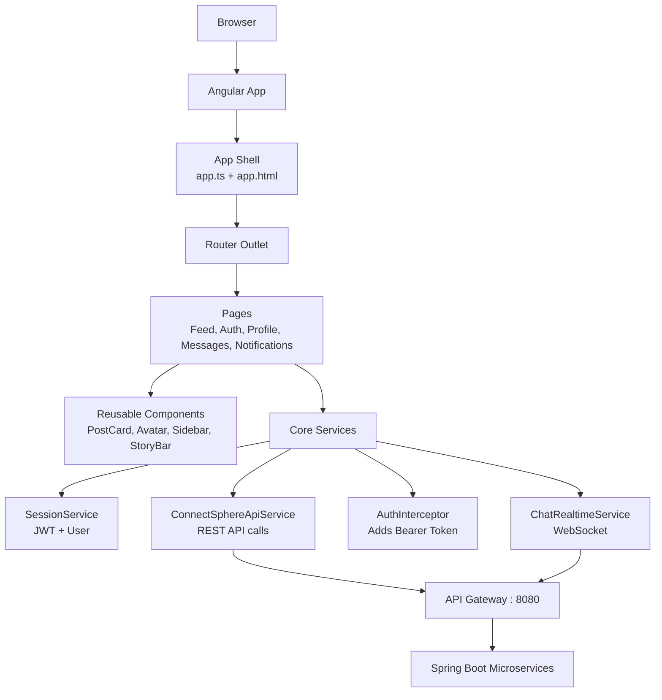
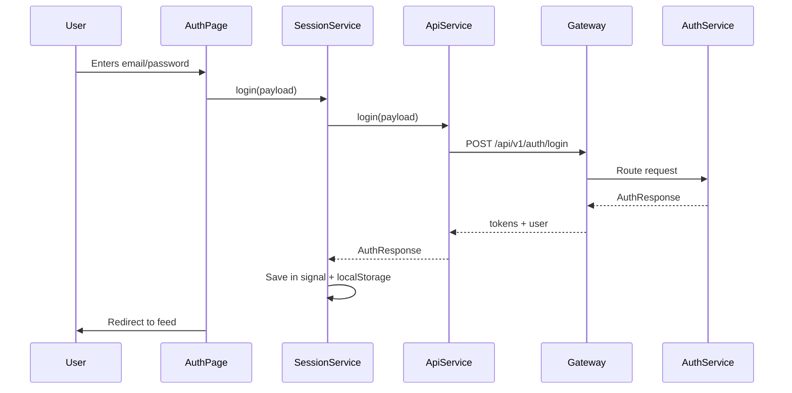
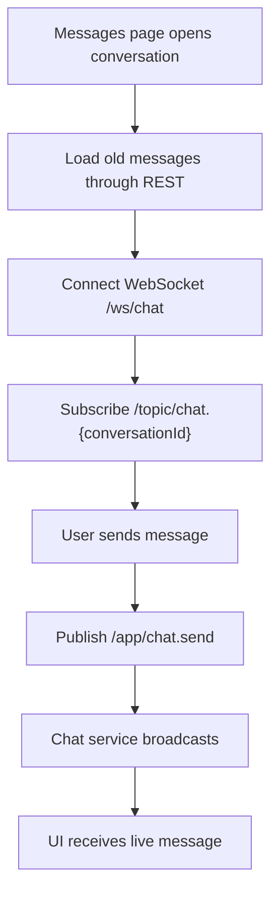
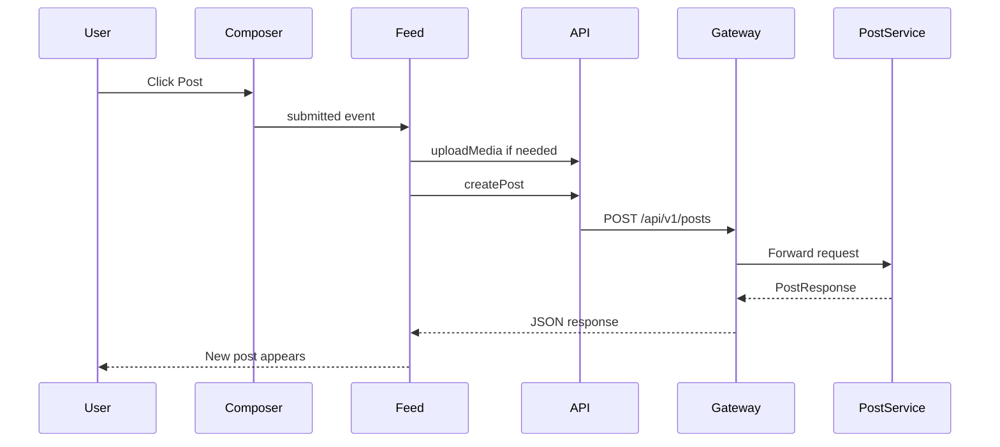
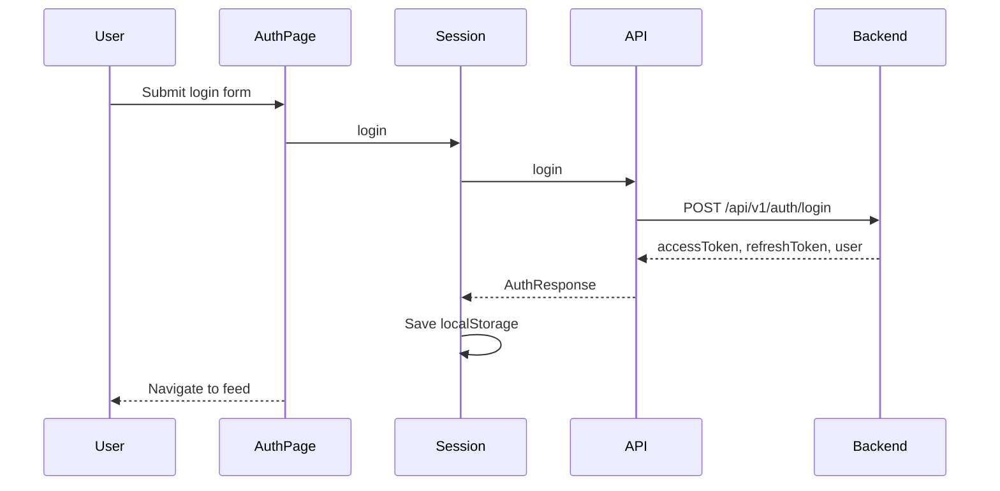
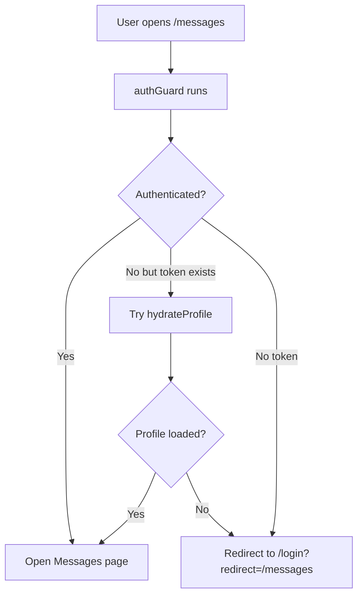

# Angular In-Depth Notes For ConnectSphere Web

These notes explain Angular from beginner to advanced level using the actual `connectsphere-web` project as the reference. The goal is simple: after reading this, you should be able to explain Angular concepts and also show where they are used in this project.

## 1. What Is Angular?

Angular is a frontend framework used to build single page applications, also called SPAs. A single page application loads one main HTML page in the browser, and then JavaScript changes the visible page without fully reloading the browser every time.

In ConnectSphere, when the user moves from `/feed` to `/profile/me` or `/messages`, the browser does not download a completely new HTML page from the server. Angular Router changes the component shown inside `<router-outlet />`.

Simple explanation:

> Angular is responsible for rendering the UI, handling routes, managing forms, calling backend APIs, storing frontend state, and reacting to user events.

In this project, Angular is used for:

- Login and registration UI.
- Feed screen.
- Profile page.
- Create post page.
- Post detail page.
- Explore/search page.
- Notifications page.
- Messages/chat page.
- Admin and system dashboards.
- JWT session handling.
- API calls to Spring Cloud Gateway.
- WebSocket chat connection.

## 2. Why Angular Was Chosen For This Project

Angular is a good choice for ConnectSphere because this frontend is not just a small static website. It is a full application with routes, forms, authentication, protected pages, API calls, realtime chat, reusable components, and admin screens.

Angular gives built-in support for:

- Components.
- Routing.
- Forms.
- HTTP client.
- Dependency injection.
- Route guards.
- Interceptors.
- Testing.
- TypeScript-first development.
- Large project structure.

Speaking answer:

> I selected Angular because ConnectSphere needs a structured frontend. Angular gives routing, forms, services, guards, interceptors, HttpClient, and testing support out of the box. This helps keep a large social media frontend maintainable.

## 3. ConnectSphere Web Architecture



Main project structure:

```text
connectsphere-web
  src
    main.ts
    index.html
    styles.scss
    proxy.conf.json
    app
      app.ts
      app.html
      app.config.ts
      app.routes.ts
      core
      pages
      components
```

Project layers:

- `app shell`: common layout like sidebar, router outlet, toast stack.
- `routes`: URL to page mapping.
- `pages`: full screens.
- `components`: reusable UI pieces.
- `core`: shared services, guards, interceptor, models.

## 4. Angular Application Startup Flow

Angular starts from `src/main.ts`.

```ts
import { bootstrapApplication } from '@angular/platform-browser';
import { appConfig } from './app/app.config';
import { App } from './app/app';

bootstrapApplication(App, appConfig)
  .catch((err) => console.error(err));
```

This means:

1. Angular starts the root component `App`.
2. It applies configuration from `appConfig`.
3. If startup fails, it logs the error.

The browser first loads `src/index.html`.

```html
<body>
  <app-root></app-root>
</body>
```

`<app-root>` is the selector of the root Angular component. Angular replaces it with the real app UI.

Beginner explanation:

> `index.html` is the physical page. `main.ts` starts Angular. `App` becomes the root component. From there, Angular displays the right page using routing.

## 5. Standalone Components

Older Angular projects use `AppModule`. This project uses modern standalone components.

Example:

```ts
@Component({
  selector: 'app-feed',
  standalone: true,
  imports: [
    CommonModule,
    PostCardComponent,
    PostComposerComponent,
  ],
  templateUrl: './feed.html',
  styleUrl: './feed.scss',
})
export class Feed {}
```

Meaning:

- `selector`: tag name for the component.
- `standalone: true`: no NgModule required.
- `imports`: dependencies used by this component template.
- `templateUrl`: HTML file.
- `styleUrl`: SCSS file.

Project examples:

- `pages/feed/feed.ts`
- `pages/profile/profile.ts`
- `pages/messages/messages.ts`
- `components/post-card/post-card.ts`
- `components/sidebar/sidebar.ts`

Speaking answer:

> ConnectSphere Web uses Angular standalone components. Every page or reusable component declares its own imports, template, and styles. This makes the code modular and removes the need for a large `AppModule`.

## 6. Root App Component

Important files:

- `src/app/app.ts`
- `src/app/app.html`
- `src/app/app.scss`

`app.ts` is the root component logic. It:

- Loads user profile on app startup.
- Stores current user in `UserDirectoryService`.
- Tracks current route.
- Shows or hides sidebar.
- Loads unread notification count every 15 seconds.
- Handles logout.

Important code idea:

```ts
readonly currentUser = this.session.user;
readonly isAuthenticated = this.session.isAuthenticated;
readonly unreadNotifications = signal(0);
readonly currentPath = signal(this.router.url);
readonly chromeVisible = computed(() => !/^\/(login|register)(\/|$)/.test(this.currentPath()));
```

`app.html` is the root layout.

```html
<app-sidebar
  [currentUser]="currentUser()"
  [isAuthenticated]="isAuthenticated()"
  (authRequested)="openAuth()"
  (logoutRequested)="logout()"
/>

<router-outlet />

<app-toast-stack />
```

Meaning:

- Sidebar is common for most pages.
- Router outlet displays the current route page.
- Toast stack shows popup messages.

## 7. Routing In Angular

Routing means mapping URL paths to components.

File:

- `src/app/app.routes.ts`

Examples:

```ts
{ path: 'feed', component: Feed, title: 'ConnectSphere | Feed' }
{ path: 'messages', component: Messages, canActivate: [authGuard] }
{ path: 'admin/dashboard', component: AdminDashboardPage, canActivate: [adminGuard] }
```

Important routes:

| Route | Page | Purpose |
| --- | --- | --- |
| `/feed` | `Feed` | Main timeline |
| `/login` | `AuthPage` | Login |
| `/register` | `AuthPage` | Signup |
| `/profile/me` | `Profile` | Own profile |
| `/profile/:userId` | `Profile` | Public profile |
| `/post/:postId` | `PostDetailPage` | Single post |
| `/messages` | `Messages` | Chat list |
| `/messages/:conversationId` | `Messages` | Chat thread |
| `/notifications` | `Notifications` | Notifications |
| `/discover` | `Explore` | Search and discovery |
| `/create-post` | `CreatePostPage` | Dedicated post creation |
| `/admin/dashboard` | `AdminDashboardPage` | Admin tools |
| `/system/dashboard` | `SystemDashboardPage` | Service health |

`router-outlet`:

```html
<router-outlet />
```

This is the placeholder where Angular inserts the selected page.

Navigation example:

```ts
void this.router.navigate(['/profile', userId]);
```

Speaking answer:

> Angular Router allows ConnectSphere to behave like a multi-page app without full page reloads. Each path maps to a component, and protected paths use guards.

## 8. Route Guards

File:

- `src/app/core/auth.guard.ts`

Guards decide whether a route can open.

### `authGuard`

Used for pages that require login:

- `/messages`
- `/notifications`
- `/profile/me`
- `/create-post`

Logic:

1. If session is authenticated, allow.
2. If token exists but profile is not loaded, try `hydrateProfile()`.
3. Otherwise redirect to `/login`.

### `guestGuard`

Used for login/register:

- If user is already logged in, redirect to feed.
- If not logged in, allow.

### `adminGuard`

Used for admin pages:

- Allows only users with `ADMIN` or `ROLE_ADMIN`.
- If not logged in, redirects to login.
- If logged in but not admin, redirects to feed.

Speaking answer:

> Guards protect frontend routes. They do not replace backend security, but they improve user experience by stopping unauthorized screens from opening.

## 9. Components In Angular

A component is a UI building block. It has:

- TypeScript class for logic.
- HTML template for view.
- SCSS file for style.

Example: `PostCardComponent`

Files:

- `post-card.ts`
- `post-card.html`
- `post-card.scss`

It displays one post and emits events when user likes, comments, shares, or opens the post.

Component design in this project:

- Pages perform API calls.
- Components display UI and emit events.

This is a clean pattern because a reusable component like `PostCardComponent` does not need to know backend API details.

## 10. Component Communication

Parent to child: `input()`

```ts
readonly view = input.required<FeedCardView>();
readonly liked = input(false);
```

HTML:

```html
<app-post-card
  [view]="card"
  [liked]="liked(card.post.postId)"
/>
```

Child to parent: `output()`

```ts
readonly likeToggled = output<string>();
```

Child emits:

```ts
this.likeToggled.emit(this.view().post.postId);
```

Parent handles:

```html
<app-post-card
  (likeToggled)="toggleLike($event)"
/>
```

Project example:

- `feed.html` sends data to `app-post-card`.
- `post-card.ts` emits events.
- `feed.ts` receives events and calls backend APIs.

## 11. Templates, Interpolation, And Binding

Templates are `.html` files connected to components.

Interpolation:

```html
<h1>{{ authorName() }}</h1>
```

Property binding:

```html

```

Class binding:

```html
<button [class.active]="liked()"></button>
```

Event binding:

```html
<button (click)="toggleLike()">Like</button>
```

Two-way style with signals:

```html
<textarea
  [ngModel]="commentDraft()"
  (ngModelChange)="commentDraft.set($event)">
</textarea>
```

Why this project uses `[ngModel]` and `(ngModelChange)`:

Signals are read by calling `signalName()`, and changed with `signalName.set(value)`.

## 12. Angular Control Flow

This project uses modern Angular syntax:

```html
@if (loading()) {
  <app-skeleton-post />
} @else {
  @for (card of visibleCards(); track card.post.postId) {
    <app-post-card [view]="card" />
  }
}
```

`@if`:

- Shows content only when condition is true.

`@for`:

- Loops over arrays.

`track`:

- Helps Angular update list efficiently.

Speaking answer:

> `@if` and `@for` are modern Angular template control flow features. They make templates cleaner than older `*ngIf` and `*ngFor`.

## 13. Signals

Signals are used heavily in this project.

Example:

```ts
readonly loading = signal(true);
readonly cards = signal<FeedCardView[]>([]);
readonly commentDraft = signal('');
```

Read signal:

```ts
this.loading()
```

Set signal:

```ts
this.loading.set(false);
```

Update signal:

```ts
this.cards.update((items) => [newCard, ...items]);
```

Why signals are useful:

- Simple state management.
- UI updates automatically.
- Less RxJS boilerplate for local component state.

Project examples:

- Feed stores posts, stories, likes, selected story.
- Profile stores form data and follow state.
- Messages stores conversations, messages, draft.
- Notifications stores notification list.
- Admin dashboard stores users, reports, overview.

## 14. Computed Signals

`computed()` creates derived state.

Example:

```ts
readonly chromeVisible = computed(() => !/^\/(login|register)(\/|$)/.test(this.currentPath()));
```

Meaning:

- If current route is login/register, hide normal app shell.
- Otherwise show sidebar and normal layout.

Computed values should not be manually set. They are calculated from other signals.

## 15. Effects

`effect()` runs automatically when signals inside it change.

Example:

```ts
effect(() => {
  const user = this.currentUser();
  if (user) {
    void this.loadChromeCounters(user.userId);
  }
});
```

Meaning:

- When current user changes, reload counters.

Project examples:

- `app.ts` reloads notification count when user changes.
- `feed.ts` reloads feed when user/route params change.
- `profile.ts` reloads when route user changes.
- `messages.ts` reacts to selected conversation changes.

## 16. Services And Dependency Injection

A service is a reusable class for shared logic.

Example:

```ts
@Injectable({ providedIn: 'root' })
export class SessionService {}
```

`providedIn: 'root'` means Angular creates one shared instance for the whole app.

Injecting service:

```ts
private readonly api = inject(ConnectSphereApiService);
private readonly session = inject(SessionService);
```

Why services are used:

- Avoid duplicate code.
- Share state between components.
- Keep components focused.
- Make testing easier.

Core services in this project:

| Service | Purpose |
| --- | --- |
| `ConnectSphereApiService` | All REST API calls |
| `SessionService` | Login, tokens, current user |
| `ChatRealtimeService` | WebSocket chat |
| `ToastService` | Popup messages |
| `UserDirectoryService` | User display cache |
| `UiShellService` | App-level UI navigation |

## 17. API Service

File:

- `src/app/core/connectsphere-api.service.ts`

This service wraps all backend API calls.

Example:

```ts
createPost(payload): Promise<PostResponse> {
  return firstValueFrom(this.http.post<PostResponse>('/api/v1/posts', payload));
}
```

Why this is good:

- Pages do not need raw URLs everywhere.
- API contracts are centralized.
- It is easy to mock in tests.
- If URL changes, update one service.

API categories:

- Auth APIs.
- Admin APIs.
- Report APIs.
- Post APIs.
- Comment APIs.
- Like APIs.
- Follow APIs.
- Notification APIs.
- Media/story APIs.
- Search APIs.
- Chat APIs.

Advanced concept:

Angular `HttpClient` returns Observables. This service uses `firstValueFrom()` to convert the first response into a Promise, so components can use `async/await`.

## 18. HTTP Interceptor

File:

- `src/app/core/auth.interceptor.ts`

Purpose:

Automatically add JWT token to requests.

```ts
const authenticatedRequest = request.clone({
  setHeaders: {
    Authorization: `Bearer ${token}`,
  },
});
```

Registered in:

- `app.config.ts`

```ts
provideHttpClient(withInterceptors([authInterceptor]))
```

Why interceptor is important:

Without interceptor, every API method would need to manually add token. That would be repetitive and error-prone.

Speaking answer:

> The interceptor is a centralized HTTP middleware. It checks the current session token and attaches it as a Bearer token to outgoing backend requests.

## 19. Session Management

File:

- `src/app/core/session.service.ts`

This service manages:

- Access token.
- Refresh token.
- Token expiry times.
- Logged-in user.
- Local storage persistence.
- Login/logout/register/OTP/profile update.

State key:

```ts
const STORAGE_KEY = 'connectsphere.session';
```

Login flow:



Hydration:

When the browser reloads, Angular memory resets. But localStorage still has token data. `hydrateProfile()` tries to restore the user by calling backend profile API.

If access token is invalid:

- Try refresh token.
- If refresh succeeds, save new tokens.
- If refresh fails, clear session.

## 20. TypeScript Interfaces And API Contracts

File:

- `src/app/core/social.models.ts`

This file describes data shapes.

Example:

```ts
export interface PostResponse {
  postId: string;
  authorId: string;
  content: string;
  mediaUrls: string[];
  postType: 'TEXT_ONLY' | 'MEDIA_ONLY' | 'TEXT_AND_MEDIA';
  visibility: 'PUBLIC' | 'FOLLOWERS_ONLY' | 'PRIVATE';
  likesCount: number;
  commentsCount: number;
  sharesCount: number;
  createdAt: string;
  updatedAt: string;
  deleted: boolean;
}
```

Why this is useful:

- Type safety.
- Autocomplete.
- Fewer property mistakes.
- Clear frontend-backend contract.

Speaking answer:

> `social.models.ts` is like the frontend version of backend DTOs. It tells Angular what fields are expected in API responses.

## 21. Forms In This Project

Angular forms are used in:

- Login form.
- Signup form.
- OTP form.
- Forgot/reset password form.
- Post composer.
- Create post page.
- Comment boxes.
- Profile edit form.
- Message input.
- Broadcast message input.

Most forms use signals and `ngModel`.

Example pattern:

```html
<input
  [ngModel]="loginForm().email"
  (ngModelChange)="loginForm.update((form) => ({ ...form, email: $event }))">
```

Meaning:

- UI displays signal value.
- On user input, signal is updated.

Project style:

- Form state is stored in the component.
- Submit method validates and calls service.
- Toast shows result.

## 22. Feed Page In Depth

Files:

- `pages/feed/feed.ts`
- `pages/feed/feed.html`
- `pages/feed/feed.scss`

Main state:

- `loading`: page loading.
- `cards`: feed posts with author/comment state.
- `stories`: active stories.
- `trending`: hashtags.
- `discoverUsers`: suggested users.
- `likedPostIds`: post like map.
- `postReactionTypes`: reaction type map.
- `selectedStory`: story modal state.
- `sharePostId`: selected post for share sheet.

Main actions:

- `load()`: loads everything needed for feed.
- `createPost()`: creates a post from composer.
- `toggleLike()`: likes/unlikes post.
- `setReaction()`: changes reaction type.
- `loadComments()`: loads comments for a post.
- `addComment()`: adds comment.
- `createStory()`: uploads story.
- `openStory()`: opens story and counts views.
- `shareToUser()`: sends post link through chat.

Feed page combines many backend services:

- Post Service.
- Media Service.
- Like Service.
- Comment Service.
- Follow Service.
- Notification Service.
- Search Service.
- Chat Service.

## 23. Post Card Component In Depth

Files:

- `components/post-card/post-card.ts`
- `components/post-card/post-card.html`
- `components/post-card/post-card.scss`

Inputs:

- `view`: post data.
- `currentUserId`: logged-in user.
- `liked`: whether current user liked this post.
- `reactionType`: current reaction.
- `likedCommentIds`: comment likes.

Outputs:

- `likeToggled`
- `reactionChanged`
- `commentsRequested`
- `commentSubmitted`
- `commentUpdated`
- `commentDeleted`
- `commentReported`
- `commentLikeToggled`
- `shareRequested`
- `profileRequested`
- `postRequested`

Important design:

Post card emits events, but feed page performs API calls. This keeps component reusable.

## 24. Profile Page In Depth

Files:

- `pages/profile/profile.ts`
- `pages/profile/profile.html`
- `pages/profile/profile.scss`

Responsibilities:

- Show own/public profile.
- Edit own profile.
- Upload profile picture/banner.
- Follow/unfollow.
- Handle private account follow requests.
- Show followers/following.
- Message user.
- Report user.
- Load user's posts.
- Deactivate account.

Advanced concept:

The same page handles two modes:

- Own profile mode: `/profile/me`
- Public profile mode: `/profile/:userId`

The page checks route params and current user to decide which UI actions are allowed.

## 25. Messages Page And WebSocket

Files:

- `pages/messages/messages.ts`
- `core/chat-realtime.service.ts`

REST is used for:

- Load conversations.
- Load old messages.
- Create conversation.
- Save message fallback.
- Clear chat.

WebSocket is used for:

- Live incoming messages.
- Typing indicators.

Flow:



Speaking answer:

> The messages page uses REST for existing data and WebSocket for realtime updates. This is a practical hybrid approach.

## 26. Notifications Page

Files:

- `pages/notifications/notifications.ts`
- `components/notification-item`

Responsibilities:

- Load notifications.
- Mark as read.
- Mark all as read.
- Delete notification.
- Open target page.
- Accept/reject follow request.
- Resolve actor profile data.

Example:

- If notification target is a post, navigate to `/post/{postId}`.
- If target is a comment, find parent post and open comment thread.

## 27. Explore Page

Files:

- `pages/explore/explore.ts`

Responsibilities:

- Search users.
- Search posts.
- Search hashtags.
- Show trending content.
- Show suggested users.
- Follow users.
- Message users.
- Open profiles/posts.

It uses query signal:

```ts
readonly query = signal('');
```

When query changes or search is submitted, it loads matching users/posts/hashtags.

## 28. Admin Dashboard

Files:

- `pages/admin-dashboard/admin-dashboard.ts`

Protected by:

- `adminGuard`

Responsibilities:

- View platform overview.
- View users.
- Suspend user.
- Reactivate user.
- Delete user.
- View reports.
- Resolve reports.
- Broadcast notifications.

This proves role-based frontend behavior.

## 29. Styling And SCSS

Global styles:

- `src/styles.scss`

Component styles:

- Each component/page has its own `.scss`.

Global design tokens:

```scss
:root {
  --bg: #f8fafc;
  --surface: #ffffff;
  --accent: #1d9bf0;
  --font-family: 'Inter', system-ui, sans-serif;
}
```

Why CSS variables are used:

- Consistent colors.
- Consistent spacing.
- Easy theme changes.
- Reusable layout values.

Responsive design:

- Media queries adapt layout for tablet/mobile.
- Feed becomes single-column on smaller screens.
- Sidebar behavior changes for mobile.

## 30. Local Proxy

File:

- `src/proxy.conf.json`

Problem:

Angular dev server runs on `4200`, backend gateway runs on `8080`. Browser security blocks some cross-origin requests.

Solution:

Proxy `/api`, `/auth`, `/oauth2`, `/ws`, etc. to gateway.

Example:

```json
"/api": {
  "target": "http://localhost:8080",
  "secure": false,
  "changeOrigin": true
}
```

Run command:

```powershell
npm start
```

It uses:

```json
"start": "ng serve --proxy-config src/proxy.conf.json"
```

## 31. Deployment With Docker And Nginx

File:

- `Dockerfile`
- `docker/nginx/default.conf`

Dockerfile stages:

1. Node image builds Angular.
2. Nginx image serves compiled files.

Nginx responsibilities:

- Serve Angular static assets.
- Proxy `/api` to API Gateway.
- Proxy `/ws` with WebSocket upgrade.
- Support Angular routes using `try_files`.

Important Nginx line:

```nginx
location / {
    try_files $uri $uri/ /index.html;
}
```

This allows browser refresh on `/profile/me` or `/messages`.

## 32. Testing

Spec files exist for:

- App.
- Auth page.
- Feed page.
- Profile page.
- Messages page.
- Notifications page.
- Explore page.
- Create post page.
- Admin dashboard.

Testing tools:

- Angular TestBed.
- Vitest/Angular unit test builder.
- Mock services.

What frontend tests check:

- Component renders.
- Login redirects.
- OTP flow state.
- Create post flow.
- Messages load/connect realtime.
- Notifications mark/read/open.
- Profile follow/private account behavior.
- Admin dashboard sections.

Speaking answer:

> Frontend tests validate UI behavior and component logic. Backend tests validate API behavior. Together they improve confidence in the full project.

## 33. Important End-To-End UI Flows

### Create Post Flow



### Login Flow



### Protected Route Flow



## 34. Advanced Angular Concepts Used

### Dependency Injection

Angular creates service objects and provides them where needed.

```ts
private readonly api = inject(ConnectSphereApiService);
```

### Reactive State

Signals store UI state and update templates automatically.

### Component Composition

Large pages are built by combining smaller components.

Example:

`Feed` uses:

- `PostComposerComponent`
- `PostCardComponent`
- `RightSidebarComponent`
- `StoryBarComponent`
- `ShareSheetComponent`

### Separation Of Concerns

- Components: UI and events.
- Pages: business orchestration.
- Services: shared logic/API/session.
- Models: data contracts.
- Guards/interceptors: cross-cutting security.

### Async/Await

The app uses async functions for backend calls:

```ts
async createPost(...) {
  const post = await this.api.createPost(payload);
}
```

### RxJS

Used for:

- Router events.
- Intervals.
- WebSocket subjects.
- HTTP observables converted to promises.

Example from app shell:

```ts
interval(15000)
  .pipe(takeUntilDestroyed(this.destroyRef))
  .subscribe(() => {
    // refresh counters
  });
```

`takeUntilDestroyed` prevents memory leaks by unsubscribing when component is destroyed.

## 35. Common Interview Questions And Answers

### What is Angular?

Angular is a TypeScript-based frontend framework for building single page applications. In ConnectSphere, it builds the complete social media UI and communicates with backend microservices through API Gateway.

### What is a component?

A component is a UI block with TypeScript logic, HTML template, and SCSS styles. Example: `PostCardComponent` renders a post.

### What is a service?

A service contains reusable logic. Example: `ConnectSphereApiService` handles API calls, and `SessionService` handles login state.

### What is dependency injection?

Dependency injection means Angular provides required services to components instead of components manually creating them.

### What is routing?

Routing maps URLs to components. Example: `/feed` opens `Feed`, `/messages` opens `Messages`.

### What is a guard?

A guard controls route access. `authGuard` protects logged-in pages, and `adminGuard` protects admin pages.

### What is an interceptor?

An interceptor modifies HTTP requests/responses globally. In this project, `authInterceptor` adds JWT token.

### What is a signal?

A signal is a reactive state variable. When signal value changes, Angular updates the UI.

### What is WebSocket?

WebSocket is a persistent connection for realtime communication. ConnectSphere uses it for live chat.

### Why use TypeScript?

TypeScript adds type safety and helps avoid runtime mistakes. It makes large projects easier to maintain.

### Why use standalone components?

Standalone components reduce module boilerplate and let each component declare its own imports.

## 36. Common Mistakes To Avoid In Explanation

Do not say Angular directly connects to database. It does not.

Do not say route guards are full security. Backend must also validate JWT and roles.

Do not say every component calls backend. In this project, pages usually call backend through services, while reusable components emit events.

Do not confuse WebSocket with REST. REST is request-response; WebSocket is realtime bidirectional communication.

Do not confuse `localStorage` with database. It is browser-side storage only.

## 37. Final Viva Summary

> ConnectSphere Web is an Angular 21 single page application. It starts from `main.ts`, loads the root `App` component, registers routing and HTTP interceptor through `app.config.ts`, and displays pages through `router-outlet`. The project uses standalone components, signals, services, guards, interceptors, and TypeScript models. Pages like Feed, Profile, Messages, Notifications, Explore, and Admin Dashboard coordinate user actions and call backend APIs through `ConnectSphereApiService`. The session is managed by `SessionService`, which stores JWT tokens and user data in localStorage. The `authInterceptor` automatically attaches the JWT token to API calls. Realtime chat is handled by `ChatRealtimeService` using STOMP WebSocket. The frontend is deployed as static Angular files served by Nginx, with `/api` and `/ws` proxied to the API Gateway.

