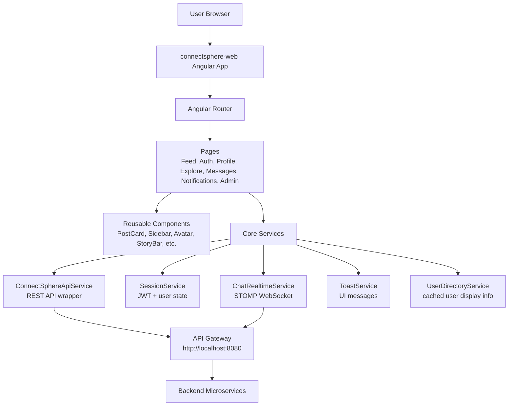
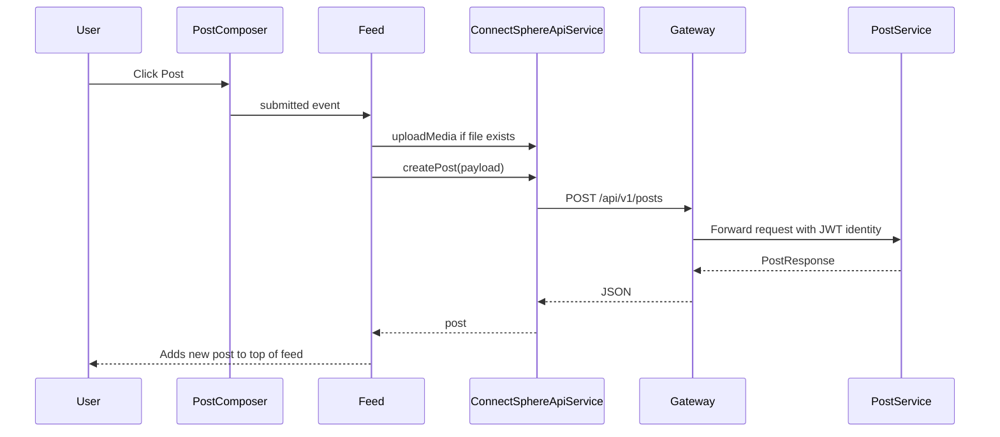
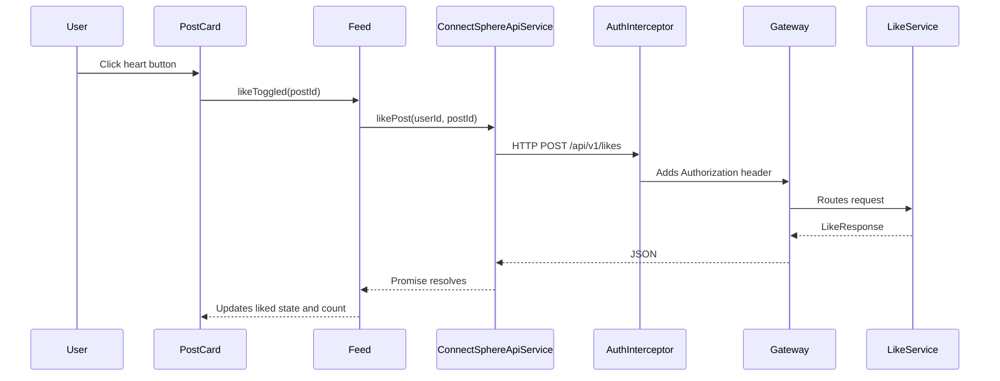
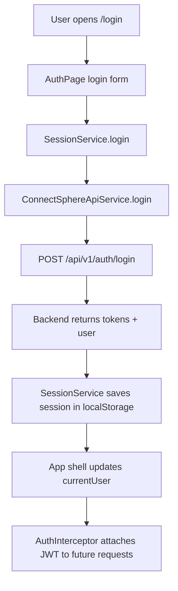
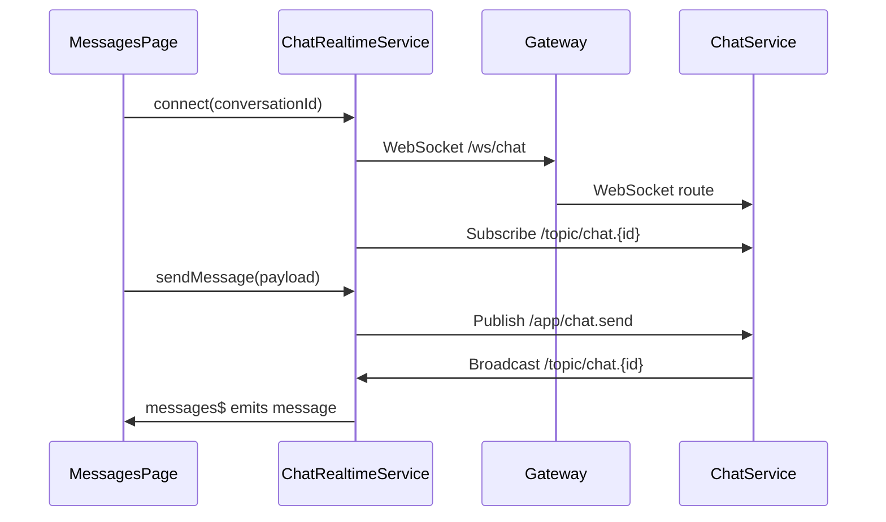

# ConnectSphere Web Explained From Beginner To Advanced

This document explains the complete `connectsphere-web` Angular frontend in easy language. Read it like a viva/evaluation script: first understand the simple idea, then move deeper into files, flows, and advanced Angular concepts.

## 1. What Is `connectsphere-web`?

`connectsphere-web` is the frontend/browser application of ConnectSphere. It is built with Angular 21 and TypeScript. The user opens this app in the browser and interacts with screens like feed, login, profile, messages, notifications, explore/search, create post, post detail, and admin dashboards.

The frontend does not directly connect to MySQL, Redis, RabbitMQ, or Elasticsearch. It talks to the backend using HTTP APIs and WebSocket. In local development, Angular runs on port `4200`. API calls like `/api/v1/posts/feed` are forwarded to the API Gateway on port `8080` using `src/proxy.conf.json`. In Docker production, the frontend is built into static files and served by Nginx.

Simple speaking line:

> ConnectSphere Web is the Angular single page application. It handles UI rendering, routing, session state, JWT header injection, REST API calls, realtime chat through WebSocket, and user interactions.

## 2. Technology Used

The main dependencies are:

- Angular 21: frontend framework.
- TypeScript 5.9: JavaScript with types.
- Angular Router: client-side navigation.
- Angular Forms: form inputs using `ngModel`.
- Angular HttpClient: REST API communication.
- Angular signals: modern Angular state management.
- RxJS: event streams, intervals, subscriptions, and HTTP observables.
- `@stomp/stompjs`: realtime chat over WebSocket/STOMP.
- SCSS: styling.
- Vitest / Angular unit test builder: frontend tests.
- Docker + Nginx: production frontend hosting.

## 3. Big Picture Architecture



The frontend follows a simple structure:

- `main.ts` starts the Angular app.
- `app.config.ts` registers app-wide providers like router and HTTP interceptor.
- `app.routes.ts` defines which page opens for each URL.
- `app.ts` and `app.html` create the outer shell: sidebar, page outlet, and toast stack.
- `core/` contains shared services and models.
- `pages/` contains full screens.
- `components/` contains reusable UI building blocks.

## 4. Runtime Flow From Browser To UI

The app begins in `src/index.html`.

```html
<body>
  <app-root></app-root>
</body>
```

This file is the static HTML page loaded by the browser. Angular replaces `<app-root>` with the actual root Angular component.

Then `src/main.ts` runs:

```ts
bootstrapApplication(App, appConfig)
  .catch((err) => console.error(err));
```

This means: start Angular using the root component `App` and apply configuration from `appConfig`.

Then `src/app/app.config.ts` registers global providers:

```ts
provideHttpClient(withInterceptors([authInterceptor])),
provideRouter(routes)
```

This means every HTTP request can pass through the auth interceptor, and Angular knows all routes.

Finally, `app.html` renders:

- Sidebar if the page is not login/register.
- `<router-outlet />` where the selected page appears.
- Toast stack for popup messages.

## 5. Angular Concepts Used In This Project

### Standalone Components

This project uses modern standalone Angular components. That is why you do not see a classic `app.module.ts`.

Example:

```ts
@Component({
  selector: 'app-feed',
  standalone: true,
  imports: [CommonModule, PostCardComponent],
  templateUrl: './feed.html',
  styleUrl: './feed.scss',
})
export class Feed {}
```

Meaning:

- `selector`: HTML tag name if another component wants to use it.
- `standalone: true`: component can import its own dependencies.
- `imports`: other components/modules used in its template.
- `templateUrl`: HTML file.
- `styleUrl`: SCSS file.

### Signals

Signals are Angular's modern way to store reactive state.

Example:

```ts
readonly loading = signal(true);
readonly cards = signal<FeedCardView[]>([]);
```

To read a signal in TypeScript or HTML, call it like a function:

```ts
this.loading()
```

To update:

```ts
this.loading.set(false);
this.cards.update((items) => [newItem, ...items]);
```

Beginner meaning: signal is a smart variable. When it changes, the UI updates automatically.

### Computed

`computed()` creates a value based on other signals.

Example from `app.ts`:

```ts
readonly chromeVisible = computed(() => !/^\/(login|register)(\/|$)/.test(this.currentPath()));
```

Meaning: hide the sidebar on login/register pages.

### Effect

`effect()` runs whenever the signals used inside it change.

Example:

```ts
effect(() => {
  const user = this.currentUser();
  if (user) {
    void this.loadChromeCounters(user.userId);
  }
});
```

Meaning: whenever current user changes, reload notification counters.

### Input And Output

This project uses Angular's new `input()` and `output()` APIs.

Example from `PostCardComponent`:

```ts
readonly view = input.required<FeedCardView>();
readonly likeToggled = output<string>();
```

Meaning:

- Parent sends data into child through input.
- Child sends events back to parent through output.

HTML usage:

```html
<app-post-card
  [view]="card"
  (likeToggled)="toggleLike($event)"
/>
```

This is exactly how reusable components communicate.

### Template Binding

Interpolation:

```html
{{ currentUser()?.fullName }}
```

Property binding:

```html

```

Event binding:

```html
<button (click)="submit()">Post</button>
```

Two-way binding style used here:

```html
<textarea
  [ngModel]="content()"
  (ngModelChange)="content.set($event)">
</textarea>
```

Because signals are functions, this project often uses `[ngModel]` plus `(ngModelChange)` instead of `[(ngModel)]`.

### New Angular Control Flow

The app uses Angular's modern template syntax:

```html
@if (loading()) {
  <app-skeleton-post />
} @else {
  @for (card of visibleCards(); track card.post.postId) {
    <app-post-card [view]="card" />
  }
}
```

Meaning:

- `@if` conditionally renders UI.
- `@for` loops through items.
- `track` helps Angular identify list items efficiently.

## 6. Folder Structure

```text
connectsphere-web
  package.json
  angular.json
  Dockerfile
  docker/nginx/default.conf
  src
    index.html
    main.ts
    proxy.conf.json
    styles.scss
    app
      app.ts / app.html / app.scss
      app.config.ts
      app.routes.ts
      core
      pages
      components
```

## 7. Root Files

### `package.json`

This defines npm scripts and dependencies.

Important scripts:

- `npm start`: runs Angular dev server with proxy config.
- `npm run build`: builds production files.
- `npm test`: runs unit tests.

Important dependency:

- `@stomp/stompjs` is used for chat realtime WebSocket.

### `angular.json`

This is Angular CLI configuration.

Important parts:

- Entry file: `src/main.ts`
- Global style: `src/styles.scss`
- Assets folder: `public`
- Production build budgets
- Dev server uses `src/proxy.conf.json`

### `src/proxy.conf.json`

This is only for local development. Angular runs on `localhost:4200`, backend gateway runs on `localhost:8080`. Browser calls `/api`, and proxy forwards it to gateway.

Example:

```json
"/api": {
  "target": "http://localhost:8080",
  "secure": false,
  "changeOrigin": true
}
```

It also proxies `/ws` with `"ws": true` for WebSocket chat.

### `Dockerfile`

The Dockerfile has two stages:

1. Node builds Angular app.
2. Nginx serves the built static files.

This is called a multi-stage build. It keeps the final image smaller because Node is not needed at runtime.

### `docker/nginx/default.conf`

Nginx serves Angular and proxies backend paths to `api-gateway:8080`.

Important behavior:

- `/api/` goes to API Gateway.
- `/oauth2/` and `/login/oauth2/` go to API Gateway.
- `/ws/` supports WebSocket upgrade.
- `/` uses `try_files $uri $uri/ /index.html;` so Angular routes work after refresh.

Without `try_files`, refreshing `/profile/me` would fail because Nginx would look for a physical file named `/profile/me`.

### `src/styles.scss`

This is global styling. It defines:

- Design tokens as CSS variables: colors, spacing, fonts, shadows.
- Base typography.
- Form input/button reset.
- Common button classes.
- Layout classes like `.twitter-page`, `.twitter-main`, `.twitter-card`.
- Responsive media queries.

Speaking line:

> Global SCSS gives the whole app a consistent design system. Individual components then add their own local SCSS.

## 8. App Shell Files

### `app.ts`

This is the root component class. It controls app-wide UI behavior.

Main responsibilities:

- Hydrates user session on app startup.
- Stores current user in `UserDirectoryService`.
- Shows or hides sidebar based on current route.
- Loads unread notification count every 15 seconds.
- Handles logout.

Important signals:

- `currentUser`: current logged-in user from `SessionService`.
- `isAuthenticated`: true when user and token exist.
- `unreadNotifications`: count shown in sidebar.
- `conversationCount`: currently set to 0, can be extended later.
- `currentPath`: current route URL.
- `chromeVisible`: sidebar visibility.

### `app.html`

This is the root layout.

It renders:

- `<app-sidebar>` for navigation.
- `<router-outlet />` for the current page.
- `<app-toast-stack />` for notifications/toasts.

Simple explanation:

> `app.html` is like the frame of the website. The sidebar stays common, and the middle page changes based on routing.

### `app.routes.ts`

This defines all frontend URLs.

Important routes:

- `/feed`: main feed.
- `/login`, `/register`: auth page.
- `/auth/callback`: OAuth login callback.
- `/discover`, `/search`: explore page.
- `/messages`, `/messages/:conversationId`: chat page, protected.
- `/notifications`: notifications page, protected.
- `/profile/me`: own profile, protected.
- `/profile/:userId`: public profile.
- `/post/:postId`: post detail.
- `/admin/dashboard`: admin dashboard, admin protected.
- `/system/dashboard`: system health dashboard, admin protected.
- `/create-post`: create post page, protected.

Guards:

- `authGuard`: only logged-in users can open.
- `guestGuard`: logged-in users should not open login/register.
- `adminGuard`: only admin users can open admin pages.

## 9. Core Layer

The `core` folder contains services and models shared by many pages.

### `social.models.ts`

This file contains TypeScript interfaces and types matching backend DTOs.

Examples:

- `UserProfile`
- `PostResponse`
- `CommentResponse`
- `LikeResponse`
- `FollowResponse`
- `NotificationResponse`
- `StoryResponse`
- `ConversationResponse`
- `ChatMessageResponse`
- `AdminUserResponse`
- `ReportResponse`

Why it matters:

> TypeScript interfaces make frontend-backend contracts clear. If `PostResponse` has `postId`, `content`, and `likesCount`, the component knows exactly what data exists.

### `connectsphere-api.service.ts`

This is one of the most important frontend files. It is the central API wrapper.

Instead of every page manually writing HTTP calls, pages call methods from this service.

Example:

```ts
createPost(payload): Promise<PostResponse> {
  return firstValueFrom(this.http.post<PostResponse>('/api/v1/posts', payload));
}
```

It covers API groups:

- Auth: register, login, refresh, logout, profile.
- Admin: stats, users, reports, system overview.
- Posts: create, feed, get by id, delete, counters.
- Comments: add, update, delete, replies.
- Likes: like/unlike/change reaction.
- Follows: follow, unfollow, requests, suggestions.
- Notifications: get, read, delete, bulk send.
- Media/stories: upload media, create story, view story.
- Search: search users/posts/hashtags.
- Chat: conversations and messages.

Advanced point:

Angular `HttpClient` returns Observables, but this service converts them to Promises using `firstValueFrom()`. That is why pages can use `async/await`.

### `session.service.ts`

This service owns login state.

It stores:

- Access token.
- Refresh token.
- Expiry times.
- Logged-in user profile.

It persists the session in browser `localStorage` under:

```ts
connectsphere.session
```

Important methods:

- `login(payload)`: calls API login, stores tokens and user.
- `signup(payload)`: calls register.
- `verifyEmail(email, code)`: verifies OTP.
- `hydrateProfile()`: tries to load current user from saved token.
- `updateProfile(payload)`: updates user and patches local state.
- `logout()`: calls backend logout and clears local state.

Advanced explanation:

When the app reloads, memory is cleared, but `localStorage` still has token data. `hydrateProfile()` checks if token exists, calls `/api/v1/auth/profile`, and restores the user. If access token fails but refresh token exists, it calls refresh. If refresh also fails, it clears the session.

### `auth.interceptor.ts`

This attaches the JWT token to backend requests.

```ts
Authorization: Bearer <token>
```

It runs automatically because `app.config.ts` registered:

```ts
provideHttpClient(withInterceptors([authInterceptor]))
```

Speaking line:

> The user does not manually attach JWT in every API call. The interceptor does it centrally for all requests.

### `auth.guard.ts`

Guards protect routes.

`authGuard`:

- If user is authenticated, allow route.
- If token exists but user is not loaded, call `hydrateProfile()`.
- Otherwise redirect to `/login?redirect=...`.

`guestGuard`:

- Stops logged-in users from opening login/register.

`adminGuard`:

- Allows only role `ADMIN` or `ROLE_ADMIN`.
- If not logged in, redirects to login.
- If logged in but not admin, redirects to feed.

### `chat-realtime.service.ts`

This handles realtime chat using STOMP over WebSocket.

Main flow:

- Connects to `/ws/chat`.
- Sends messages to `/app/chat.send`.
- Sends typing indicators to `/app/chat.typing`.
- Subscribes to `/topic/chat.{conversationId}` for live messages.
- Subscribes to `/topic/chat.typing.{conversationId}` for typing events.

It uses `Subject` from RxJS:

- `messages$`: emits new live chat messages.
- `typing$`: emits typing indicator updates.

Advanced point:

It builds WebSocket URL from the current browser host:

```ts
const protocol = window.location.protocol === 'https:' ? 'wss' : 'ws';
const brokerURL = `${protocol}://${window.location.host}/ws/chat`;
```

So it works in both local and deployed environments.

### `user-directory.service.ts`

This is a small client-side user cache.

Problem it solves:

Posts, comments, likes, and messages often only contain user IDs. The UI needs names, usernames, and avatars.

This service stores user display information by `userId`.

Methods:

- `storeCurrentUser(user)`
- `storePublicProfile(profile)`
- `storeSummaries(users)`
- `get(userId)`
- `displayName(userId)`
- `handle(userId)`
- `avatarUrl(userId)`

### `toast.service.ts`

This manages popup messages.

Example:

```ts
this.toast.show('Post created', 'Your post was published.', 'success');
```

It stores a stack of toast items and auto-removes each toast after a few seconds.

### `ui-shell.service.ts`

Small service for UI navigation behavior, mainly opening auth:

```ts
openAuth(redirectUrl?: string)
```

It routes user to `/login` and optionally includes the original page as redirect target.

### `visuals.ts`

Utility for generated avatar fallback.

If a user does not have profile picture, the app creates an SVG avatar with initials and a color based on seed.

## 10. Page Layer

Pages are full screens connected to routes.

### Auth Page: `pages/auth`

Route:

- `/login`
- `/register`

Responsibilities:

- Login with email/password.
- Signup/register.
- OTP verification after registration.
- Resend OTP.
- Forgot password.
- Reset password.
- OAuth buttons for Google/GitHub flow.
- Redirect user after successful login.

Flow:

1. User fills login form.
2. `submit()` calls `session.login(...)`.
3. `SessionService` calls API login.
4. Tokens and user are saved in localStorage.
5. Router navigates to redirect URL or `/feed`.

Signup flow:

1. User fills signup form.
2. App calls `/api/v1/auth/register`.
3. Backend sends/returns OTP state.
4. UI shows OTP screen.
5. User enters OTP.
6. App calls `/api/v1/auth/verify-email`.
7. User can log in.

### OAuth Callback Page: `pages/oauth-callback`

Route:

- `/auth/callback`

This page handles external login result after OAuth provider redirects back. It reads token/user response information and applies it into `SessionService`, then routes user into the app.

### Feed Page: `pages/feed`

Route:

- `/feed`

This is the main social timeline.

Responsibilities:

- Load current user.
- Load following list.
- Load user's likes.
- Load active stories.
- Load trending hashtags.
- Load suggested users.
- Load personalized feed.
- Create post.
- Upload media for a post.
- Like/unlike/react to posts.
- Load comments.
- Add/update/delete/report comments.
- Create and view stories.
- Like stories.
- Share post into messages.
- Notify mentions and followers.

Important UI composition in `feed.html`:

- `<app-post-composer>` for new posts.
- `<app-story-bar>` for stories.
- `<app-post-card>` for each post.
- `<app-right-sidebar>` for suggestions/trends.
- `<app-share-sheet>` for sharing post in chat.

Advanced flow: creating a post from feed.



### Create Post Page: `pages/create-post`

Route:

- `/create-post`

This is a dedicated post creation page, separate from the feed composer.

Responsibilities:

- Write text post.
- Attach media.
- Upload media first if selected.
- Create post.
- Detect mentions like `@username`.
- Send mention notifications.
- Redirect to post detail after publishing.

### Post Detail Page: `pages/post-detail`

Route:

- `/post/:postId`

This page shows one post deeply.

Responsibilities:

- Load post by ID.
- Load comments and replies.
- Like/unlike/react to post.
- Add top-level comment.
- Reply to a comment.
- Edit/delete own comments.
- Like comments.
- Report post/comment.
- Share post through messages.
- Delete post if allowed.

It is useful when a notification points to a specific post/comment thread.

### Profile Page: `pages/profile`

Routes:

- `/profile/me`
- `/profile/:userId`

Responsibilities:

- Show own profile or another user's profile.
- Edit profile if it is current user.
- Upload profile picture.
- Upload banner.
- Follow/unfollow/request private account.
- Accept private profile logic through status.
- Show followers/following counts.
- Open follower/following lists.
- Message a user.
- Report a user.
- Deactivate own account.
- Logout.
- Load profile posts.
- Load suggested users.

Important advanced idea:

Profile page behaves differently depending on route:

- If route is `/profile/me`, it loads current user's profile and enables editing.
- If route is `/profile/:userId`, it loads public profile and follow/message/report actions.

### Explore Page: `pages/explore`

Routes:

- `/discover`
- `/search`

Responsibilities:

- Search users.
- Search posts.
- Search hashtags.
- Show trending hashtags when query is empty.
- Show friend-of-friend suggestions.
- Open hashtag posts.
- Follow users.
- Message users.
- Open profiles/posts.

It uses both Search Service and Auth Service style search methods through `ConnectSphereApiService`.

### Messages Page: `pages/messages`

Routes:

- `/messages`
- `/messages/:conversationId`

Responsibilities:

- Load conversations.
- Open a conversation.
- Load previous messages through REST.
- Connect realtime WebSocket for active conversation.
- Send messages.
- Receive live messages.
- Send typing indicators.
- Poll chat as a fallback.
- Clear chat.
- Start a new conversation with a selected user.

Advanced point:

This page combines REST and WebSocket:

- REST loads existing data.
- WebSocket handles live updates.

### Notifications Page: `pages/notifications`

Route:

- `/notifications`

Responsibilities:

- Load notifications for current user.
- Mark one notification as read.
- Mark all notifications as read.
- Delete notification.
- Open notification target.
- Handle follow request notifications.
- Accept/reject follow requests.
- Load actor profile names/avatars.

Example:

If notification target type is `POST`, it navigates to `/post/{postId}`. If target type is `COMMENT`, it may resolve parent post and open the post thread.

### Admin Dashboard Page: `pages/admin-dashboard`

Route:

- `/admin/dashboard`

Protected by:

- `adminGuard`

Responsibilities:

- Load platform overview.
- Load users.
- Load reports.
- Suspend users.
- Reactivate users.
- Delete users.
- Resolve reports.
- Send broadcast notifications.

This page talks to Auth/Admin endpoints and Notification endpoints.

### System Dashboard Page: `pages/system-dashboard`

Route:

- `/system/dashboard`

Protected by:

- `adminGuard`

Responsibilities:

- Load service health/system overview.
- Show status of backend services.

## 11. Component Layer

Components are reusable UI pieces. They are used by pages.

### `SidebarComponent`

File:

- `components/sidebar`

Purpose:

- Main left navigation.
- Shows links like feed, discover, messages, notifications, profile, admin.
- Shows notification count.
- Shows logged-in user area.
- Emits login/logout requests.

### `NavbarComponent`

File:

- `components/navbar`

Purpose:

- Smaller navigation/header component. It can show route/current user/auth actions. In this app, the sidebar is the main shell navigation.

### `PostComposerComponent`

File:

- `components/post-composer`

Purpose:

- Textarea and media chooser for creating a post.
- Holds local `content` and selected file.
- Emits `submitted` event to parent page.

Important behavior:

- If user is not logged in, emits `authRequested`.
- If content and file are empty, does nothing.
- After submit, clears content and file.

### `PostCardComponent`

File:

- `components/post-card`

Purpose:

- Renders one post in feed.
- Shows author, avatar, content, media, likes count, comments count, share button.
- Allows like/reaction.
- Opens comments.
- Adds a comment.
- Edits/deletes/reports comments through output events.

It does not directly call backend. It emits events like:

- `likeToggled`
- `reactionChanged`
- `commentsRequested`
- `commentSubmitted`
- `commentUpdated`
- `commentDeleted`
- `shareRequested`
- `profileRequested`
- `postRequested`

This is good architecture because reusable component stays mostly UI-focused, and parent page owns backend logic.

### `CommentItemComponent`

File:

- `components/comment-item`

Purpose:

- Renders a single comment.
- Shows author details, content, like/manage/report actions.
- Emits events to parent.

### `StoryBarComponent`

File:

- `components/story-bar`

Purpose:

- Shows active stories horizontally.
- Allows current user to create a story by selecting a file.
- Emits selected story to parent.

### `ShareSheetComponent`

File:

- `components/share-sheet`

Purpose:

- Modal/panel for choosing a user to share a post with.
- Emits selected recipient ID.

### `RightSidebarComponent`

File:

- `components/right-sidebar`

Purpose:

- Shows suggested users and trending hashtags on feed/explore-like layout.
- Emits follow/profile/auth/hashtag actions.

### `UserCardComponent`

File:

- `components/user-card`

Purpose:

- Reusable user display card.
- Shows avatar, name, username, follow/pending/message state.

### `ProfileHeaderComponent`

File:

- `components/profile-header`

Purpose:

- Displays profile banner, avatar, name, bio, counts, and actions.
- Used by profile page.

### `NotificationItemComponent`

File:

- `components/notification-item`

Purpose:

- Renders one notification row.
- Emits open, mark read, and remove events.

### `ChatListItemComponent`

File:

- `components/chat-list-item`

Purpose:

- Shows one conversation row in message list.
- Figures out the other participant.
- Emits selected conversation.

### `AvatarComponent`

File:

- `components/avatar`

Purpose:

- Shows real profile picture if available.
- Otherwise uses generated initials avatar from `visuals.ts`.

### `UiIconComponent`

File:

- `components/ui-icon`

Purpose:

- Central icon component.
- Receives icon name and size.
- Renders inline SVG icons consistently.

### `ToastStackComponent`

File:

- `components/toast-stack`

Purpose:

- Reads toast list from `ToastService`.
- Shows success/warning/neutral popup messages.

### `EmptyStateComponent`

File:

- `components/empty-state`

Purpose:

- Reusable empty state UI with title, message, and optional action.

### `SkeletonPostComponent`

File:

- `components/skeleton-post`

Purpose:

- Loading placeholder for posts.

### `MentionTextComponent`

File:

- `components/mention-text`

Purpose:

- Displays post/comment text and treats `@username` style mentions specially.

### `AuthModalComponent`

File:

- `components/auth-modal`

Purpose:

- Older/reusable auth UI component. The current app mainly uses route-based auth page through `/login` and `/register`.

## 12. Complete UI To Backend Example

Example: user clicks like on a post.



Notice: `PostCardComponent` does not know the backend URL. It only says "like was toggled." Feed decides what API method to call.

## 13. Authentication Flow



Important:

- Login state is kept in `SessionService`.
- Token is stored in localStorage.
- Interceptor attaches token automatically.
- Guards use session state to allow or block pages.

## 14. Realtime Chat Flow



## 15. State Management Approach

This app does not use NgRx or Redux. It uses a simpler state strategy:

- Page-level signals for page state.
- Shared services for cross-page state.
- `SessionService` for auth state.
- `UserDirectoryService` for user display cache.
- `ToastService` for toast state.
- `ChatRealtimeService` for realtime message streams.

Why this is good here:

- Less boilerplate.
- Easier for a medium-sized project.
- Signals update UI automatically.

When would we need NgRx?

- If state grows too complex.
- If many pages modify the same state.
- If we need time-travel debugging, normalized store, and strict action flows.

## 16. Error Handling In Frontend

Most page methods use `try/catch`.

Example idea:

```ts
try {
  await this.api.createPost(payload);
  this.toast.show('Post created', 'Your post was published.', 'success');
} catch {
  this.toast.show('Post failed', 'Post creation hit a backend issue.', 'warning');
}
```

This means backend errors do not crash the UI. The user sees a friendly message.

## 17. Testing

The project has spec files such as:

- `app.spec.ts`
- `auth.spec.ts`
- `feed.spec.ts`
- `profile.spec.ts`
- `messages.spec.ts`
- `notifications.spec.ts`
- `create-post.spec.ts`
- `explore.spec.ts`
- `admin-dashboard.spec.ts`

Testing style:

- Angular `TestBed` creates component test environment.
- Services are mocked/faked.
- Tests verify user flows like login redirect, OTP, follow private profile, sending messages, marking notifications, and creating posts.

Speaking line:

> Frontend tests focus on component behavior and user flow, while backend integration tests validate API behavior.

## 18. Build And Deployment

Local:

```powershell
cd connectsphere-web
npm install
npm start
```

Open:

```text
http://localhost:4200
```

Production build:

```powershell
npm run build
```

Docker:

```powershell
docker build -t connectsphere-web .
```

In root production compose, frontend is exposed on host port `8088` and internally served by Nginx on port `80`.

## 19. Beginner Explanation You Can Say In Evaluation

> ConnectSphere Web is an Angular single page application. It starts from `main.ts`, bootstraps the root `App` component, registers routes and HTTP interceptor in `app.config.ts`, and displays pages through `router-outlet`. The app uses standalone components and Angular signals. Pages like Feed, Profile, Messages, Notifications, Explore, and Admin Dashboard call backend APIs through `ConnectSphereApiService`. The JWT token is stored in `SessionService` and automatically added to requests by `authInterceptor`. Protected pages are controlled by route guards. Realtime chat uses `ChatRealtimeService` with STOMP WebSocket. Reusable UI pieces like post cards, story bar, sidebar, avatar, and toast stack keep the UI clean and maintainable.

## 20. Advanced Explanation You Can Say

> Architecturally, the frontend is separated into shell, routes, pages, components, and core services. The shell owns global layout and counters. Routes map URLs to page components and guards. Pages orchestrate business actions and API calls. Components are mostly presentational and communicate by input/output events. Core services abstract cross-cutting concerns like session persistence, API communication, JWT injection, realtime chat, cached user display data, and toast state. API calls go through Angular's HttpClient to `/api/v1/...`, which is proxied to the Spring Cloud Gateway. In deployment, Nginx serves the compiled Angular bundle and also proxies `/api` and `/ws` to the gateway, so browser routes, REST APIs, OAuth, and WebSocket work from the same host.

## 21. Common Viva Questions

### Why Angular?

Angular gives routing, forms, HTTP client, dependency injection, guards, interceptors, testing support, and a structured component system. For a big social platform frontend, that structure is helpful.

### Why TypeScript?

TypeScript catches mistakes before runtime. For example, if backend `PostResponse` has `likesCount`, TypeScript helps ensure the UI uses the correct property.

### Why use services?

Services avoid duplicate logic. Instead of every component writing HTTP calls or localStorage logic, shared services handle it once.

### Why use guards?

Guards protect routes. A guest should not open `/messages`, and a normal user should not open `/admin/dashboard`.

### Why use interceptor?

The interceptor centrally adds JWT token to requests. Without it, every API call would need manual token code.

### Why use WebSocket for chat?

REST is request-response. Chat needs realtime push. WebSocket keeps a connection open so messages can appear immediately.

### What happens if token expires?

`SessionService.hydrateProfile()` tries profile loading. If access token fails and refresh token exists, it calls refresh. If refresh fails, session is cleared and user must login again.

### What happens when backend is down?

API calls fail, page `catch` blocks show warning toasts, and UI remains stable.

## 22. Most Important Files To Remember

| File | Why Important |
| --- | --- |
| `src/main.ts` | Starts Angular app |
| `src/app/app.config.ts` | Registers router and HTTP interceptor |
| `src/app/app.routes.ts` | Defines frontend routes |
| `src/app/app.ts` | Root shell logic |
| `src/app/app.html` | Sidebar + router outlet + toast stack |
| `src/app/core/connectsphere-api.service.ts` | All REST API calls |
| `src/app/core/session.service.ts` | Login session, tokens, localStorage |
| `src/app/core/auth.interceptor.ts` | Adds JWT to requests |
| `src/app/core/auth.guard.ts` | Protects routes |
| `src/app/core/chat-realtime.service.ts` | WebSocket chat |
| `src/app/core/social.models.ts` | TypeScript API contracts |
| `src/app/pages/feed/feed.ts` | Main social feed logic |
| `src/app/pages/messages/messages.ts` | Chat page logic |
| `src/app/pages/profile/profile.ts` | Profile/follow/edit logic |
| `src/app/components/post-card/post-card.ts` | Reusable post UI |
| `src/proxy.conf.json` | Local API proxy to gateway |
| `Dockerfile` and `docker/nginx/default.conf` | Production frontend deployment |

## 23. How To Mentally Debug The App

If UI is not opening:

1. Check `npm start`.
2. Check browser console.
3. Check route in `app.routes.ts`.

If API call fails:

1. Check browser Network tab.
2. Check if request has `Authorization` header.
3. Check `proxy.conf.json`.
4. Check API Gateway on port `8080`.
5. Check backend service.

If protected page redirects:

1. Check `SessionService` localStorage.
2. Check token validity.
3. Check `authGuard` or `adminGuard`.

If chat is not realtime:

1. Check `/ws/chat` WebSocket connection.
2. Check Nginx `/ws/` upgrade config.
3. Check Chat Service WebSocket endpoint.
4. Check `ChatRealtimeService` subscriptions.

## 24. One-Line Summary

ConnectSphere Web is a modern Angular 21 SPA that turns user actions into authenticated REST and WebSocket requests to the ConnectSphere microservices backend, while keeping UI state organized through signals, services, route guards, interceptors, and reusable components.

