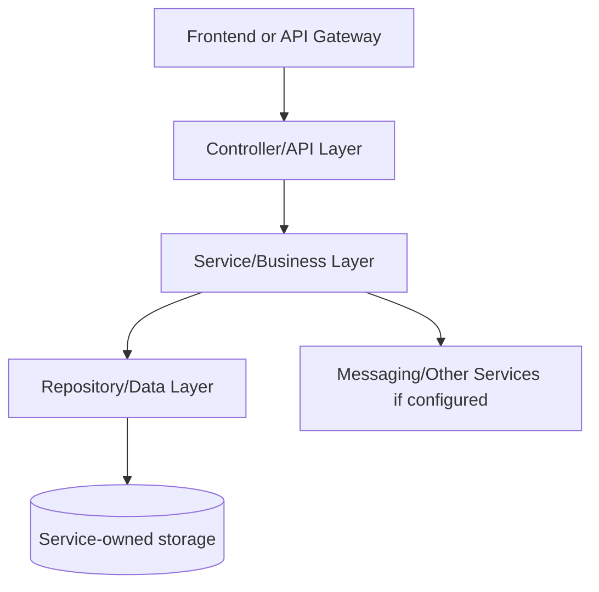
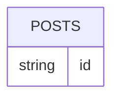

# Post Service - SERVICE_DOCUMENTATION.md

## 1. Service Overview

**Service folder:** `post-service`  
**Type:** Spring Boot service  
**Port:** 8082  
**Run command:** `mvn -pl post-service spring-boot:run`

Owns posts, feed retrieval, post visibility, and denormalized counters for likes/comments/shares.

**Business responsibility:** Create/update/delete posts, author feeds, public feed, counters, Redis caching, search indexing events.

**Data owned:** posts and post_media_urls element collection.

**Why this service exists:** In a microservices design, this responsibility changes independently from other domains. For interviews, explain that the service owns its data and exposes an API contract instead of letting other services touch its tables directly.

## 2. Service Architecture



**Internal structure:**

| Folder/File Area | Meaning |
| --- | --- |
| `src/main/java/.../controller` | HTTP boundary and exception mapping. |
| `src/main/java/.../service` | Business rules, transactions, orchestration. |
| `src/main/java/.../repository` | Spring Data persistence/search queries. |
| `src/main/java/.../entity` | Database table mapping. |
| `src/main/java/.../dto` | Request and response contracts. |
| `src/main/java/.../config` | Beans, OpenAPI, security, messaging, storage, or websocket setup. |
| `src/main/resources` | Runtime configuration with environment overrides. |
| `src/test` | Integration/unit tests proving important flows. |

**Request flow:** request enters controller, request DTO validation runs, service performs business checks, repository persists/queries data, response DTO returns to API Gateway/front-end.

## 3. File-by-File Explanation

| File Path | Purpose | What It Does | Connected With | Interview Notes |
| --- | --- | --- | --- | --- |
| post-service/Dockerfile | Container build recipe used by Docker Compose and Jenkins deployment. | Container build recipe used by Docker Compose and Jenkins deployment. | Related module build/runtime | Explain multi-stage/image build and why containerized services are portable. |
| post-service/README.md | Markdown documentation/readme file. | Markdown documentation/readme file. | Related module build/runtime | Know why the file exists and what runtime/build behavior would break if removed. |
| post-service/pom.xml | Maven project descriptor: declares Spring Boot parent, dependencies, build plugin, and Java version. | Maven project descriptor: declares Spring Boot parent, dependencies, build plugin, and Java version. | Maven, Spring Boot, Jenkins, Docker build | Know why the file exists and what runtime/build behavior would break if removed. |
| post-service/src/main/java/com/connectsphere/post/PostServiceApplication.java | Java source file: Spring Boot application, controller, service, entity, repository, DTO, config, or test. | Java source file: Spring Boot application, controller, service, entity, repository, DTO, config, or test. | Related module build/runtime | Know why the file exists and what runtime/build behavior would break if removed. |
| post-service/src/main/java/com/connectsphere/post/config/OpenApiConfig.java | Configuration class: declares beans, security, OpenAPI, messaging, storage, or websocket setup. | Configuration class: declares beans, security, OpenAPI, messaging, storage, or websocket setup. | Spring application context and runtime configuration | Know why the file exists and what runtime/build behavior would break if removed. |
| post-service/src/main/java/com/connectsphere/post/controller/GlobalExceptionHandler.java | REST controller: exposes HTTP API routes and delegates business work to service classes. | REST controller: exposes HTTP API routes and delegates business work to service classes. | Service layer, DTOs, API gateway, frontend calls | Explain this as the HTTP boundary: validation happens here, but business rules stay in services. |
| post-service/src/main/java/com/connectsphere/post/controller/PostResource.java | REST controller: exposes HTTP API routes and delegates business work to service classes. | REST controller: exposes HTTP API routes and delegates business work to service classes. | Service layer, DTOs, API gateway, frontend calls | Explain this as the HTTP boundary: validation happens here, but business rules stay in services. |
| post-service/src/main/java/com/connectsphere/post/dto/ApiMessageResponse.java | DTO/request/response record: defines API input/output contract and validation. | DTO/request/response record: defines API input/output contract and validation. | Controllers, services, API clients | Explain DTOs as API contracts that keep entity models separate from request/response payloads. |
| post-service/src/main/java/com/connectsphere/post/dto/ChangeVisibilityRequest.java | DTO/request/response record: defines API input/output contract and validation. | DTO/request/response record: defines API input/output contract and validation. | Controllers, services, API clients | Explain DTOs as API contracts that keep entity models separate from request/response payloads. |
| post-service/src/main/java/com/connectsphere/post/dto/CreatePostRequest.java | DTO/request/response record: defines API input/output contract and validation. | DTO/request/response record: defines API input/output contract and validation. | Controllers, services, API clients | Explain DTOs as API contracts that keep entity models separate from request/response payloads. |
| post-service/src/main/java/com/connectsphere/post/dto/PostCountResponse.java | DTO/request/response record: defines API input/output contract and validation. | DTO/request/response record: defines API input/output contract and validation. | Controllers, services, API clients | Explain DTOs as API contracts that keep entity models separate from request/response payloads. |
| post-service/src/main/java/com/connectsphere/post/dto/PostResponse.java | DTO/request/response record: defines API input/output contract and validation. | DTO/request/response record: defines API input/output contract and validation. | Controllers, services, API clients | Explain DTOs as API contracts that keep entity models separate from request/response payloads. |
| post-service/src/main/java/com/connectsphere/post/dto/UpdatePostRequest.java | DTO/request/response record: defines API input/output contract and validation. | DTO/request/response record: defines API input/output contract and validation. | Controllers, services, API clients | Explain DTOs as API contracts that keep entity models separate from request/response payloads. |
| post-service/src/main/java/com/connectsphere/post/entity/Post.java | JPA entity/model: maps Java fields to a database table. | JPA entity/model: maps Java fields to a database table. | Repositories and database schema | Explain table ownership, UUID identifiers, and denormalized counters/fields where present. |
| post-service/src/main/java/com/connectsphere/post/entity/PostType.java | JPA entity/model: maps Java fields to a database table. | JPA entity/model: maps Java fields to a database table. | Repositories and database schema | Explain table ownership, UUID identifiers, and denormalized counters/fields where present. |
| post-service/src/main/java/com/connectsphere/post/entity/PostVisibility.java | JPA entity/model: maps Java fields to a database table. | JPA entity/model: maps Java fields to a database table. | Repositories and database schema | Explain table ownership, UUID identifiers, and denormalized counters/fields where present. |
| post-service/src/main/java/com/connectsphere/post/exception/BadRequestException.java | Java source file: Spring Boot application, controller, service, entity, repository, DTO, config, or test. | Java source file: Spring Boot application, controller, service, entity, repository, DTO, config, or test. | Related module build/runtime | Know why the file exists and what runtime/build behavior would break if removed. |
| post-service/src/main/java/com/connectsphere/post/exception/NotFoundException.java | Java source file: Spring Boot application, controller, service, entity, repository, DTO, config, or test. | Java source file: Spring Boot application, controller, service, entity, repository, DTO, config, or test. | Related module build/runtime | Know why the file exists and what runtime/build behavior would break if removed. |
| post-service/src/main/java/com/connectsphere/post/messaging/RabbitMessagingConfig.java | Messaging component: publishes or consumes RabbitMQ events. | Messaging component: publishes or consumes RabbitMQ events. | RabbitMQ exchange/queue bindings and async service flows | Know why the file exists and what runtime/build behavior would break if removed. |
| post-service/src/main/java/com/connectsphere/post/messaging/SearchIndexEvent.java | Messaging component: publishes or consumes RabbitMQ events. | Messaging component: publishes or consumes RabbitMQ events. | RabbitMQ exchange/queue bindings and async service flows | Know why the file exists and what runtime/build behavior would break if removed. |
| post-service/src/main/java/com/connectsphere/post/messaging/SearchIndexEventPublisher.java | Messaging component: publishes or consumes RabbitMQ events. | Messaging component: publishes or consumes RabbitMQ events. | RabbitMQ exchange/queue bindings and async service flows | Know why the file exists and what runtime/build behavior would break if removed. |
| post-service/src/main/java/com/connectsphere/post/repository/PostRepository.java | Repository/DAO: Spring Data or Angular data access boundary for persistence/search. | Repository/DAO: Spring Data or Angular data access boundary for persistence/search. | Service layer and JPA/Elasticsearch persistence | Explain Spring Data derived queries and why services do not write SQL directly. |
| post-service/src/main/java/com/connectsphere/post/service/PostService.java | Java source file: Spring Boot application, controller, service, entity, repository, DTO, config, or test. | Java source file: Spring Boot application, controller, service, entity, repository, DTO, config, or test. | Controllers, repositories, entities, messaging/storage clients | Explain this as the business logic layer and the best place to discuss transactions and edge cases. |
| post-service/src/main/java/com/connectsphere/post/service/PostServiceImpl.java | Business service implementation: contains main domain logic and transaction boundaries. | Business service implementation: contains main domain logic and transaction boundaries. | Controllers, repositories, entities, messaging/storage clients | Explain this as the business logic layer and the best place to discuss transactions and edge cases. |
| post-service/src/main/resources/application-mysql.yml | Spring configuration file for port, datasource, Eureka, cache, broker, storage, and actuator settings. | Spring configuration file for port, datasource, Eureka, cache, broker, storage, and actuator settings. | Related module build/runtime | Know why the file exists and what runtime/build behavior would break if removed. |
| post-service/src/main/resources/application.yml | Spring configuration file for port, datasource, Eureka, cache, broker, storage, and actuator settings. | Spring configuration file for port, datasource, Eureka, cache, broker, storage, and actuator settings. | Related module build/runtime | Explain port, service name, Eureka registration, and environment-variable overrides. |
| post-service/src/test/java/com/connectsphere/post/JsonTestHelper.java | Java source file: Spring Boot application, controller, service, entity, repository, DTO, config, or test. | Java source file: Spring Boot application, controller, service, entity, repository, DTO, config, or test. | Related module build/runtime | Know why the file exists and what runtime/build behavior would break if removed. |
| post-service/src/test/java/com/connectsphere/post/PostResourceIntegrationTest.java | REST controller: exposes HTTP API routes and delegates business work to service classes. | REST controller: exposes HTTP API routes and delegates business work to service classes. | Related module build/runtime | Know why the file exists and what runtime/build behavior would break if removed. |

## 4. Dependencies Used in This Service

| Dependency | Group | Purpose | Project Usage | Interview Notes |
| --- | --- | --- | --- | --- |
| spring-cloud-dependencies ${spring-cloud.version} | org.springframework.cloud | Project dependency used by framework/build/runtime code. | Declared in pom/package for this service. | Be ready to say what breaks if this dependency is removed. |
| spring-boot-starter-web | org.springframework.boot | Builds REST controllers on embedded Tomcat. | Declared in pom/package for this service. | Be ready to say what breaks if this dependency is removed. |
| spring-boot-starter-validation | org.springframework.boot | Bean validation for DTO constraints such as @NotBlank and @Email. | Declared in pom/package for this service. | Be ready to say what breaks if this dependency is removed. |
| spring-boot-starter-data-jpa | org.springframework.boot | JPA/Hibernate persistence against MySQL. | Declared in pom/package for this service. | Explain repository pattern and service-owned databases. |
| spring-boot-starter-cache | org.springframework.boot | Spring cache abstraction. | Declared in pom/package for this service. | Explain caching of read-heavy responses and invalidation risks. |
| spring-boot-starter-data-redis | org.springframework.boot | Redis cache integration. | Declared in pom/package for this service. | Explain caching of read-heavy responses and invalidation risks. |
| spring-boot-starter-amqp | org.springframework.boot | RabbitMQ publisher/listener support. | Declared in pom/package for this service. | Explain async event-driven notifications/search indexing. |
| spring-boot-starter-actuator | org.springframework.boot | Health and operational endpoints. | Declared in pom/package for this service. | Be ready to say what breaks if this dependency is removed. |
| spring-cloud-starter-netflix-eureka-client | org.springframework.cloud | Registers service with Eureka and enables discovery. | Declared in pom/package for this service. | Know that it decouples service locations from hardcoded host/port values. |
| springdoc-openapi-starter-webmvc-ui ${springdoc.version} | org.springdoc | Swagger/OpenAPI docs for REST endpoints. | Declared in pom/package for this service. | Be ready to say what breaks if this dependency is removed. |
| mysql-connector-j | com.mysql | MySQL JDBC driver. | Declared in pom/package for this service. | Explain repository pattern and service-owned databases. |
| spring-boot-starter-test | org.springframework.boot | JUnit/Spring test support. | Declared in pom/package for this service. | Be ready to say what breaks if this dependency is removed. |

## 5. API Endpoints of This Service

| Method | URL | Code File | Purpose | Request | Response | Auth | Database Interaction | Error Cases |
| --- | --- | --- | --- | --- | --- | --- | --- | --- |
| POST | /api/v1/posts | post-service/src/main/java/com/connectsphere/post/controller/PostResource.java | Create post through PostResource.java. | JSON body matching the request DTO named in the controller method signature. | Usually JSON/DTO response; see response DTO records below. | Normally called behind gateway with JWT; service itself mostly trusts forwarded user/context in this codebase. | Reads/writes posts and post_media_urls element collection. | Domain BadRequest/NotFound become 400/404 through GlobalExceptionHandler where present; validation failures return client errors. |
| GET | /api/v1/posts/{postId} | post-service/src/main/java/com/connectsphere/post/controller/PostResource.java | Get post by id through PostResource.java. | Path/query parameters only unless noted by controller signature. | Usually JSON/DTO response; see response DTO records below. | Normally called behind gateway with JWT; service itself mostly trusts forwarded user/context in this codebase. | Reads/writes posts and post_media_urls element collection. | Domain BadRequest/NotFound become 400/404 through GlobalExceptionHandler where present; validation failures return client errors. |
| GET | /api/v1/posts/user/{authorId} | post-service/src/main/java/com/connectsphere/post/controller/PostResource.java | Get posts by user through PostResource.java. | Path/query parameters only unless noted by controller signature. | Usually JSON/DTO response; see response DTO records below. | Normally called behind gateway with JWT; service itself mostly trusts forwarded user/context in this codebase. | Reads/writes posts and post_media_urls element collection. | Domain BadRequest/NotFound become 400/404 through GlobalExceptionHandler where present; validation failures return client errors. |
| GET | /api/v1/posts/feed | post-service/src/main/java/com/connectsphere/post/controller/PostResource.java | Get feed through PostResource.java. | Path/query parameters only unless noted by controller signature. | Usually JSON/DTO response; see response DTO records below. | Normally called behind gateway with JWT; service itself mostly trusts forwarded user/context in this codebase. | Reads/writes posts and post_media_urls element collection. | Domain BadRequest/NotFound become 400/404 through GlobalExceptionHandler where present; validation failures return client errors. |
| GET | /api/v1/posts/search | post-service/src/main/java/com/connectsphere/post/controller/PostResource.java | Search posts through PostResource.java. | Path/query parameters only unless noted by controller signature. | Usually JSON/DTO response; see response DTO records below. | Normally called behind gateway with JWT; service itself mostly trusts forwarded user/context in this codebase. | Reads/writes posts and post_media_urls element collection. | Domain BadRequest/NotFound become 400/404 through GlobalExceptionHandler where present; validation failures return client errors. |
| PUT | /api/v1/posts/{postId} | post-service/src/main/java/com/connectsphere/post/controller/PostResource.java | Update post through PostResource.java. | JSON body matching the request DTO named in the controller method signature. | Usually JSON/DTO response; see response DTO records below. | Normally called behind gateway with JWT; service itself mostly trusts forwarded user/context in this codebase. | Reads/writes posts and post_media_urls element collection. | Domain BadRequest/NotFound become 400/404 through GlobalExceptionHandler where present; validation failures return client errors. |
| PUT | /api/v1/posts/{postId}/visibility | post-service/src/main/java/com/connectsphere/post/controller/PostResource.java | Change visibility through PostResource.java. | JSON body matching the request DTO named in the controller method signature. | Usually JSON/DTO response; see response DTO records below. | Normally called behind gateway with JWT; service itself mostly trusts forwarded user/context in this codebase. | Reads/writes posts and post_media_urls element collection. | Domain BadRequest/NotFound become 400/404 through GlobalExceptionHandler where present; validation failures return client errors. |
| DELETE | /api/v1/posts/{postId} | post-service/src/main/java/com/connectsphere/post/controller/PostResource.java | Delete post through PostResource.java. | JSON body matching the request DTO named in the controller method signature. | Usually JSON/DTO response; see response DTO records below. | Normally called behind gateway with JWT; service itself mostly trusts forwarded user/context in this codebase. | Reads/writes posts and post_media_urls element collection. | Domain BadRequest/NotFound become 400/404 through GlobalExceptionHandler where present; validation failures return client errors. |
| POST | /api/v1/posts/{postId}/likes/increment | post-service/src/main/java/com/connectsphere/post/controller/PostResource.java | Increment likes through PostResource.java. | JSON body matching the request DTO named in the controller method signature. | Usually JSON/DTO response; see response DTO records below. | Normally called behind gateway with JWT; service itself mostly trusts forwarded user/context in this codebase. | Reads/writes posts and post_media_urls element collection. | Domain BadRequest/NotFound become 400/404 through GlobalExceptionHandler where present; validation failures return client errors. |
| POST | /api/v1/posts/{postId}/likes/decrement | post-service/src/main/java/com/connectsphere/post/controller/PostResource.java | Decrement likes through PostResource.java. | JSON body matching the request DTO named in the controller method signature. | Usually JSON/DTO response; see response DTO records below. | Normally called behind gateway with JWT; service itself mostly trusts forwarded user/context in this codebase. | Reads/writes posts and post_media_urls element collection. | Domain BadRequest/NotFound become 400/404 through GlobalExceptionHandler where present; validation failures return client errors. |
| POST | /api/v1/posts/{postId}/comments/increment | post-service/src/main/java/com/connectsphere/post/controller/PostResource.java | Increment comments through PostResource.java. | JSON body matching the request DTO named in the controller method signature. | Usually JSON/DTO response; see response DTO records below. | Normally called behind gateway with JWT; service itself mostly trusts forwarded user/context in this codebase. | Reads/writes posts and post_media_urls element collection. | Domain BadRequest/NotFound become 400/404 through GlobalExceptionHandler where present; validation failures return client errors. |
| GET | /api/v1/posts/count/{authorId} | post-service/src/main/java/com/connectsphere/post/controller/PostResource.java | Get post count through PostResource.java. | Path/query parameters only unless noted by controller signature. | Usually JSON/DTO response; see response DTO records below. | Normally called behind gateway with JWT; service itself mostly trusts forwarded user/context in this codebase. | Reads/writes posts and post_media_urls element collection. | Domain BadRequest/NotFound become 400/404 through GlobalExceptionHandler where present; validation failures return client errors. |

## 6. Database / Model Details

**Database/storage:** MySQL database connectsphere_post plus Redis cache.

| Entity/Class | Table | File | Important Fields | Ownership Notes |
| --- | --- | --- | --- | --- |
| Post | posts | post-service/src/main/java/com/connectsphere/post/entity/Post.java | postId:String, authorId:String, content:String, postType:PostType, visibility:PostVisibility, likesCount:long, commentsCount:long, sharesCount:long, createdAt:Instant, updatedAt:Instant, deleted:boolean | Owned by this service database |

**Important DTO/API contracts:**

| Record/DTO | File | Fields |
| --- | --- | --- |
| ApiMessageResponse | post-service/src/main/java/com/connectsphere/post/dto/ApiMessageResponse.java | String message |
| ChangeVisibilityRequest | post-service/src/main/java/com/connectsphere/post/dto/ChangeVisibilityRequest.java | @NotNull PostVisibility visibility |
| CreatePostRequest | post-service/src/main/java/com/connectsphere/post/dto/CreatePostRequest.java | @NotBlank String authorId, @Size(max = 5000) String content, List<@Size(max = 1000) String> mediaUrls, @NotNull PostType postType, @NotNull PostVisibility visibility |
| PostCountResponse | post-service/src/main/java/com/connectsphere/post/dto/PostCountResponse.java | String authorId, long count |
| PostResponse | post-service/src/main/java/com/connectsphere/post/dto/PostResponse.java | String postId, String authorId, String content, List<String> mediaUrls, String postType, String visibility, long likesCount, long commentsCount, long sharesCount, Instant createdAt, Instant updatedAt, boolean deleted ) implements Serializable { private static final long serialVersionUID = 1L; public static PostResponse from(Post post |
| UpdatePostRequest | post-service/src/main/java/com/connectsphere/post/dto/UpdatePostRequest.java | @Size(max = 5000) String content, List<@Size(max = 1000) String> mediaUrls, @NotNull PostType postType |
| SearchIndexEvent | post-service/src/main/java/com/connectsphere/post/messaging/SearchIndexEvent.java | String postId, String content, String operation |



## 7. Communication With Other Services

| Source | Target | Method | Purpose | Related Files |
| --- | --- | --- | --- | --- |
| post-service | RabbitMQ search.index | AMQP event | Index or remove posts in search-service | SearchIndexEventPublisher.java |
| frontend/gateway | post-service | REST | Post CRUD/feed/profile posts | PostResource.java |

## 8. Code Flow Examples

**Important code excerpt:**

From `post-service/src/main/java/com/connectsphere/post/controller/PostResource.java`:

```java
package com.connectsphere.post.controller;
@RestController
@RequestMapping({"/api/v1/posts", "/posts"})
@Tag(name = "Post Service")
public class PostResource {
    private final PostService postService;
    public PostResource(PostService postService) {
        this.postService = postService;
    }
    @PostMapping
    @Operation(summary = "Create a post", description = "Creates a new post with content, optional media URLs, type, and visibility.")
    public ResponseEntity<PostResponse> createPost(
            @Valid @RequestBody CreatePostRequest request,
            @RequestHeader(value = "X-User-Id") String actorId,
            @RequestHeader(value = "X-User-Role", required = false) String actorRole
    ) {
        if (request.authorId() == null || !request.authorId().trim().equalsIgnoreCase(actorId.trim())) {
            return ResponseEntity.status(HttpStatus.FORBIDDEN).build();
        }
        return ResponseEntity.status(HttpStatus.CREATED).body(postService.createPost(request));
    }
    @GetMapping("/{postId}")
    @Operation(summary = "Get a post by id", description = "Returns one post if it exists and has not been soft-deleted.")
    public ResponseEntity<PostResponse> getPostById(
            @PathVariable String postId,
            @RequestHeader(value = "X-User-Id", required = false) String viewerId,
            @RequestHeader(value = "X-User-Role", required = false) String viewerRole
    ) {
```

**Interview explanation:** Start by naming the controller/API entry point, then explain how it delegates to service logic, how repository/storage/messaging is used, and what response DTO goes back to the caller.

## 9. Running This Service

**Local:**

```powershell
mvn -pl post-service spring-boot:run
```

**Docker/production:** the root `docker-compose.prod.yml` builds this module from `post-service/Dockerfile` and injects environment variables. Required infrastructure depends on the service: MySQL for persistent services, Redis for cached services, RabbitMQ for async event services, Elasticsearch for search, and storage credentials for media.

**Important environment variables found in config:** `APP_EVENTS_EXCHANGE`, `APP_SEARCH_ROUTING_KEY`, `EUREKA_SERVER_URL`, `FOLLOW_SERVICE_BASE_URL`, `MYSQL_DB`, `MYSQL_HOST`, `MYSQL_PASSWORD`, `MYSQL_PORT`, `MYSQL_USERNAME`, `POST_CACHE_TTL`, `RABBITMQ_HOST`, `RABBITMQ_PASSWORD`, `RABBITMQ_PORT`, `RABBITMQ_USERNAME`, `RABBIT_HEALTH_ENABLED`, `REDIS_HEALTH_ENABLED`, `REDIS_HOST`, `REDIS_PORT`, `SEARCH_SERVICE_BASE_URL`, `SPRING_CACHE_TYPE`

**Common errors and fixes:**

| Error | Likely Cause | Fix |
| --- | --- | --- |
| Cannot connect to MySQL | Database container/service not running or wrong env vars | Start MySQL and check `MYSQL_HOST`, `MYSQL_DB`, username/password. |
| Eureka registration warning | Service registry not running | Start `service-registry` first or ignore during isolated tests. |
| Rabbit/Redis/Elasticsearch health down | Optional infrastructure not running | Start required container or disable health flags for local tests. |
| 401/403 | Missing or invalid JWT / role | Login again and send `Authorization: Bearer <token>`. |

## 10. Interview Notes for This Service

**Short answer:** Post Service owns posts, feed retrieval, post visibility, and denormalized counters for likes/comments/shares.

**Deep answer:** Discuss why the service owns posts and post_media_urls element collection, how it exposes route contracts, and how it integrates with Publishes RabbitMQ search index events; reads follow-service for personalized feed in config; called by frontend/gateway.

**Common questions and best answers:**

| Question | Best Answer |
| --- | --- |
| Why is this a separate service? | Because create/update/delete posts, author feeds, public feed, counters, redis caching, search indexing events. can evolve, scale, and fail independently from other platform domains. |
| What would break if it is down? | Features depending on Post Service fail, but unrelated services can continue if they do not require it synchronously. |
| How do you debug it? | Check container logs, `/actuator/health`, DB connectivity, Eureka registration, and the controller/service/repository flow. |
| How would you improve it? | Add stronger contract tests, distributed tracing, idempotency for writes, and production-grade metrics/alerts. |
