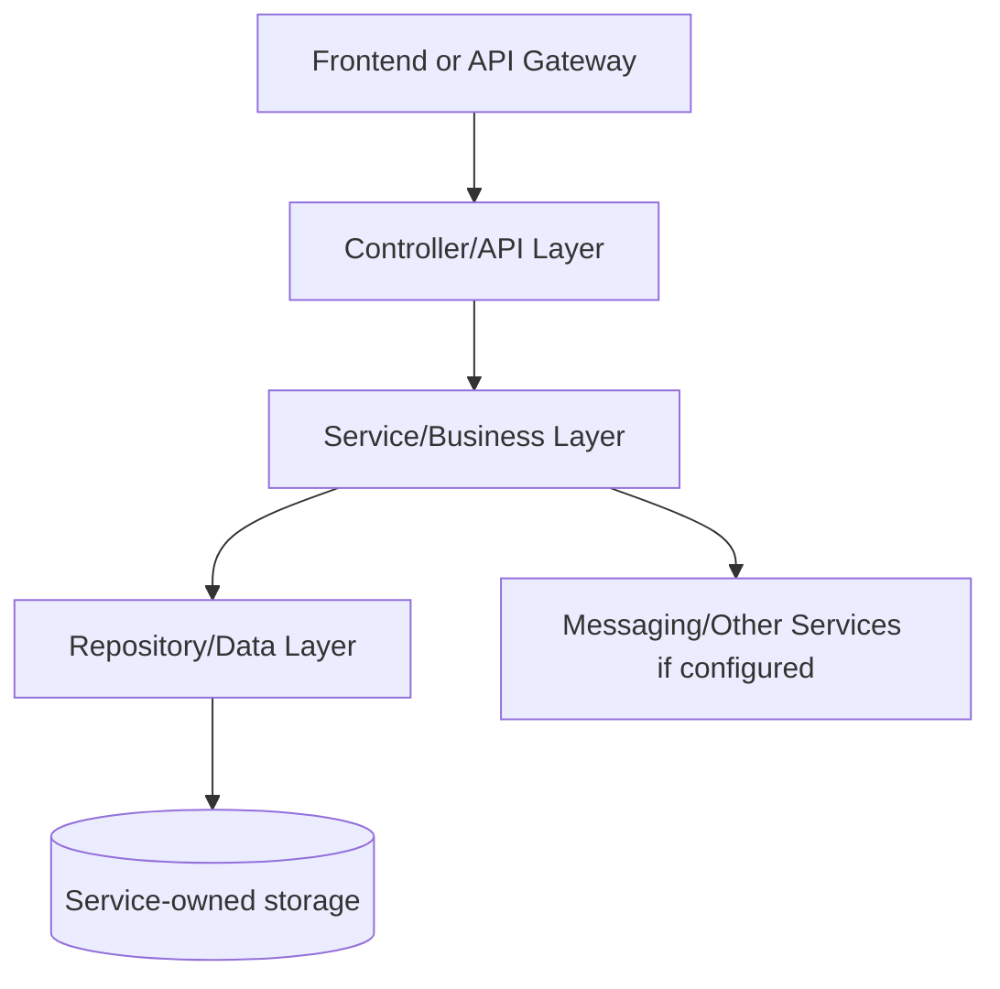
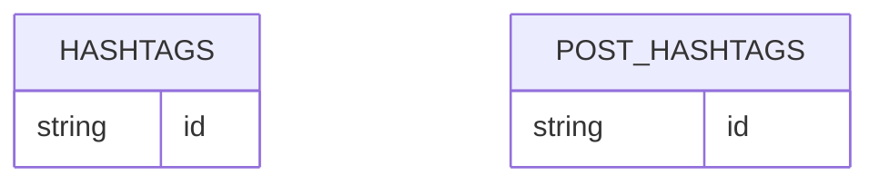

# Search Service - SERVICE_DOCUMENTATION.md

## 1. Service Overview

**Service folder:** `search-service`  
**Type:** Spring Boot service  
**Port:** 8088  
**Run command:** `mvn -pl search-service spring-boot:run`

Indexes and searches posts, hashtags, and user search proxy data.

**Business responsibility:** Post indexing, hashtag extraction, trending hashtags, Elasticsearch search, fallback database hashtag tracking.

**Data owned:** hashtags, post_hashtags, Elasticsearch documents.

**Why this service exists:** In a microservices design, this responsibility changes independently from other domains. For interviews, explain that the service owns its data and exposes an API contract instead of letting other services touch its tables directly.

## 2. Service Architecture



**Internal structure:**

| Folder/File Area | Meaning |
| --- | --- |
| `src/main/java/.../controller` | HTTP boundary and exception mapping. |
| `src/main/java/.../service` | Business rules, transactions, orchestration. |
| `src/main/java/.../repository` | Spring Data persistence/search queries. |
| `src/main/java/.../entity` | Database table mapping. |
| `src/main/java/.../dto` | Request and response contracts. |
| `src/main/java/.../config` | Beans, OpenAPI, security, messaging, storage, or websocket setup. |
| `src/main/resources` | Runtime configuration with environment overrides. |
| `src/test` | Integration/unit tests proving important flows. |

**Request flow:** request enters controller, request DTO validation runs, service performs business checks, repository persists/queries data, response DTO returns to API Gateway/front-end.

## 3. File-by-File Explanation

| File Path | Purpose | What It Does | Connected With | Interview Notes |
| --- | --- | --- | --- | --- |
| search-service/Dockerfile | Container build recipe used by Docker Compose and Jenkins deployment. | Container build recipe used by Docker Compose and Jenkins deployment. | Related module build/runtime | Explain multi-stage/image build and why containerized services are portable. |
| search-service/README.md | Markdown documentation/readme file. | Markdown documentation/readme file. | Related module build/runtime | Know why the file exists and what runtime/build behavior would break if removed. |
| search-service/pom.xml | Maven project descriptor: declares Spring Boot parent, dependencies, build plugin, and Java version. | Maven project descriptor: declares Spring Boot parent, dependencies, build plugin, and Java version. | Maven, Spring Boot, Jenkins, Docker build | Know why the file exists and what runtime/build behavior would break if removed. |
| search-service/src/main/java/com/connectsphere/search/SearchServiceApplication.java | Java source file: Spring Boot application, controller, service, entity, repository, DTO, config, or test. | Java source file: Spring Boot application, controller, service, entity, repository, DTO, config, or test. | Related module build/runtime | Know why the file exists and what runtime/build behavior would break if removed. |
| search-service/src/main/java/com/connectsphere/search/config/OpenApiConfig.java | Configuration class: declares beans, security, OpenAPI, messaging, storage, or websocket setup. | Configuration class: declares beans, security, OpenAPI, messaging, storage, or websocket setup. | Spring application context and runtime configuration | Know why the file exists and what runtime/build behavior would break if removed. |
| search-service/src/main/java/com/connectsphere/search/config/RabbitMessagingConfig.java | Configuration class: declares beans, security, OpenAPI, messaging, storage, or websocket setup. | Configuration class: declares beans, security, OpenAPI, messaging, storage, or websocket setup. | Spring application context and runtime configuration | Know why the file exists and what runtime/build behavior would break if removed. |
| search-service/src/main/java/com/connectsphere/search/controller/SearchResource.java | REST controller: exposes HTTP API routes and delegates business work to service classes. | REST controller: exposes HTTP API routes and delegates business work to service classes. | Service layer, DTOs, API gateway, frontend calls | Explain this as the HTTP boundary: validation happens here, but business rules stay in services. |
| search-service/src/main/java/com/connectsphere/search/document/HashtagSearchDocument.java | Java source file: Spring Boot application, controller, service, entity, repository, DTO, config, or test. | Java source file: Spring Boot application, controller, service, entity, repository, DTO, config, or test. | Related module build/runtime | Know why the file exists and what runtime/build behavior would break if removed. |
| search-service/src/main/java/com/connectsphere/search/document/PostSearchDocument.java | Java source file: Spring Boot application, controller, service, entity, repository, DTO, config, or test. | Java source file: Spring Boot application, controller, service, entity, repository, DTO, config, or test. | Related module build/runtime | Know why the file exists and what runtime/build behavior would break if removed. |
| search-service/src/main/java/com/connectsphere/search/dto/ApiMessageResponse.java | DTO/request/response record: defines API input/output contract and validation. | DTO/request/response record: defines API input/output contract and validation. | Controllers, services, API clients | Explain DTOs as API contracts that keep entity models separate from request/response payloads. |
| search-service/src/main/java/com/connectsphere/search/dto/HashtagResponse.java | DTO/request/response record: defines API input/output contract and validation. | DTO/request/response record: defines API input/output contract and validation. | Controllers, services, API clients | Explain DTOs as API contracts that keep entity models separate from request/response payloads. |
| search-service/src/main/java/com/connectsphere/search/dto/PostIndexRequest.java | DTO/request/response record: defines API input/output contract and validation. | DTO/request/response record: defines API input/output contract and validation. | Controllers, services, API clients | Explain DTOs as API contracts that keep entity models separate from request/response payloads. |
| search-service/src/main/java/com/connectsphere/search/entity/Hashtag.java | JPA entity/model: maps Java fields to a database table. | JPA entity/model: maps Java fields to a database table. | Repositories and database schema | Explain table ownership, UUID identifiers, and denormalized counters/fields where present. |
| search-service/src/main/java/com/connectsphere/search/entity/PostHashtag.java | JPA entity/model: maps Java fields to a database table. | JPA entity/model: maps Java fields to a database table. | Repositories and database schema | Explain table ownership, UUID identifiers, and denormalized counters/fields where present. |
| search-service/src/main/java/com/connectsphere/search/exception/BadRequestException.java | Java source file: Spring Boot application, controller, service, entity, repository, DTO, config, or test. | Java source file: Spring Boot application, controller, service, entity, repository, DTO, config, or test. | Related module build/runtime | Know why the file exists and what runtime/build behavior would break if removed. |
| search-service/src/main/java/com/connectsphere/search/messaging/PostIndexEvent.java | Messaging component: publishes or consumes RabbitMQ events. | Messaging component: publishes or consumes RabbitMQ events. | RabbitMQ exchange/queue bindings and async service flows | Know why the file exists and what runtime/build behavior would break if removed. |
| search-service/src/main/java/com/connectsphere/search/messaging/SearchIndexEventListener.java | Messaging component: publishes or consumes RabbitMQ events. | Messaging component: publishes or consumes RabbitMQ events. | RabbitMQ exchange/queue bindings and async service flows | Know why the file exists and what runtime/build behavior would break if removed. |
| search-service/src/main/java/com/connectsphere/search/repository/HashtagRepository.java | Repository/DAO: Spring Data or Angular data access boundary for persistence/search. | Repository/DAO: Spring Data or Angular data access boundary for persistence/search. | Service layer and JPA/Elasticsearch persistence | Explain Spring Data derived queries and why services do not write SQL directly. |
| search-service/src/main/java/com/connectsphere/search/repository/HashtagSearchRepository.java | Repository/DAO: Spring Data or Angular data access boundary for persistence/search. | Repository/DAO: Spring Data or Angular data access boundary for persistence/search. | Service layer and JPA/Elasticsearch persistence | Explain Spring Data derived queries and why services do not write SQL directly. |
| search-service/src/main/java/com/connectsphere/search/repository/PostHashtagRepository.java | Repository/DAO: Spring Data or Angular data access boundary for persistence/search. | Repository/DAO: Spring Data or Angular data access boundary for persistence/search. | Service layer and JPA/Elasticsearch persistence | Explain Spring Data derived queries and why services do not write SQL directly. |
| search-service/src/main/java/com/connectsphere/search/repository/PostSearchRepository.java | Repository/DAO: Spring Data or Angular data access boundary for persistence/search. | Repository/DAO: Spring Data or Angular data access boundary for persistence/search. | Service layer and JPA/Elasticsearch persistence | Explain Spring Data derived queries and why services do not write SQL directly. |
| search-service/src/main/java/com/connectsphere/search/service/SearchService.java | Java source file: Spring Boot application, controller, service, entity, repository, DTO, config, or test. | Java source file: Spring Boot application, controller, service, entity, repository, DTO, config, or test. | Controllers, repositories, entities, messaging/storage clients | Explain this as the business logic layer and the best place to discuss transactions and edge cases. |
| search-service/src/main/java/com/connectsphere/search/service/SearchServiceImpl.java | Business service implementation: contains main domain logic and transaction boundaries. | Business service implementation: contains main domain logic and transaction boundaries. | Controllers, repositories, entities, messaging/storage clients | Explain this as the business logic layer and the best place to discuss transactions and edge cases. |
| search-service/src/main/resources/application-mysql.yml | Spring configuration file for port, datasource, Eureka, cache, broker, storage, and actuator settings. | Spring configuration file for port, datasource, Eureka, cache, broker, storage, and actuator settings. | Related module build/runtime | Know why the file exists and what runtime/build behavior would break if removed. |
| search-service/src/main/resources/application.yml | Spring configuration file for port, datasource, Eureka, cache, broker, storage, and actuator settings. | Spring configuration file for port, datasource, Eureka, cache, broker, storage, and actuator settings. | Related module build/runtime | Explain port, service name, Eureka registration, and environment-variable overrides. |
| search-service/src/test/java/com/connectsphere/search/SearchServiceIntegrationTest.java | Java source file: Spring Boot application, controller, service, entity, repository, DTO, config, or test. | Java source file: Spring Boot application, controller, service, entity, repository, DTO, config, or test. | Related module build/runtime | Know why the file exists and what runtime/build behavior would break if removed. |

## 4. Dependencies Used in This Service

| Dependency | Group | Purpose | Project Usage | Interview Notes |
| --- | --- | --- | --- | --- |
| spring-cloud-dependencies ${spring-cloud.version} | org.springframework.cloud | Project dependency used by framework/build/runtime code. | Declared in pom/package for this service. | Be ready to say what breaks if this dependency is removed. |
| spring-boot-starter-web | org.springframework.boot | Builds REST controllers on embedded Tomcat. | Declared in pom/package for this service. | Be ready to say what breaks if this dependency is removed. |
| spring-boot-starter-validation | org.springframework.boot | Bean validation for DTO constraints such as @NotBlank and @Email. | Declared in pom/package for this service. | Be ready to say what breaks if this dependency is removed. |
| spring-boot-starter-data-jpa | org.springframework.boot | JPA/Hibernate persistence against MySQL. | Declared in pom/package for this service. | Explain repository pattern and service-owned databases. |
| spring-boot-starter-amqp | org.springframework.boot | RabbitMQ publisher/listener support. | Declared in pom/package for this service. | Explain async event-driven notifications/search indexing. |
| spring-boot-starter-data-elasticsearch | org.springframework.boot | Elasticsearch repositories and templates. | Declared in pom/package for this service. | Be ready to say what breaks if this dependency is removed. |
| spring-boot-starter-actuator | org.springframework.boot | Health and operational endpoints. | Declared in pom/package for this service. | Be ready to say what breaks if this dependency is removed. |
| spring-cloud-starter-netflix-eureka-client | org.springframework.cloud | Registers service with Eureka and enables discovery. | Declared in pom/package for this service. | Know that it decouples service locations from hardcoded host/port values. |
| springdoc-openapi-starter-webmvc-ui ${springdoc.version} | org.springdoc | Swagger/OpenAPI docs for REST endpoints. | Declared in pom/package for this service. | Be ready to say what breaks if this dependency is removed. |
| mysql-connector-j | com.mysql | MySQL JDBC driver. | Declared in pom/package for this service. | Explain repository pattern and service-owned databases. |
| spring-boot-starter-test | org.springframework.boot | JUnit/Spring test support. | Declared in pom/package for this service. | Be ready to say what breaks if this dependency is removed. |

## 5. API Endpoints of This Service

| Method | URL | Code File | Purpose | Request | Response | Auth | Database Interaction | Error Cases |
| --- | --- | --- | --- | --- | --- | --- | --- | --- |
| POST | /api/v1/search/index | search-service/src/main/java/com/connectsphere/search/controller/SearchResource.java | Index post through SearchResource.java. | JSON body matching the request DTO named in the controller method signature. | Usually JSON/DTO response; see response DTO records below. | Normally called behind gateway with JWT; service itself mostly trusts forwarded user/context in this codebase. | Reads/writes hashtags, post_hashtags, Elasticsearch documents. | Domain BadRequest/NotFound become 400/404 through GlobalExceptionHandler where present; validation failures return client errors. |
| DELETE | /api/v1/search/index/{postId} | search-service/src/main/java/com/connectsphere/search/controller/SearchResource.java | Remove post index through SearchResource.java. | JSON body matching the request DTO named in the controller method signature. | Usually JSON/DTO response; see response DTO records below. | Normally called behind gateway with JWT; service itself mostly trusts forwarded user/context in this codebase. | Reads/writes hashtags, post_hashtags, Elasticsearch documents. | Domain BadRequest/NotFound become 400/404 through GlobalExceptionHandler where present; validation failures return client errors. |
| GET | /api/v1/search/posts | search-service/src/main/java/com/connectsphere/search/controller/SearchResource.java | Search posts through SearchResource.java. | Path/query parameters only unless noted by controller signature. | Usually JSON/DTO response; see response DTO records below. | Normally called behind gateway with JWT; service itself mostly trusts forwarded user/context in this codebase. | Reads/writes hashtags, post_hashtags, Elasticsearch documents. | Domain BadRequest/NotFound become 400/404 through GlobalExceptionHandler where present; validation failures return client errors. |
| GET | /api/v1/search/users | search-service/src/main/java/com/connectsphere/search/controller/SearchResource.java | Search users through SearchResource.java. | Path/query parameters only unless noted by controller signature. | Usually JSON/DTO response; see response DTO records below. | Normally called behind gateway with JWT; service itself mostly trusts forwarded user/context in this codebase. | Reads/writes hashtags, post_hashtags, Elasticsearch documents. | Domain BadRequest/NotFound become 400/404 through GlobalExceptionHandler where present; validation failures return client errors. |
| GET | /api/v1/hashtags/post/{postId} | search-service/src/main/java/com/connectsphere/search/controller/SearchResource.java | Get hashtags for post through SearchResource.java. | Path/query parameters only unless noted by controller signature. | Usually JSON/DTO response; see response DTO records below. | Normally called behind gateway with JWT; service itself mostly trusts forwarded user/context in this codebase. | Reads/writes hashtags, post_hashtags, Elasticsearch documents. | Domain BadRequest/NotFound become 400/404 through GlobalExceptionHandler where present; validation failures return client errors. |
| GET | /api/v1/hashtags/trending | search-service/src/main/java/com/connectsphere/search/controller/SearchResource.java | Get trending hashtags through SearchResource.java. | Path/query parameters only unless noted by controller signature. | Usually JSON/DTO response; see response DTO records below. | Normally called behind gateway with JWT; service itself mostly trusts forwarded user/context in this codebase. | Reads/writes hashtags, post_hashtags, Elasticsearch documents. | Domain BadRequest/NotFound become 400/404 through GlobalExceptionHandler where present; validation failures return client errors. |
| GET | /api/v1/hashtags/{tag}/posts | search-service/src/main/java/com/connectsphere/search/controller/SearchResource.java | Get posts by hashtag through SearchResource.java. | Path/query parameters only unless noted by controller signature. | Usually JSON/DTO response; see response DTO records below. | Normally called behind gateway with JWT; service itself mostly trusts forwarded user/context in this codebase. | Reads/writes hashtags, post_hashtags, Elasticsearch documents. | Domain BadRequest/NotFound become 400/404 through GlobalExceptionHandler where present; validation failures return client errors. |
| GET | /api/v1/hashtags/search | search-service/src/main/java/com/connectsphere/search/controller/SearchResource.java | Search hashtags through SearchResource.java. | Path/query parameters only unless noted by controller signature. | Usually JSON/DTO response; see response DTO records below. | Normally called behind gateway with JWT; service itself mostly trusts forwarded user/context in this codebase. | Reads/writes hashtags, post_hashtags, Elasticsearch documents. | Domain BadRequest/NotFound become 400/404 through GlobalExceptionHandler where present; validation failures return client errors. |
| GET | /api/v1/hashtags/{tag}/count | search-service/src/main/java/com/connectsphere/search/controller/SearchResource.java | Get hashtag count through SearchResource.java. | Path/query parameters only unless noted by controller signature. | Usually JSON/DTO response; see response DTO records below. | Normally called behind gateway with JWT; service itself mostly trusts forwarded user/context in this codebase. | Reads/writes hashtags, post_hashtags, Elasticsearch documents. | Domain BadRequest/NotFound become 400/404 through GlobalExceptionHandler where present; validation failures return client errors. |

## 6. Database / Model Details

**Database/storage:** MySQL database connectsphere_search plus Elasticsearch.

| Entity/Class | Table | File | Important Fields | Ownership Notes |
| --- | --- | --- | --- | --- |
| Hashtag | hashtags | search-service/src/main/java/com/connectsphere/search/entity/Hashtag.java | hashtagId:String, tag:String, postCount:long, lastUsedAt:Instant | Owned by this service database |
| PostHashtag | post_hashtags | search-service/src/main/java/com/connectsphere/search/entity/PostHashtag.java | id:String, postId:String, hashtagId:String, createdAt:Instant | Owned by this service database |

**Important DTO/API contracts:**

| Record/DTO | File | Fields |
| --- | --- | --- |
| HashtagSearchDocument | search-service/src/main/java/com/connectsphere/search/document/HashtagSearchDocument.java | @Id String hashtagId, @Field(type = FieldType.Keyword) String tag, @Field(type = FieldType.Long) long postCount, @Field(type = FieldType.Date, format = DateFormat.date_time) Instant lastUsedAt |
| PostSearchDocument | search-service/src/main/java/com/connectsphere/search/document/PostSearchDocument.java | @Id String postId, @Field(type = FieldType.Text) String content, @Field(type = FieldType.Keyword) List<String> hashtags, @Field(type = FieldType.Date, format = DateFormat.date_time) Instant updatedAt |
| ApiMessageResponse | search-service/src/main/java/com/connectsphere/search/dto/ApiMessageResponse.java | String message |
| HashtagResponse | search-service/src/main/java/com/connectsphere/search/dto/HashtagResponse.java | String hashtagId, String tag, long postCount, Instant lastUsedAt |
| PostIndexRequest | search-service/src/main/java/com/connectsphere/search/dto/PostIndexRequest.java | @NotBlank String postId, @NotBlank String content |
| PostIndexEvent | search-service/src/main/java/com/connectsphere/search/messaging/PostIndexEvent.java | String postId, String content, String operation |



## 7. Communication With Other Services

| Source | Target | Method | Purpose | Related Files |
| --- | --- | --- | --- | --- |
| RabbitMQ search.index | search-service | AMQP listener | Index/unindex posts asynchronously | SearchIndexEventListener.java |
| search-service | Elasticsearch | Spring Data Elasticsearch | Full-text post/hashtag search | document/repository package |

## 8. Code Flow Examples

**Important code excerpt:**

From `search-service/src/main/java/com/connectsphere/search/controller/SearchResource.java`:

```java
package com.connectsphere.search.controller;
@RestController
@RequestMapping({"/api/v1", ""})
@Tag(name = "Search Service", description = "Delegated user/post search plus hashtag indexing.")
public class SearchResource {
    private final SearchService searchService;
    public SearchResource(SearchService searchService) {
        this.searchService = searchService;
    }
    @PostMapping("/search/index")
    @Operation(summary = "Index a post for hashtags")
    public ResponseEntity<Map<String, List<String>>> indexPost(@Valid @RequestBody PostIndexRequest request) {
        return ResponseEntity.ok(Map.of("hashtags", searchService.indexPost(request.postId(), request.content())));
    }
    @DeleteMapping("/search/index/{postId}")
    @Operation(summary = "Remove a post from hashtag index")
    public ResponseEntity<ApiMessageResponse> removePostIndex(@PathVariable String postId) {
        searchService.removePostIndex(postId);
        return ResponseEntity.ok(new ApiMessageResponse("Post index removed successfully."));
    }
    @GetMapping("/search/posts")
    public ResponseEntity<Object> searchPosts(
            @RequestParam String query,
            @RequestHeader(value = "X-User-Id", required = false) String viewerId,
            @RequestHeader(value = "X-User-Role", required = false) String viewerRole
    ) {
        return ResponseEntity.ok(searchService.searchPosts(query, viewerId, viewerRole));
    }
```

**Interview explanation:** Start by naming the controller/API entry point, then explain how it delegates to service logic, how repository/storage/messaging is used, and what response DTO goes back to the caller.

## 9. Running This Service

**Local:**

```powershell
mvn -pl search-service spring-boot:run
```

**Docker/production:** the root `docker-compose.prod.yml` builds this module from `search-service/Dockerfile` and injects environment variables. Required infrastructure depends on the service: MySQL for persistent services, Redis for cached services, RabbitMQ for async event services, Elasticsearch for search, and storage credentials for media.

**Important environment variables found in config:** `APP_EVENTS_EXCHANGE`, `APP_SEARCH_PROVIDER`, `APP_SEARCH_QUEUE`, `APP_SEARCH_ROUTING_KEY`, `AUTH_SERVICE_BASE_URL`, `ELASTICSEARCH_HEALTH_ENABLED`, `ELASTICSEARCH_REPOSITORIES_ENABLED`, `ELASTICSEARCH_URIS`, `ELASTIC_PASSWORD`, `ELASTIC_USERNAME`, `EUREKA_SERVER_URL`, `MYSQL_DB`, `MYSQL_HOST`, `MYSQL_PASSWORD`, `MYSQL_PORT`, `MYSQL_USERNAME`, `POST_SERVICE_BASE_URL`, `RABBITMQ_HOST`, `RABBITMQ_PASSWORD`, `RABBITMQ_PORT`, `RABBITMQ_USERNAME`, `RABBIT_HEALTH_ENABLED`

**Common errors and fixes:**

| Error | Likely Cause | Fix |
| --- | --- | --- |
| Cannot connect to MySQL | Database container/service not running or wrong env vars | Start MySQL and check `MYSQL_HOST`, `MYSQL_DB`, username/password. |
| Eureka registration warning | Service registry not running | Start `service-registry` first or ignore during isolated tests. |
| Rabbit/Redis/Elasticsearch health down | Optional infrastructure not running | Start required container or disable health flags for local tests. |
| 401/403 | Missing or invalid JWT / role | Login again and send `Authorization: Bearer <token>`. |

## 10. Interview Notes for This Service

**Short answer:** Search Service indexes and searches posts, hashtags, and user search proxy data.

**Deep answer:** Discuss why the service owns hashtags, post_hashtags, Elasticsearch documents, how it exposes route contracts, and how it integrates with Consumes search.index events from RabbitMQ; calls auth-service for users and post-service for posts if configured.

**Common questions and best answers:**

| Question | Best Answer |
| --- | --- |
| Why is this a separate service? | Because post indexing, hashtag extraction, trending hashtags, elasticsearch search, fallback database hashtag tracking. can evolve, scale, and fail independently from other platform domains. |
| What would break if it is down? | Features depending on Search Service fail, but unrelated services can continue if they do not require it synchronously. |
| How do you debug it? | Check container logs, `/actuator/health`, DB connectivity, Eureka registration, and the controller/service/repository flow. |
| How would you improve it? | Add stronger contract tests, distributed tracing, idempotency for writes, and production-grade metrics/alerts. |
